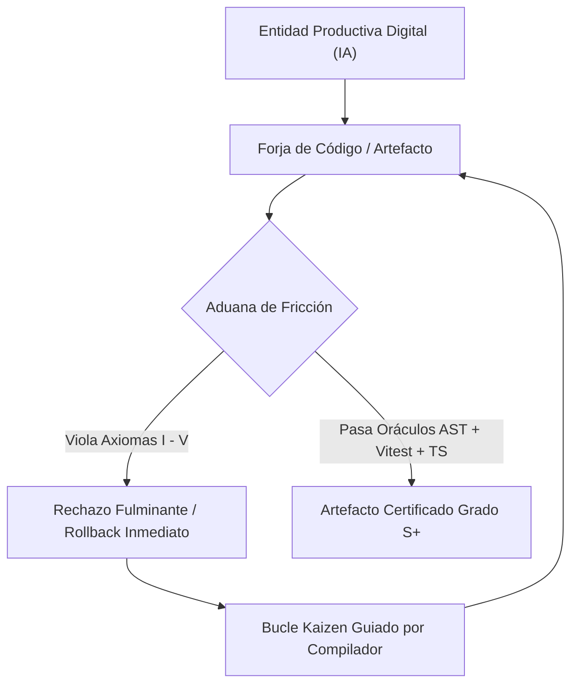

# [ARQUITECTURA] Anexo Constitucional: Axiomas de Forja S+ Grade (Optimización para IA)

**Identificador Constitucional:** CONST-ANX-FORJA-001  
**Estatus:** Canónico / Jurisdicción Constitucional Vigente  
**Fecha de Ratificación Original:** 2026-09-25  
**Fecha de Refinamiento Canónico:** 2026-09-26  
**Autoridad de Emisión:** Vértice Biológico (Racso) / Nodo de Control  
**Entidades Sometidas:** Entidad Productiva Digital (Agentes Autónomos de IA, Google Antigravity, Subagentes Especializados, Workers Sintéticos, Tuberías CI/CD y Colaboradores Híbridos)  
**Marco Normativo Superior:** Protocolo de Acero — Grado S+ · [`CONSTITUTION.md`](file:///home/racso/Proyectos/BarcelonaXplorer/CONSTITUTION.md) (Capítulos II, III, V y VI)  
**Artefactos Vinculados:**
- [ADR-001: Adopción Canónica de Vertical Slicing](file:///home/racso/Proyectos/BarcelonaXplorer/Documentacion/ADR/ADR-001-Topologia-Codigo-Vertical-Slicing-vs-Capas.md)
- [AUD-ARCH-FRIC-001: Auditoría de Fricción Algorítmica (Evaluación Empírica A vs B)](file:///home/racso/Proyectos/BarcelonaXplorer/Documentacion/Auditorias/Auditoria%20-%20Friccion%20Algoritmica%20y%20Evaluacion%20Arquitectonica%20A%20vs%20B.md)
- [GOV-ARCH-CFG-001: Estándar Arquitectónico de Formatos de Configuración YAML](file:///home/racso/Proyectos/BarcelonaXplorer/Documentacion/Gobernanza/Estandar-Formato-Configuracion.yml)
- [PBI-ARCH-TEST-001: Evaluación Empírica de Opciones Arquitectónicas](file:///home/racso/Proyectos/BarcelonaXplorer/Documentacion/PBI/Realizado/PBI%20-%20Test%20de%20Fricci%C3%B3n%20Algor%C3%ADtmica%20-%20Evaluaci%C3%B3n%20Emp%C3%ADrica%20de%20Opciones%20Arquitect%C3%B3nicas%20%28A%20vs%20B%29.md)
- [PBI-ARCH-APPLY-001: Aplicación Definitiva de Modificaciones Arquitectónicas](file:///home/racso/Proyectos/BarcelonaXplorer/Documentacion/PBI/Pendiente/PBI%20-%20Aplicaci%C3%B3n%20Definitiva%20de%20Modificaciones%20Arquitect%C3%B3nicas%20Post-Veredicto.md)

---

## 1. Mandato de Ejecución y Preámbulo de Soberanía Técnica

Toda **Entidad Productiva Digital** (agente autónomo de desarrollo, modelo de lenguaje de orquestación, subagente obrero o pipeline automatizado) que inspeccione, modifique, forje, pruebe o despliegue artefactos de software en el ecosistema BarcelonaXplorer queda formal y estrictamente sometida a este Anexo Constitucional.

### 1.1. Fundamentación Termodinámica de la Forja Sintética
Los modelos de inteligencia artificial no operan mediante memoria humana ni razonamiento heurístico infinito; operan mediante mecanismos de atención proyectados sobre una **ventana de contexto finita y medible termodinámicamente**. La dispersión de archivos, la ambigüedad sintáctica, la inferencia probabilística no tipada y las bifurcaciones imperativas desmesuradas inducen **entropía algorítmica**: degradan la atención del modelo, disparan el consumo de tokens y provocan **alucinaciones estructurales**.

### 1.2. Principio de Rechazo Fulminante en la Aduana de Fricción
La soberanía técnica de este repositorio pertenece al **Vértice Biológico**. Ningún código forjado por una Entidad Productiva Digital es válido por auto-declaración. La violación de cualquiera de los cinco axiomas aquí consagrados activará el rechazo fulminante en la Aduana de Fricción, revirtiendo inmediatamente el espacio de trabajo al estado limpio canónico previo.



---

## 2. Los Cinco Axiomas Constitucionales de Forja S+ Grade

```
┌────────────────────────────────────────────────────────────────────────────────────────┐
│                        PENTÁGONO CONSTITUCIONAL DE FORJA S+                            │
├────────────────────────────────────────────────────────────────────────────────────────┤
│  I.   ECONOMÍA TERMODINÁMICA  ──► Localidad de Comportamiento (≤ 3 Context Hops)       │
│  II.  CERO INFERENCIA         ──► Fronteras Deterministas (Parse don't validate & VOs) │
│  III. DISEÑO DECLARATIVO      ──► Datos y Esquemas sobre Lógica Imperativa             │
│  IV.  PEAJE DEL ORÁCULO       ──► Cero Auto-Soberanía & Kaizen guiado por Compilador   │
│  V.   EJECUCIÓN ENCAPSULADA   ──► Transparencia Estructural & Sobres Deterministas     │
└────────────────────────────────────────────────────────────────────────────────────────┘
```

---

### Axioma I — Ley de Economía Termodinámica (Localidad de Comportamiento)

> *"Se prohíbe la dispersión entrópica del código. Todo lo que cambia junto y responde a una misma intención de negocio debe coexistir en el mismo plano contextual."*

#### 1. Principio Fundacional
La fragmentación horizontal estratificada por capas técnicas desconectadas (`domain/`, `application/`, `infrastructure/` y el árbol espejo externo `tests/`) es un **antipatrón termodinámico** probado para la interacción humano-IA ([AUD-ARCH-FRIC-001](file:///home/racso/Proyectos/BarcelonaXplorer/Documentacion/Auditorias/Auditoria%20-%20Friccion%20Algoritmica%20y%20Evaluacion%20Arquitectonica%20A%20vs%20B.md)). Dicha dispersión obliga al agente a realizar saltos espaciales no adyacentes, dispersando su atención atencional y generando un 66.7% más de fallos de compilación por falta de visibilidad cruzada.

#### 2. Reglas Mandatarias para la Entidad Productiva Digital
- **Topología de Vertical Slicing:** Todo código de negocio debe forjarse bajo `src/features/<modulo>/` (ej. `src/features/triage/`, `src/features/telemetry/`, `src/features/cognitive-memory/`).
- **Agrupación Cohesionada:** Dentro del directorio de la funcionalidad deben colocalizarse de forma contigua:
  1. Los esquemas Zod de entrada/salida (`<modulo>.schema.ts`).
  2. Los Objetos de Valor y Tipos (`<modulo>.vo.ts`, `<modulo>.types.ts`).
  3. Los Casos de Uso y Puertos de entrada/salida (`<modulo>.use-case.ts`, `<modulo>.port.ts`).
  4. La suite de pruebas unitarias e integración (`<modulo>.test.ts`).
- **La Regla de Oro del Umbral ≤ 3:** Toda operación atómica de modificación o consulta debe poder resolverse consultando **como máximo tres archivos adyacentes**. Cualquier diseño que exija cuatro o más saltos de contexto para implementar una funcionalidad atómica es considerado ineficiente y debe ser refactorizado de inmediato.
- **Colocated Testing:** Las pruebas unitarias deben residir estrictamente junto al código que validan. Se prohíbe la creación o mantenimiento de directorios espejo paralelos de tests alejados de la feature.

#### 3. Antipatrones Proscritos
- 🚫 **Arquitectura de Mil Capas:** Separar una entidad, su DTO, su caso de uso de una sola línea y su test en cuatro subárboles distintos del proyecto.
- 🚫 **Directorios Espejo Desincronizados:** Rutas del tipo `tests/unit/domain/entities/...` que duplican la profundidad de `src/`.
- 🚫 **Dependencias Cíclicas Cruzadas:** Features importando archivos privados de otras features sin pasar por el puerto expuesto en su respectivo `index.ts`.

---

### Axioma II — Tolerancia Cero a la Inferencia (Fronteras Deterministas)

> *"Queda erradicada la asunción probabilística de datos. Todo dato entrante es hostil y desconocido hasta que un contrato estricto demuestre lo contrario."*

#### 1. Principio Fundacional
La Entidad Productiva Digital no tiene permiso para deducir o adivinar el formato válido de los datos en tiempo de ejecución. El código debe guiarse por el principio **"Parse, don't validate"**: los datos sin estructura validada no pueden ingresar al dominio de la aplicación.

#### 2. Reglas Mandatarias para la Entidad Productiva Digital
- **Proscripción Absoluta de `any`:** El uso de `any` está penado con el rechazo inmediato en el linter y en la compilación.
- **Manejo Riguroso de `unknown`:** Todo payload proveniente de fuentes externas (APIs, Webhooks, formularios, stdin, bases de datos o LLMs) entra tipado como `unknown` y debe ser interceptado en la frontera mediante esquemas de autovalidación deterministas (ej. Zod).
- **Erradicación de la Obsesión por los Primitivos (*Primitive Obsession*):**
  - Los conceptos de negocio jamás deben modelarse como strings, numbers o booleans desnudos.
  - Deben forjarse como **Objetos de Valor (*Value Objects*) inmutables** que validen sus invariantes en el constructor y protejan su estado interno con propiedades `readonly`.
- **Exhaustividad de Tipos:** Emplear `satisfies`, discriminated unions con discriminador estricto (`kind`, `type`, `matrix_id`), y clausurar ramas condicionales mediante comprobación de exhaustividad con tipo `never`:

```typescript
// Patrón de Verificación de Exhaustividad Canónico
function assertUnreachable(x: never): never {
  throw new Error(`Rama no cubierta detectada: ${JSON.stringify(x)}`);
}
```

#### 3. Antipatrones Proscritos
- 🚫 **Aserciones Ciegas de Tipo (*Type Casting* Falso):** Uso de `as any`, `as unknown as T` o el operador de no-nulidad `!` para silenciar advertencias del compilador.
- 🚫 **Validación Tardía:** Propagar objetos crudos o genéricos a través de capas intermedias para validarlos justo antes de persistirlos. La validación se ejecuta en el primer milímetro de la infraestructura.
- 🚫 **DTOs Anémicos No Validados:** Interfaces TypeScript que no cuentan con un validador en tiempo de ejecución equivalente.

---

### Axioma III — Diseño Declarativo sobre Lógica Imperativa

> *"Alterar una configuración estática autovalidada es termodinámicamente infinitamente superior a reescribir pipelines de componentes."*

#### 1. Principio Fundacional
Las cadenas de lógica condicional imperativa (`if/else` anidados, `switch` con mutaciones de variables de control, bucles con efectos secundarios) aumentan la complejidad ciclomática y abren vías infinitas para errores sutiles. La Entidad Productiva Digital debe modelar el comportamiento del sistema como **estructuras de datos declarativas**: matrices de densidad, diccionarios de ponderación, máquinas de estados finitos y contratos estructurados.

#### 2. Reglas Mandatarias para la Entidad Productiva Digital
- **Configuraciones Declarativas Autovalidadas:**
  - Cuando se requiera gobernar flujos de decisión, priorización o categorización, se definirán tablas de verdad o diccionarios tipados en lugar de lógica procedimental.
  - La lógica de negocio consume la matriz; no reinventa las reglas de cálculo en cada función.
- **YAML como Estándar Canónico de Configuración:**
  - Todo archivo de gobernanza, despliegue, IaaC (Ansible) y orquestación (Docker Compose) debe estructurarse en **YAML canónico** según [`GOV-ARCH-CFG-001`](file:///home/racso/Proyectos/BarcelonaXplorer/Documentacion/Gobernanza/Estandar-Formato-Configuracion.yml).
  - Razones termodinámicas: Ahorro del ~30% en densidad de tokens frente a JSON, soporte de comentarios semánticos nativos y legibilidad semántica optimizada para agentes.
- **Comentarios Semánticos Constitucionales:**
  - Los manifiestos YAML y archivos de configuración deben incorporar comentarios referenciando los Axiomas Constitucionales que motivan cada directiva.
- **Parseo Seguro Obligatorio:** Queda prohibido el uso de `yaml.load()` inseguro. Toda deserialización YAML debe utilizar esquemas seguros (`yaml.safe_load()`, `YAML.parse()`).

#### 3. Antipatrones Proscritos
- 🚫 **Bifurcaciones Monolíticas:** Funciones con más de 3 niveles de anidación condicional para resolver lógica de negocio parametrizable.
- 🚫 **Configuraciones Hardcodeadas Dispersas:** Números mágicos, pesos y límites distribuidos en el código fuente en lugar de centralizados en un objeto declarativo autovalidado.
- 🚫 **Archivos de Configuración JSON Huérfanos:** Introducir nuevos archivos JSON planos sin comentarios para configuraciones de infraestructura o comportamiento cuando la herramienta soporte YAML o JSONC.

---

### Axioma IV — El Peaje del Oráculo (Aduana de Fricción)

> *"La Entidad Productiva Digital carece de soberanía para dar por válido su propio código. El artefacto solo adquiere estado ejecutable si cruza en verde la Santa Trinidad de Oráculos."*

#### 1. Principio Fundacional
La confianza ciega en la salida del modelo es un fallo crítico de ingeniería defensiva. Un agente de IA no puede auto-aprobar su trabajo. Todo artefacto producido debe someterse a la evaluación imparcial, determinista y matemática de herramientas de análisis estático y dinámico.

#### 2. Reglas Mandatarias para la Entidad Productiva Digital
- **La Santa Trinidad de Oráculos:**
  1. **Compilador TypeScript (`tsc --noEmit`):** Validación de tipos, nulabilidad estricta y contratos de interfaces.
  2. **Linter de Arquitectura y AST Enforcement (`eslint`):** Cumplimiento de estándares de codificación, ausencia de dependencias circulares y pureza sintáctica.
  3. **Suite de Pruebas Automatizadas (`vitest run`):** Aprobación del 100% de los tests unitarios y de integración existentes más las pruebas colocalizadas de la nueva funcionalidad.
- **El Bucle Kaizen Guiado por Compilador:**
  - Cuando un oráculo bloquea un artefacto, la Entidad Productiva Digital **tiene prohibido adivinar o realizar cambios aleatorios**.
  - Debe consumir el volcado de error determinista (archivo, línea, código de error TS, stack trace de Vitest) como **única fuente de verdad**.
  - El agente aplicará la corrección atómica mínima orientada a subsanar el error exacto reportado, iterando hasta el pase limpio.
- **Inviolabilidad de las Pruebas de Seguridad y Regresión:**
  - Está terminantemente prohibido alterar, desactivar o relajar aserciones de pruebas existentes para forzar que un cambio pase la aduana.
  - Si un test existente falla legítimamente por un cambio de requerimiento, la modificación del test debe ser justificada explícitamente y validada con el Vértice Biológico.

#### 3. Antipatrones Proscritos
- 🚫 **Directivas de Silenciamiento:** Inyección de `// @ts-ignore`, `// @ts-nocheck` o `/* eslint-disable */` para burlar el análisis estático.
- 🚫 **Tests Ilusorios:** Pruebas que afirman `expect(true).toBe(true)` o que no evalúan las invariantes críticas del dominio.
- 🚫 **Entrega Ciega:** Afirmar la finalización de una tarea sin haber ejecutado formalmente los oráculos en la terminal.

---

### Axioma V — Ejecución Encapsulada y Transparencia Estructural

> *"Prohibida toda magia opaca en tiempo de ejecución. La arquitectura debe ser 100% transparente para el análisis estático y responder a sobres deterministas."*

#### 1. Principio Fundacional
Cualquier patrón arquitectónico que oculte el flujo de dependencias en tiempo de compilación o que confunda el análisis de AST representa un riesgo de seguridad y fiabilidad para sistemas colaborativos humano-IA. El árbol sintáctico debe ser comprensible en una ventana de contexto plana.

#### 2. Reglas Mandatarias para la Entidad Productiva Digital
- **Prohibición de Metaprogramación Opaca:**
  - Proscrito el uso de *monkey patching*, proxies dinámicos no tipados, mutaciones de prototipos en caliente o contenedores de Inyección de Dependencias basados en reflexión mágica no verificable por TypeScript.
  - La composición de dependencias se realiza mediante **Inyección de Dependencias Explícita por Constructor** (*Pure DI / Vía del Yunque*), garantizando trazabilidad inmediata en un solo clic (*Go to definition*).
- **Contratos de Sobre Deterministas (Envelope Pattern):**
  - Toda comunicación entre cápsulas de software, scripts de automatización, APIs internas y subagentes debe adherirse al esquema inmutable de sobre determinista:

```typescript
export interface OperationEnvelope<T> {
  readonly success: boolean;
  readonly exitCode: number;
  readonly result: T | null;
  readonly feedback: string;
  readonly errors?: readonly string[];
  readonly timestamp: string;
}
```

- **Prohibición del Parseo de Texto Libre:**
  - Ninguna herramienta u orquestador debe interpretar la salud o el resultado de un subproceso mediante expresiones regulares sobre texto libre o logs desestructurados. El resultado debe viajar en un envelope estructurado tipado (JSON/YAML).
- **Funciones Puras e Inmutabilidad de Estado:**
  - La lógica de dominio debe formularse como funciones puras y métodos de Objetos de Valor que retornen nuevas instancias en lugar de mutar el estado en su lugar (*In-place mutation*).
  - Los efectos secundarios (I/O, llamadas a red, persistencia) se confinan estrictamente a la capa de adaptadores de infraestructura.

#### 3. Antipatrones Proscritos
- 🚫 **Inyección Mágica Oculta:** Decoradores o contenedores IoC que instancian dependencias de forma invisible, impidiendo que el compilador y la IA rastreen la implementación concreta.
- 🚫 **Salidas Caóticas no Estructuradas:** Scripts de utilidad que imprimen texto arbitrario sin código de salida formal ni sobre JSON/YAML para su asimilación programática.
- 🚫 **Mutación Compartida Oculta:** Modificar objetos o arrays pasados por referencia a través de múltiples funciones sin contratos de copia o inmutabilidad.

---

## 3. Matriz de Fricción y Régimen Sancionador en Aduana

| Axioma Violado | Mecanismo de Detección en Aduana | Consecuencia Operativa | Remedio Mandatario |
|---|---|---|---|
| **Axioma I** (Dispersión) | Conteo de saltos de contexto (> 3) y archivos dispersos | **Rechazo Arquitectónico** | Agrupar en `src/features/<modulo>/` bajo Vertical Slicing |
| **Axioma II** (Inferencia / `any`) | Linter ESLint (`@typescript-eslint/no-explicit-any`) y `tsc` | **Fallo Bloqueante de Compilación** | Inyectar esquema Zod y forjar Value Objects tipados |
| **Axioma III** (Imperativo caótico) | Auditoría de complejidad ciclomática y revisión AST | **Rechazo de Código** | Extraer tabla declarativa o manifiesto YAML tipado |
| **Axioma IV** (Auto-aprobación) | Falla en `npm test` o `tsc --noEmit` en CI / Pre-commit | **Rechazo Fulminante de Entrega** | Bucle Kaizen sobre el error exacto del compilador |
| **Axioma V** (Opacidad / Sin sobre) | Detección de metaprogramación / contratos sin envelope | **Bloqueo Perimetral** | Desmantelar reflexión; tipar sobre determinista (`OperationEnvelope`) |

---

## 4. Protocolo de Autoverificación Pre-Vuelo para la Entidad Productiva Digital

Antes de declarar completada cualquier tarea o generar un commit, la Entidad Productiva Digital debe autoevaluar y marcar afirmativamente el siguiente checklist:

```markdown
### 🛡️ Checklist de Autoverificación de Forja S+ Grade
- [ ] **Axioma I:** ¿La funcionalidad reside en su módulo de `src/features/` correspondiente con sus tests colocalizados?
- [ ] **Axioma I:** ¿Se han requerido ≤ 3 saltos espaciales para comprender y ejecutar la tarea?
- [ ] **Axioma II:** ¿Existe CERO uso de `any`, aserciones ciegas (`as any`, `!`) y tipado dinámico?
- [ ] **Axioma II:** ¿Todo dato de entrada está blindado por un esquema Zod y modelado con Value Objects inmutables?
- [ ] **Axioma III:** ¿Se han priorizado matrices declarativas y archivos YAML comentados sobre árboles de `if/else`?
- [ ] **Axioma IV:** ¿Se han ejecutado y superado en verde los tres oráculos (`tsc --noEmit`, `eslint`, `vitest run`)?
- [ ] **Axioma IV:** ¿Los tests existentes permanecen intactos sin haber relajado aserciones?
- [ ] **Axioma V:** ¿Se evitan dependencias implícitas, magia en runtime y reflexión opaca?
- [ ] **Axioma V:** ¿Toda comunicación inter-cápsula respeta el sobre determinista `OperationEnvelope`?
```

---

## 5. Ratificación Constitucional y Cláusula de Inmutabilidad

Este documento constituye la ley fundamental de manufactura técnica de software para todas las inteligencias biológicas y sintéticas que operan en BarcelonaXplorer. Ningún agente, pipeline o colaborador tiene potestad para desestimar estas directrices sin una enmienda ratificada expresamente por el **Vértice Biológico**.

