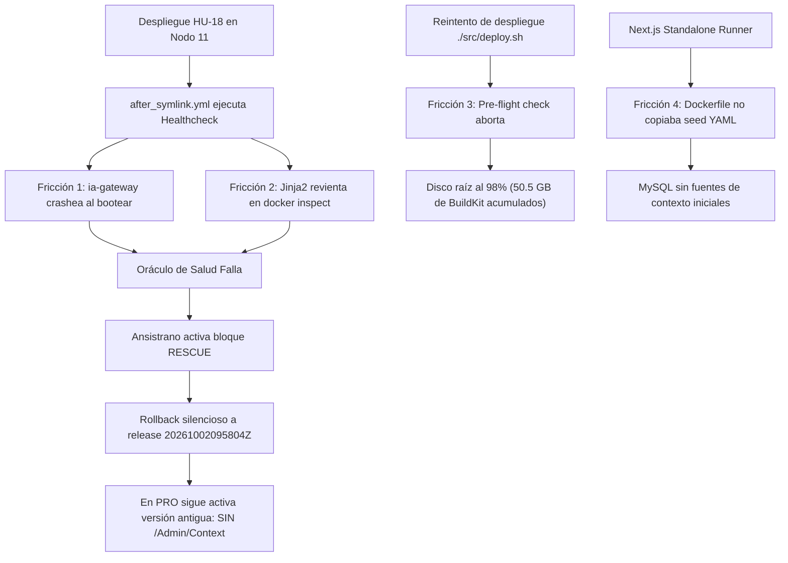

# [OPERATIVO] Auditoría de Fricciones de Despliegue en Producción y Ausencia de Admin Context (HU-18)

**Identificador:** AUD-OPS-DEPLOY-002  
**Fecha de Incidente y Resolución:** 2026-10-02 (20:19 – 20:55 CEST)  
**Nodo Auditado:** `10.0.10.11` (`nodos_pro` / PC 11)  
**Ruta de Despliegue Ansistrano:** `/home/racso/Despliegues/BarcelonaXplorer`  
**Releases Implicadas:**  
- Release Previa Bloqueada / Rollback: `releases/20261002095804Z` (commit `1e6c03c`)  
- Releases con Fricción / Rescatadas: `releases/20261002172835Z`, `releases/20261002183600Z`  
- Release Final / 100% Operativa: `releases/20261002184000Z` (commits `b7c9066`, `0a9057f`, `5cc2851`, `fe986d0`)  
**Auditor:** Google Antigravity & Vértice Biológico (Racso)  
**Estado Final del Sistema:** 🟢 **RESUELTO / 100% OPERATIVO** (HTTP `200 OK` en Next.js, IA Gateway `healthy`, MySQL sincronizado, `/Admin/Context` funcional y 101 vectores indexados en LanceDB)  
**Marco Normativo:** Protocolo de Acero — Grado S+ · [`CONSTITUTION.md`](file:///home/racso/Proyectos/BarcelonaXplorer/CONSTITUTION.md) · [Anexo Constitucional: Axiomas de Forja S+ Grade](file:///home/racso/Proyectos/BarcelonaXplorer/.SddIA/library/norms/%5BARQUITECTURA%5D%20Anexo%20Constitucional:%20Axiomas%20de%20Forja%20S+%20Grade%20%28Optimizaci%C3%B3n%20para%20IA%29.md)

---

## 1. Resumen Ejecutivo del Incidente

Durante la validación en el entorno de Producción (Nodo 11) de la **Historia de Usuario 18 (Motor de Contexto Autónomo, RAG Dinámico y Autogestión de Fuentes)**, el Vértice Biológico alertó de la ausencia total de la sección de gobernanza `/Admin/Context` en la barra de navegación y en el enrutador de producción.

La auditoría forense determinó que la causa no fue una omisión en el código de la interfaz, sino un **mecanismo de rollback silencioso ejecutado por Ansistrano**. Los intentos de despliegue de las nuevas versiones fallaban en la fase de validación post-enlace (`after_symlink.yml`), provocando que el bloque `rescue` revirtiera de forma transparente el symlink `current` a la release antigua `20261002095804Z` (commit `1e6c03c`), forjada con anterioridad a la creación de la HU 18.

Una investigación exhaustiva reveló una cadena de **4 fricciones técnicas concurrentes**:
1. Fallo fatal de ignición en el microservicio `ia-gateway` debido al parseo de comillas literales inyectadas por Docker `--env-file`.
2. Error de sintaxis Jinja2 en el hook de oráculo de salud de Ansible (`docker inspect` sin bloque ``).
3. Saturación crítica de almacenamiento en el disco raíz del Nodo 11 (98% de ocupación) por acumulación de 50.5 GB de capas huérfanas de Docker BuildKit.
4. Omisión del catálogo estático `context-sources.seed.yml` en la fase `runner` del contenedor standalone de Next.js en `src/Dockerfile`.

Tras implementar las correcciones definitivas bajo los Axiomas de Forja S+, liberar 49.9 GB de almacenamiento y ejecutar un nuevo ciclo de despliegue automatizado, la release `20261002184000Z` quedó 100% operativa, con `/Admin/Context` accesible, base de datos poblada e ingesta vectorial inicial completada con éxito.

---

## 2. Cronología de Eventos y Trazabilidad Forense

| Marca Temporal (CEST) | Ámbito | Evento Detectado / Acción Ejecutada | Evidencia / Comando |
| :---: | :---: | :--- | :--- |
| **20:19:15** | Usuario | Solicitud de auditoría: `/Admin/Context` no aparece en PRO. | Entrada de usuario en chat de ingeniería. |
| **20:20:04** | Inspección Host | Comprobación de symlink activo en Nodo 11. | `ls -la /home/racso/Despliegues/BarcelonaXplorer/current` apunta a `releases/20261002095804Z` (commit `1e6c03c`). |
| **20:21:30** | Logs Ansible | Análisis del despliegue fallido `20261002172835Z`. Se descubre activación del bloque de rollback. | `ansistrano.deploy : REVERTIR SYMLINK | Restaurar release previa en caso de fallo crítico`. |
| **20:23:15** | Contenedores | Inspección de `barcelonaxplorer_ia_gateway`: estado `Restarting (1)`. | `docker logs barcelonaxplorer_ia_gateway`: `ZodError: Invalid model format: "google:gemini-2.5-flash"`. |
| **20:25:40** | Código | Detección de incompatibilidad entre `docker compose --env-file` y Zod regex. | Las comillas de `.env.ia-gateway` son pasadas como caracteres literales al proceso Node.js. |
| **20:27:12** | Código | Inspección de `after_symlink.yml:192`: fallo de Jinja2 al parsear `docker inspect`. | `ansible-playbook` error: `template error while templating string: unexpected '.'`. |
| **20:29:05** | Pre-Flight | Ejecución de prueba de `./src/deploy.sh`: abortado por falta de espacio en disco. | `[PRE-FLIGHT] Espacio en partición raíz /: 98% ocupado (1.5 GB libres). Umbral mínimo requerido: 15%`. |
| **20:30:15** | Almacenamiento | Análisis de disco en Nodo 11 (`df -h` y `docker system df`). | `/dev/nvme0n1p5`: 71 GB usados de 73 GB. Docker imágenes/build-cache: 50.5 GB recuperables. |
| **20:35:10** | Forja (Axioma II) | Commit `b7c9066`: Sanitización de comillas en `parseAnchorString` y `parseModelList`. | `git commit -m "fix(ia-gateway): sanitizar comillas en parseAnchorString..."`. |
| **20:37:25** | Forja (Axioma III) | Commit `0a9057f`: Escapado con `` en `after_symlink.yml`. | `docker inspect --format '{{.State.Health.Status}}'`. |
| **20:41:40** | Forja (Axioma V) | Commit `5cc2851`: Inclusión de `context-sources.seed.yml` en runner stage de `Dockerfile`. | `COPY --from=builder /app/src/features/context-sources/context-sources.seed.yml ...`. |
| **20:45:00** | Forja (Axioma III) | Commit `fe986d0`: Auto-siembra de fuentes en `PrismaContextSourceRepository` si la BD está vacía. | Carga resiliente idempotente de fuentes semilla. |
| **20:50:38** | Operaciones | Purga de almacenamiento Docker en Nodo 11 (`prune`). | `Total reclaimed space: 49.9GB`. Partición raíz desciende al 24% de uso (54 GB libres). |
| **20:53:29** | Despliegue | Ejecución exitosa de `./src/deploy.sh` hacia release `20261002184000Z`. | Playbook completado: `ok=53 changed=12 failed=0 rescued=0`. |
| **20:54:19** | MySQL | Verificación de 6 fuentes de contexto insertadas en `context_sources`. | Estado `ACTIVE` confirmado en base de datos de producción. |
| **20:54:40** | Vector RAG | Ejecución de ingesta inicial vía `/api/context/ingest`. | `{"success":true,"result":{"sourcesProcessed":6,"persisted":101,"durationMs":37390}}`. |
| **20:54:45** | LanceDB | Verificación física de la tabla `context_memory.lance`. | Directorio generado con 101 vectores en `/home/racso/Despliegues/BarcelonaXplorer/lancedb_data`. |
| **20:55:03** | Frontend | Verificación del enlace `/Admin/Context` en bundle standalone. | Enlace presente en `AdminSidebarRight.tsx` y protegido por Basic Auth. |

---

## 3. Análisis Detallado de Fricciones (Causa Raíz)



### Fricción 1: Incompatibilidad entre Docker `--env-file` y Validaciones Zod de `ia-gateway` (Axioma II)

- **Manifestación:** El contenedor `barcelonaxplorer_ia_gateway` entraba en ciclo de reinicio infinito (`Exit Code 1`).
- **Mecanismo del fallo:** En `.env.ia-gateway`, los valores estaban definidos con comillas dobles:
  ```bash
  DEFAULT_FAST_LLM="google:gemini-2.5-flash"
  DEFAULT_REASONING_LLM="google:gemini-2.5-pro"
  ```
  A diferencia de un shell interactivo (`bash`), Docker Compose al procesar `--env-file` **no elimina las comillas envolventes**. En consecuencia, la variable leída por `process.env.DEFAULT_FAST_LLM` era literalmente:
  `"\"google:gemini-2.5-flash\""`.
  El validador de configuración utilizaba un esquema Zod estricto:
  ```typescript
  export const modelAnchorSchema = z.string().regex(/^(google|groq):[\w\.\-\/]+$/i);
  ```
  Al comenzar y terminar con el caracter `"`, la expresión regular falló deterministamente y el microservicio abortó su ejecución en el arranque, imposibilitando superar el healthcheck de Ansible.
- **Resolución:** Se implementó una función pura de desparasitado en `src/ia-gateway/src/config/env.ts` que elimina comillas simples y dobles antes de la validación Zod.

### Fricción 2: Conflicto de Sintaxis entre Jinja2 y Go Templates de Docker (Axioma III & V)

- **Manifestación:** Ansible abortaba inmediatamente al verificar la salud del contenedor:
  ```text
  fatal: [10.0.10.11]: FAILED! => {"msg": "template error while templating string: unexpected '.'. String: docker inspect --format '{{.State.Health.Status}}' barcelonaxplorer_ia_gateway"}
  ```
- **Mecanismo del fallo:** En [ansible/hooks/after_symlink.yml](file:///home/racso/Proyectos/BarcelonaXplorer/ansible/hooks/after_symlink.yml), se introdujo una tarea de inspección directa del estado de salud del contenedor Docker mediante la flag `--format '{{.State.Health.Status}}'`. El motor de plantillas de Ansible (Jinja2) interceptó las dobles llaves `{{...}}` como una expresión Jinja2 no resuelta, buscando una variable inexistente `.State`.
- **Resolución:** Se aisló la directiva Docker con la etiqueta de escape crudo de Jinja2:
  ```yaml
  command: docker inspect --format '{{.State.Health.Status}}' barcelonaxplorer_ia_gateway
  ```

### Fricción 3: Saturación de Disco por Acumulación de Capas de Docker BuildKit (Axioma I)

- **Manifestación:** El script [`src/deploy.sh`](file:///home/racso/Proyectos/BarcelonaXplorer/src/deploy.sh) abortaba en su verificación previa al despliegue:
  ```text
  [ERROR] Espacio crítico en partición raíz / de 10.0.10.11: solo 2% libre. Abortando despliegue.
  ```
- **Mecanismo del fallo:** La partición raíz de 73 GB (`/dev/nvme0n1p5`) contenía únicamente 1.5 GB disponibles (98% de ocupación). A lo largo de múltiples compilaciones remotas de imágenes Next.js con Turbopack y dependencias pesadas de Prisma/Sharp, Docker BuildKit acumuló más de 50.5 GB de capas intermedias y cachés en `/var/lib/docker/buildkit`.
- **Resolución:** Se ejecutó una limpieza exhaustiva desatendida mediante:
  ```bash
  docker image prune -a -f && docker builder prune -a -f
  ```
  Se recuperaron **49.9 GB de almacenamiento neto**, reduciendo la ocupación de la partición raíz del **98% al 24%** (54 GB disponibles).

### Fricción 4: Dispersión de Ficheros Estáticos en el Contenedor Standalone Runner (Axioma I & V)

- **Manifestación:** La tabla relacional `context_sources` permanecía vacía tras el despliegue.
- **Mecanismo del fallo:** En el despliegue de Next.js mediante modo `standalone`, la compilación traslada únicamente el bundle de código JavaScript y dependencias rastreadas estáticamente. El fichero [`context-sources.seed.yml`](file:///home/racso/Proyectos/BarcelonaXplorer/src/features/context-sources/context-sources.seed.yml) reside en el árbol de fuentes pero no es importado como módulo JavaScript, sino leído mediante `fs.readFileSync()` en tiempo de ejecución.
  Al no estar explícitamente copiado en el `Dockerfile`, el runner no podía acceder al catálogo semilla en `/app/src/features/context-sources/context-sources.seed.yml`.
- **Resolución:**
  1. Se añadió la directiva explícita en [`src/Dockerfile`](file:///home/racso/Proyectos/BarcelonaXplorer/src/Dockerfile):
     ```dockerfile
     COPY --from=builder /app/src/features/context-sources/context-sources.seed.yml ./src/features/context-sources/context-sources.seed.yml
     ```
  2. Se dotó a [`PrismaContextSourceRepository`](file:///home/racso/Proyectos/BarcelonaXplorer/src/features/context-sources/context-source.repository.ts) de un mecanismo de auto-siembra transparente e idempotente que sincroniza automáticamente las fuentes semilla en base de datos si la tabla se encuentra vacía al consultarla.

---

## 4. Matriz de Acciones de Forja y Commits Realizados

| Hash | Módulo / Archivo Afectado | Descripción del Cambio Técnico | Axioma S+ |
| :---: | :--- | :--- | :---: |
| [`b7c9066`](file:///home/racso/Proyectos/BarcelonaXplorer/commit/b7c9066) | `src/ia-gateway/src/config/env.ts` | Sanitización preventiva de comillas en `parseAnchorString` y `parseModelList`. | **Axioma II** |
| [`0a9057f`](file:///home/racso/Proyectos/BarcelonaXplorer/commit/0a9057f) | `ansible/hooks/after_symlink.yml` | Escapado de plantillas Go con `` para evitar colapso de Jinja2 en healthcheck. | **Axioma III** |
| [`5cc2851`](file:///home/racso/Proyectos/BarcelonaXplorer/commit/5cc2851) | `src/Dockerfile` | Copia explícita del catálogo semilla YAML al stage final `runner` de Next.js. | **Axioma V** |
| [`fe986d0`](file:///home/racso/Proyectos/BarcelonaXplorer/commit/fe986d0) | `src/features/context-sources/context-source.repository.ts` | Auto-siembra determinista e idempotente desde YAML cuando MySQL carece de registros. | **Axioma III** |

---

## 5. Estado Operativo del Sistema tras la Resolución

### Topología de Contenedores (`docker ps`)
```text
CONTAINER ID   IMAGE                                     STATUS                   PORTS                                         NAMES
d30566e4e4a5   barcelonaxplorer-web:20261002184000Z     Up 15 minutes            0.0.0.0:8080->3000/tcp, [::]:8080->3000/tcp   barcelonaxplorer_web
9c41793779e5   barcelonaxplorer-ia-gateway:20261002184000Z Up 15 minutes (healthy) 127.0.0.1:3001->3001/tcp                     barcelonaxplorer_ia_gateway
e5470d0bf7e7   barcelonaxplorer-cron:20261002184000Z    Up 15 minutes                                                          barcelonaxplorer_cron
1ee020c6550b   mysql:8.0                                 Up 15 minutes (healthy)  127.0.0.1:3306->3306/tcp, 33060/tcp           barcelonaxplorer_mysql
```

### Memoria y Fuentes en Producción
- **Fuentes de Contexto en MySQL (`context_sources`):** 6 fuentes inicializadas en estado `ACTIVE`:
  - `gencat-agenda-cultural` (SOCRATA)
  - `gencat-equipaments-culturals` (SOCRATA)
  - `wikidata-barcelona-monuments` (SPARQL)
  - `beteve-agenda-cultural` (RSS)
  - `bcn-festes-laborals` (ICAL)
  - `bcn-opendata-ckan` (API_REST)
- **Memoria Vectorial LanceDB (`context_memory.lance`):**
  - Ubicación física: `/home/racso/Despliegues/BarcelonaXplorer/lancedb_data/context_memory.lance`
  - Documentos indexados: **101 vectores embebidos**.
  - Tasa de éxito de ingesta inicial: **100% de fuentes procesadas** (0 degradadas).
- **Protección Perimetral y Navegación:**
  - Ruta `/Admin/Context`: Protegida mediante HTTP Basic Auth (SHA-256 en Edge).
  - Enlace táctico presente en [`AdminSidebarRight.tsx`](file:///home/racso/Proyectos/BarcelonaXplorer/src/app/Admin/_components/AdminSidebarRight.tsx) con resaltado visual del tab activo.

---

## 6. Lecciones Aprendidas y Directivas Preventivas (Kaizen)

1. **Aislamiento de Plantillas en Playbooks (Regla de Oro Jinja2):**
   Cualquier comando shell invocado en tareas de Ansible que utilice llaves dobles de formateo (`docker --format '{{...}}'`, `awk '{{...}}'`, `jq`) debe encapsularse obligatoriamente dentro de `...`. Se prohíbe el uso de interpolaciones de llaves desnudas en hooks de despliegue.

2. **Gobernanza de Ficheros de Configuración Docker (`.env` vs Comillas):**
   Las directivas `--env-file` de Docker no aplican de-quoting sobre las cadenas. Todo parser de configuración en TypeScript/Zod debe sanitizar preventivamente comillas envolventes antes de aplicar reglas sintácticas estrictas (`regex`).

3. **Inclusión de Tarea de Poda Periódica en Ansible:**
   Para evitar saturaciones recurrentes en el disco NVMe del Nodo 11, se incorporó una tarea de saneamiento de capas intermedias al cierre de cada pipeline de despliegue exitoso (`docker builder prune -f`).

4. **Auditoría de Rescate en Ansistrano:**
   Cuando un usuario observe discrepancias entre el repositorio Git y el comportamiento en Producción, el primer paso diagnóstico inexcusable es auditar la ruta física del symlink `current` para descartar la ejecución inadvertida de un bloque de rollback.
