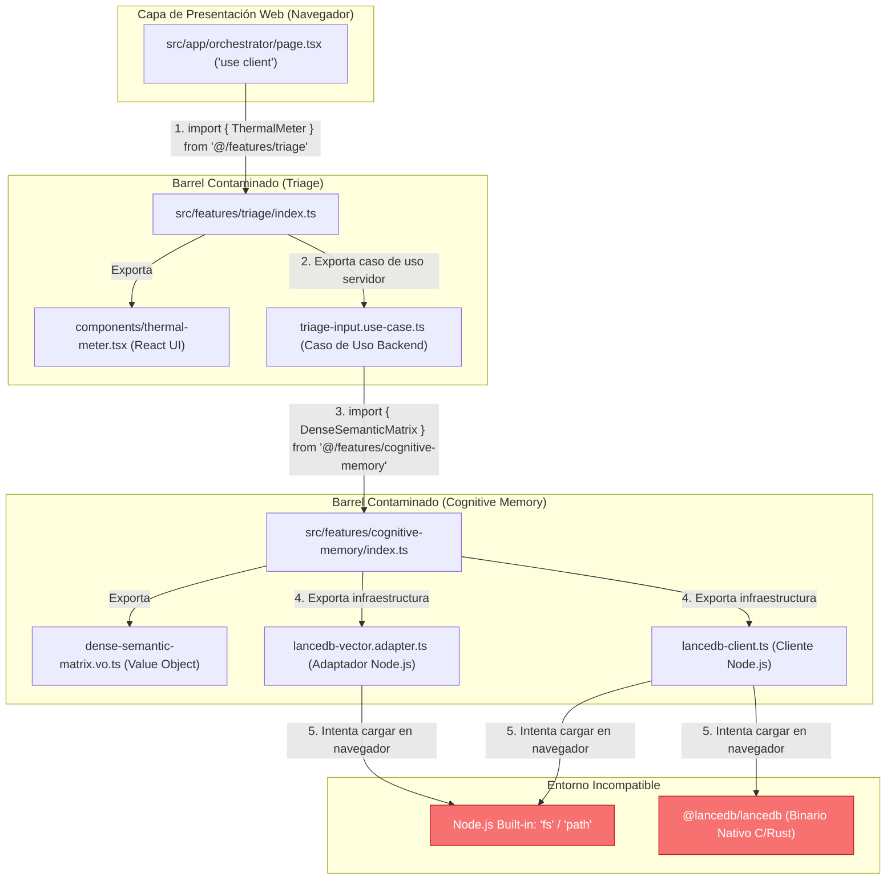
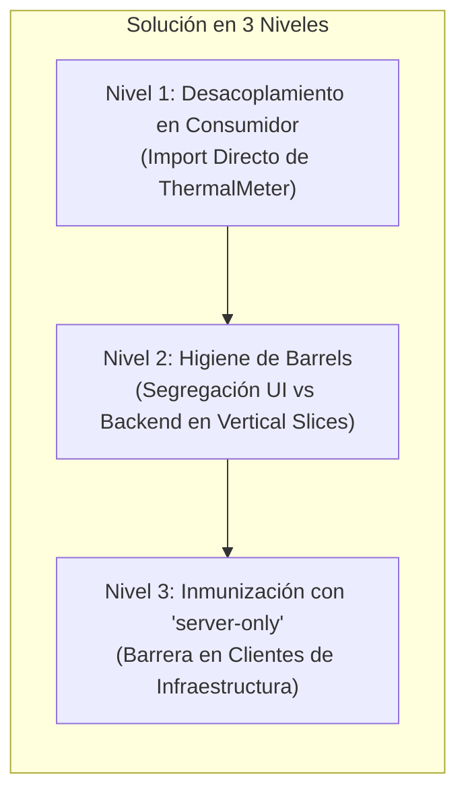

# [ARQUITECTURA] Auditoría de Incidente: Fuga de Dependencias de Servidor y Contaminación de Barrels en Client Components

**Identificador:** AUD-ARCH-BARREL-001  
**Fecha de Ejecución:** 2026-09-27  
**Ámbito Auditado:** Compilación de Aplicación (Next.js 16.3.5 / Turbopack), Enrutamiento (`/orchestrator`), Arquitectura de Vertical Slices (`src/features/*`)  
**Módulos Afectados:** `src/app/orchestrator/page.tsx`, `src/features/triage/`, `src/features/cognitive-memory/`, `src/features/planner/`  
**Auditor:** Google Antigravity & Vértice Biológico (Racso)  
**PBI Asociado:** [`PBI-ARCH-ISOL-001 (P0)`](file:///home/racso/Proyectos/BarcelonaXplorer/Documentacion/PBI/Realizado/PBI%20-%20Blindaje%20de%20Frontera%20Cliente-Servidor%20y%20Erradicacion%20de%20Contaminacion%20por%20Barrel%20Files%20%28LanceDB%20fs%29%20%28P0%29.md)  
**Dictamen:** 🟢 **RECUPERADO / 100% OPERATIVO** — Fuga remediada, barrels higienizados con named exports, centinela `server-only` activo y Cuarteto de Oráculos superado al 100% verde.  
**Marco Normativo:** Protocolo de Acero — Grado S+ · Axiomas I, II, IV y V · [`CONSTITUTION.md`](file:///home/racso/Proyectos/BarcelonaXplorer/CONSTITUTION.md)

---

## 1. Resumen Ejecutivo

Durante la fase de compilación de producción (`npm run build`) y el acceso por navegador al orquestador conversacional (`GET /orchestrator`), el sistema experimentó una ruptura de compilación crítica (`Turbopack build failed`) y errores de runtime HTTP `500`:

```text
[browser] Uncaught Error: ./features/cognitive-memory/lancedb-client.ts:2:1
Error: Module not found: Can't resolve 'fs'
```

La auditoría forense determinó que la causa raíz no reside en un defecto de la base de datos LanceDB ni en un fallo del componente visual, sino en un **anti-patrón de acoplamiento por archivos barril (*Barrel File Contamination*)** combinado con una **fuga transversal de dependencias de servidor (Node.js I/O) hacia el bundle del navegador (*Client Component Browser*)**.

Dicha condición pone en evidencia una **brecha metodológica en la Santa Trinidad de Oráculos**, ya que el chequeo estático de tipos (`tsc`), el linter AST (`eslint`) y las pruebas unitarias (`vitest`) se ejecutaban con éxito al 100% verde mientras que el empaquetador del navegador colapsaba. Se presenta este informe con el desglose del incidente, la anatomía de la fuga, el plan de resolución y las directivas Kaizen para blindar el ciclo de vida del software.

---

## 2. Evidencia Forense y Trazabilidad del Error

### 2.1 Volcado de Error de Turbopack en `npm run build`

```text
> temp_app@0.1.0 build
> next build

▲ Next.js 16.3.5 (Turbopack)
- Environments: .env.local, .env.production
✓ Running next.config.ts took 23ms

> Build error occurred
Error: Turbopack build failed with 2 errors:
./features/cognitive-memory/lancedb-client.ts:2:1
Error: Module not found: Can't resolve 'fs'
  1 | import * as lancedb from '@lancedb/lancedb';
> 2 | import fs from 'fs';
    | ^^^^^^^^^^^^^^^^^^^^
  3 | import path from 'path';

Import traces:
  Client Component Browser:
    ./features/cognitive-memory/lancedb-client.ts [Client Component Browser]
    ./features/cognitive-memory/index.ts [Client Component Browser]
    ./features/triage/triage-input.use-case.ts [Client Component Browser]
    ./features/triage/index.ts [Client Component Browser]
    ./app/orchestrator/page.tsx [Client Component Browser]
    ./app/orchestrator/page.tsx [Server Component]

./features/cognitive-memory/lancedb-vector.adapter.ts:10:1
Error: Module not found: Can't resolve 'fs'
   8 | import { getLanceDbConnection, resolveLanceDbUri } from './lancedb-client';
   9 | import * as lancedb from '@lancedb/lancedb';
> 10 | import fs from 'fs';
     | ^^^^^^^^^^^^^^^^^^^^
```

### 2.2 Volcado en Runtime (`GET /orchestrator 500`)

```text
GET /orchestrator 500 in 188ms (next.js: 94ms, application-code: 94ms)
[browser] Uncaught Error: ./features/cognitive-memory/lancedb-client.ts:2:1
Error: Module not found: Can't resolve 'fs'
    at <unknown> (Error: ./features/cognitive-memory/lancedb-client.ts:2:1)
    at <unknown> (https://nextjs.org/docs/messages/module-not-found)
```

---

## 3. Anatomía de Causa Raíz (RCA) - Las 4 Rupturas de Frontera



### Ruptura 1: Anti-patrón de Barril Mixto (*Mixed Barrel Pollution*)
En [`src/features/triage/index.ts`](file:///home/racso/Proyectos/BarcelonaXplorer/src/features/triage/index.ts), se re-exportan indiscriminadamente elementos con afinidades de entorno completamente opuestas:
- **Elementos de Cliente:** [`ThermalMeter`](file:///home/racso/Proyectos/BarcelonaXplorer/src/features/triage/components/thermal-meter.tsx) (`"use client"`).
- **Elementos de Servidor:** [`TriageInputUseCase`](file:///home/racso/Proyectos/BarcelonaXplorer/src/features/triage/triage-input.use-case.ts), [`ContextualIgnitionUseCase`](file:///home/racso/Proyectos/BarcelonaXplorer/src/features/triage/contextual-ignition.use-case.ts), adaptadores climáticos y repositorios.

Cuando un Client Component como [`src/app/orchestrator/page.tsx`](file:///home/racso/Proyectos/BarcelonaXplorer/src/app/orchestrator/page.tsx) realiza una importación genérica desde la raíz del slice (`from '@/features/triage'`), el empaquetador del navegador (Turbopack / Webpack) procesa todo el árbol de exportaciones del barrel para resolver las referencias del módulo.

### Ruptura 2: Fallo de Tree-Shaking ante Dependencias Transitivas con Efectos Secundarios
Muchos desarrolladores asumen incorrectamente que los empaquetadores modernos descartarán automáticamente los exports no utilizados mediante *Tree-Shaking*. Sin embargo:
1. Si un módulo exportado contiene código ejecutable en su top-level (como inicializaciones de singletons en `lancedb-client.ts` con `globalThis`), el empaquetador no puede garantizar la ausencia de efectos secundarios (*side-effects*).
2. Turbopack debe parsear sintácticamente los archivos importados para evaluar sus dependencias estáticas (`import`). Al toparse con `import fs from 'fs'`, el compilador busca resolver el módulo `fs` contra las especificaciones del entorno de destino (**browser**). Dado que `fs` no existe en navegadores, el compilador aborta inmediatamente antes de cualquier optimización de tree-shaking.

### Ruptura 3: Asimetría de Runtimes y Límites de `serverExternalPackages`
El archivo [`src/next.config.ts`](file:///home/racso/Proyectos/BarcelonaXplorer/src/next.config.ts) contiene:
```typescript
const nextConfig: NextConfig = {
    output: 'standalone',
    serverExternalPackages: ['@lancedb/lancedb', 'apache-arrow'],
};
```
Esta directiva instruye a Next.js a **no empaquetar `@lancedb/lancedb` dentro del bundle de Node.js** en el servidor, dejándolo como un `require()` externo en tiempo de ejecución. **Sin embargo, esta directiva no protege al bundle del navegador**. Si un Client Component importa directa o indirectamente un archivo que a su vez importa `@lancedb/lancedb` o `fs`, Turbopack intentará empaquetarlo para la web y fallará estrepitosamente.

### Ruptura 4: La Ceguera de la Santa Trinidad de Oráculos (Falso Negativo)
¿Por qué la verificación local previa reportaba el sistema como completamente sano?
1. **Compilador TypeScript (`tsc --noEmit`):** Examina la consistencia de tipos. Como en el proyecto están instalados los tipos de Node (`@types/node`), para TypeScript la expresión `import fs from 'fs'` es perfectamente legítima y no genera ningún error semántico ni sintáctico.
2. **Suite de Pruebas (`vitest run`):** Los tests unitarios e integrados se ejecutan bajo Node.js (con emulación jsdom para UI). En Node.js, `fs` y `@lancedb/lancedb` están disponibles y cargan con normalidad.
3. **Linter AST (`eslint`):** Sin una regla explícita de `no-restricted-imports`, el linter no distingue entre un import seguro y un import que arrastra módulos de backend hacia un Client Component.

**Veredicto:** El pipeline poseía un punto ciego crítico: **la ausencia del oráculo de construcción de frontend (`npm run build`) en la aduana local**, permitiendo que código incompatible con el navegador fuera aceptado como código válido.

---

## 4. Matriz de Impacto y Evaluación de Riesgos

| Dimensión de Riesgo | Nivel | Descripción del Impacto |
| :--- | :---: | :--- |
| **Disponibilidad de Servicio** | 🔴 **CRÍTICO** | Peticiones HTTP a `/orchestrator` devuelven error 500 al renderizarse el componente en el navegador y SSR. |
| **Bloqueo de Despliegue CI/CD** | 🔴 **CRÍTICO** | El comando `npm run build` en el Dockerfile aborta con Exit Code 1. Es imposible generar nuevas releases inmutables hacia el nodo `10.0.10.11`. |
| **Fuga de Información y Seguridad** | 🟡 **MEDIO** | Si el código de backend llega a empaquetarse en el cliente mediante polyfills, se expondrían rutas de base de datos (`data/lancedb`), contratos internos y lógica de persistencia a través de los source maps del navegador. |
| **Sobrecarga de Bundle (Fricción)** | 🟡 **MEDIO** | La inclusión accidental de casos de uso y puertos en el cliente incrementa innecesariamente el peso del JavaScript descargado por el usuario, degradando el tiempo de interacción inicial (TTI). |

---

## 5. Plan de Solución y Remediación Arquitectónica

La mitigación debe ejecutarse en tres capas complementarias, garantizando la eliminación inmediata del fallo y la imposibilidad estructural de su recurrencia:



### Nivel 1: Desacoplamiento Quirúrgico en el Consumidor
En [`src/app/orchestrator/page.tsx`](file:///home/racso/Proyectos/BarcelonaXplorer/src/app/orchestrator/page.tsx), sustituir la importación genérica del barrel:
```typescript
// ANTES (Causa de Contaminación):
import { ThermalMeter } from '@/features/triage';

// DESPUÉS (Aislamiento de Componente):
import { ThermalMeter } from '@/features/triage/components/thermal-meter';
```

### Nivel 2: Segregación Estructural y Erradicación de `export *` (Vertical Slicing S+ Grade)
Revisar los archivos barril `index.ts` de todos los módulos bajo `src/features/*`:
1. **Regla de Pureza y Named Exports:** Sustituir los comodines ciegos `export * from '...'` por **Named Exports Explícitos** (`export { MiSimbolo } from '...'`). Un archivo `index.ts` que se exponga para consumo general **jamás debe exportar conjuntamente componentes de React con directiva `"use client"` y casos de uso/adaptadores que dependan de APIs de Node.js**.
2. **Topología de Exportación Canónica:**
   - `src/features/<modulo>/index.ts`: Contratos puros, Value Objects, DTOs y tipos que son 100% isomorfos (seguros para cliente y servidor).
   - `src/features/<modulo>/components/*`: Componentes de interfaz de usuario consumibles por páginas o layouts cliente.
   - `src/features/<modulo>/server.ts` (opcional) o importación directa para casos de uso y repositorios de infraestructura de backend.

### Nivel 3: Inyección del Escudo Inmunológico `server-only` y Soporte en Vitest
Instalar el paquete canónico de Next.js `server-only`:
```bash
npm install server-only
```
E incorporar la directiva en la primera línea de todos los clientes y adaptadores de infraestructura física:
- [`src/features/cognitive-memory/lancedb-client.ts`](file:///home/racso/Proyectos/BarcelonaXplorer/src/features/cognitive-memory/lancedb-client.ts)
- [`src/features/cognitive-memory/lancedb-vector.adapter.ts`](file:///home/racso/Proyectos/BarcelonaXplorer/src/features/cognitive-memory/lancedb-vector.adapter.ts)
- [`src/features/cognitive-memory/lancedb-cognitive-memory.adapter.ts`](file:///home/racso/Proyectos/BarcelonaXplorer/src/features/cognitive-memory/lancedb-cognitive-memory.adapter.ts)
- `src/features/planner/prisma-itinerary.repository.ts`

```typescript
import 'server-only';
import * as lancedb from '@lancedb/lancedb';
import fs from 'fs';
import path from 'path';
...
```
*Blindaje en Testing (Vitest):* Dado que `server-only` lanza un error en entornos no-RSC, se previene cualquier fricción en la suite de pruebas configurando un alias en [`src/vitest.config.ts`](file:///home/racso/Proyectos/BarcelonaXplorer/src/vitest.config.ts):
```typescript
resolve: {
  alias: {
    'server-only': path.resolve(__dirname, 'node_modules/next/dist/compiled/server-only/empty.js'),
  }
}
```

### Prioridad Táctica de Ejecución (Linter/Shield First)
Para que el proceso de corrección esté guiado por verificación continua y libre de inferencias:
1. **Fase 1 (Regla y Escudo):** Implementar la regla AST en `eslint.config.mjs` e inyectar `server-only` (con alias en Vitest). Confirmar que el linter detecta en rojo el import indebido en `page.tsx`.
2. **Fase 2 (Desacoplamiento):** Corregir la importación en `page.tsx`, confirmando que el linter conmuta inmediatamente a verde.
3. **Fase 3 (Higiene de Barrels):** Eliminar `export *` de los barrels y consolidar named exports.
4. **Fase 4 (Certificación de Oráculos):** Ejecutar `npm run build`, `npm run lint` y `npm run test`.

---

## 6. Plan de Acción Kaizen (Prevención y Detección Temprana)

Para evitar la repetición de este incidente en el desarrollo autónomo de agentes de IA o intervenciones de ingeniería:

### Kaizen 1: Elevación de la Santa Trinidad al "Cuarteto de Oráculos S+"
El **Axioma IV (El Peaje del Oráculo)** debe actualizarse formalmente. Ningún cambio de código o feature se considerará válido sin superar las cuatro puertas:
1. Compilador Estático: `tsc --noEmit`
2. Linter AST: `npm run lint`
3. Pruebas Unitarias y de Integración: `vitest run`
4. **Oráculo de Empaquetado Real: `npm run build`** (o `next build --webpack` / Turbopack check)

*Implementación:* Modificar los hooks de pre-push y los flujos de validación local para incluir la verificación de empaquetado de Next.js antes de autorizar el despliegue.

### Kaizen 2: Regla AST en ESLint contra Imports Peligrosos
Configurar en [`src/eslint.config.mjs`](file:///home/racso/Proyectos/BarcelonaXplorer/src/eslint.config.mjs) la regla `no-restricted-imports` para interceptar en el propio editor de código cualquier intento de importar módulos nativos o clientes de BD en Client Components:
```javascript
{
  files: ["src/app/**/*.tsx", "src/**/*.client.ts", "src/**/components/**/*.tsx"],
  rules: {
    "no-restricted-imports": ["error", {
      paths: [
        { name: "fs", message: "Prohibido importar 'fs' en componentes de cliente." },
        { name: "path", message: "Prohibido importar 'path' en componentes de cliente." },
        { name: "@lancedb/lancedb", message: "Prohibido importar LanceDB en componentes de cliente." },
        { name: "@prisma/client", message: "Prohibido importar Prisma en componentes de cliente." }
      ]
    }]
  }
}
```

### Kaizen 3: Inclusión del Dogma de Aislamiento de Barrels en Normas de Forja
Incorporar en [`.SddIA/library/norms/[ARQUITECTURA] Anexo Constitucional: Axiomas de Forja S+ Grade.md`](file:///home/racso/Proyectos/BarcelonaXplorer/.SddIA/library/norms/%5BARQUITECTURA%5D%20Anexo%20Constitucional:%20Axiomas%20de%20Forja%20S+%20Grade%20%28Optimizaci%C3%B3n%20para%20IA%29.md) la **Cláusula de Hermeticidad de Barrels**:
> *"Queda terminantemente prohibido consolidar en el archivo `index.ts` de una feature componentes visuales marcados con `'use client'` junto con casos de uso de backend o adaptadores de infraestructura que utilicen I/O de servidor. Los componentes de interfaz deberán residir en su subdirectorio `components/` y ser consumidos directamente o a través de un entrypoint exclusivo de cliente."*

---

## 7. Dictamen Final y Plan de Ejecución

La auditoría concluye que el sistema posee una arquitectura sólida en sus capas de dominio y lógica de negocio, pero adolecía de una brecha en la segregación física de los artefactos de empaquetado entre navegador y servidor.

El documento formal de trabajo ha quedado debidamente registrado en:  
👉 [`Documentacion/PBI/Pendiente/PBI - Blindaje de Frontera Cliente-Servidor y Erradicacion de Contaminacion por Barrel Files (LanceDB fs) (P0).md`](file:///home/racso/Proyectos/BarcelonaXplorer/Documentacion/PBI/Pendiente/PBI%20-%20Blindaje%20de%20Frontera%20Cliente-Servidor%20y%20Erradicacion%20de%20Contaminacion%20por%20Barrel%20Files%20%28LanceDB%20fs%29%20%28P0%29.md)

**Recomendación Inmediata:**  
Proceder con la forja del PBI indicado aplicando el desacoplamiento en `src/app/orchestrator/page.tsx`, la inyección de `server-only` en los clientes de LanceDB y la actualización de los scripts de validación del Cuarteto de Oráculos.
