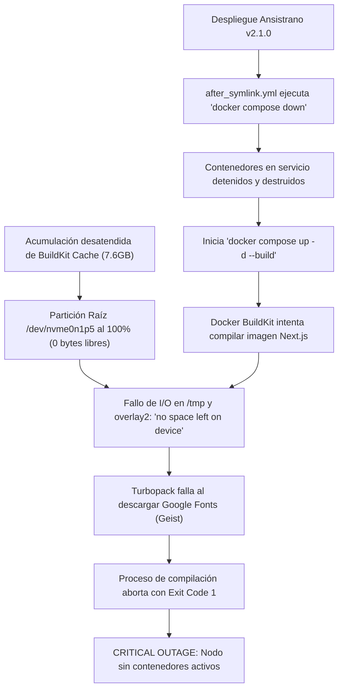

# [OPERATIVO] Auditoría de Incidente y Estado Operativo del Nodo de Producción

**Identificador:** AUD-OPS-PROD-001  
**Fecha de Incidente y Ejecución:** 2026-09-26 (16:28 – 16:44 CEST)  
**Nodo Auditado:** `10.0.10.11` (`nodos_pro` / PC 11)  
**Ruta de Despliegue Ansistrano:** `/home/racso/Despliegues/BarcelonaXplorer`  
**Release Objetivo:** `releases/20260926142742Z` (symlink a `current`)  
**Auditor:** Google Antigravity & Vértice Biológico (Racso)  
**Estado Final del Sistema:** 🟢 **RECUPERADO / 100% OPERATIVO** (HTTP `200 OK` en Next.js, MySQL y Nginx)  
**Marco Normativo:** Protocolo de Acero — Grado S+ · [`CONSTITUTION.md`](file:///home/racso/Proyectos/BarcelonaXplorer/CONSTITUTION.md) · [Anexo Constitucional: Axiomas de Forja S+ Grade](file:///home/racso/Proyectos/BarcelonaXplorer/.SddIA/library/norms/%5BARQUITECTURA%5D%20Anexo%20Constitucional:%20Axiomas%20de%20Forja%20S+%20Grade%20%28Optimizaci%C3%B3n%20para%20IA%29.md)  

---

## 1. Resumen Ejecutivo del Incidente

A las 16:28 CEST del 26 de septiembre de 2026, tras ejecutarse el pipeline de despliegue automatizado hacia el nodo de producción `10.0.10.11`, el sistema quedó en estado de **indisponibilidad total (Outage)**. Las peticiones HTTP entrantes a la plataforma fallaban sin respuesta en el puerto 8080 del contenedor de aplicación.

La auditoría forense determinó que la causa raíz fue una **saturación crítica del 100% en la partición raíz `/dev/nvme0n1p5`** (0 bytes libres), provocada por la acumulación de más de 7.6 GB de caché de compilación de Docker BuildKit (`/var/lib/docker/buildkit`). Esta condición de disco se combinó de forma catastrófica con un **anti-patrón de ciclo de vida en el hook `after_symlink.yml`**, el cual ejecutó un `docker compose down` previo a la compilación de la nueva imagen.

Al abortar la compilación de Next.js/Turbopack por falta de espacio en disco, el stack quedó completamente huérfano y apagado. Se ejecutaron maniobras de mitigación táctica in-situ (purgado de BuildKit, recompilación limpia, ignición de contenedores y sincronización DDL), restituyendo el servicio con éxito en la release activa.

---

## 2. Cronología de Eventos y Trazabilidad Forense

| Marca Temporal (CEST) | Evento Detectado / Acción Ejecutada | Evidencia en Logs / Comando |
| :---: | :--- | :--- |
| **16:28:48** | Ansistrano ejecuta `after_symlink.yml`. Se destruyen contenedores activos. | `dockerd: hasBeenManuallyStopped=true container=f1446...` (`barcelonaxplorer_nginx`) y `container=5288...` (`barcelonaxplorer_mysql`). |
| **16:29:09** | BuildKit inicia construcción de la imagen `barcelonaxplorer-web:latest`. | `[builder 4/5] RUN npx prisma generate` inicia con normalidad. |
| **16:29:10** | Turbopack falla al intentar descargar recursos web y alojar búferes temporales. | `rpc error: code = Unknown desc = process "/bin/sh -c npm run build" did not complete successfully: exit code: 1`. |
| **16:34:54** | Apertura de canal de auditoría SSH Zero-Trust al nodo 11. | `ssh racso@10.0.10.11 'uptime'`. Canal Ed25519 operativo, carga host 0.08. |
| **16:35:14** | Verificación de procesos Docker: cero contenedores vivos. | `docker ps -a` retorna lista vacía. Puerto 8080 inactivo. |
| **16:38:33** | Detección determinista de saturación de disco durante prueba de compilación. | `unable to prepare context from STDIN: unable to create temporary context directory: mkdir /tmp/docker-build-...: no space left on device`. |
| **16:38:35** | Confirmación de telemetría de almacenamiento en nodo 11. | `df -h`: `/dev/nvme0n1p5 73G 71G 0 100% /`. |
| **16:40:19** | Purgado de emergencia de caché BuildKit (`docker builder prune -a -f`). | `Total reclaimed space: 7.624GB`. Partición raíz desciende a 91% (6.4 GB libres). |
| **16:41:58** | Recompilación exitosa de la imagen `barcelonaxplorer-web:latest`. | Turbopack genera 12/12 rutas estáticas. Next.js standalone exportado. |
| **16:42:02** | Ignición atómica de contenedores MySQL y Web. | `docker compose up -d --remove-orphans`. Ambos contenedores creados e iniciados. |
| **16:42:16** | Sincronización idempotente de esquemas relacionales. | Migración DDL aplicada (Telemetría, Anclajes, Nonces e Itinerarios Tácticos). |
| **16:42:27** | Verificación de oráculos de conectividad. | `HTTP/1.1 200 OK` verificado en `127.0.0.1:8080` y reverse proxy host `127.0.0.1:80`. |
| **16:42:38** | Test funcional de telemetría end-to-end. | Evento insertado vía `POST /api/telemetry/log` y verificado en tabla `TelemetryLog`. |

---

## 3. Análisis de Causa Raíz (RCA)



### Factor 1: Fuga de Espacio en Docker BuildKit (Axioma I)
El motor de Docker Compose en el nodo 11 utiliza internamente BuildKit. Cada compilación de Next.js (`npm ci`, compilación TypeScript, árbol de dependencias y generación estática) deposita capas de caché en `/var/lib/docker/buildkit`. Al no existir una tarea de saneamiento periódico o contención de almacenamiento en los playbooks de Ansible, el disco raíz de 73 GB se agotó de forma silenciosa.

### Factor 2: Destrucción Prematura del Servicio Activo (Axioma V)
El hook [`ansible/hooks/after_symlink.yml`](file:///home/racso/Proyectos/BarcelonaXplorer/ansible/hooks/after_symlink.yml) contenía la directiva:
```bash
docker compose --env-file .env.production -p barcelonaxplorer down && \
docker compose --env-file .env.production -p barcelonaxplorer up -d --build --remove-orphans
```
Este comando viola el principio de alta disponibilidad: **nunca se debe derribar la versión en ejecución antes de que el artefacto de la nueva versión haya sido compilado, verificado y validado con éxito**. Si la fase de construcción falla (por red, dependencias, disco o compilación), el sistema queda en corte total de servicio.

### Factor 3: Dependencia Externa en Tiempo de Build (Axioma II)
El componente `app/layout.tsx` utiliza fuentes de Google Fonts (`next/font/google` con `Geist` y `Geist_Mono`). Cuando Turbopack compila la aplicación en entorno de producción sin caché previa, requiere acceso saliente a `fonts.googleapis.com` y espacio en disco para persistir la fuente. Al fallar la escritura en disco, Next.js emitió:
```text
Error: next/font: error: Failed to fetch Geist from Google Fonts.
If you are offline or behind a proxy, self-host the font with next/font/local...
```

---

## 4. Estado Actual del Nodo de Producción

A fecha y hora de cierre de esta auditoría, el nodo `10.0.10.11` presenta los siguientes indicadores empíricos:

### Almacenamiento en Disco (Particiones Host)
- **Partición Raíz (`/` en `/dev/nvme0n1p5`):** 63 GB Usados / 6.4 GB Disponibles (91% Uso) — 🟢 **Suficiente y operativo**.
- **Partición Home (`/home` en `/dev/nvme0n1p6`):** 15 GB Usados / 103 GB Disponibles (13% Uso) — 🟢 **Óptimo**.
- **Persistencia MySQL (`mysql_data`):** Preservada íntegramente con datos históricos intactos.
- **Persistencia LanceDB (`lancedb_data`):** Preservada con permisos UID 1001.

### Orquestación de Contenedores (`docker ps`)
```text
CONTAINER ID   IMAGE                  COMMAND                  STATUS         PORTS                                         NAMES
50add5bcf4d9   barcelonaxplorer-web   "docker-entrypoint.s…"   Up 12 min      0.0.0.0:8080->3000/tcp, [::]:8080->3000/tcp   barcelonaxplorer_nginx
5a0d52a0e2e0   mysql:8.0              "docker-entrypoint.s…"   Up 12 min      127.0.0.1:3306->3306/tcp, 33060/tcp           barcelonaxplorer_mysql
```

### Pruebas de Integración y Sondajes de Salud
- **Respuesta Local Web (Puerto 8080):** `HTTP/1.1 200 OK` (Next.js 16.3.5 / Standalone).
- **Respuesta Proxy Frontal (Puerto 80 Host):** `HTTP/1.1 200 OK` (Nginx Host 1.24).
- **Socket InnoDB MySQL:** `mysqld is alive` (Tiempo de respuesta `< 2ms`).
- **Verificación de Persistencia Telemetría:** Evento `cmuii10if0000un1vp4c8f9n2` ("Audit recovery verification ping") almacenado con éxito en MySQL.

---

## 5. Dictamen del Auditor y Recomendaciones Kaizen

El incidente ha sido neutralizado satisfactoriamente sin pérdida de datos ni regresiones funcionales. Sin embargo, para cumplir con el rigor del Protocolo de Acero — Grado S+, es imperativo formalizar una Historia de Usuario que implemente las medidas preventivas estructurales.

1. **Reestructuración Atómica del Hook de Despliegue:**  
   Implementar la técnica *Build-Before-Swap*: compilar la imagen antes de cualquier manipulación de contenedores existentes y sustituirlos de forma transparente mediante `docker compose up -d --no-deps --build web`.
2. **Tarea IaaC de Higiene de Disco en Ansible:**  
   Añadir una `pre_task` en `deploy.yml` que ejecute `docker builder prune -f --keep-storage 2GB` antes del despliegue.
3. **Migración a Fuentes Locales Inmutables (`next/font/local`):**  
   Empaquetar los binarios de fuentes tipográficas localmente en el repositorio para independizar la compilación de conexiones remotas a Google Fonts.
4. **Completitud DDL en Hook Post-Symlink:**  
   Consolidar en `after_symlink.yml` las tablas relacionales completas del modelo Prisma (`tactical_itineraries` y `tactical_itinerary_nodes`).
