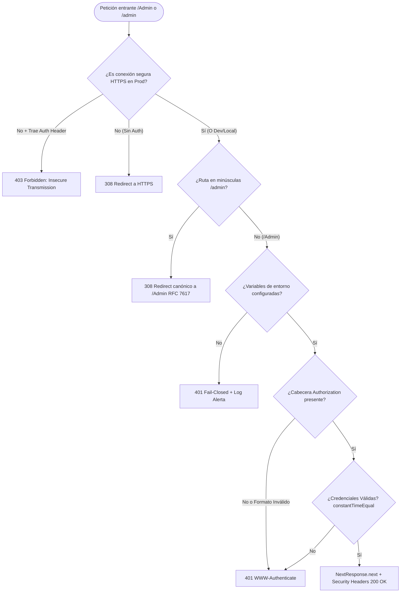

# Historia de Usuario: Blindaje Perimetral y Autenticación del Nodo `/Admin` (El Centinela del Yunque)

## 1. Descripción General
**Como** Administrador / Operador Técnico de BarcelonaXplorer,  
**Quiero** disponer de un interceptor perimetral ligero (`middleware.ts`) en el runtime de borde (Edge Runtime) que proteja de forma estricta y exclusiva el nodo `/Admin` y todas sus subrutas (`/Admin/:path*`),  
**Para** garantizar la inaccesibilidad absoluta a la telemetría y herramientas operativas frente a agentes no autorizados, mitigar ataques de temporización, forzar el cifrado en tránsito (HTTPS) y resolver de forma canónica las variantes de casing en el sistema de archivos de Linux del Nodo 11.

---

## 2. Componentes de Seguridad y Perímetro (La Forja Defensiva)

El sistema de seguridad opera a nivel de borde (Edge), interceptando las solicitudes en milisegundos antes de que alcancen el árbol de enrutamiento del App Router o consuman ciclos de renderizado.

### 2.1. `src/middleware.ts` (El Centinela Perimetral)
- **Runtime**: Compatible 100% con Edge Runtime de Next.js (sin dependencias de APIs nativas de Node.js como `crypto`).
- **Matcher Quirúrgico**: Filtro acotado a `['/Admin', '/Admin/:path*', '/admin', '/admin/:path*']`. Cero impacto térmico en rutas públicas (`/`, `/orchestrator`, etc.).
- **Protocolo de Autenticación**: HTTP Basic Auth nativo (`RFC 7617`).

### 2.2. Motor de Validación Criptográfica (Web Crypto API)
- **Criptografía**: Cálculo de hash SHA-256 en memoria mediante `crypto.subtle.digest('SHA-256', ...)`.
- **Decodificación UTF-8**: Deserialización base64 resistente mediante `atob` y decodificación con `TextDecoder('utf-8')` para admitir caracteres especiales (ej. tildes, eñes).
- **Protección contra Timing Attacks**: Función de comparación en tiempo constante (`constantTimeEqual`) para erradicar ataques de canal lateral en la validación de usuario y hash.

### 2.3. Blindaje de Red y Cifrado en Tránsito
- **Detección de Túnel Seguro**: Reconocimiento de cabeceras de proxy inverso (`x-forwarded-proto`, `cf-visitor` de Cloudflare Tunnels).
- **Inyección de Cabeceras HSTS y Perimetrales**:
  - `Strict-Transport-Security: max-age=63072000; includeSubDomains; preload`
  - `X-Content-Type-Options: nosniff`
  - `X-Frame-Options: DENY`
  - `Referrer-Policy: strict-origin-when-cross-origin`

---

## 3. Coreografía de Estados y Flujo de Intercepción

### Fase 1: Detección y Cifrado en Tránsito
1. Si la petición en producción proviene de un canal inseguro (`http://`):
   - **Con credenciales previas**: Bloqueo fulminante `403 Forbidden` para impedir el procesamiento de secretos expuestos en texto plano.
   - **Sin credenciales**: Redirección `308 Permanent Redirect` inmediata a `https://...` antes de emitir el desafío Basic Auth. El navegador nunca transmitirá credenciales en texto plano.

### Fase 2: Redirección Canónica 308 (RFC 7617)
1. Si la petición solicita `/admin` o subrutas en minúscula:
   - Se emite una **Redirección Canónica 308** hacia `/Admin` preservando el subpath.
   - **Fundamento RFC 7617**: El navegador asocia las credenciales del diálogo nativo al prefijo de ruta `/Admin`. Esto unifica la barra de direcciones, previene peticiones erráticas repetitivas de credenciales y permite que el sistema de archivos *case-sensitive* de Linux Mint / Docker resuelva nativamente `src/app/Admin`.

### Fase 3: Principio Fail-Closed
1. Si `ADMIN_USER` o `ADMIN_PASSWORD_HASH` no están definidas en el entorno del servidor:
   - El middleware deniega inmediatamente el acceso arrojando `401 Unauthorized`.
   - Se emite un registro de alerta en la consola del servidor sin revelar información interna.

### Fase 4: Desafío y Autenticación Ligera
1. Si la cabecera `Authorization` no está presente o no corresponde al esquema `Basic`:
   - Se devuelve estado `401 Unauthorized` con cabecera `WWW-Authenticate: Basic realm="BarcelonaXplorer Admin", charset="UTF-8"`.
   - El navegador despliega el diálogo nativo de ingreso de credenciales.
2. Si se transmiten credenciales:
   - Se procesan usuario y contraseña.
   - Se calcula el SHA-256 de la contraseña ingresada.
   - Se verifica mediante `constantTimeEqual` tanto el usuario como el hash frente a los valores esperados.

### Fase 5: Acceso Concedido e Inyección de Cabeceras
1. Tras la validación exitosa, se invoca `NextResponse.next()`.
2. Se inyectan las cabeceras perimetrales (`HSTS`, `X-Frame-Options: DENY`, `X-Content-Type-Options: nosniff`).

---

## 4. Normativas Arquitectónicas (Certificación Yunque S+)

### 4.1. Tolerancia Cero al Módulo `crypto` de Node.js en Edge
- Queda proscrito importar `crypto` en `middleware.ts`. Toda operación criptográfica reside en el objeto global `crypto.subtle` de la Web Crypto API estándar.

### 4.2. Tolerancia Cero al Tipo `any`
- Uso estricto de los tipos e interfaces del ecosistema Next.js (`NextRequest`, `NextResponse`). Funciones auxiliares debidamente tipadas con firmas explícitas.

### 4.3. Inmutabilidad y Persistencia en Despliegue (Nodo 11)
- **Orquestación Docker**: `src/docker-compose.yml` declara explícitamente en el servicio `web`:
  - `ADMIN_USER=${ADMIN_USER}`
  - `ADMIN_PASSWORD_HASH=${ADMIN_PASSWORD_HASH}`
- **Ansistrano (`ansible/deploy.yml`)**: Sincroniza atómicamente `src/.env.local` hacia el directorio compartido (`shared/.env.local`, modo `0600`) y genera el symlink en la release activa.
- **Pre-Flight Check (`src/deploy.sh`)**: Bloquea mecánicamente cualquier intento de despliegue hacia el Nodo 11 si `src/.env.local` carece de las variables `ADMIN_USER` o `ADMIN_PASSWORD_HASH`.

---

## 5. Criterios de Aceptación (Verificación Empírica)

### Escenario 1: Bloqueo de Conexión Insegura en Producción
- **Dado** un entorno en modo producción (`NODE_ENV=production`) y host público.
- **Cuando** un cliente solicita `http://dominio/Admin` sin credenciales.
- **Entonces** el sistema responde con `308 Permanent Redirect` hacia `https://dominio/Admin`.
- **Cuando** un cliente envía credenciales sobre `http://dominio/Admin`.
- **Entonces** el sistema responde con `403 Forbidden` rechazando la transmisión insegura.

### Escenario 2: Redirección Canónica de Minúsculas
- **Dado** una petición dirigida a `/admin` o `/admin/System`.
- **Cuando** el middleware intercepta la solicitud.
- **Entonces** emite un `308 Permanent Redirect` hacia `/Admin` o `/Admin/System`, permitiendo indexar credenciales bajo la ruta canónica y garantizando la compatibilidad con el sistema de archivos case-sensitive en Linux.

### Escenario 3: Petición sin Autenticación a `/Admin`
- **Dado** una petición HTTPS dirigida a `/Admin` o cualquier subruta.
- **Cuando** la cabecera `Authorization` no está presente.
- **Entonces** devuelve `401 Unauthorized` con cabecera `WWW-Authenticate: Basic realm="BarcelonaXplorer Admin", charset="UTF-8"`.

### Escenario 4: Validación de Credenciales y Mitigación de Timing
- **Dado** un intento de autenticación con usuario o contraseña erróneos.
- **Cuando** el middleware calcula y compara el hash SHA-256 en tiempo constante.
- **Entonces** rechaza el acceso con `401 Unauthorized`.
- **Dado** un intento con credenciales legítimas (incluyendo soporte de caracteres UTF-8).
- **Entonces** autoriza el acceso (`200 OK`) e inyecta la cabecera HSTS `Strict-Transport-Security`.

### Escenario 5: Fail-Closed por Falta de Configuración
- **Dado** un servidor donde `ADMIN_USER` o `ADMIN_PASSWORD_HASH` han sido eliminadas del entorno.
- **Cuando** se solicita cualquier ruta administrativa.
- **Entonces** el sistema deniega el acceso con `401 Unauthorized` y emite un log de alerta en el servidor.
