# Historia de Usuario: Órgano Sensorial y Telemetría Centralizada (El Ojo del Yunque)

## 1. Descripción General
**Como** Operador Técnico y Desarrollador de BarcelonaXplorer,  
**Quiero** implementar una arquitectura de telemetría y trazabilidad centralizada en el motor MySQL del Nodo 11 que capture de manera polimórfica y asíncrona las anomalías de la interfaz gráfica (React), las violaciones perimetrales de seguridad del Centinela (`middleware.ts` en Edge Runtime), las excepciones del servidor (Next.js) y las métricas de inferencia de IA (Gemini / Groq), integrando un protocolo automatizado de Poda Ontológica,  
**Para** monitorizar la salud y seguridad operativa del sistema desde el nodo administrativo `/Admin/System`, prevenir la saturación de almacenamiento en el Nodo 11 y auditar el consumo y latencia de los modelos generativos con fricción cero en la experiencia del usuario.

---

## 2. Componentes Arquitectónicos y Sensores (El Forjado Sensorial)

El sistema opera a través de cuatro fronteras sensoriales coordinadas bajo los axiomas de la Arquitectura Hexagonal y la Vía del Yunque.

```
+-----------------------------------------------------------------------------------------------+
|                                  BARCELONAXPLORER MONOLITO                                    |
|                                                                                               |
|  [ Frontera de Borde: Edge Runtime ]             [ Frontera Cliente: Browser React ]          |
|  - src/middleware.ts (El Centinela)              - error.tsx / global-error.tsx               |
|  - CERO dependencias de Prisma                   - sendBeacon / fetch keepalive               |
|            │ (fetch asíncrono)                                │ (fetch asíncrono)             |
|            ▼                                                  ▼                               |
|   ═════════════════════════════════════════════════════════════════════════════════════       |
|   [ Ingesta HTTP Servidor: Node.js Runtime ] ──► POST /api/telemetry/log                      |
|   - Escudo Zod (TelemetryLogInputSchema)                                                      |
|   ═════════════════════════════════════════════════════════════════════════════════════       |
|                                         │                                                     |
|                                         ▼                                                     |
|  [ Frontera Servidor: App Router ] ──►  [ TelemetryRepositoryPort ]                           |
|  - Route Handlers & Use Cases                   ▲                                             |
|  - Catch Excepciones Técnicas                   │                                             |
|                                                 │                                             |
|  [ Frontera Cognitiva: LLMs ]                   │                                             |
|  - GeminiClient / GroqClient                    │                                             |
|  - Feature Flag: TELEMETRY_LLM_ENABLED ─────────┘ (Fire-and-Forget)                           |
|                                                                                               |
|  [ Mantenimiento: Poda Ontológica ]                                                           |
|  - Cronjob 03:00 AM ──► POST /api/telemetry/prune ──► PruneTelemetryUseCase                  |
|                                                              │                                |
|                                                              ▼                                |
|                                              [ PrismaTelemetryRepository ]                    |
|                                                              │                                |
|                                                              ▼                                |
|                                             [ MySQL: Tabla TelemetryLog ]                     |
+-----------------------------------------------------------------------------------------------+
```

### 2.1. Persistencia y Esquema Polimórfico (`src/prisma/schema.prisma`)
- **Tabla Central**: `TelemetryLog`.
- **Enums Estrictos**:
  - `TelemetryLevel`: `DEBUG`, `INFO`, `WARN`, `ERROR`.
  - `TelemetryContext`: `CLIENT_UI`, `SERVER_API`, `LLM_ENGINE`, `SYSTEM`, `SECURITY_PERIMETER`.
- **Payload Dinámico (`@db.Json`)**: Almacenamiento nativo en formato JSON de MySQL para registrar *stack traces*, metadatos de navegador o *prompts* y respuestas LLM sin requerir migraciones continuas de base de datos.
- **Indexación Estratégica**: Índices compuestos sobre `[context, level, createdAt]`, `[createdAt]` y `[level]` para acelerar las consultas de diagnóstico en `/Admin/System`.

### 2.2. Desacoplamiento de Borde: El Centinela Perimetral (`src/middleware.ts`)
- **Runtime**: Edge Runtime (Next.js).
- **Proscripción de Prisma**: Queda estrictamente prohibido importar `@prisma/client` en `middleware.ts`.
- **Comunicación HTTP Perimetral**: Las violaciones de acceso a `/Admin` (ataques de fuerza bruta, peticiones HTTP sin cifrar, credenciales inválidas) se emiten asíncronamente mediante `fetch` estándar hacia el Route Handler `/api/telemetry/log`.
- **Modo No Bloqueante**: El despacho hacia telemetría no retrasa el bloqueo o redirección perimetral del Centinela.

### 2.3. Guardián de Frontera Cliente (`error.tsx`, `global-error.tsx`)
- **Error Boundaries**: `src/app/error.tsx` y `src/app/global-error.tsx` capturan excepciones imprevistas en el renderizado de la UI.
- **Despacho Asíncrono Resiliente**: Emisión no bloqueante mediante `navigator.sendBeacon` (o `fetch` con `keepalive: true` como alternativa) hacia `/api/telemetry/log`.

### 2.4. Route Handler de Ingesta (`src/app/api/telemetry/log/route.ts`)
- **Runtime**: Node.js Runtime (`export const runtime = 'nodejs'`).
- **Validación con Escudo Zod**: Validación estructural estricta de cada evento entrante.
- **Respuesta Ultrarrápida `202 Accepted`**: Notifica recepción exitosa al emisor y delega la inserción a Prisma en segundo plano.
- **Sanitización de Secretos**: Purgado automático de tokens, cookies y datos confidenciales.

### 2.5. Puerto de Salida y Adaptador Hexagonal
- **Puerto de Dominio / Aplicación**: `src/application/ports/out/telemetry-repository.port.ts`:
  - `log(entry: TelemetryEntry): Promise<void>`
  - `getRecentLogs(filter: TelemetryFilter): Promise<TelemetryEntry[]>`
  - `prune(rules: RetentionRules): Promise<{ deletedCount: number }>`
- **Adaptador de Infraestructura**: `src/infrastructure/repositories/prisma-telemetry.repository.ts` implementando el acceso a MySQL mediante `PrismaClient`.

### 2.6. Interceptor Cognitivo y Feature Flag Térmico
- **Ubicación**: Envoltorio en adaptadores de IA (`src/infrastructure/ai/gemini-client.ts` y clientes de Groq).
- **Interruptor Térmico**: Variable de entorno `TELEMETRY_LLM_ENABLED=true`. Si es `false` o no está declarada, el interceptor finaliza de inmediato con coste nulo.
- **Ejecución Fire-and-Forget**: Las promesas de auditoría de inferencia se despachan en segundo plano (`void telemetryRepository.log(...)`), aislando el retorno del payload al usuario de la persistencia en base de datos.

### 2.7. Motor de Poda Ontológica (Mantenimiento Automatizado)
- **Caso de Uso**: `PruneTelemetryUseCase` en `src/application/use-cases/prune-telemetry.use-case.ts`.
- **Ruta Segura de Mantenimiento**: `POST /api/telemetry/prune`, autenticada mediante cabecera interna `CRON_SECRET`.
- **Cronjob Programado en Nodo 11**: Disparo diario a las 03:00 AM (`0 3 * * *`).
- **Regla de Retención Ontológica**:
  - `DEBUG` e `INFO`: Se eliminan registros con antigüedad mayor a **7 días**.
  - `WARN` y `ERROR`: Se eliminan registros con antigüedad mayor a **30 días**.

---

## 3. Coreografía de Estados y Flujos Sensoriales

```mermaid
sequenceDiagram
    autonumber
    actor Atacante as Atacante / Bot
    actor Usuario as Turista / Navegador
    participant Edge as Centinela (middleware.ts - Edge)
    participant UI as React UI (Client)
    participant RouteH as Route Handler (/api/telemetry/log)
    participant UseCase as Caso de Uso (Servidor)
    participant AI as IA Engine (Gemini / Groq)
    participant Cron as Cronjob Nodo 11 (03:00 AM)
    participant Port as TelemetryRepositoryPort
    participant MySQL as MySQL (Nodo 11)

    %% Flujo 1: Violación Perimetral en Edge
    rect rgb(45, 25, 30)
    note right of Edge: Flujo 1: Violación Perimetral en Edge Runtime
    Atacante->>Edge: GET /Admin (Sin Auth / Ataque Fuerza Bruta)
    Edge-->>Atacante: 401 Unauthorized (Bloqueo Instantáneo)
    Edge-)RouteH: fetch(POST /api/telemetry/log) [SECURITY_PERIMETER, WARN]
    RouteH--)Port: Inyección Asíncrona (Node.js Runtime)
    Port-)MySQL: INSERT INTO TelemetryLog
    end

    %% Flujo 2: Error en Cliente React
    rect rgb(30, 30, 45)
    note right of UI: Flujo 2: Anomalía en Cliente (UI Crash)
    Usuario->>UI: Interacción de Navegación
    UI->>UI: Falla renderizado (error.tsx intercepta)
    UI-)RouteH: sendBeacon(POST /api/telemetry/log) [CLIENT_UI, ERROR]
    RouteH-->>UI: 202 Accepted (Inmediato)
    RouteH--)Port: Inyección asíncrona log()
    Port-)MySQL: INSERT INTO TelemetryLog
    end

    %% Flujo 3: Auditoría IA Fire-and-Forget
    rect rgb(45, 35, 20)
    note right of AI: Flujo 3: Auditoría Cognitiva IA (Fire-and-Forget)
    UseCase->>AI: generateTacticalRoute(prompt)
    AI->>AI: Resuelve inferencia con Gemini/Groq
    AI-->>UseCase: Retorna TacticalRoute
    alt TELEMETRY_LLM_ENABLED === 'true'
        AI-)Port: Fire-and-Forget log(LLM_ENGINE, INFO, tokens, ms)
        Port-)MySQL: INSERT INTO TelemetryLog
    end
    UseCase-->>Usuario: Despliega Ruta (Latencia Cero)
    end

    %% Flujo 4: Poda Ontológica Automatizada
    rect rgb(25, 40, 35)
    note right of Cron: Flujo 4: Poda Ontológica (Mantenimiento Preventivo)
    Cron->>RouteH: POST /api/telemetry/prune (Bearer CRON_SECRET)
    RouteH->>Port: prune({ infoAge: 7d, errorAge: 30d })
    Port->>MySQL: DELETE FROM TelemetryLog WHERE older than policy
    MySQL-->>Port: Registros purgados
    Port-->>RouteH: { deletedCount: N }
    RouteH-->>Cron: 200 OK (Purga Consolidada)
    end
```



---

## 4. Normativas Arquitectónicas (Certificación Yunque S+)

### 4.1. Proscripción Absoluta de Prisma en Edge Runtime
- Por diseño de arquitectura de Next.js, el Edge Runtime carece de APIs de bajo nivel de Node.js. Queda estrictamente prohibido importar `@prisma/client` dentro de `src/middleware.ts`.
- El Centinela Perimetral debe interactuar exclusivamente como cliente HTTP hacia el Route Handler `/api/telemetry/log`.

### 4.2. Protocolo Obligatorio de Poda Ontológica
- Queda proscrito permitir el almacenamiento ilimitado de registros de telemetría.
- Toda instancia de despliegue en el Nodo 11 debe ejecutar periódicamente la Poda Ontológica (7 días para logs operativos `INFO`/`DEBUG`, 30 días para incidencias `WARN`/`ERROR`), resguardando el volumen `/home/racso/Despliegues/BarcelonaXplorer/mysql_data`.

### 4.3. Tolerancia Cero a la Fricción de Rendimiento
- Ninguna operación de telemetría o registro en MySQL puede anteponer un `await` que retarde la entrega del HTML, el flujo streaming SSE o la respuesta JSON al cliente.
- Todo despacho de telemetría debe ejecutarse bajo el patrón **Fire-and-Forget** o en un ciclo desacoplado de promesas.

### 4.4. Principio Fail-Safe (Aislamiento Total del Subsistema)
- La caída imprevista del contenedor MySQL, una saturación de conexiones o un fallo de red interna en Docker **nunca** debe provocar el colapso de las rutas públicas de la aplicación ni de la seguridad del Centinela.
- Las funciones de telemetría encapsulan sus escrituras en bloques defensivos que capturan y silencian internamente los errores de persistencia mediante un registro de emergencia secundario (`console.warn`).

### 4.5. Sanitización Obligatoria de Datos Sensibles
- Antes de persistir cualquier payload en `TelemetryLog.payload`:
  - Se redactan cabeceras de autorización (`Authorization`, `Cookie`, `x-api-key`).
  - Se eliminan credenciales, contraseñas y hashes presentes en los cuerpos de peticiones.
  - En telemetría de IA, se truncan o filtran tokens de autenticación de proveedores.

---

## 5. Criterios de Aceptación (Verificación Empírica)

### Escenario 1: Telemetría Perimetral desde el Centinela (Edge Runtime)
- **Dado** que un agente malicioso intenta acceder a `/Admin` con credenciales inválidas.
- **Cuando** `src/middleware.ts` intercepta la petición en el Edge Runtime.
- **Entonces** bloquea inmediatamente al atacante con `401 Unauthorized`.
- **Y** despacha asíncronamente vía `fetch` un evento a `/api/telemetry/log` con `context = 'SECURITY_PERIMETER'`, `level = 'WARN'` y la IP de origen, sin importar Prisma Client en el Edge.

### Escenario 2: Captura y Despacho de Error en Cliente (React Error Boundary)
- **Dado** que un usuario interactúa con la aplicación y se produce un error imprevisto de renderizado en React.
- **Cuando** `error.tsx` o `global-error.tsx` atrapa la anomalía.
- **Entonces** se despacha asíncronamente un evento vía `sendBeacon` o `fetch` con `keepalive` hacia `/api/telemetry/log`.
- **Y** la interfaz gráfica despliega un mensaje amigable de recuperación sin congelar la ventana del navegador.

### Escenario 3: Ingesta en Route Handler `/api/telemetry/log` con Validación Zod
- **Dado** una petición entrante a `/api/telemetry/log` con un payload JSON.
- **Cuando** el Route Handler procesa la solicitud:
  - Si el cuerpo no cumple con el esquema `TelemetryLogInputSchema`, responde `400 Bad Request`.
  - Si el cuerpo es válido, devuelve inmediatamente `202 Accepted`.
- **Entonces** se inserta un registro en la tabla `TelemetryLog` en el entorno Node.js mediante Prisma.

### Escenario 4: Trazabilidad de Modelos LLM Activada por Feature Flag
- **Dado** que la variable de entorno `TELEMETRY_LLM_ENABLED` está configurada como `'true'`.
- **Cuando** `GeminiClient` o `GroqClient` completan una llamada de inferencia táctica.
- **Entonces** se despacha en segundo plano un log con `context = 'LLM_ENGINE'`, `durationMs`, modelo utilizado y conteo de tokens en el campo `payload`.
- **Y** la respuesta generada por la IA se devuelve al caso de uso de inmediato sin esperar la confirmación de escritura de MySQL.

### Escenario 5: Supresión Térmica de Telemetría LLM
- **Dado** que la variable de entorno `TELEMETRY_LLM_ENABLED` está ausente o tiene el valor `'false'`.
- **Cuando** se ejecuta una inferencia en cualquier motor de IA.
- **Entonces** el interceptor omite cualquier operación de telemetría, consumiendo 0 conexiones a MySQL y 0 ciclos de I/O en disco.

### Escenario 6: Poda Ontológica Automatizada de Registros
- **Dado** una base de datos con registros de telemetría antiguos acumulados.
- **Cuando** el cronjob diario invoca el endpoint `POST /api/telemetry/prune` con la cabecera `Authorization: Bearer ${CRON_SECRET}`.
- **Entonces** se eliminan todos los registros `DEBUG` e `INFO` con más de 7 días de antigüedad.
- **Y** se eliminan todos los registros `WARN` y `ERROR` con más de 30 días de antigüedad.
- **Y** el endpoint devuelve `200 OK` con el conteo de registros purgados.

### Escenario 7: Resiliencia Fail-Safe ante Caída de MySQL
- **Dado** que la base de datos MySQL no responde o se encuentra saturada.
- **Cuando** el sistema intenta persistir un evento de telemetría (desde UI, Middleware, Servidor o IA).
- **Entonces** el error de persistencia es capturado internamente por el repositorio sin propagar la excepción hacia el usuario ni detener la ejecución del hilo principal.
