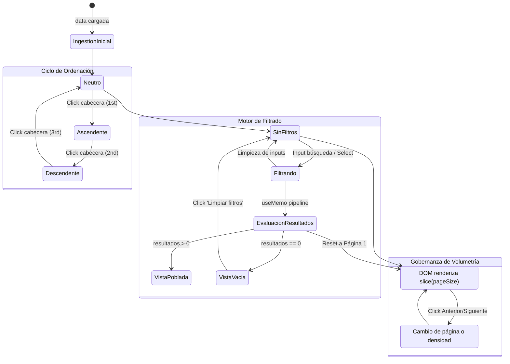

# [ARQUITECTURA] Cuaderno de Sistemas: Topología de Componentes de Tablas y Listas Tácticas (DataTable)

**Estatus:** Refinado / Especificación Consolidada (v1.1)  
**Fecha de Revisión:** 2026-09-22  
**Autor:** Operador Técnico / Arquitectura BarcelonaXplorer  

---

## Matriz de Indexación Tridimensional

- **Naturaleza:** Especificación de Componente Genérico de Interfaz de Usuario, Tipado Estricto en TypeScript, Pipeline Reactivo en Cliente, Control de Volumetría del DOM y Accesibilidad Táctica (WAI-ARIA).
- **Entorno:** Ecosistema `/Admin` de BarcelonaXplorer (Next.js App Router, Tailwind CSS, Lucide React, Client Components).
- **Entropía Asimilada:**
  1. **Erradicación del Marcado Tabular Fragmentado:** Sustitución de listas de `div` estáticas y tablas HTML improvisadas (como la vista inicial de `TelemetryRecentLogsCard.tsx`) por una forja declarativa unificada.
  2. **Desacoplamiento Absoluto de Dominio e Inferencia Limpia:** Creación de un componente universal `<T>` en la capa compartida `src/components/ui/` que desconoce entidades de negocio (logs, usuarios, plantillas, itinerarios) y erradica fugas de `any` mediante el tipo primitivo/estructurado `ComparableValue`.
  3. **Blindaje contra la Saturación del DOM (Gobernanza de Volumetría):** Mitigación del cuello de botella en renderizado masivo (ej. 1.500 registros concurrentes) mediante paginación táctica en cliente (`pageSize`), amortiguación térmica (*Debounce* de 200 ms) y canalización memoizada en pipeline único.

---

## 1. Principios Fundacionales: La Forja Tabular de la Vía del Yunque

Bajo los preceptos de la **Vía del Yunque**, los paneles de control táctico no toleran código repetitivo ni interfaces pasivas. Toda visualización tabular debe operar como un panel de instrumentos reactivo, seguro y de latencia cero.

La topología del componente `DataTable<T>` se rige por seis axiomas innegociables:

1. **Agnóstico del Dominio:** El componente reside en `src/components/ui/data-table/`. No importa entidades de Prisma, casos de uso ni servicios de infraestructura. Recibe su configuración mediante `columns` y sus datos mediante `data`.
2. **Inferencia Estricta sin `any` (`ComparableValue`):** Cada columna y cada valor se tipan sobre el genérico `<T>`. Los valores extraídos mediante `accessorFn` devuelven estrictamente `ComparableValue`, imposibilitando fugas de tipado laxo.
3. **Resolución Segura de Claves Virtuales:** Se admiten claves sintéticas (`key: string`) para columnas operativas (botones, badges calculados). Si no se provee `accessorFn`, el motor las asume automáticamente no ordenables y no filtrables (`sortable: false`, `filterable: false`), protegiendo al pipeline contra valores `undefined`.
4. **Ciclo de Ordenación Tridimensional:** La ordenación por columna no es un conmutador binario; sigue un ciclo riguroso de tres estados: `ascendente` $\rightarrow$ `descendente` $\rightarrow$ `neutro` (este último restaura el orden natural de llegada de los datos).
5. **Gobernanza de Volumetría y Rendimiento del DOM:** La interfaz no vuelca colecciones ilimitadas al árbol de renderizado de React. Un mecanismo de paginación táctica (`pageSize`) garantiza tasas de 60 FPS independientemente del volumen ingerido.
6. **Accesibilidad Semántica y WAI-ARIA:** Cumplimiento riguroso de estándares web: roles HTML5 nativos (`table`, `thead`, `tbody`, `tr`, `th`, `td`), directivas `aria-sort`, foco visible y control de interacción completo por teclado (`Enter`, `Space`).

---

## 2. Arquitectura de Módulos y Estructura de Ficheros

El componente se organiza de forma modular y cohesiva dentro de la jerarquía de UI:

```
src/components/ui/data-table/
├── data-table.tsx            # Orquestador principal ('use client') y gestor de pipeline
├── data-table-toolbar.tsx    # Barra de herramientas: buscador global, selectores y reset
├── data-table-header.tsx     # Encabezados interactivos con aria-sort e iconos de estado
├── data-table-row.tsx        # Contenedor de fila con soporte hover y onRowClick
├── data-table-cell.tsx       # Renderizador de celda (fallback por key o cell renderer)
├── data-table-pagination.tsx # Control de volumetría: navegación de páginas y selector de densidad
├── data-table-empty.tsx      # Estado vacío resiliente con CTA de limpieza de filtros
├── data-table-skeleton.tsx   # Esqueleto pulsante para mitigación de Cumulative Layout Shift
├── types.ts                  # Contratos y tipos estrictos de TypeScript (ComparableValue)
└── index.ts                  # Fachada Barrel Export
```

### 2.1. Responsabilidades de los Módulos

- **`data-table.tsx`:** Mantiene el estado de ordenación (`SortState<T>`), el valor del buscador debounced, los valores de filtros por columna (`filterValues`) y el estado de paginación (`currentPage`, `pageSize`). Ejecuta el pipeline `useMemo(data -> filter -> sort -> paginate)`.
- **`data-table-toolbar.tsx`:** Contiene el input de búsqueda rápida con icono de lupa, los selectores para filtros activos de columna, el contador dinámico de registros visibles frente al total (`Mostrando X de Y`) y el botón para limpiar todos los filtros de golpe.
- **`data-table-header.tsx`:** Renderiza el `<thead>` y cada `<th>`. Gestiona los eventos de teclado y ratón para alternar el ciclo de ordenación, e inyecta los iconos visuales (`ChevronUp`, `ChevronDown`, `ChevronsUpDown`) y las directivas `aria-sort`.
- **`data-table-row.tsx` & `data-table-cell.tsx`:** Renderizan el `<tbody>` de manera semántica. Si la columna dispone de la función `cell(item, index)`, delega la representación al nodo devuelto; en caso contrario, extrae el valor plano mediante el extractor seguro.
- **`data-table-pagination.tsx`:** Ofrece controles ergonómicos de paginación: salto a primera/última página, anterior/siguiente, indicador textual (`Página X de Y - Registros A-B de N`) y selector desplegable de densidad (`10, 25, 50, 100`).
- **`data-table-empty.tsx`:** Garantiza que cuando una búsqueda no arroje resultados, la UI no colapse ni muestre una tabla truncada, sino un contenedor que ocupa todo el ancho (`colSpan={columns.length}`) con un mensaje táctico y un botón para restaurar filtros.
- **`data-table-skeleton.tsx`:** Proporciona una simulación visual pulsante durante los periodos en los que `isLoading={true}`, eliminando el parpadeo de carga y bloqueando saltos de layout (*CLS*).

---

## 3. Contratos de Tipado y Definición de Interfaces (`types.ts`)

```typescript
import React from 'react';

/** Tipos primitivos y estructurados evaluables por el motor de ordenación y filtrado */
export type ComparableValue = string | number | boolean | Date | null | undefined;

/** Dirección de ordenación soportada */
export type SortDirection = 'asc' | 'desc' | null;

/** Estado actual de ordenación */
export interface SortState<T> {
  column: keyof T | string | null;
  direction: SortDirection;
}

/** Opción individual para filtros de columna tipo 'select' */
export interface FilterOption {
  label: string;
  value: string | number;
}

/** Definición formal de columna tabular */
export interface ColumnDef<T> {
  /** Clave de acceso a la propiedad en T o identificador sintético virtual */
  key: keyof T | string;
  /** Encabezado visible en la tabla */
  header: string | React.ReactNode;
  /** Determina si la columna admite ordenación */
  sortable?: boolean;
  /** Determina si la columna admite filtrado */
  filterable?: boolean;
  /** Modalidad de filtro para la columna */
  filterType?: 'text' | 'select';
  /** Opciones predefinidas requeridas cuando filterType === 'select' */
  filterOptions?: FilterOption[];
  /** Renderizador personalizado opcional de la celda */
  cell?: (item: T, index: number) => React.ReactNode;
  /** Clases CSS Tailwind inyectadas en la celda <td> */
  className?: string;
  /** Clases CSS Tailwind inyectadas en el encabezado <th> */
  headerClassName?: string;
  /** Extractor seguro de valor plano para ordenación o búsqueda (Tolerancia Cero a any) */
  accessorFn?: (item: T) => ComparableValue;
}

/** Propiedades del componente raíz DataTable */
export interface DataTableProps<T> {
  /** Conjunto de datos a renderizar */
  data: T[];
  /** Matriz declarativa de columnas */
  columns: ColumnDef<T>[];
  /** Texto guía para la barra de búsqueda global */
  searchPlaceholder?: string;
  /** Conjunto explícito de claves sobre las que aplica la búsqueda rápida */
  searchableKeys?: (keyof T | string)[];
  /** Flag de estado de carga asíncrona */
  isLoading?: boolean;
  /** Mensaje táctico para el estado vacío */
  emptyMessage?: string;
  /** Clases CSS para el contenedor exterior */
  className?: string;
  /** Callback para captura de clicks en filas */
  onRowClick?: (item: T) => void;
  /** Ordenación inicial aplicada en el montaje */
  initialSort?: {
    column: keyof T | string;
    direction: 'asc' | 'desc';
  };
  /** Número de filas por página para blindaje del DOM (por defecto 25; 0 o null para desactivar) */
  pageSize?: number;
  /** Opciones configurables en el selector de densidad de página (ej. [10, 25, 50, 100]) */
  pageSizeOptions?: number[];
}
```

---

## 4. Canalización Reactiva de Datos (Pipeline en Cliente)

El componente orquesta un flujo de datos unidireccional y puro, garantizando que el array original pasado en la prop `data` nunca sufra mutaciones.

```
[ Ingestión: data (T[]) ]
            │
            ▼
[ Pipeline 1: Filtro Global (Search) ] ── (Debounce Térmico 200 ms sobre searchableKeys)
            │
            ▼
[ Pipeline 2: Filtros por Columna ] ───── (Evaluación booleana AND acumulativa)
            │
            ▼
[ Pipeline 3: Motor de Ordenación ] ───── (Ciclo asc | desc | null con ComparableValue)
            │
            ▼
[ Pipeline 4: Paginador Táctico ] ─────── (slice((page-1)*pageSize, page*pageSize))
            │
            ▼
[ Salida Viewport: paginatedRows ] ────── (Renderizado de alta tasa de refresco en <tbody>)
```

### 4.1. Extractor Seguro de Valores y Manejo de Claves Virtuales
Para aislar el pipeline de valores `undefined` generados por columnas virtuales:
```typescript
export function extractCellValue<T>(item: T, column: ColumnDef<T>): ComparableValue {
  if (column.accessorFn) {
    return column.accessorFn(item);
  }
  const key = column.key as string;
  const record = item as Record<string, unknown>;
  const val = record[key];

  if (
    typeof val === 'string' ||
    typeof val === 'number' ||
    typeof val === 'boolean' ||
    val instanceof Date ||
    val === null ||
    val === undefined
  ) {
    return val;
  }

  return String(val);
}
```
**Regla de Clave Virtual:** Si `column.key` no existe como propiedad en `T` y no existe `column.accessorFn`, la columna se marca con `sortable: false` y `filterable: false` por omisión dentro de la normalización inicial del orquestador.

### 4.2. Algoritmo de Ordenación Multi-Tipo
Cuando `sortConfig.direction !== null`, el motor extrae los valores mediante `extractCellValue`:
- **Strings:** Se evalúan mediante `aStr.localeCompare(bStr, undefined, { sensitivity: 'base' })`.
- **Numbers:** Se evalúan mediante resta escalar `aNum - bNum`.
- **Dates:** Se transmutan a milisegundos Unix (`getTime()`) y se comparan numéricamente.
- **Valores Nulos / Indefinidos:** Se desplazan sistemáticamente al final de la colección independientemente del sentido de la marcha.
- **Inversión:** Si `direction === 'desc'`, el resultado se multiplica por $-1$.

### 4.3. Gobernanza de Volumetría del DOM
- Cuando `pageSize > 0`, la lista ordenada y filtrada no se arroja de golpe al DOM.
- Se calcula:
  $$\text{totalPages} = \max(1, \lceil \text{filteredCount} / \text{pageSize} \rceil)$$
  $$\text{paginatedData} = \text{sortedData}.\text{slice}((\text{currentPage} - 1) \times \text{pageSize}, \text{currentPage} \times \text{pageSize})$$
- Al cambiar el término de búsqueda o cualquier filtro de columna, un efecto reactivo ajusta `currentPage = 1`.

---

## 5. Coreografía Visual, Accesibilidad y Micro-Interacciones

### 5.1. Diagrama de Transición de Estados



### 5.2. Directrices WAI-ARIA
- **Roles Semánticos:** Empleo estricto de marcado semántico HTML5.
- **Cabeceras Ordenables:**
  ```html
  <th 
    scope="col" 
    tabindex="0" 
    aria-sort="ascending | descending | none"
    aria-label="Ordenar por [Nombre de Columna]"
  >
  ```
- **Interacción por Teclado:** Eventos `onKeyDown` que capturan las teclas `Enter` y ` ` (Espacio) para disparar la misma transición que el click del puntero.
- **Paginación:** Botones con `aria-label="Página anterior"`, `aria-label="Página siguiente"` y estado `aria-disabled="true"` cuando corresponda.

### 5.3. Tokens de Diseño Táctico (Tailwind CSS)
- **Contenedor Principal:** `bg-zinc-900/90 border border-zinc-800 rounded-lg overflow-hidden shadow-xl`.
- **Cabeceras (`<th>`):** `bg-zinc-950/60 text-zinc-400 font-mono text-xs uppercase tracking-wider px-4 py-3 border-b border-zinc-800`.
- **Filas (`<tr>`):** `border-b border-zinc-800/60 hover:bg-zinc-800/30 transition-colors`.
- **Celdas (`<td>`):** `px-4 py-3 text-xs text-zinc-200 font-mono align-middle`.
- **Barra de Paginación:** `px-4 py-3 bg-zinc-950/40 border-t border-zinc-800 flex items-center justify-between text-xs font-mono text-zinc-400`.
- **Acentos Activos:** `text-emerald-400` para indicadores de ordenación activos y estados de éxito.

---

## 6. Caso de Uso Piloto: Modernización del Órgano Sensorial (`/Admin/System`)

La primera misión táctica del componente consiste en reemplazar el volcado monolítico de `TelemetryRecentLogsCard.tsx` por una tabla interactiva de alta densidad con control de volumetría.

### 6.1. Definición de Columnas para `TelemetryLog`

```typescript
import { ColumnDef } from '@/components/ui/data-table';
import { TelemetryLogItem } from '@/types/telemetry';

export const telemetryTableColumns: ColumnDef<TelemetryLogItem>[] = [
  {
    key: 'level',
    header: 'Nivel',
    sortable: true,
    filterable: true,
    filterType: 'select',
    filterOptions: [
      { label: 'DEBUG', value: 'DEBUG' },
      { label: 'INFO', value: 'INFO' },
      { label: 'WARN', value: 'WARN' },
      { label: 'ERROR', value: 'ERROR' },
    ],
    cell: (log) => <TelemetryLevelBadge level={log.level} />,
    className: 'w-24',
  },
  {
    key: 'context',
    header: 'Contexto Sensorial',
    sortable: true,
    filterable: true,
    filterType: 'select',
    filterOptions: [
      { label: 'CLIENT_UI', value: 'CLIENT_UI' },
      { label: 'SERVER_API', value: 'SERVER_API' },
      { label: 'LLM_ENGINE', value: 'LLM_ENGINE' },
      { label: 'SYSTEM', value: 'SYSTEM' },
      { label: 'SECURITY_PERIMETER', value: 'SECURITY_PERIMETER' },
    ],
    cell: (log) => <TelemetryContextBadge context={log.context} />,
    className: 'w-40',
  },
  {
    key: 'message',
    header: 'Mensaje de Diagnóstico',
    sortable: false,
    cell: (log) => (
      <span className="truncate max-w-md block text-zinc-300 font-mono text-xs" title={log.message}>
        {log.message}
      </span>
    ),
  },
  {
    key: 'statusCode',
    header: 'Estado HTTP',
    sortable: true,
    cell: (log) =>
      log.statusCode ? (
        <span className="px-2 py-0.5 rounded bg-zinc-800 text-zinc-300 border border-zinc-700 font-mono text-[11px]">
          {log.statusCode}
        </span>
      ) : (
        <span className="text-zinc-600">—</span>
      ),
    className: 'w-28 text-center',
  },
  {
    key: 'durationMs',
    header: 'Latencia',
    sortable: true,
    cell: (log) =>
      log.durationMs !== null ? (
        <span className={log.durationMs > 1000 ? 'text-amber-400 font-bold font-mono' : 'text-zinc-400 font-mono'}>
          {log.durationMs} ms
        </span>
      ) : (
        <span className="text-zinc-600">—</span>
      ),
    className: 'w-28 text-right',
  },
  {
    key: 'createdAt',
    header: 'Registro Temporal',
    sortable: true,
    accessorFn: (log) => new Date(log.createdAt),
    cell: (log) => (
      <span className="text-zinc-400 text-[11px] font-mono">
        {new Date(log.createdAt).toLocaleString('es-ES', { hour12: false })}
      </span>
    ),
    className: 'w-44 text-right',
  },
];
```

---

## 7. Directrices de Implementación y Certificación Yunque S+

1. **Dependencias Cero Bloatware:** Implementación nativa en React + TypeScript puro sin librerías pesadas externas.
2. **Auditoría de Tipos:** Validación continua mediante `npx tsc --noEmit` garantizando ausencia total de `any` y cumplimiento estricto del contrato `ComparableValue`.
3. **Hoja de Ruta Futura:**
   - **Fase 2:** Sincronización de filtros, ordenación y paginación con `URLSearchParams` para compartir diagnósticos directamente por URL.
   - **Fase 3:** Extensión para virtualización de filas con `tanstack-virtual` en vistas sin paginación con más de 10.000 filas concurrentes.
