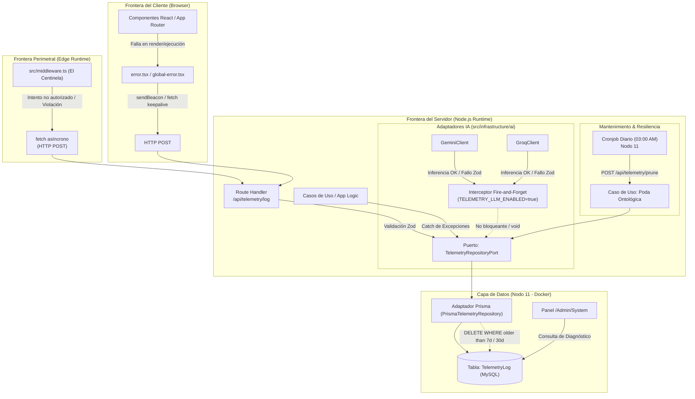

# [ARQUITECTURA] Cuaderno de Sistemas: Topología de Telemetría y Trazabilidad Centralizada

**Estatus:** Refinado / Especificación Consolidada (v1.1)  
**Fecha de Revisión:** 2026-09-22  

---

## Matriz de Indexación Tridimensional

- **Naturaleza:** Observabilidad de Sistema, Auditoría Cognitiva, Telemetría Polimórfica Asíncrona y Poda Ontológica.
- **Entorno:** Monolito Next.js (App Router) / Motor Relacional MySQL en Contenedor Docker (Nodo 11 @ `10.0.10.11`) / Runtimes Híbridos (Edge Middleware, Node.js Server, Client Browser).
- **Entropía Asimilada:** 
  1. Sustitución de flujos efímeros en `console.log` por un órgano sensorial centralizado y estructurado con persistencia en MySQL.
  2. Resolución del bloqueo técnico entre Edge Runtime y Prisma ORM mediante desacoplamiento HTTP perimetral hacia Route Handlers.
  3. Erradicación del riesgo de desbordamiento en disco del Nodo 11 mediante un protocolo estricto de Poda Ontológica automatizada por severidad y antigüedad.

---

## 1. Principios Fundacionales: El Órgano Sensorial del Monolito

En el marco de la **Vía del Yunque**, el registro de eventos y métricas no constituye un vertedero de texto plano arrojado al sistema de archivos del contenedor, sino un **órgano sensorial estructurado** capaz de proveer visibilidad táctica sobre el estado operativo del sistema.

La arquitectura de telemetría se rige por cinco axiomas innegociables:

1. **Aislamiento Hexagonal:** El Dominio no tiene conciencia de la base de datos de telemetría ni del mecanismo de transporte de logs. La persistencia de eventos se arbitra mediante Puertos de Salida (`application/ports/out`) y Adaptadores de Infraestructura (`infrastructure/repositories`).
2. **Latencia Cero para el Usuario (Patrón Fire-and-Forget):** Las operaciones de auditoría y telemetría operan en segundo plano de manera asíncrona. Ninguna solicitud de usuario ni respuesta de la interfaz queda bloqueada en espera de una escritura en la base de datos.
3. **Resiliencia Térmica del Nodo 11:** El hardware de producción (PC 11 @ `10.0.10.11`) cuenta con un Interruptor Térmico (*Feature Flag*) configurable por entorno para gobernar el volumen de telemetría de inferencia de IA, protegiendo el almacenamiento local y el ancho de banda de I/O.
4. **Poda Ontológica Preventiva:** Ningún dato se almacena indefinidamente. El sistema cuenta con ciclos de vida mecánicamente programados para evitar la degradación del rendimiento de MySQL y la saturación del almacenamiento del contenedor.
5. **Aislamiento de Runtimes (Edge vs. Node.js):** El runtime de borde (Edge Runtime) de `middleware.ts` jamás importa el cliente de Prisma; delega la telemetría perimetral al Route Handler interno de Node.js mediante peticiones HTTP asíncronas estándar.

---

## 2. Vector 1: Persistencia, Esquema Polimórfico y Poda Ontológica (MySQL + Prisma ORM)

La base de datos MySQL desplegada en el Nodo 11 actúa como bóveda central de telemetría, accediendo a través del ORM Prisma mediante el binario compilado para entornos contenerizados Alpine (`linux-musl-openssl-3.0.x`).

### 2.1. Modelo Polimórfico (`src/prisma/schema.prisma`)

Se incorpora la entidad central `TelemetryLog` con campos tipados para indexación rápida y un contenedor nativo JSON para albergar datos dinámicos:

```prisma
enum TelemetryLevel {
  DEBUG
  INFO
  WARN
  ERROR
}

enum TelemetryContext {
  CLIENT_UI
  SERVER_API
  LLM_ENGINE
  SYSTEM
  SECURITY_PERIMETER
}

model TelemetryLog {
  id          String           @id @default(cuid())
  createdAt   DateTime         @default(now())
  level       TelemetryLevel
  context     TelemetryContext
  message     String           @db.VarChar(512)
  payload     Json?            @db.Json
  statusCode  Int?
  durationMs  Int?
  environment String           @default("production") @db.VarChar(32)

  @@index([context, level, createdAt])
  @@index([createdAt])
  @@index([level])
}
```

### 2.2. Justificación Técnica de la Estructura Polimórfica

- **`payload` (`@db.Json` nativo de MySQL):** Almacena estructuras variables según el contexto:
  - En `CLIENT_UI`: `componentStack`, `url`, `userAgent`, `viewport`, `errorName`.
  - En `SERVER_API`: `route`, `method`, `stackTrace`, `requestHeaders` (sanitizadas), `query`.
  - En `LLM_ENGINE`: `model`, `promptSummary`, `temperature`, `promptTokens`, `completionTokens`, `costEstimate`, `zodValidationErrors`.
  - En `SECURITY_PERIMETER`: `ip`, `blockedPath`, `violationReason`, `threatFingerprint`.
  - En `SYSTEM`: Métricas de conectividad, verificaciones de red (DNS 1.1.1.1) o latencia de MySQL.
- **Indexación Compuesta:** La tupla `[context, level, createdAt]` optimiza las consultas del panel de mando `/Admin/System`, permitiendo filtrar anomalías críticas de la IA o de la UI en rangos de tiempo definidos con coste $O(\log n)$.

### 2.3. Protocolo de Poda Ontológica (Ciclo de Vida y Purga de Datos)

Dado que los volcados JSON de las respuestas e inferencias de IA pueden alcanzar decenas de kilobytes por petición, la persistencia sin control saturaría el volumen del contenedor en `/home/racso/Despliegues/BarcelonaXplorer/mysql_data`.

Se establece la siguiente **Matriz de Retención Ontológica**:
- **`DEBUG` e `INFO` (Telemetría de Alta Frecuencia / Operativa):** Retención máxima de **7 días**. Los datos más antiguos carecen de relevancia táctica y se purgan automáticamente.
- **`WARN` y `ERROR` (Anomalías y Fallos de Dominio / Perímetro):** Retención máxima de **30 días** para fines de auditoría, depuración forense y análisis de estabilidad.

#### Mecanismo de Ejecución de la Poda:
1. **Caso de Uso:** `PruneTelemetryUseCase` en `src/application/use-cases/prune-telemetry.use-case.ts`.
2. **Disparador:** 
   - *Ruta Administrativa Interna:* `POST /api/telemetry/prune`, protegida por secreto compartido (`CRON_SECRET`) o accesible únicamente en la red interna de Docker.
   - *Cronjob en Nodo 11:* Tarea periódica programada diariamente a las 03:00 AM (`0 3 * * *`) ejecutando la instrucción de purga:
     ```bash
     curl -s -X POST http://127.0.0.1:3000/api/telemetry/prune -H "Authorization: Bearer ${CRON_SECRET}"
     ```
3. **Operación Prisma Atómica:**
   ```typescript
   const now = new Date();
   const sevenDaysAgo = new Date(now.getTime() - 7 * 24 * 60 * 60 * 1000);
   const thirtyDaysAgo = new Date(now.getTime() - 30 * 24 * 60 * 60 * 1000);

   await prisma.telemetryLog.deleteMany({
     where: {
       OR: [
         { level: { in: ['DEBUG', 'INFO'] }, createdAt: { lt: sevenDaysAgo } },
         { level: { in: ['WARN', 'ERROR'] }, createdAt: { lt: thirtyDaysAgo } }
       ]
     }
   });
   ```

---

## 3. Vector 2: Rastreo de Anomalías y Fronteras de Runtime (Edge, Servidor y Cliente)

### 3.1. Frontera Perimetral: Edge Runtime (`src/middleware.ts`)

El Centinela Perimetral (`middleware.ts`) opera en el **Edge Runtime** de Next.js. Debido a que el Edge Runtime carece de APIs nativas de sockets de Node.js (`net`, `tls`), **queda proscrito importar o instanciar `@prisma/client` directamente dentro del middleware**.

#### Solución de Desacoplamiento Perimetral:
Cuando el middleware intercepta una violación de seguridad (ej. inyección de credenciales inseguras en HTTP, intentos de fuerza bruta en `/Admin`, o accesos bloqueados por IP):
1. Formula un payload serializado.
2. Despacha una petición HTTP asíncrona mediante `fetch` estándar hacia el Route Handler `/api/telemetry/log`.
3. El Route Handler se ejecuta en el **Node.js Runtime** (`export const runtime = 'nodejs'`), donde Prisma Client tiene conectividad nativa y completa hacia MySQL.
4. Para evitar penalizar la respuesta del middleware al cliente, el `fetch` se ejecuta en modo *Fire-and-Forget* o utilizando `event.waitUntil` (cuando esté disponible en el entorno de despliegue).

```typescript
// En src/middleware.ts (Edge Runtime)
void fetch(new URL('/api/telemetry/log', request.url), {
  method: 'POST',
  headers: {
    'Content-Type': 'application/json',
    'x-internal-telemetry-token': process.env.INTERNAL_TELEMETRY_TOKEN || ''
  },
  body: JSON.stringify({
    level: 'WARN',
    context: 'SECURITY_PERIMETER',
    message: 'Violación perimetral: Intento no autorizado en /Admin',
    statusCode: 401,
    payload: {
      ip: request.headers.get('x-forwarded-for') ?? 'unknown',
      path: request.nextUrl.pathname,
      method: request.method,
      userAgent: request.headers.get('user-agent')
    }
  })
}).catch(() => {});
```

### 3.2. Frontera del Cliente (React Error Boundaries)

La captura de excepciones no controladas en el navegador del usuario se materializa en los componentes de captura de React:
- **`src/app/error.tsx`:** Red de seguridad para segmentos del App Router.
- **`src/app/global-error.tsx`:** Red de seguridad de último recurso para el layout raíz (`src/app/layout.tsx`).

#### Protocolo de Transmisión Asíncrona:
1. El componente `error.tsx` intercepta la instancia de `Error` y el objeto `ErrorInfo` (`componentStack`).
2. Se ejecuta un despacho asíncrono no bloqueante hacia el Route Handler `/api/telemetry/log`:
   ```typescript
   const payload = {
     level: 'ERROR',
     context: 'CLIENT_UI',
     message: error.message || 'Error no controlado en la interfaz del cliente',
     payload: {
       name: error.name,
       stack: error.stack,
       componentStack: info?.componentStack,
       url: window.location.href,
       userAgent: navigator.userAgent
     }
   };

   // Resiliencia ante cierre de ventana con sendBeacon; fallback a fetch keepalive
   if (navigator.sendBeacon) {
     navigator.sendBeacon('/api/telemetry/log', JSON.stringify(payload));
   } else {
     fetch('/api/telemetry/log', {
       method: 'POST',
       headers: { 'Content-Type': 'application/json' },
       body: JSON.stringify(payload),
       keepalive: true
     }).catch(() => {});
   }
   ```
3. El Route Handler `/api/telemetry/log` valida el cuerpo mediante un esquema Zod de infraestructura y delega la inserción a Prisma en modo desacoplado, respondiendo de inmediato con `202 Accepted`.

### 3.3. Frontera del Servidor (Capa de Aplicación y Casos de Uso)

Siguiendo la Arquitectura Hexagonal:
- **Puerto de Salida:** Se define `TelemetryRepositoryPort` en `src/application/ports/out/telemetry-repository.port.ts`.
- **Adaptador de Infraestructura:** `PrismaTelemetryRepository` en `src/infrastructure/repositories/prisma-telemetry.repository.ts`.
- **Interceptores de Casos de Uso:** Cuando un Caso de Uso o Route Handler del servidor captura una excepción técnica o de infraestructura, delega la persistencia al puerto de telemetría sin propagar detalles internos al cliente.

---

## 4. Vector 3: Trazabilidad Cognitiva y Auditoría de IA (Gemini / Groq)

Para auditar el comportamiento de los modelos generativos, calcular tiempos de respuesta, evaluar la precisión de los *prompts* y detectar fallos del Escudo Zod, se acopla un interceptor dentro de los adaptadores de infraestructura (`src/infrastructure/ai/`).

### 4.1. Interruptor Térmico (Feature Flag de Producción)

Para preservar la capacidad de I/O y el almacenamiento en disco en el Nodo 11:
- Variable de Entorno: `TELEMETRY_LLM_ENABLED=true` (por defecto `false` en entornos locales o de escasos recursos).
- Si la variable está inactiva, la función interceptora aborta de forma inmediata sin consumir ciclos de CPU ni realizar conexiones al pool de MySQL.

### 4.2. Operación Desacoplada ("Fire-and-Forget")

La auditoría de los modelos LLM (Vía Rápida con Groq o Vía Lenta con Gemini) jamás debe sumar latencia a la respuesta devuelta al usuario:

```typescript
const startTime = Date.now();
const response = await this.ai.models.generateContent(...);
const durationMs = Date.now() - startTime;

// Interceptor de telemetría en hilo secundario (Fire-and-Forget)
if (process.env.TELEMETRY_LLM_ENABLED === 'true') {
  void this.telemetryRepository.log({
    level: 'INFO',
    context: 'LLM_ENGINE',
    message: `Inferencia completada con éxito en modelo ${model}`,
    durationMs,
    payload: {
      model,
      promptTokens: response.usageMetadata?.promptTokenCount,
      candidatesTokens: response.usageMetadata?.candidatesTokenCount,
      promptSnippet: prompt.slice(0, 300),
      rawResponseSnippet: response.text?.slice(0, 300)
    }
  }).catch(telemetryErr => {
    console.warn('[Telemetry LLM Error]', telemetryErr);
  });
}
```

---

## 5. Diagrama Integral de Coreografía y Topología



---

## 6. Normativas Arquitectónicas (Certificación Yunque S+)

1. **Incompatibilidad Proscripta de Prisma en Edge:** Queda terminantemente prohibido importar o ejecutar `@prisma/client` en archivos gobernados por el Edge Runtime (`middleware.ts`). Toda telemetría de borde debe transitar a través del Route Handler `/api/telemetry/log`.
2. **Poda Ontológica Obligatoria:** Toda implementación en producción debe mantener activa la purga periódica para impedir que el volumen de MySQL sobrepase la cuota de disco en el Nodo 11.
3. **Inmutabilidad y Rendimiento:** La caída o saturación del motor MySQL de telemetría jamás debe propagarse ni tirar el servicio principal de navegación turística. Todo registro de telemetría está encapsulado en bloques defensivos (*fail-safe*).
4. **Sanitización de Datos y Cero Fuga de Secretos:** Antes de serializar cualquier `payload`, las funciones adaptadoras deben filtrar activamente llaves maestras, contraseñas, hashes, cabeceras `Authorization` o tokens de sesión.
5. **Tipado Estricto:** Prohibición absoluta del tipo `any` en los DTOs de telemetría. Toda estructura de entrada al Route Handler `/api/telemetry/log` debe estar validada mediante un esquema Zod estricto.
