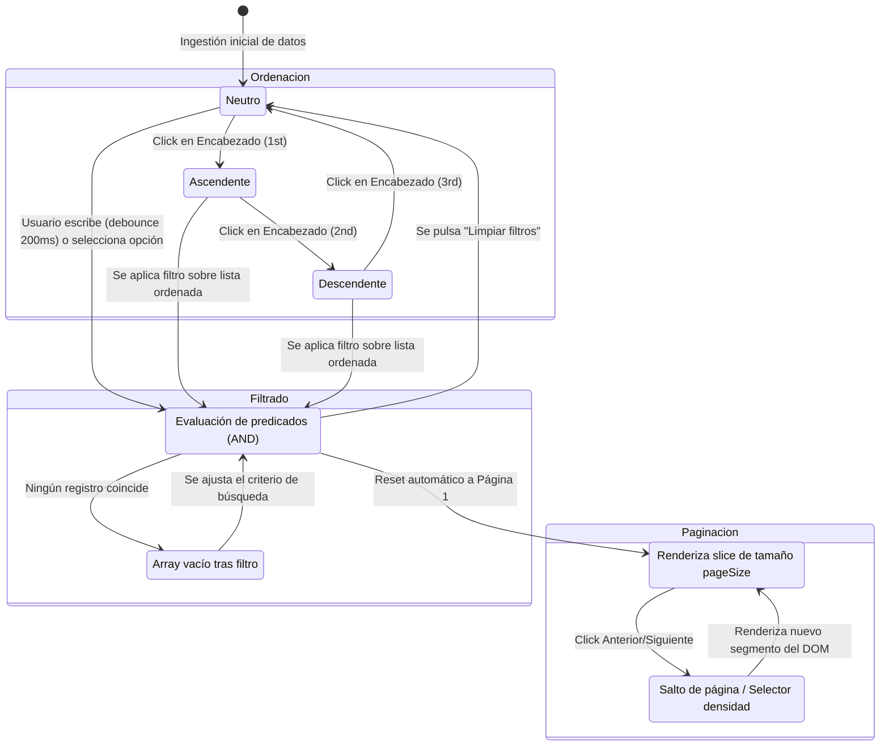

# Historia de Usuario: Componente Genérico de Tablas y Listas Tácticas (DataTable)

**Estatus:** Refinado / Listo para Implementación  
**Fecha de Revisión:** 2026-09-22  
**Autor:** Operador Técnico / Arquitectura BarcelonaXplorer  

---

## 1. Descripción General

**Como** Operador Técnico y Desarrollador de BarcelonaXplorer,  
**Quiero** disponer de un componente genérico, reactivo y fuertemente tipado (`DataTable<T>`) con capacidades declarativas de ordenación multidireccional (`asc` -> `desc` -> `null`), filtrado multidimensional dinámico (búsqueda global y selectores facetados por columna), renderizado configurable de celdas (`cell?: (item: T) => React.ReactNode`) y paginación táctica con gobernanza de volumetría del DOM,  
**Para** unificar la visualización de entidades tabulares en el ecosistema `/Admin` (comenzando por la inspección de registros de telemetría en `/Admin/System`), erradicar la duplicación de marcado HTML en bruto, blindar el rendimiento del navegador ante picos masivos de datos y garantizar la consistencia visual y de interacción en la plataforma bajo los axiomas de la Vía del Yunque.

---

## 2. Componentes Arquitectónicos y Contratos (La Forja Visual)

El componente reside en la capa de interfaz de usuario compartida (`src/components/ui/data-table/`), manteniéndose **100% agnóstico del dominio** (desconoce si renderiza logs, itinerarios, plantillas o usuarios).

```
+-----------------------------------------------------------------------------------------+
|                              src/components/ui/data-table/                              |
|                                                                                         |
|  [ data-table.tsx ] (Client Component: 'use client')                                    |
|  ├── Orquestador de estado: sortConfig, filterValues, search, pagination (page, size)   |
|  ├── Pipeline reactivo: useMemo(data -> filter -> sort -> paginate)                    |
|  ├── Barra de Herramientas Superior: [ data-table-toolbar.tsx ] (Buscador y filtros)    |
|  ├── Estructura Tabular Semántica:                                                      |
|  │   ├── Encabezados interactivos: [ data-table-header.tsx ] (aria-sort, iconos orden)   |
|  │   ├── Filas y celdas tipadas: [ data-table-row.tsx ] / [ data-table-cell.tsx ]       |
|  │   └── Estados especiales: [ data-table-empty.tsx ] & [ data-table-skeleton.tsx ]     |
|  ├── Control de Volumetría Inferior: [ data-table-pagination.tsx ]                      |
|  │                                                                                      |
|  ├── [ types.ts ]                                                                       |
|  │   └── ColumnDef<T>, ComparableValue, SortDirection, DataTableProps<T>                |
|  │                                                                                      |
|  └── [ index.ts ] (Barrel export limpio)                                                |
+-----------------------------------------------------------------------------------------+
```

### 2.1. Contrato de Tipado Estricto (`types.ts`)

**Tolerancia Cero a `any`:** Queda rigurosamente proscrito el uso del comodín `any`. Toda la definición se fundamenta en genéricos de TypeScript (`<T>`) y en el tipo estricto `ComparableValue` para la extracción de valores, asegurando inferencia limpia en tiempo de compilación.

```typescript
import React from 'react';

/** Tipos primitivos y estructurados evaluables por el motor de ordenación y filtrado */
export type ComparableValue = string | number | boolean | Date | null | undefined;

/** Dirección de ordenación soportada */
export type SortDirection = 'asc' | 'desc' | null;

/** Estado del motor de ordenación */
export interface SortState<T> {
  column: keyof T | string | null;
  direction: SortDirection;
}

/** Opción individual para filtros de selección facetada */
export interface FilterOption {
  label: string;
  value: string | number;
}

/** Definición formal de columna tabular */
export interface ColumnDef<T> {
  /** Clave de acceso a la propiedad en T o identificador sintético virtual (ej. 'actions') */
  key: keyof T | string;
  /** Encabezado visible en la tabla */
  header: string | React.ReactNode;
  /** Habilita la ordenación tridimensional por esta columna */
  sortable?: boolean;
  /** Habilita el filtrado por esta columna */
  filterable?: boolean;
  /** Tipo de entrada para el filtro de la columna */
  filterType?: 'text' | 'select';
  /** Opciones predefinidas requeridas cuando filterType === 'select' */
  filterOptions?: FilterOption[];
  /** Renderizador de celda personalizado (badges, botones, fechas, etc.) */
  cell?: (item: T, index: number) => React.ReactNode;
  /** Clases CSS Tailwind adicionales para la celda <td> */
  className?: string;
  /** Clases CSS Tailwind adicionales para el encabezado <th> */
  headerClassName?: string;
  /** Extractor seguro de valor plano para ordenación o búsqueda (Tolerancia Cero a any) */
  accessorFn?: (item: T) => ComparableValue;
}

/** Propiedades del componente raíz DataTable */
export interface DataTableProps<T> {
  /** Matriz de datos tipados */
  data: T[];
  /** Definición de columnas fuertemente tipada */
  columns: ColumnDef<T>[];
  /** Placeholder para el buscador global rápido */
  searchPlaceholder?: string;
  /** Claves de T sobre las cuales actúa el buscador global */
  searchableKeys?: (keyof T | string)[];
  /** Estado de carga asíncrono */
  isLoading?: boolean;
  /** Mensaje informativo cuando la lista resultante es vacía */
  emptyMessage?: string;
  /** Clases CSS para el contenedor exterior de la tabla */
  className?: string;
  /** Manejador opcional para click en fila */
  onRowClick?: (item: T) => void;
  /** Configuración inicial de ordenación */
  initialSort?: {
    column: keyof T | string;
    direction: 'asc' | 'desc';
  };
  /** Número de filas por página para blindaje del DOM (por defecto 25; 0 o false para desactivar) */
  pageSize?: number;
  /** Opciones configurables en el selector de densidad de página (ej. [10, 25, 50, 100]) */
  pageSizeOptions?: number[];
}
```

---

## 3. Motor de Filtrado, Ordenación y Gobernanza del DOM

### 3.1. Resolución Segura de Claves Virtuales (`key: keyof T | string`)
Al admitir columnas sintéticas que no existen físicamente en la entidad `T` (ej. `key: 'actions'` o badges de estado calculados en caliente):
1. **Extractor Seguro:** El motor de datos extrae el valor evaluando prioritariamente `accessorFn`:
   ```typescript
   const rawValue: ComparableValue = column.accessorFn
     ? column.accessorFn(item)
     : (item as Record<string, unknown>)[column.key as string] as ComparableValue;
   ```
2. **Invariante de Claves Virtuales:** Si una columna declara una `key` sintética no presente en `T` y **no** define un `accessorFn`, el motor la desactiva automáticamente para interactividad (`sortable: false` y `filterable: false` por omisión). Esto inmuniza al pipeline contra evaluaciones erróneas sobre valores `undefined`.

### 3.2. Ordenación Tridimensional Cíclica
Cada columna elegible responde al ciclo de tres estados:
$$\text{Neutro (null)} \xrightarrow{\text{Click 1}} \text{Ascendente (asc)} \xrightarrow{\text{Click 2}} \text{Descendente (desc)} \xrightarrow{\text{Click 3}} \text{Neutro (null)}$$
- **Neutro (`null`):** Restablece mecánicamente el orden natural de llegada de la colección `data`.
- **Comparación Multi-Tipo:** Soporte estricto y tipado para cadenas (`localeCompare`), números, marcas cronológicas (`Date` / timestamp) y valores nulos/indefinidos (desplazados al final).

### 3.3. Filtrado Reactivo con Debounce Térmico (200 ms)
- **Buscador Global:** Evalúa las claves configuradas en `searchableKeys` mediante normalización a minúsculas y eliminación de acentos.
- **Amortiguación Térmica:** Entrada de texto vinculada a un retardo de 200 ms (`useDebounce`), evitando cálculos innecesarios por pulsación.
- **Filtros por Columna:** Combinados conjuntamente con la búsqueda global mediante evaluación booleana $AND$.

### 3.4. Gobernanza de Volumetría del DOM (Paginación Táctica)
Para prevenir la degradación de rendimiento ante picos de saturación (ej. 1.500 registros de telemetría tras un fallo en cascada):
- El pipeline fragmenta la colección procesada en páginas (`slice((page - 1) * pageSize, page * pageSize)`).
- El árbol del DOM de React monta únicamente las filas de la página activa, preservando la tasa de refresco a 60 FPS y evitando fugas de memoria.
- **Reseteo Automático:** Toda alteración en el término de búsqueda o filtros facetados restablece la navegación a la Página 1 de forma atómica.

---

## 4. Coreografía de Interacción y Estados



---

## 5. Normativas Arquitectónicas (Certificación Yunque S+)

### 5.1. Desacoplamiento Absoluto de Dominio
El componente reside en `src/components/ui/data-table/` y **tiene estrictamente prohibido importar entidades, esquemas Zod o repositorios del dominio o infraestructura**. Opera como una forja visual universal gobernada exclusivamente por sus `props`.

### 5.2. Tolerancia Cero a `any`
Prohibición taxativa de la palabra clave `any`. Todos los contratos, variables internas y extractores emplean `<T>`, `ComparableValue` o estrechamiento de tipos (*type narrowing*).

### 5.3. Accesibilidad Semántica y WAI-ARIA
- **Roles HTML5 Nativos:** `<table>`, `<thead>`, `<tbody>`, `<tr>`, `<th>`, `<td>`.
- **Atributos de Ordenación:** Encabezados con `tabIndex={0}`, `aria-sort="ascending" | "descending" | "none"` y activación por teclado (`Enter` / `Space`).
- **Controles de Paginación Accesibles:** Botones de cambio de página con `aria-label` descriptivos y estado `disabled` en límites de navegación.

### 5.4. Estilado Atómico Táctico (Tailwind CSS)
- Fondos en tonos oscuros `zinc-900` / `zinc-950` con bordes sutiles `zinc-800`.
- Efectos de fila `hover:bg-zinc-800/40` con transición fluida.
- Acentos funcionales en `emerald-400` para ordenación y selecciones activas.
- Tipografía monoespaciada (`font-mono`) en métricas, códigos y marcas temporales.

---

## 6. Criterios de Aceptación (Verificación Empírica)

### Escenario 1: Renderizado Genérico y Celdas Personalizadas
- **Dado** un conjunto de datos tipados (ej. `TelemetryEntry[]`) y una matriz de `ColumnDef<TelemetryEntry>`.
- **Cuando** se monta `<DataTable columns={columns} data={data} />`.
- **Entonces** se renderiza una tabla semántica HTML con sus encabezados y celdas correspondientes.
- **Y si** una columna define la propiedad `cell`, se renderiza el nodo React devuelto (ej. badge carmesí para `ERROR`, insignia azul para `LLM_ENGINE`).

### Escenario 2: Ciclo de Ordenación Tridimensional y Atributos ARIA
- **Dado** una columna con `sortable: true`.
- **Cuando** el operador hace click sobre el encabezado:
  - *Primer click:* Ordena ascendentemente (`asc`), muestra flecha hacia arriba y asigna `aria-sort="ascending"`.
  - *Segundo click:* Ordena descendentemente (`desc`), muestra flecha hacia abajo y asigna `aria-sort="descending"`.
  - *Tercer click:* Restablece la ordenación original (`null`), oculta o atenúa el icono indicador y asigna `aria-sort="none"`.
- **Entonces** la interacción mediante teclado (`Enter` o `Space`) replica fielmente el ciclo.

### Escenario 3: Filtrado Combinado con Debounce Térmico
- **Dado** un listado de registros visualizado en pantalla con buscador global y filtros por columna.
- **Cuando** el operador introduce "Prisma" en la caja de texto y selecciona `level = 'ERROR'` en el desplegable.
- **Entonces** tras 200 ms de inactividad de escritura, la tabla muestra única y exclusivamente las filas que satisfacen ambas condiciones de manera simultánea ($AND$).
- **Y** la barra de herramientas muestra un contador reactivo con el total de resultados filtrados.

### Escenario 4: Estado Vacío Resiliente (*Empty State*)
- **Dado** un filtro de búsqueda cuyos criterios no coinciden con ningún registro.
- **Cuando** la lista filtrada resultante contiene 0 elementos.
- **Entonces** se renderiza una fila única que abarca el 100% de las columnas con el componente `DataTableEmpty`.
- **Y** se despliega un mensaje explicativo y un botón táctico "Limpiar Filtros" que restablece la vista completa.

### Escenario 5: Skeleton Loader Táctico para Transición Asíncrona
- **Dado** el componente `DataTable` con la propiedad `isLoading={true}`.
- **Cuando** se produce la carga inicial o refresco de datos desde el servidor.
- **Entonces** se renderiza la estructura de encabezados y un cuerpo de 5 filas de esqueletos pulsantes (`DataTableSkeleton`), previniendo saltos de diseño (*layout shift*).

### Escenario 6: Blindaje contra `any` y Resolución de Claves Virtuales
- **Dado** una columna sintética de acciones declarada como `{ key: 'actions', header: 'Operaciones', cell: (item) => <Button /> }`.
- **Cuando** se omite la declaración de `accessorFn`, `sortable` y `filterable`.
- **Entonces** el componente asume automáticamente `sortable: false` y `filterable: false`, sin arrojar errores ni evaluar `undefined`.
- **Y** la ejecución de `npx tsc --noEmit` concluye con código de salida 0, certificando tipado estricto con `ComparableValue` y cero ocurrencias de `any`.

### Escenario 7: Gobernanza de Volumetría y Paginación Táctica
- **Dado** un lote masivo de datos (ej. 1.500 registros de telemetría cargados tras un incidente crítico).
- **Cuando** se monta `<DataTable data={logs} columns={columns} pageSize={25} />`.
- **Entonces** el DOM de React renderiza únicamente 25 filas en el `<tbody>`, blindando la fluidez visual a 60 FPS.
- **Y** el componente `DataTablePagination` permite avanzar, retroceder y alternar el tamaño de página (`[10, 25, 50, 100]`), regresando automáticamente a la Página 1 cada vez que se aplica un nuevo filtro.

### Escenario 8: Integración Inmediata con Bitácora de Telemetría (`/Admin/System`)
- **Dado** el componente `TelemetryRecentLogsCard` en `src/app/Admin/System/`.
- **Cuando** se sustituye el marcado HTML estático ad-hoc por `<DataTable<TelemetryEntry> columns={telemetryColumns} data={logs} pageSize={25} />`.
- **Entonces** el operador técnico puede auditar, filtrar y ordenar registros de manera instantánea sin sobrecargar el navegador.