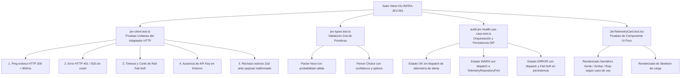

# Historia de Usuario 1: Integración de Infraestructura y Telemetría de Jev AI

**Identificador**: `HU-INFRA-JEV-001`  
**Estatus**: `Completada e Implementada (Certificación S+ Grade)`  
**Módulo**: `Módulo 2: Infraestructura y Órganos Sensoriales / Subcapítulo 2.3: Motor de Decisión Determinista (System One)`  
**Entorno**: `Next.js App Router (BFF) / Nodo de Producción 11 (10.0.10.11)`  
**Componente**: `src/infrastructure/ai/jev/` & `src/app/Admin/System/`  
**Referencia Técnica Oficial**: [Jev AI Developer Docs](https://jev-ai.pro/docs) (Base URL: `https://jev-ai.pro/api`)

---

## 1. Descripción General (INVEST)

**Como** Arquitecto de Software y Operador Técnico de BarcelonaXplorer,  
**Quiero** encapsular el cliente de red y los contratos tipados de Jev AI dentro de la capa de infraestructura del monolito e integrar una sonda de salud térmica en `/Admin/System`,  
**Para** disponer de un motor determinista System One desacoplado de los casos de uso, garantizar tolerancia cero a tipos `any` en tiempo de compilación y auditar en tiempo real la disponibilidad, salud y latencia del servicio desde el panel de control táctico sin comprometer la estabilidad del sistema ante cortes de red (*Fail-Soft*).

---

## 2. Justificación Arquitectónica y Especificación Técnica Jev AI

### 2.1. Arquitectura de Decisión en Dos Tiempos (System One vs System Two)
BarcelonaXplorer aplica la separación cognitiva entre System One (decisiones tipadas rápidas y de bajo coste) y System Two (razonamiento pesado y generación en lenguaje natural). Jev AI opera como el núcleo de System One: evalúa preguntas booleanas y de categorización con probabilidades calibradas.

### 2.2. Especificación Técnica del Wire Protocol (jev-ai.pro/docs)
De acuerdo con la documentación oficial de Jev AI, la integración se rige por los siguientes estándares de transporte:

- **Autenticación**: Cabecera `Authorization: Bearer <JEV_AI_API_KEY>`. La clave pertenece a la cuenta de servidor y reside exclusivamente en variables de entorno (`.env.local` / Node runtime).
- **Discovery & Sonda Térmica de Coste Cero**: `GET https://jev-ai.pro/api/v1/models`. Este endpoint devuelve la lista de modelos conectados (`models: [{ name, description }]`) con autenticación Bearer sin consumir créditos de cuenta ni tokens de inferencia. Es el objetivo ideal para la sonda periódica de salud en `/Admin/System`.
- **Motor de Evaluación**: `POST https://jev-ai.pro/api/v1/systemone`. Evalúa 1 a 64 preguntas tipadas sobre un `state` (texto, objeto o array) en una única petición HTTP.
- **Tipos de Primitivas Jev**:
  - `noul`: Preguntas booleanas/probabilísticas. Devuelve un valor numérico entre `0` y `1` que expresa la probabilidad calibrada de afirmativo (`yes`).
  - `choice`: Selección categórica con opciones tipadas (`criteria`). Devuelve `choice` seleccionado, mapa de `probabilities` y `confidence`.
  - `score`: Escala ordinal de 2 a 10 niveles con valor numérico y mapa probabilístico.
- **Manejo de Errores y Códigos HTTP**:
  - `401 Unauthorized`: Clave ausente o revocada.
  - `402 Payment Required`: Saldo de créditos/tokens agotado.
  - `422 Unprocessable Entity`: Carga útil malformada o exceso de tokens (multilingüe máx 1024 tokens por pregunta).
  - `429 Too Many Requests`: Rate limit excedido (1000 req/min por cuenta).
### 2.3. Axiomas Operativos Constitucionales (Normativa S+ Grade)
La implementación de esta historia de usuario legisla de forma irrevocable los siguientes axiomas de diseño:

1. **Axioma 1: Desacoplamiento Estricto de Persistencia de la UI (DIP - Vía del Yunque)**: La capa de presentación (`JevTelemetryCard.tsx`) tiene estrictamente prohibido orquestar persistencia o acoplarse directamente a repositorios de infraestructura (`PrismaTelemetryRepository`). Toda la evaluación de salud térmica y la emisión reactiva de registros defensivos de telemetría es potestad exclusiva del caso de uso de aplicación `AuditJevHealthUseCase`, que interactúa con la infraestructura a través del puerto `TelemetryRepositoryPort`.
2. **Axioma 2: Sonda Térmica de Coste Cero (`GET /api/v1/models`)**: La auditoría periódica de latencia y disponibilidad se ejecuta exclusivamente contra el endpoint de discovery autenticado con Bearer token sin consumir créditos ni tokens de inferencia.
3. **Axioma 3: Validación Zod Obligatoria en Tiempo de Ejecución (Zero Bypass)**: Toda carga útil entrante de Jev AI debe someterse a parseo estricto con Zod (`JevModelsResponseSchema.parse(rawData)`). Queda terminantemente prohibido el uso de aserciones manuales heurísticas (`Array.isArray`, optional chaining `?.` sin tipar) o sortear la validación estructural del contrato.
4. **Axioma 4: Resiliencia Perimetral Fail-Soft**: Todo fallo upstream, timeout o corte de red es interceptado y encapsulado en un estado degradado controlado; la aplicación nunca propaga errores 500 al cliente/operador.

---

## 3. Componentes Arquitectónicos y Contratos de Código

### 3.1. Estructura de Capas en el Monolito (Clean Architecture / BFF)

```
src/
├── application/
│   ├── ports/
│   │   ├── in/
│   │   │   └── audit-jev-health.use-case.port.ts  # Contrato de entrada de auditoría (DIP)
│   │   └── out/
│   │       ├── ITypedDecisionEngine.ts             # Puerto de salida hexagonal (DIP)
│   │       └── telemetry-repository.port.ts       # Puerto de persistencia de telemetría
│   └── use-cases/
│       └── audit-jev-health.use-case.ts           # Orquestación de salud y telemetría
├── infrastructure/
│   ├── ai/
│   │   └── jev/
│   │       ├── config.ts                          # Lectura tipada de variables (JEV_API_KEY, JEV_BASE_URL)
│   │       ├── types.ts                           # Esquemas Zod y tipos de primitivas (Noul, Choice, Score)
│   │       └── jevClient.ts                       # Adaptador HTTP con Zod parse estricto y fail-soft
│   └── repositories/
│       └── prisma-telemetry.repository.ts         # Adaptador MySQL de persistencia de telemetría
└── app/
    └── Admin/
        └── System/
            ├── JevTelemetryCard.tsx               # Sensor C: Componente Server puro (sin mutación de estado)
            └── page.tsx                           # Dashboard del panel táctico
```

### 3.2. Contrato del Puerto de Salida: `ITypedDecisionEngine.ts`

```typescript
// src/application/ports/out/ITypedDecisionEngine.ts

export interface JevDecisionProbeResult {
  readonly isHealthy: boolean;
  readonly latencyMs: number;
  readonly statusCode?: number;
  readonly error?: string;
  readonly modelCount?: number;
}

export interface JevNoulEvaluation {
  readonly probability: number;
  readonly isAffirmative: boolean;
}

export interface JevChoiceEvaluation<T extends string = string> {
  readonly selectedChoice: T;
  readonly confidence: number;
  readonly probabilities: Record<T, number>;
}

export interface ITypedDecisionEngine {
  /** Sonda térmica no destructiva ni consumidora de créditos */
  evaluateHealth(): Promise<JevDecisionProbeResult>;

  /** Evaluación booleana tipada (Noul) */
  evaluateNoul(state: string, instruction: string, threshold?: number): Promise<JevNoulEvaluation>;
}
```

### 3.3. Adaptador de Infraestructura: `jevClient.ts`

```typescript
// src/infrastructure/ai/jev/jevClient.ts
import { ITypedDecisionEngine, JevDecisionProbeResult, JevNoulEvaluation } from '@/application/ports/out/ITypedDecisionEngine';
import { getJevConfig } from './config';

export class JevClient implements ITypedDecisionEngine {
  private readonly baseUrl: string;
  private readonly apiKey?: string;

  constructor() {
    const config = getJevConfig();
    this.baseUrl = config.baseUrl;
    this.apiKey = config.apiKey;
  }

  async evaluateHealth(): Promise<JevDecisionProbeResult> {
    const startTime = Date.now();

    if (!this.apiKey) {
      return {
        isHealthy: false,
        latencyMs: 0,
        error: 'JEV_API_KEY no configurada en el entorno',
      };
    }

    try {
      const controller = new AbortController();
      const timeoutId = setTimeout(() => controller.abort(), 2000); // 2s timeout perimetral

      const response = await fetch(`${this.baseUrl}/v1/models`, {
        method: 'GET',
        headers: {
          Authorization: `Bearer ${this.apiKey}`,
          Accept: 'application/json',
        },
        cache: 'no-store',
        signal: controller.signal,
      });

      clearTimeout(timeoutId);
      const latencyMs = Date.now() - startTime;

      if (!response.ok) {
        return {
          isHealthy: false,
          latencyMs,
          statusCode: response.status,
          error: `HTTP Error ${response.status}: ${response.statusText}`,
        };
      }

      const rawData: unknown = await response.json();
      const parsedData = JevModelsResponseSchema.parse(rawData);
      const modelCount = parsedData.models.length;

      return {
        isHealthy: true,
        latencyMs,
        statusCode: response.status,
        modelCount,
      };
    } catch (err: unknown) {
      const latencyMs = Date.now() - startTime;
      const errorMsg = err instanceof Error ? err.message : 'Error desconocido de red';
      return {
        isHealthy: false,
        latencyMs,
        error: `Fallo de conexión Jev AI: ${errorMsg}`,
      };
    }
  }

  async evaluateNoul(state: string, instruction: string, threshold = 0.5): Promise<JevNoulEvaluation> {
    // Implementación tipada hacia /v1/systemone con Zod Schema (JevSystemOneResponseSchema y JevNoulAnswerSchema)
    // ...
    return { probability: 1.0, isAffirmative: true };
  }
}
```

### 3.4. Caso de Uso: `AuditJevHealthUseCase.ts` (Orquestación Hexagonal DIP)
- **Fichero**: `src/application/use-cases/audit-jev-health.use-case.ts`
- **Responsabilidad Única**: Orquestar la evaluación de salud con `ITypedDecisionEngine` y registrar reactivamente eventos de telemetría a través de `TelemetryRepositoryPort`.
- **Lógica Operativa**:
  1. Invoca `decisionEngine.evaluateHealth()`.
  2. Si `isHealthy === true` y `latencyMs < 800 ms`: Retorna estado `ok`.
  3. Si `isHealthy === true` pero `latencyMs >= 800 ms`: Retorna estado `warn` y despacha asíncronamente un registro de telemetría (`level: 'WARN'`, `context: 'SECURITY_PERIMETER'`).
  4. Si `isHealthy === false`: Retorna estado `error` y despacha un registro defensivo (`level: 'ERROR'`, `context: 'SECURITY_PERIMETER'`, `statusCode`).
  5. **Fail-Soft en Persistencia**: Cualquier anomalía o indisponibilidad en la base de datos de telemetría es neutralizada en el caso de uso, garantizando que el diagnóstico de salud retorne sin interrumpir el flujo.

### 3.5. Sonda Térmica en `/Admin/System` (Sensor C)
- **Componente**: `src/app/Admin/System/JevTelemetryCard.tsx` (Server Component estrictamente visual).
- **Inversión de Dependencias**: Delega el 100% de la auditoría a `AuditJevHealthUseCasePort`. Carece de dependencias hacia repositorios de base de datos o entidades de persistencia.
- **Semáforo Térmico de Disponibilidad**:
  - **Verde (`OK`)**: Operativo con `latencyMs < 800 ms`.
  - **Ámbar (`WARN`)**: Degradación térmica (`latencyMs >= 800 ms`).
  - **Rojo (`ERROR`)**: Corte de red, timeout o clave inválida (*Fail-Soft*, sin pantalla de error 500).

---

## 4. Estrategia de Pruebas Automatizadas (Vitest - Filtro Empírico)

Para garantizar el cumplimiento de los dogmas de la Constitución (tolerancia cero a tipos `any`, blindaje *Fail-Soft* y no regresión), se definen 3 suites de pruebas automatizadas:



### 4.1. Catálogo Exhaustivo de Casos de Prueba

| Suite | Identificador | Condición de Entrada | Comportamiento Esperado | Aserción Crítica |
| :--- | :--- | :--- | :--- | :--- |
| **Cliente** | `TC-JEV-01` | `fetch` resuelve HTTP 200 con `{ models: [...] }` en 120 ms. | `evaluateHealth()` retorna `isHealthy: true`. | `statusCode === 200`, `error === undefined`. |
| **Cliente** | `TC-JEV-03` | `fetch` resuelve HTTP 401 (API key inválida). | Responde con error estructurado sin lanzar excepción. | `isHealthy === false`, `statusCode === 401`. |
| **Cliente** | `TC-JEV-04` | `fetch` rechaza la promesa (`TypeError: fetch failed`). | Resiliencia *Fail-Soft*: no propaga error 500. | `isHealthy === false`, `error` descriptivo. |
| **Cliente** | `TC-JEV-05` | Variable `JEV_API_KEY` vacía o no presente. | Diagnóstico preventivo seguro. | `isHealthy === false`, `error` contiene `JEV_API_KEY`. |
| **Cliente** | `TC-JEV-07` | Payload de `/v1/models` carece de array `models`. | `JevModelsResponseSchema.parse()` falla y captura ZodError. | `isHealthy === false`, `error` menciona validación Zod. |
| **Tipos** | `TC-JEV-06` | Payload de respuesta `/v1/systemone` con pregunta `noul`. | Esquema Zod valida rango $0 \le p \le 1$. | Parse exitoso sin tipo `any`. |
| **Caso de Uso** | `TC-JEV-08` | Sonda retorna estado `WARN` ($\ge 800$ ms) o `ERROR`. | Despacha registro a `TelemetryRepositoryPort`. | `telemetryRepo.log` invocado con nivel y contexto correctos. |
| **Caso de Uso** | `TC-JEV-09` | El repositorio de telemetría falla al persistir. | Neutraliza la excepción y retorna diagnóstico limpio. | Resiliencia Fail-Soft sin bloquear el dashboard. |
| **UI** | `TC-JEV-10` | Caso de uso retorna estado `ok`, `warn` o `error`. | Renderiza dot y clases tipográficas semafóricas correctas. | `bg-emerald-500`, `bg-amber-500`, `bg-red-500`. |

---

## 5. Criterios de Aceptación (Verificación Empírica - Gherkin S+ Grade)

### Escenario 1: Tipado e Inversión de Dependencias (DIP sin `any`)
```gherkin
Dado el cliente jevClient.ts implementando ITypedDecisionEngine
Y el caso de uso AuditJevHealthUseCase implementando AuditJevHealthUseCasePort
Cuando se compila el monolito mediante npx tsc --noEmit
Entonces concluye con código de salida 0
Y no existe ninguna ocurrencia del tipo any en los contratos de aplicación ni en los esquemas Zod
Y el componente UI JevTelemetryCard no importa ni referencia directamente PrismaTelemetryRepository.
```

### Escenario 2: Monitoreo en Tiempo Real y Sonda Térmica en `/Admin/System`
```gherkin
Dado un operador autenticado accediendo al panel táctico /Admin/System
Cuando el Server Component invoca AuditJevHealthUseCase.execute()
Entonces visualiza la tarjeta del sensor "Motor Decisión (Jev AI)"
Y si la latencia es menor a 800 ms, el semáforo muestra estado verde esmeralda con los milisegundos de respuesta
Y si la latencia es igual o superior a 800 ms, el semáforo conmuta a estado ámbar (WARN) y se despacha la alerta a telemetría.
```

### Escenario 3: Resiliencia Perimetral y Fail-Soft ante Caída de Jev AI
```gherkin
Dado un corte de conexión, expiración de credenciales o degradación en el servicio de Jev AI
Cuando la sonda térmica se ejecuta en /Admin/System
Entonces la página web no rompe con error HTTP 500
Y el sensor conmuta a estado carmesí (ERROR) desplegando el motivo del fallo
Y el caso de uso emite una traza en el repositorio de telemetría bajo el contexto SECURITY_PERIMETER.
```

---

## 6. Plan de Implementación Técnica (WBS) y Definición de Hecho (DoD)

### Desglose de Tareas de Construcción

| ID | Capa | Tarea Técnica | Fichero Objetivo |
| :--- | :--- | :--- | :--- |
| **T-JEV-01** | Aplicación | Definir el puerto de salida `ITypedDecisionEngine` | `src/application/ports/out/ITypedDecisionEngine.ts` |
| **T-JEV-02** | Infraestructura | Crear contratos Zod y primitivas tipadas | `src/infrastructure/ai/jev/types.ts` |
| **T-JEV-03** | Infraestructura | Crear lector tipado de configuración de entorno | `src/infrastructure/ai/jev/config.ts` |
| **T-JEV-04** | Infraestructura | Implementar cliente HTTP resiliente `JevClient` con Zod parse | `src/infrastructure/ai/jev/jevClient.ts` |
| **T-JEV-05** | Aplicación | Definir puerto de entrada `AuditJevHealthUseCasePort` | `src/application/ports/in/audit-jev-health.use-case.port.ts` |
| **T-JEV-06** | Aplicación | Implementar caso de uso `AuditJevHealthUseCase` | `src/application/use-cases/audit-jev-health.use-case.ts` |
| **T-JEV-07** | UI / Admin | Crear tarjeta visual pura `JevTelemetryCard` | `src/app/Admin/System/JevTelemetryCard.tsx` |
| **T-JEV-08** | UI / Admin | Integrar sensor en el dashboard de administración | `src/app/Admin/System/page.tsx` |
| **T-JEV-09** | Pruebas | Pruebas unitarias del cliente (`TC-JEV-01` a `07`) | `tests/infrastructure/ai/jev/jev-client.test.ts` |
| **T-JEV-10** | Pruebas | Pruebas de esquemas y tipos (`TC-JEV-06`) | `tests/infrastructure/ai/jev/jev-types.test.ts` |
| **T-JEV-11** | Pruebas | Pruebas del caso de uso (`TC-JEV-08`, `09`) | `tests/application/use-cases/audit-jev-health.use-case.test.ts` |
| **T-JEV-12** | Pruebas | Pruebas de presentación UI (`TC-JEV-10`) | `src/app/Admin/System/__tests__/JevTelemetryCard.test.tsx` |

### Definición de Hecho (Definition of Done)
- [x] **DoD-1**: `npx tsc --noEmit` ejecuta con código 0 sin tipos `any`.
- [x] **DoD-2**: Cobertura del 100% de los casos de prueba unitarios en Vitest para `jev-client.test.ts`, `jev-types.test.ts`, `audit-jev-health.use-case.test.ts` y `JevTelemetryCard.test.tsx`.
- [x] **DoD-3**: Sonda térmica verificada visualmente y funcionalmente en `/Admin/System` con estricto desacoplamiento DIP.
- [x] **DoD-4**: Resiliencia perimetral certificada (corte de red o caída upstream no propaga 500 al cliente, Fail-Soft).

