# [OPERATIVO] Historia de Usuario: Auditoría Termodinámica y Registro de Telemetría del Motor LLM (La Aduana Cognitiva)

**Estatus:** Refinado / Listo para Implementación  
**Fecha de Revisión:** 2026-09-22  
**Autor:** Operador Técnico y Arquitectura BarcelonaXplorer  
**Prioridad:** Alta (P1 - Gobernanza Sensorial y Trazabilidad Cognitiva)  

---

## 1. Descripción General

**Como** Operador Técnico y Arquitecto del proyecto BarcelonaXplorer,  
**Quiero** registrar el flujo de interacción completo (prompts de usuario, contexto sensorial inyectado y respuestas de los modelos) como eventos de telemetría desacoplados en el sistema bajo el contexto `LLM_ENGINE`, interceptando específicamente las claudicaciones de orquestación donde la respuesta es o contiene `"No se pudo forjar la ruta."`,  
**Para** monitorizar esta fricción cognitiva catalogándola como advertencia (`WARN`) en la tabla táctica de [`/Admin/System`](file:///home/racso/Proyectos/BarcelonaXplorer/src/app/Admin/System/page.tsx), diagnosticar qué combinaciones de contexto y variables de entorno provocan el colapso del agente, auditar el rendimiento y latencia del motor LLM bajo los preceptos de la Aduana Universal, y garantizar que el dominio permanezca puro sin penalizar los tiempos de respuesta del usuario (fricción térmica cero).

---

## 2. Componentes Arquitectónicos y Contratos (La Forja del Registro)

La captura de la entropía generada por los modelos de lenguaje (LLM) se gestiona a través de la capa de orquestación en la aplicación ([`GenerateTacticalRouteUseCase`](file:///home/racso/Proyectos/BarcelonaXplorer/src/application/use-cases/generate-tactical-route.use-case.ts)), garantizando que **los adaptadores de IA no se auditen a sí mismos**, sino que sea el puente de conexión y orquestación el que emita el chispazo de telemetría hacia el puerto [`TelemetryRepositoryPort`](file:///home/racso/Proyectos/BarcelonaXplorer/src/application/ports/out/telemetry-repository.port.ts).

```
+--------------------------------------------------------------------------------------------------+
|                                    BARCELONAXPLORER MONOLITO                                     |
|                                                                                                  |
|   [ Cliente Turista / Frontend ]                                                                 |
|   - src/app/orchestrator/page.tsx (Prompt + Contexto: Clima, Hora, Ubicación)                    |
|                │                                                                                 |
|                ▼  POST /api/orchestrator/slow { prompt, context }                                |
|   ════════════════════════════════════════════════════════════════════════════════════════       |
|   [ Capa Presentación / HTTP: Node.js Runtime ]                                                  |
|   - src/app/api/orchestrator/slow/route.ts                                                       |
|                │                                                                                 |
|                ▼  Invoca Caso de Uso                                                             |
|   [ Capa Aplicación / Orquestación: La Aduana Cognitiva ]                                        |
|   - GenerateTacticalRouteUseCase                                                                 |
|        │                                                                                         |
|        ├──► 1. Invoca Puerto: AiGeneratorPort.generateTacticalRoute()                            |
|        │          │                                                                              |
|        │          ▼                                                                              |
|        │    [ Capa Infraestructura: Adaptador IA ]                                               |
|        │    - GeminiClient / GroqClient (Inferencia Pura)                                        |
|        │    - Escudo Zod (TacticalRouteZodSchema)                                                |
|        │    - Retorna TacticalRoute O Claudica / Falla                                           |
|        │          │                                                                              |
|        │◄─────────┘ (Retorno o Excepción)                                                        |
|        │                                                                                         |
|        ├──► 2. Evaluación Sintáctica & Clasificación Termodinámica                              |
|        │       ├── Éxito: level = 'DEBUG'                                                        |
|        │       ├── Claudicación ("No se pudo forjar la ruta."): level = 'WARN'                   |
|        │       └── Excepción Red / Cuota 5xx: level = 'ERROR'                                    |
|        │                                                                                         |
|        ├──► 3. Despacho Asíncrono Fire-and-Forget (Si TELEMETRY_LLM_ENABLED === 'true')          |
|        │       └──► TelemetryRepositoryPort.log(TelemetryEntry) ──► MySQL (Tabla TelemetryLog)   |
|        │                                                                                         |
|        └──► 4. Retorno Inmediato a la UI (Latencia Cero)                                         |
|                                                                                                  |
|   ════════════════════════════════════════════════════════════════════════════════════════       |
|   [ Inspección Operativa: Órgano Sensorial ]                                                     |
|   - src/app/Admin/System/page.tsx ──► TelemetryTableClient                                       |
|   - DataTable<TelemetryLogItem>: Filtros facetados [WARN] + [LLM_ENGINE]                         |
+--------------------------------------------------------------------------------------------------+
```

### 2.1. Contexto Sensorial Estricto (Aduana)
Todas las interacciones de inferencia, orquestación y evaluación cognitiva se registrarán obligatoriamente bajo el contexto:
```typescript
context: 'LLM_ENGINE'
```

### 2.2. Niveles de Intervención Termodinámica
El sistema categoriza el comportamiento del motor generativo en tres niveles de energía:

1. **`DEBUG` (Éxito Termodinámico):**  
   Se emplea para registrar las interacciones donde el modelo sintetiza exitosamente un itinerario válido.  
   - **`message`**: Extracto del prompt del usuario y el identificador único de la ruta generada (ej. `"[LLM SUCCESS] Ruta forjada id: bcn-1727012345 | Prompt: Tengo 4 horas en el Born..."`).
   - **`durationMs`**: Latencia real de inferencia y procesamiento en milisegundos.
   - **`statusCode`**: `200`.
   - **`payload`**: Objeto estructurado con modelo utilizado, total de waypoints generados y metadatos de generación.

2. **`WARN` (Fricción Cognitiva / Claudicación del Modelo):**  
   Nivel reservado **exclusivamente** para iteraciones donde el modelo claudica, no logra conciliar las restricciones operativas o la respuesta devuelta contiene la cadena canónica `"No se pudo forjar la ruta."`.  
   - **`message`**: Diagnóstico de fricción detallando el fallo y extracto del prompt que provocó el colapso (ej. `"[LLM WARN] Fricción cognitiva: No se pudo forjar la ruta. | Prompt: Quiero visitar 15 museos en 30 minutos a pie"`).
   - **`durationMs`**: Tiempo transcurrido hasta la claudicación del agente.
   - **`statusCode`**: `422` (Unprocessable Entity) o `200` con bandera de fallo lógico.
   - **`payload`**: Prompt original íntegro del usuario junto con las variables externas (clima, tiempo, ubicación, restricciones logísticas) inyectadas en ese turno, permitiendo la disección forense de la anomalía.

3. **`ERROR` (Fallo Periférico de Infraestructura):**  
   Registra caídas de red, cuotas agotadas (`RESOURCE_EXHAUSTED` / HTTP `429`), timeouts o errores `5xx` devueltos por la API externa de Google GenAI o Groq.  
   - **`message`**: Detalle del error de infraestructura (ej. `"[LLM ERROR] Excepción de infraestructura Google GenAI: 429 Quota Exceeded"`).
   - **`statusCode`**: Código HTTP devuelto por el proveedor (`429`, `500`, `503`, etc.).
   - **`payload`**: Stack trace sanitizado, modelo de fallback intentado y duración hasta el corte.

### 2.3. Estructura del Payload y Contrato Estricto (`TelemetryLogItem` & Unión Discriminada)
Cada registro inyectado en la base de datos MySQL mediante la entidad [`TelemetryEntry`](file:///home/racso/Proyectos/BarcelonaXplorer/src/domain/entities/telemetry-entry.entity.ts) cumple de forma unívoca con los atributos consumidos por la interfaz [`TelemetryLogItem`](file:///home/racso/Proyectos/BarcelonaXplorer/src/app/Admin/System/TelemetryTableClient.tsx#L7-L15) del componente [`DataTable`](file:///home/racso/Proyectos/BarcelonaXplorer/src/components/ui/data-table/data-table.tsx):

```typescript
export interface TelemetryLogItem {
  id: string;
  createdAt: string | Date;
  level: 'DEBUG' | 'INFO' | 'WARN' | 'ERROR';
  context: 'LLM_ENGINE';
  message: string;
  statusCode: number | null;
  durationMs: number | null;
}
```

#### Blindaje Forense mediante Estrechamiento de Tipos (*Type Narrowing*)
Para el atributo polimórfico `payload` (`@db.Json` en MySQL), se implementa una **unión discriminada** en TypeScript gobernada por el nivel termodinámico (`level`). 

> [!IMPORTANT]
> **Axioma Forense de la Aduana Cognitiva:** Dado que el propósito primordial del nivel `WARN` es diseccionar con precisión quirúrgica por qué el modelo colapsó ante el prompt del usuario ("No se pudo forjar la ruta."), un valor `undefined` en el contexto ambiental anularía la auditoría. Por tanto, mediante *Type Narrowing*, el compilador **exige ineludiblemente** `environmentVariables` cuando `level === 'WARN'`.

```typescript
/** Contexto ambiental y logístico inyectado durante la orquestación */
export interface LlmEnvironmentContext {
  weather?: string;
  localTime: string;
  userLocation?: { lat: number; lng: number };
  constraints?: string[];
  [key: string]: unknown;
}

/** Base común compartida por todos los payloads del motor LLM */
interface BaseLlmTelemetryPayload {
  model: string;
  prompt: string;
  promptLength: number;
}

/** Payload para inferencias exitosas (DEBUG): context ambiental opcional */
export interface LlmSuccessTelemetryPayload extends BaseLlmTelemetryPayload {
  routeId: string;
  waypointsCount: number;
  environmentVariables?: LlmEnvironmentContext;
}

/** 
 * Payload forense para claudicaciones del modelo (WARN: "No se pudo forjar la ruta.")
 * INVARIANTE FORENSE ESTRICTO: environmentVariables es OBLIGATORIO a nivel de compilador.
 * Queda terminantemente prohibido 'undefined' o 'null'.
 */
export interface LlmWarningTelemetryPayload extends BaseLlmTelemetryPayload {
  reason: 'NO_ROUTE_FORGED' | string;
  /** Obligatorio sin comodín opcional (?): garantiza la reproducibilidad de la anomalía */
  environmentVariables: LlmEnvironmentContext;
  rawResponse?: string;
}

/** Payload para caídas de red, cuotas agotadas o errores de infraestructura (ERROR) */
export interface LlmErrorTelemetryPayload extends BaseLlmTelemetryPayload {
  errorMessage: string;
  statusCode: number;
  environmentVariables?: LlmEnvironmentContext;
  stackTraceSnippet?: string;
}

/** Unión discriminada polimórfica para el payload del motor LLM */
export type LlmTelemetryPayload =
  | LlmSuccessTelemetryPayload
  | LlmWarningTelemetryPayload
  | LlmErrorTelemetryPayload;

/** Contrato formal discriminado para la emisión del evento de telemetría */
export type LlmTelemetryEvent =
  | {
      level: 'DEBUG';
      context: 'LLM_ENGINE';
      message: string;
      statusCode: 200;
      durationMs: number;
      payload: LlmSuccessTelemetryPayload;
    }
  | {
      level: 'WARN';
      context: 'LLM_ENGINE';
      message: string;
      statusCode: 422 | 200;
      durationMs: number;
      payload: LlmWarningTelemetryPayload; // Exige environmentVariables a nivel estático
    }
  | {
      level: 'ERROR';
      context: 'LLM_ENGINE';
      message: string;
      statusCode: number;
      durationMs: number;
      payload: LlmErrorTelemetryPayload;
    };
```

### 2.4. Interruptor Térmico de Gobernanza (`TELEMETRY_LLM_ENABLED`)
La emisión del chispazo de telemetría está gobernada por la variable de entorno:
- Si `TELEMETRY_LLM_ENABLED="true"`: Se activa el despacho asíncrono no bloqueante a MySQL.
- Si `TELEMETRY_LLM_ENABLED="false"` o ausente: El interceptor retorna de inmediato con **cero impacto computacional**, 0 conexiones a MySQL y 0 latencia añadida.

---

## 3. Coreografía de Estados y Flujos Sensoriales

```mermaid
sequenceDiagram
    autonumber
    actor Usuario as Turista / Navegador
    participant UI as Orchestrator UI (page.tsx)
    participant RouteH as Route Handler (/api/orchestrator/slow)
    participant UseCase as GenerateTacticalRouteUseCase (Aduana)
    participant AI as GeminiClient / GroqClient
    participant Repo as TelemetryRepositoryPort
    participant MySQL as MySQL (Tabla TelemetryLog)
    actor Admin as Operador Técnico (/Admin/System)

    %% Escenario 1: Éxito Termodinámico
    rect rgb(20, 35, 25)
    note right of Usuario: Escenario 1: Inferencia Exitosa (DEBUG)
    Usuario->>UI: Envía prompt ("Ruta gótica 3 horas")
    UI->>RouteH: POST /api/orchestrator/slow { prompt }
    RouteH->>UseCase: execute({ prompt, context })
    UseCase->>AI: generateTacticalRoute(prompt)
    AI-->>UseCase: TacticalRoute (Válida con Waypoints)
    opt TELEMETRY_LLM_ENABLED === 'true'
        UseCase-)Repo: Fire-and-Forget log(DEBUG, LLM_ENGINE, durationMs, routeId)
        Repo-)MySQL: INSERT INTO TelemetryLog (Async)
    end
    UseCase-->>RouteH: TacticalRoute
    RouteH-->>UI: 200 OK { response: TacticalRoute }
    UI-->>Usuario: Renderiza Itinerario Táctico
    end

    %% Escenario 2: Claudicación y Fricción
    rect rgb(45, 35, 15)
    note right of Usuario: Escenario 2: Claudicación Cognitiva (WARN)
    Usuario->>UI: Envía prompt hiper-complejo o contradictorio
    UI->>RouteH: POST /api/orchestrator/slow { prompt }
    RouteH->>UseCase: execute({ prompt, context })
    UseCase->>AI: generateTacticalRoute(prompt)
    AI-->>UseCase: "No se pudo forjar la ruta." (Respuesta no estructurada / colapso)
    note over UseCase: Aduana intercepta cadena sintáctica
    opt TELEMETRY_LLM_ENABLED === 'true'
        UseCase-)Repo: Fire-and-Forget log(WARN, LLM_ENGINE, durationMs, prompt + variables)
        Repo-)MySQL: INSERT INTO TelemetryLog (Async)
    end
    UseCase-->>RouteH: Fallback controlado / 422
    RouteH-->>UI: 200 OK { response: "No se pudo forjar la ruta." }
    UI-->>Usuario: Despliega aviso "No se pudo forjar la ruta."
    end

    %% Escenario 3: Caída Periférica
    rect rgb(45, 20, 25)
    note right of AI: Escenario 3: Fallo de Red o Cuota 5xx (ERROR)
    UseCase->>AI: generateTacticalRoute(prompt)
    AI-->>UseCase: Throw Error (429 Too Many Requests / 503 Service Unavailable)
    opt TELEMETRY_LLM_ENABLED === 'true'
        UseCase-)Repo: Fire-and-Forget log(ERROR, LLM_ENGINE, statusCode: 429/500)
        Repo-)MySQL: INSERT INTO TelemetryLog (Async)
    end
    UseCase-->>RouteH: Throw Domain/Infrastructure Exception
    RouteH-->>UI: 500 / Fallback
    end

    %% Escenario 4: Auditoría en /Admin/System
    rect rgb(25, 30, 45)
    note right of Admin: Escenario 4: Disección Táctica en /Admin/System
    Admin->>UI: Accede a /Admin/System
    UI->>MySQL: SELECT * FROM TelemetryLog ORDER BY createdAt DESC
    MySQL-->>UI: logs: TelemetryLogItem[]
    Admin->>UI: Filtra por level: WARN + context: LLM_ENGINE
    UI-->>Admin: DataTable renderiza exclusivamente registros de colapso LLM
    Admin->>UI: Inspecciona celda de mensaje con variables contextuales
    end
```



### Fase 1: Recepción e Ingesta de la Petición
1. El usuario interactúa en la ruta [`/orchestrator`](file:///home/racso/Proyectos/BarcelonaXplorer/src/app/orchestrator/page.tsx), transmitiendo su intención táctica y metadatos ambientales (hora local, coordenadas, filtros previos).
2. El Route Handler [`/api/orchestrator/slow`](file:///home/racso/Proyectos/BarcelonaXplorer/src/app/api/orchestrator/slow/route.ts) recibe la solicitud, valida la estructura inicial del payload con Zod y delega la ejecución al Caso de Uso [`GenerateTacticalRouteUseCase`](file:///home/racso/Proyectos/BarcelonaXplorer/src/application/use-cases/generate-tactical-route.use-case.ts).

### Fase 2: Invocación Desacoplada del Adaptador de IA
1. El Caso de Uso invoca el puerto [`AiGeneratorPort`](file:///home/racso/Proyectos/BarcelonaXplorer/src/application/ports/out/ai-generator.port.ts).
2. La infraestructura de IA ([`GeminiClient`](file:///home/racso/Proyectos/BarcelonaXplorer/src/infrastructure/ai/gemini-client.ts) o adaptador Groq) ejecuta la llamada a la API correspondiente y somete el JSON devuelto al filtro del Escudo Zod ([`TacticalRouteZodSchema`](file:///home/racso/Proyectos/BarcelonaXplorer/src/infrastructure/ai/schemas/tactical-route.schema.ts)).
3. **Principio de No Auto-Auditoría:** El adaptador de IA se limita a generar o arrojar excepciones técnicas; **no se audita a sí mismo**. La responsabilidad de clasificar el resultado termodinámico recae en la capa de orquestación (Caso de Uso o Aduana).

### Fase 3: Detección y Clasificación Termodinámica en la Aduana
1. Si el adaptador genera exitosamente una entidad [`TacticalRoute`](file:///home/racso/Proyectos/BarcelonaXplorer/src/domain/entities/tactical-route.entity.ts):
   - Se clasifica como **`DEBUG`**.
   - Se mide la latencia exacta (`durationMs = Date.now() - startTime`).
   - Se prepara el mensaje con el ID de la ruta y un extracto del prompt.
2. Si el modelo devuelve una cadena o respuesta que contenga exactamente `"No se pudo forjar la ruta."` (o si falla el parser estructurado indicando inviabilidad):
   - La Aduana intercepta la anomalía cognitiva y la clasifica estrictamente como **`WARN`**.
   - Se capturan en el `payload` el prompt original y las variables contextuales (clima, hora, coordenadas) para diagnosticar por qué colapsó la síntesis.
3. Si el adaptador arroja una excepción no recuperable (timeout, error HTTP 429, caída de red):
   - Se clasifica como **`ERROR`**, registrando el `statusCode` real devuelto por la API externa.

### Fase 4: Despacho Asíncrono Fire-and-Forget
1. Si `TELEMETRY_LLM_ENABLED === 'true'`, el Caso de Uso despacha el chispazo de telemetría:
   ```typescript
   void this.telemetryRepo.log(telemetryEntry).catch((err) => {
     console.warn('[Telemetry LLM Fire-and-Forget Error]', err);
   });
   ```
2. La respuesta HTTP hacia el usuario se entrega de forma atómica e inmediata, garantizando **cero sobrecoste de latencia**.

### Fase 5: Disección Táctica en `/Admin/System`
1. En el nodo administrativo `/Admin/System`, el componente [`TelemetryTableClient`](file:///home/racso/Proyectos/BarcelonaXplorer/src/app/Admin/System/TelemetryTableClient.tsx) carga la bitácora mediante [`DataTable<TelemetryLogItem>`](file:///home/racso/Proyectos/BarcelonaXplorer/src/components/ui/data-table/data-table.tsx).
2. El operador selecciona el selector facetado `Nivel: WARN` y `Contexto: LLM_ENGINE`.
3. La tabla filtra instantáneamente los colapsos del agente, mostrando en celdas truncadas con tooltip accesible la combinación de variables que provocaron la incapacidad de forjar la ruta, sin desbordar el DOM del navegador.

---

## 4. Normativas Arquitectónicas (Certificación Yunque S+)

### 4.1. Desacoplamiento Hexagonal y Pureza del Dominio
- La evaluación de la cadena `"No se pudo forjar la ruta."` debe realizarse **estrictamente en la capa de Aplicación** ([`GenerateTacticalRouteUseCase`](file:///home/racso/Proyectos/BarcelonaXplorer/src/application/use-cases/generate-tactical-route.use-case.ts)) o en el adaptador HTTP.
- Los modelos y entidades de la capa de Dominio ([`TacticalRoute`](file:///home/racso/Proyectos/BarcelonaXplorer/src/domain/entities/tactical-route.entity.ts), [`TacticalWaypoint`](file:///home/racso/Proyectos/BarcelonaXplorer/src/domain/entities/tactical-route.entity.ts#L6-L16)) deben permanecer 100% agnósticos a respuestas textuales o sintácticas externas.

### 4.2. Principio de No Auto-Auditoría en Adaptadores
- Queda proscrito que los clientes concretos de IA ([`GeminiClient`](file:///home/racso/Proyectos/BarcelonaXplorer/src/infrastructure/ai/gemini-client.ts)) contengan la lógica de decisión sobre qué constituye una advertencia de negocio frente a un éxito. Su única responsabilidad es comunicarse con los endpoints externos y mapear DTOs.
- La orquestación y telemetría residen en la frontera del Caso de Uso, evitando el acoplamiento cruzado y facilitando el intercambio de modelos (ej. Groq, Gemini, Ollama) sin duplicar código de telemetría.

### 4.3. Fricción Térmica Cero (Patrón Fire-and-Forget)
- Ninguna operación de persistencia de telemetría en MySQL puede interponer un `await` que retarde la entrega del JSON al usuario o interrumpa el streaming de la interfaz.
- Toda escritura a MySQL opera mediante una promesa asíncrona desacoplada (`void ... .catch(...)`).
- Si MySQL no responde o se encuentra saturado, el fallo se captura internamente sin propagar excepciones al cliente.

### 4.4. Sanitización y Privacidad de Prompts
- Antes de persistir el prompt del usuario en `TelemetryEntry.payload`, se deben omitir o redactar datos confidenciales y credenciales mediante [`TelemetryEntry.sanitizePayload()`](file:///home/racso/Proyectos/BarcelonaXplorer/src/domain/entities/telemetry-entry.entity.ts#L50-L80).
- Queda estrictamente prohibido registrar claves API (`GEMINI_API_KEY`, tokens) en los campos de mensaje o payload.

### 4.5. Tolerancia Cero a `any`
- Todo el flujo de datos, desde el orquestador hasta la tabla táctica de administración, debe implementar tipado estricto mediante TypeScript y Zod. Se prohíbe el uso del comodín `any`.

### 4.6. Blindaje Forense en Tiempo de Compilación (Invariante de Contexto en `WARN`)
- En la Vía del Yunque, la trazabilidad forense no tolera conjeturas ni ausencias de contexto causal.
- Si un evento se emite con `level: 'WARN'`, el compilador de TypeScript impone mediante estrechamiento de tipos (*Type Narrowing*) que `payload` corresponda estrictamente a `LlmWarningTelemetryPayload`.
- Queda prohibido a nivel de tipo el uso de modificadores opcionales (`?`) sobre `environmentVariables` en `LlmWarningTelemetryPayload`. Si se omite este atributo o se intenta pasar `undefined`, la ejecución de `npx tsc --noEmit` abortará con error estático, impidiendo el despliegue de código que degrade la capacidad de auditoría forense en el Nodo 11.

---

## 5. Criterios de Aceptación (Verificación Empírica - Gherkin BDD)

### Escenario 1: Registro Exitoso de Orquestación LLM (DEBUG)
- **Dado** un prompt válido enviado por un usuario solicitando un itinerario por Barcelona.
- **Y** la variable de entorno `TELEMETRY_LLM_ENABLED` configurada como `'true'`.
- **Cuando** el orquestador finaliza el ciclo de inferencia y la IA devuelve una ruta táctica válida con waypoints.
- **Entonces** se emite de forma asíncrona a MySQL un registro con:
  - `level = 'DEBUG'`
  - `context = 'LLM_ENGINE'`
  - `durationMs` registrando la latencia real de la llamada.
  - `statusCode = 200`
  - `message` conteniendo el identificador de la ruta y un extracto del prompt.
- **Y** el cliente HTTP recibe la respuesta sin demora adicional por la escritura en base de datos.

### Escenario 2: Captura de Fricción Cognitiva "No se pudo forjar la ruta" (WARN)
- **Dado** un prompt con restricciones logísticas incompatibles o requerimientos contradictorios.
- **Cuando** la respuesta del motor LLM claudica y contiene exactamente la cadena `"No se pudo forjar la ruta."`.
- **Entonces** la Aduana de la capa de aplicación intercepta la falla y despacha a MySQL un registro con:
  - `level = 'WARN'`
  - `context = 'LLM_ENGINE'`
  - `durationMs` con el tiempo transcurrido hasta la resolución.
  - `message` reflejando la advertencia de fricción cognitiva.
  - `payload` de tipo `LlmWarningTelemetryPayload`, conteniendo obligatoriamente `environmentVariables` con las variables contextuales (clima, hora, coordenadas y restricciones) junto al prompt original del usuario.
- **Y** la interfaz de usuario en [`/orchestrator`](file:///home/racso/Proyectos/BarcelonaXplorer/src/app/orchestrator/page.tsx) renderiza el aviso de imposibilidad de forma limpia y estilada.

### Escenario 3: Resiliencia ante Fallos de Red Periféricos o Cuota Excedida (ERROR)
- **Dado** un fallo de red externo, error HTTP 429 (`RESOURCE_EXHAUSTED`) o error 5xx emitido por el proveedor Google GenAI.
- **Cuando** el adaptador de infraestructura lanza una excepción no recuperable.
- **Entonces** el sistema captura la anomalía y emite un registro con:
  - `level = 'ERROR'`
  - `context = 'LLM_ENGINE'`
  - `statusCode` reflejando el código HTTP real devuelto por la API externa (ej. `429` o `500`).
  - `message` detallando la causa de la interrupción.
- **Y** el sistema no colapsa, garantizando el registro forense en la tabla de telemetría.

### Escenario 4: Aislamiento Analítico en el Órgano Sensorial (`/Admin/System`)
- **Dado** el panel de administración operando sobre el componente táctico [`DataTable<TelemetryLogItem>`](file:///home/racso/Proyectos/BarcelonaXplorer/src/app/Admin/System/TelemetryTableClient.tsx).
- **Cuando** el operador técnico accede a la ruta [`/Admin/System`](file:///home/racso/Proyectos/BarcelonaXplorer/src/app/Admin/System/page.tsx) y selecciona simultáneamente en la barra de herramientas:
  - Filtro de Nivel: `WARN`
  - Filtro de Contexto: `LLM_ENGINE`
- **Entonces** la tabla visualiza de forma instantánea y exclusiva los registros de claudicación del agente.
- **Y** la celda truncada de diagnóstico permite inspeccionar el mensaje completo y las variables contextuales sin colapsar ni ralentizar el DOM del navegador.

### Escenario 5: Fricción Térmica Cero en el Hilo Principal (Fire-and-Forget)
- **Dado** una llamada a la API de orquestación donde la base de datos MySQL experimenta un pico de concurrencia o bloqueo de I/O.
- **Cuando** el orquestador concluye la generación del itinerario.
- **Entonces** el Route Handler devuelve el JSON de respuesta al usuario sin esperar la resolución de la promesa de `telemetryRepo.log()`.
- **Y** si la escritura en MySQL falla o agota el timeout, se emite una advertencia secundaria en consola del servidor (`console.warn`) sin arrojar un error 500 al turista.

### Escenario 6: Gobernanza Térmica mediante Feature Flag (`TELEMETRY_LLM_ENABLED`)
- **Dado** que la variable de entorno `TELEMETRY_LLM_ENABLED` está configurada como `'false'` o ausente.
- **Cuando** el orquestador procesa cualquier interacción con el modelo de lenguaje (éxito, claudicación o fallo).
- **Entonces** el interceptor de telemetría omite la ejecución del log, consumiendo 0 conexiones a MySQL y 0 ciclos de CPU de serialización JSON.

### Escenario 7: Blindaje Estático en Compilación ante Omisión Contextual (Type Narrowing Forense)
- **Dado** el contrato de tipado `LlmTelemetryEvent` implementado en el Caso de Uso o servicio de telemetría.
- **Cuando** un desarrollador intenta despachar un evento con `level = 'WARN'` pero suministra un payload carente de la propiedad `environmentVariables`:
  ```typescript
  // Intento de emisión inválido a nivel estático:
  const invalidWarning: LlmTelemetryEvent = {
    level: 'WARN',
    context: 'LLM_ENGINE',
    message: '[LLM WARN] Fricción cognitiva: No se pudo forjar la ruta.',
    statusCode: 422,
    durationMs: 1200,
    payload: {
      model: 'gemini-1.5-flash',
      prompt: 'Ruta imposible',
      promptLength: 14,
      reason: 'NO_ROUTE_FORGED',
      // FALTA environmentVariables
    },
  };
  ```
- **Entonces** el compilador de TypeScript (`npx tsc --noEmit`) rechaza el código con el error:
  `Property 'environmentVariables' is missing in type '{ ... }' but required in type 'LlmWarningTelemetryPayload'`.
- **Y** se impide mecánicamente la compilación y despliegue hacia producción sin la debida inyección del contexto ambiental.

---

## 6. Plan de Verificación y Pruebas Tácticas

### 6.1. Pruebas Unitarias de Capa de Aplicación (Vitest)
- **Archivo**: `src/application/use-cases/__tests__/generate-tactical-route.use-case.test.ts`
- **Casos de Prueba**:
  1. Verificación de emisión de `DEBUG` con `LLM_ENGINE` y latencia calculada ante respuesta exitosa de `AiGeneratorPort`.
  2. Verificación de intercepción de `"No se pudo forjar la ruta."` emitiendo evento `WARN` con el prompt y variables contextuales obligatorias (`environmentVariables`) en el payload.
  3. Verificación de captura de excepción externa arrojando error hacia la capa HTTP y emitiendo evento `ERROR` con `statusCode`.
  4. Verificación de omisión total de llamadas al repositorio cuando `TELEMETRY_LLM_ENABLED !== 'true'`.

### 6.2. Verificación de Interfaz y Gobernanza del DOM
- **Ruta**: [`/Admin/System`](file:///home/racso/Proyectos/BarcelonaXplorer/src/app/Admin/System/page.tsx)
- **Validación Visual**:
  - Comprobar que los registros con nivel `WARN` despliegan el badge ámbar (`text-amber-400 bg-amber-950/60 border-amber-800/50`).
  - Comprobar que los registros con contexto `LLM_ENGINE` despliegan la insignia celeste (`text-sky-300 bg-sky-950/40 border-sky-800/40`).
  - Filtrado combinado mediante la barra reactiva de [`DataTableToolbar`](file:///home/racso/Proyectos/BarcelonaXplorer/src/components/ui/data-table/data-table-toolbar.tsx).

### 6.3. Verificación de Tipado Estricto (Cero `any` & Type Narrowing)
- Ejecución de chequeo estático:
  ```bash
  cd /home/racso/Proyectos/BarcelonaXplorer/src && npx tsc --noEmit
  ```
  El compilador debe validar con código de salida 0 sin advertencias de tipado, confirmando la discriminación de tipos estricta entre `LlmSuccessTelemetryPayload`, `LlmWarningTelemetryPayload` y `LlmErrorTelemetryPayload`.
