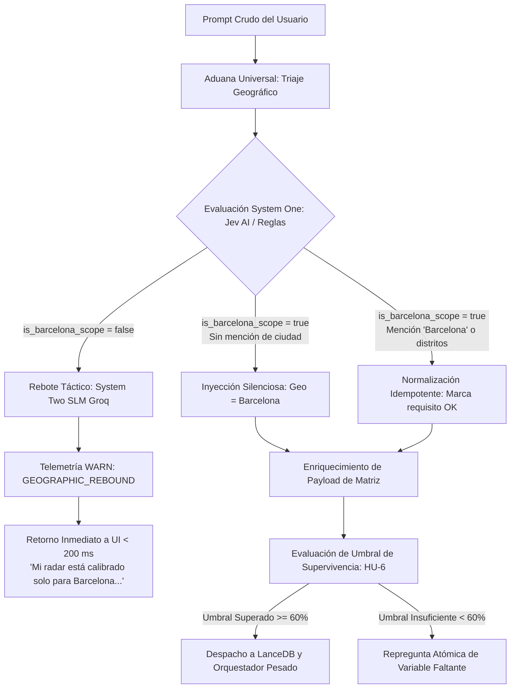
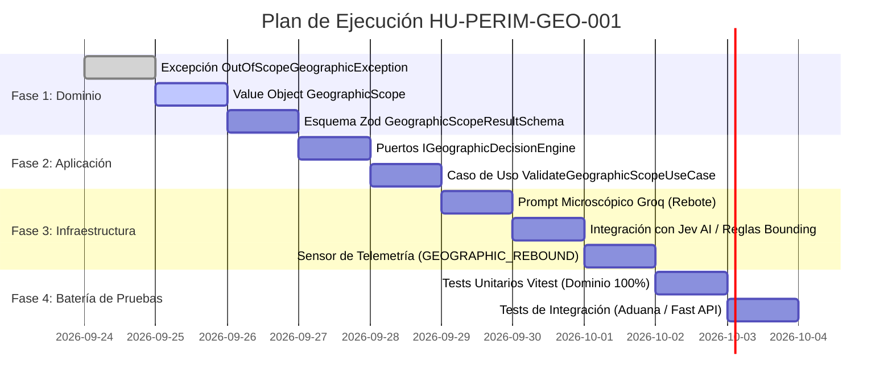

# Historia de Usuario 1: Anclaje Geográfico Absoluto y Fricción Cero (Contexto Base Barcelona)

**Identificador**: `HU-PERIM-GEO-001`  
**Estatus**: `Refinado / Listo para Implementación`  
**Módulo**: `Módulo 1: Perímetro de Seguridad, Identidad y Anclaje (Fricción Cero) / Subcapítulo 1.3: Anclaje Geográfico Absoluto`  
**Entorno**: `Next.js App Router (BFF) / Nodo de Producción 11 (10.0.10.11)`  
**Entropía Asimilada**: Neutralización del 100% de la ambigüedad geográfica entrante; inmunización contra alucinaciones del orquestador pesado (Google Gemini) y erradicación del gasto termodinámico injustificado en peticiones fuera de perímetro.

---

## 1. Descripción General (INVEST)

**Como** turista o explorador urbano interactuando con la PWA de BarcelonaXplorer,  
**Quiero** que el sistema asuma de forma invisible, inmutable y automática que mi intención de viaje se circunscribe estricta y exclusivamente a la ciudad de Barcelona, interceptando de inmediato cualquier desviación hacia otros destinos,  
**Para** no tener que teclear información redundante en mi prompt inicial (eliminando la fricción cognitiva de entrada) y recibir recomendaciones que se alimenten con máxima fidelidad de la base de datos estática hiperlocal curada (MySQL) y la memoria vectorial local (LanceDB).

---

## 2. Justificación Arquitectónica y Restricción de Dominio (La Vía del Yunque)

1. **Seguridad Ontológica y Cero Alucinaciones**: El sistema no es un motor de búsqueda generalista; es un orquestador hiperlocal de alta precisión. Las plantillas de autor (`GuideTemplate`, `TemplateItem`) y los embeddings vectoriales residen en almacenamiento local para Barcelona. Permitir que el motor procese consultas de ciudades externas (ej. *"Qué hacer este finde en Madrid"* o *"Ruta por Valencia"*) desencadenaría alucinaciones, respuestas estériles y llamadas inútiles a APIs de terceros.
2. **Defensa Termodinámica (Filtro A / Filtro de Eficiencia)**: Cada llamada al orquestador pesado (Gemini 1.5) consume cuota, eleva la latencia y malgasta tokens de contexto. El anclaje geográfico actúa como una aduana perimetral de coste cero: el triaje ligero descarta peticiones foráneas en menos de 200 ms sin tocar jamás la base vectorial ni el modelo de razonamiento complejo.
3. **Erradicación de Tipos Primitivos (Dogma Constitucional)**: La geografía y el perímetro no pueden representarse como simples cadenas de texto (`string`). Se encapsulan en un Objeto de Valor (`Value Object`) inmutable que valida sus invariantes en el constructor, imposibilitando la existencia de estados geográficos inválidos o indeterminados en memoria.
4. **Axioma Innegociable de Micro-Logística Periurbana (Última Milla)**: Se oficializa como regla de dominio que los nodos logísticos periurbanos de entrada/salida (Aeropuerto Josep Tarradellas Barcelona-El Prat, terminales portuarias de cruceros y estaciones periféricas de enlace como Estació d'El Prat) gozan de tolerancia perimetral estricta para garantizar la inserción natural del viajero sin fricción logística. Queda terminantemente proscrito ampliar esta tolerancia a actividades, atracciones o POIs turísticos externos al término municipal de Barcelona (ej. Sitges, Montserrat, Castelldefels, Badalona playa), las cuales activarán indefectiblemente el Rebote Táctico en la Aduana Universal.

---

## 3. Modelo de Dominio y Contratos Arquitectónicos

### 3.1. Estructura de Capas en el Monolito (Clean Architecture / BFF)

```
src/
├── domain/
│   ├── exceptions/
│   │   ├── domain.exception.ts
│   │   └── out-of-scope-geographic.exception.ts # [NUEVO] Excepción de dominio perimetral
│   ├── schemas/
│   │   └── geographic-scope.schema.ts           # [NUEVO] Esquema Zod estricto (cero 'any')
│   └── value-objects/
│       └── geographic-scope.vo.ts               # [NUEVO] Value Object inmutable con invariantes
├── application/
│   ├── ports/
│   │   ├── in/
│   │   │   └── IValidateGeographicScopeUseCase.ts # [NUEVO] Puerto de entrada para el caso de uso
│   │   └── out/
│   │       ├── ITypedDecisionEngine.ts          # Puerto Jev AI (System One determinista)
│   │       ├── IConversationalSLM.ts            # Puerto SLM (Groq / System Two ligero)
│   │       └── ITelemetryRepository.ts          # Bitácora de eventos perimetrales
│   └── use-cases/
│       └── validate-geographic-scope.use-case.ts # [NUEVO] Caso de uso de aduana geográfica
└── infrastructure/
    └── ai/
        └── groq/
            └── prompts/
                └── geographic-rebound.prompt.ts  # [NUEVO] Prompt microscópico de rebote gamificado
```

### 3.2. Objeto de Valor Inmutable: `GeographicScope`

```typescript
// src/domain/value-objects/geographic-scope.vo.ts
import { OutOfScopeGeographicException } from '../exceptions/out-of-scope-geographic.exception';

export type CanonicalDistrict = typeof GeographicScope.CANONICAL_DISTRICTS[number];
export type PeriurbanException = typeof GeographicScope.PERIURBAN_EXCEPTIONS[number];

export class GeographicScope {
  public static readonly CANONICAL_CITY = 'Barcelona';

  /** 10 distritos canónicos oficiales del municipio de Barcelona */
  public static readonly CANONICAL_DISTRICTS = [
    'Ciutat Vella',
    'Eixample',
    'Sants-Montjuïc',
    'Les Corts',
    'Sarrià-Sant Gervasi',
    'Gràcia',
    'Horta-Guinardó',
    'Nou Barris',
    'Sant Andreu',
    'Sant Martí',
  ] as const;

  /**
   * Nodos logísticos periurbanos tolerados estrictamente bajo la doctrina de Micro-Logística de Última Milla.
   * Se limita exclusivamente a infraestructura de tránsito/acceso (aeropuertos, terminales portuarias, estaciones).
   * Se prohíbe taxativamente la admisión de atracciones o POIs turísticos externos.
   */
  public static readonly PERIURBAN_EXCEPTIONS = [
    'Aeropuerto de El Prat',
    'Aeroport Josep Tarradellas Barcelona-El Prat',
    'El Prat de Llobregat',
    'Port de Barcelona (Terminales de Cruceros)',
    'Estació d’El Prat',
  ] as const;

  /** Bounding Box Perimetral de Barcelona Metropolitana */
  public static readonly BOUNDING_BOX = {
    minLat: 41.317,
    maxLat: 41.468,
    minLng: 2.052,
    maxLng: 2.235,
  } as const;

  private constructor(
    public readonly isWithinScope: boolean,
    public readonly targetCity: string,
    public readonly detectedDistricts: readonly string[],
    public readonly confidenceScore: number,
    public readonly rejectedEntity?: string
  ) {
    if (!targetCity || targetCity.trim().length === 0) {
      throw new OutOfScopeGeographicException('Target city must not be empty');
    }
    if (confidenceScore < 0 || confidenceScore > 1) {
      throw new OutOfScopeGeographicException('Confidence score must be between 0 and 1');
    }
    if (!isWithinScope && (!rejectedEntity || rejectedEntity.trim().length === 0)) {
      throw new OutOfScopeGeographicException('Rejected geographic entity must be specified when out of scope');
    }
    Object.freeze(this.detectedDistricts);
    Object.freeze(this);
  }

  /** Fábrica para consultas implícitas (Fricción Cero) */
  public static createImplicitBarcelona(): GeographicScope {
    return new GeographicScope(true, GeographicScope.CANONICAL_CITY, [], 1.0);
  }

  /** Fábrica para consultas explícitas dentro del perímetro (Blindaje estricto sin tipo any) */
  public static createExplicitInScope(
    districts: string[] = [],
    confidence: number = 1.0
  ): GeographicScope {
    const validDistricts = districts.filter(d => {
      const isCanonical = (GeographicScope.CANONICAL_DISTRICTS as readonly string[]).includes(d);
      const isPeriurban = GeographicScope.PERIURBAN_EXCEPTIONS.some(
        p => p.toLowerCase() === d.toLowerCase()
      );
      return isCanonical || isPeriurban;
    });
    return new GeographicScope(true, GeographicScope.CANONICAL_CITY, validDistricts, confidence);
  }

  /** Fábrica para desvíos geográficos (Bloqueo Out-of-Scope) */
  public static createOutOfScope(rejectedEntity: string, confidence: number = 1.0): GeographicScope {
    if (!rejectedEntity || rejectedEntity.trim().length === 0) {
      throw new OutOfScopeGeographicException('Rejected geographic entity must be specified');
    }
    return new GeographicScope(false, rejectedEntity.trim(), [], confidence, rejectedEntity.trim());
  }
}
```

### 3.3. Esquema de Validación Zod (Triaje Perimetral)

```typescript
// src/domain/schemas/geographic-scope.schema.ts
import { z } from 'zod';

export const GeographicScopeResultSchema = z.object({
  is_barcelona_scope: z.boolean(),
  canonical_city: z.string().default('Barcelona'),
  detected_districts: z.array(z.string()).default([]),
  confidence: z.number().min(0).max(1),
  out_of_scope_entity: z.string().optional(),
});

export type GeographicScopeResultDto = z.infer<typeof GeographicScopeResultSchema>;
```

---

## 4. Coreografía de la Aduana Geográfica

### 4.1. Diagrama de Estados y Flujo Operacional



### 4.2. Mecánicas de Intercepción

1. **Inyección Silenciosa (Enriquecimiento Invisible)**: Si el usuario introduce *"Quiero visitar monumentos góticos y tomar vermut"*, el sistema no realiza ninguna pregunta de clarificación sobre la ubicación. Automáticamente inyecta `targetCity: 'Barcelona'` y detecta implícitamente `detectedDistricts: ['Ciutat Vella']` en el payload interno.
2. **Rebote Táctico (Bloqueo Out-of-Scope en < 200 ms)**: Si el usuario teclea *"Qué hacer un domingo en Sitges"* o *"Ruta por Sevilla"*, la petición no llega jamás al orquestador pesado ni a LanceDB. El SLM rápido formula una única frase táctica, gamificada y no punitiva, reorientando la intención hacia el asfalto barcelonés.
3. **Idempotencia y Cero Duplicidad**: Si el usuario escribe explícitamente *"Quiero pasear por Barcelona"*, el sistema valida la conformidad perimetral sin duplicar claves ni generar redundancias en los embeddings de LanceDB.
4. **Tolerancia Periurbana Logística (Doctrina de Micro-Logística de Última Milla)**: Se decreta la inclusión estricta de nodos logísticos periurbanos (*Aeropuerto Josep Tarradellas Barcelona-El Prat*, terminales portuarias de cruceros y estaciones periféricas de enlace como *Estació d'El Prat*) como excepciones operativas de entrada. Esta concesión neutraliza la fricción de inserción natural del viajero al aterrizar o desembarcar. **Cláusula de Exclusión**: Esta tolerancia no se extenderá jamás a atracciones, actividades o POIs turísticos fuera del término municipal de Barcelona (ej. Sitges, Montserrat, Castelldefels, Badalona playa); cualquier petición de ocio fuera del municipio detonará indefectiblemente el Rebote Táctico.

---

## 5. Criterios de Aceptación (Verificación Empírica - Gherkin S+ Grade)

### Escenario 1: Prompt Implícito (Fricción Cero e Inyección Silenciosa)
```gherkin
Dado que un usuario envía el prompt: "Tengo 3 horas libres esta tarde, quiero comer paella y ver algo histórico"
Cuando el caso de uso ValidateGeographicScopeUseCase procesa la entrada en la Aduana Universal
Entonces el sistema resuelve is_barcelona_scope = true de forma automática
Y devuelve un GeographicScope con targetCity = "Barcelona"
Y el flujo avanza hacia la evaluación de la matriz de densidad (HU-6) sin formular preguntas geográficas al usuario
Y el orquestador pesado no recibe peticiones de aclaración de ubicación.
```

### Escenario 2: Prompt Fuera de Dominio (Rebote Táctico y Filtro de Eficiencia)
```gherkin
Dado que un usuario introduce el prompt: "Recomiéndame una ruta para ver museos y comer tapas en Valencia"
Cuando el motor System One (Jev AI) evalúa el texto entrante
Entonces detecta la entidad foránea "Valencia" y resuelve is_barcelona_scope = false en menos de 200 ms
Y el caso de uso detiene el avance hacia LanceDB y hacia el modelo Gemini
Y el SLM ligero (Groq) genera un mensaje de rebote táctico con tono conversacional de conserje:
  "Mi radar táctico está calibrado exclusivamente para el asfalto de Barcelona. Si tienes planeado pasarte por la capital catalana, avísame y forjamos una ruta a medida."
Y el sistema persiste una entrada de telemetría con nivel "WARN" y contexto "SECURITY_PERIMETER" bajo la etiqueta "GEOGRAPHIC_REBOUND".
```

### Escenario 3: Prompt Explícito Redundante (Normalización e Idempotencia)
```gherkin
Dado que un usuario introduce el prompt: "Quiero pasear por Barcelona con mi pareja durante 2 horas por el barrio de Gràcia"
Cuando la Aduana procesa la entrada
Entonces valida que "Barcelona" coincide con el perímetro canónico
Y extrae "Gràcia" dentro de detectedDistricts
Y marca el requisito de anclaje geográfico como satisfecho
Y garantiza que no se duplican metadatos geográficos en el payload vectorial destinado a LanceDB.
```

### Escenario 4: Tolerancia Periurbana vs. Rechazo de Atracciones Foráneas (Micro-Logística)
```gherkin
Dado que un viajero introduce: "Acabo de aterrizar en el Aeropuerto de El Prat y tengo 4 horas antes de mi tren"
Cuando el triaje geográfico evalúa la entrada
Entonces reconoce "Aeropuerto de El Prat" como excepción periurbana de infraestructura logística autorizada
Y resuelve is_barcelona_scope = true sin emitir rebote táctico
Y prepara la matriz logística para trazar la conexión hacia el centro urbano de Barcelona.

Pero dado otro usuario que introduce: "Quiero pasar la tarde en la playa de Sitges y cenar allí"
Cuando la Aduana Universal audita la petición
Entonces clasifica "Sitges" como atracción turística fuera de dominio (sin inmunidad logística)
Y aborta inmediatamente el flujo hacia LanceDB/Gemini
Y emite un Rebote Táctico en < 200 ms reorientando la recomendación al litoral barcelonés (ej. Barceloneta o Poblenou).
```

### Escenario 5: Resiliencia Perimetral y Degradación Elegante (Fail-Soft)
```gherkin
Dado que el servicio de inferencia rápida de triaje experimenta un timeout (> 500 ms) o error HTTP 5xx
Cuando el usuario envía una consulta ambigua
Entonces el sistema activa la política perimetral "Assume-Barcelona-Default"
Y permite la continuidad de la sesión asignando GeographicScope.createImplicitBarcelona()
Y emite un registro de telemetría de nivel "WARN" reportando la degradación perimetral sin interrumpir la experiencia del usuario.
```

---

## 6. Planificación Técnica de Implementación (WBS / Desglose de Tareas)



### Desglose Detallado de Tareas Técnicas

| ID | Capa | Tarea Técnica | Entregable / Fichero | Criterio de Aceptación |
| :--- | :--- | :--- | :--- | :--- |
| **T-GEO-01** | Dominio | Crear excepción tipada de dominio | `src/domain/exceptions/out-of-scope-geographic.exception.ts` | Extiende `DomainException` con mensaje contextual. |
| **T-GEO-02** | Dominio | Implementar Value Object inmutable `GeographicScope` | `src/domain/value-objects/geographic-scope.vo.ts` | Invariantes validadas, congelación de objeto (`Object.freeze`), cero primitivos sueltos. |
| **T-GEO-03** | Dominio | Crear esquema Zod perimetral | `src/domain/schemas/geographic-scope.schema.ts` | Tipado estricto inferido, validación sin tipo `any`. |
| **T-GEO-04** | Aplicación | Definir contratos de puertos de entrada y salida | `src/application/ports/in/IValidateGeographicScopeUseCase.ts`<br>`src/application/ports/out/IGeographicDecisionEngine.ts` | DIP estricto: la aplicación no conoce a Groq ni a Jev. |
| **T-GEO-05** | Aplicación | Implementar caso de uso de orquestación de la aduana | `src/application/use-cases/validate-geographic-scope.use-case.ts` | Decide entre inyección silenciosa, paso directo o rebote rápido en < 200 ms. |
| **T-GEO-06** | Infraestructura | Crear prompt microscópico de rebote gamificado | `src/infrastructure/ai/groq/prompts/geographic-rebound.prompt.ts` | Redacción en 1 frase empática, sin alucinación. |
| **T-GEO-07** | Infraestructura | Integrar adaptador de decisión determinista y telemetría | `src/infrastructure/ai/groq/` & `src/infrastructure/repositories/prisma-telemetry.repository.ts` | Registro de eventos `GEOGRAPHIC_REBOUND` con código 422/WARN. |
| **T-GEO-08** | Pruebas | Suite de pruebas unitarias de dominio | `tests/domain/value-objects/geographic-scope.vo.test.ts` | Cobertura 100% en métodos de fábrica, invariantes y distritos. |
| **T-GEO-09** | Pruebas | Suite de pruebas del caso de uso | `tests/application/use-cases/validate-geographic-scope.use-case.test.ts` | Mocks de puertos aislados sin llamadas reales a red. |

---

## 7. Matriz de Trazabilidad y Definición de Hecho (DoD)

- [ ] **DoD-1 (Cero 'any')**: El código compila limpiamente con `npx tsc --noEmit` sin ninguna ocurrencia del tipo `any`.
- [ ] **DoD-2 (Aislamiento de Dominio)**: Las entidades y Value Objects de `src/domain/` no importan librerías de infraestructura ni frameworks.
- [ ] **DoD-3 (Presupuesto Termodinámico)**: El rebote geográfico se resuelve en $\le 200$ ms y nunca invoca al cliente de Gemini ni a LanceDB.
- [ ] **DoD-4 (Pruebas Automatizadas)**: Suite de tests con Vitest aprobada al 100% para la capa de dominio y caso de uso.
- [ ] **DoD-5 (Telemetría Perimetral)**: Todo desvío geográfico bloqueado genera una traza en la bitácora visible desde `/Admin/System`.
- [ ] **DoD-6 (Documentación Sincronizada)**: Las referencias cruzadas con `HU-CORE-TRIAGE-002` y `HU-6` (Matriz de Densidad) están validadas.
