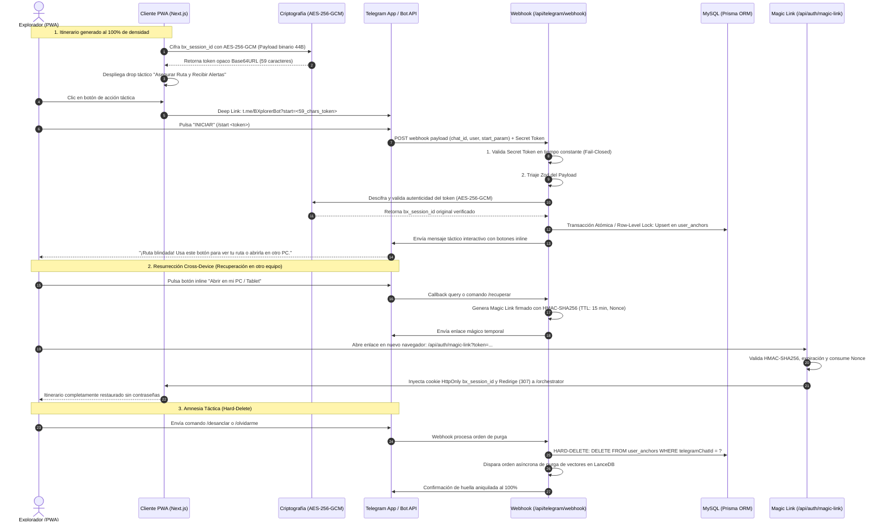

# Historia de Usuario 2.2: Anclaje Táctico y Persistencia de Larga Duración (Telegram Bridge)

**Identificador:** HU-PERIM-TG-002  
**Estatus:** Implementado y Validado S+ Grade  
**Módulo:** Módulo 1: Perímetro de Seguridad, Identidad y Anclaje (Fricción Cero) / Integración B2C y Persistencia Relacional Híbrida  
**Entorno:** Next.js App Router (Node.js & Edge Runtime) / MySQL (Prisma ORM) / Telegram Bot API / Nodo de Producción 11  

---

### Matriz de Indexación Tridimensional

- **Naturaleza:** Especificación Funcional S+ Grade, Arquitectura Criptográfica de Integración Externa y Plan Táctico de Ejecución.
- **Entorno:** Ecosistema BarcelonaXplorer (PWA Mobile-First, Next.js App Router, MySQL Relacional vía Prisma, Telegram Bot API).
- **Entropía Asimilada:** Desacople total de autenticación tradicional (sin contraseñas ni SMTP). Cifrado simétrico autenticado (AES-256-GCM) para Deep Links con payload estrictamente opaco y restringido al límite de 64 caracteres de Telegram. Hard-Delete irreversible en la Amnesia Táctica para garantizar la aniquilación absoluta de la huella digital. Resiliencia de transacciones atómicas con mitigación de condiciones de carrera (*Race Conditions*) ante reintentos agresivos del Webhook de Telegram.

---

## 1. Descripción General (INVEST)

**Como** explorador urbano y usuario recurrente que ha finalizado un itinerario de alta fidelidad (S+ Grade con densidad del 100% en el peaje termodinámico),  
**Quiero** vincular mi sesión efímera actual a un canal de comunicación asíncrono y soberano (Telegram) mediante una acción táctica de un solo toque (*Deep Link* paramétrico cifrado de forma opaca con AES-256-GCM),  
**Para** salvaguardar mi ruta ante la expiración o purga de cookies locales, acceder a ella instantáneamente desde cualquier otro dispositivo (Cross-Device) mediante un enlace mágico temporal firmado, recibir alertas tácticas hiperlocales (meteorología, aforos en tiempo real, enlaces de alivio y drops de afiliación CPA/CPS), y contar con la garantía de que al ejecutar la Amnesia Táctica se erradicará físicamente todo mi rastro en la base de datos relacional y vectorial.

---

## 2. Justificación Arquitectónica (La Táctica del Refugio y la Vía del Yunque)

1. **Erradicación de Fricción Operativa y Coste Marginal Cero:**  
   Los flujos de registro tradicionales imponen una fricción letal en el embudo de conversión de una PWA turística y acarrean el coste operativo y la superficie de ataque de servidores de correo (SMTP, entregabilidad, gestión de rebotes, filtrado de contraseñas). Delegar la identidad de larga duración a Telegram aniquila este coste y proporciona un canal de hardware persistente y bidireccional sin coste marginal.

2. **Cifrado Simétrico Autenticado (AES-256-GCM) en Deep Links:**  
   El parámetro de inicio de Telegram (`t.me/BXplorerBot?start=<TOKEN>`) no debe ser una simple firma o base64 de un UUID interno, ya que expondría el identificador de sesión a terceros y al cliente. Se exige un mandato criptográfico único: **Cifrado simétrico autenticado AES-256-GCM** utilizando la Web Crypto API.  
   - Para satisfacer la restricción innegociable de Telegram (máximo 64 caracteres alfanuméricos/base64url en el parámetro `start`), el payload se empaqueta de forma binaria compacta:  
     `IV (12 bytes) + Ciphertext del UUID v4 (16 bytes) + Auth Tag (16 bytes) = 44 bytes binarios`.  
     Al codificarse en `Base64URL`, el resultado es una cadena de exactamente **59 caracteres**, completamente opaca, resistente al tampering y perfectamente válida para Telegram (`59 <= 64 caracteres`).

3. **Amnesia Táctica Absoluta (Hard-Delete Innegociable):**  
   Mantener registros con estados lógicos de revocación (`AnchorStatus.REVOKED`) contradice frontalmente la promesa de soberanía y "aniquilación de la huella digital" comunicada al usuario. La orden de Amnesia Táctica (`/desanclar`, `/olvidarme` o "Borrar mi rastro" en la PWA) ejecuta un **borrado físico (*Hard-Delete*) inmediato e irreversible** en la tabla `user_anchors` de MySQL, junto con la purga de embeddings en LanceDB. La entidad de dominio `UserAnchor` solo modela el anclaje mientras este se encuentre activo.

4. **Resiliencia Transaccional y Anti-Race Conditions en Webhooks:**  
   La API de Telegram reintenta agresivamente la entrega de webhooks ante picos de latencia o retransmisiones de red. Peticiones concurrentes del comando `/start` con el mismo `chat_id` podrían generar condiciones de carrera o colisiones en la restricción `UNIQUE(telegramChatId)`. El repositorio de infraestructura debe implementar operaciones transaccionales atómicas mediante bloqueo a nivel de fila (`SELECT ... FOR UPDATE` en MySQL) o la cláusula atómica `INSERT ... ON DUPLICATE KEY UPDATE` / deduplicación idempotente, garantizando consistencia absoluta sin excepciones no controladas.

5. **Aislamiento Hexagonal (Clean Architecture):**  
   El núcleo de dominio no acopla dependencias de Telegram ni detalles de Web Crypto API. Todo se articula mediante puertos (`AnchorTokenEncryptorPort`, `UserAnchorRepositoryPort`, `TelegramBotGatewayPort`, `MagicLinkSignerPort`).

---

## 3. Coreografía de la Conversión Voluntaria y Resurrección Omnicanal



### Detalle de las Fases Operativas

#### Fase A: El Drop de Gamificación (UI / Post-Generación)
El componente táctico solo emerge cuando la densidad de interacción alcanza el 100% y el orquestador presenta la ruta S+ Grade. Presenta un llamado claro: *"Asegurar ruta contra pérdida de batería o cookies y recibir alertas tácticas en tu móvil"*.

#### Fase B: Deep Link Criptográfico con AES-256-GCM (59 Caracteres)
Para impedir la lectura, adivinación o suplantación de identificadores de sesión, el token inyectado en el Deep Link de Telegram se genera mediante **cifrado simétrico autenticado (AES-256-GCM)**:
1. Se extrae el `bx_session_id` (UUID v4 estándar de 16 bytes crudos).
2. Se genera un vector de inicialización criptográficamente seguro (IV de 12 bytes).
3. Se cifra mediante AES-256-GCM con una clave secreta (`ANCHOR_AES_KEY`, de 256 bits), produciendo 16 bytes de texto cifrado y 16 bytes de etiqueta de autenticación (*Auth Tag*).
4. Se concatenan los búferes binarios: `[IV (12B) | Ciphertext (16B) | AuthTag (16B)] = 44 bytes`.
5. Se codifica en `Base64URL` sin padding, resultando exactamente en **59 caracteres**, cumpliendo holgadamente el límite de 64 caracteres de Telegram (`[a-zA-Z0-9_-]{1,64}`).

#### Fase C: Ingesta del Webhook y Triaje Entrópico
La API de Telegram despacha el evento al Route Handler `/api/telegram/webhook`:
1. **Centinela de Cabecera:** Comprobación en tiempo constante (`timingSafeEqual`) de la cabecera `X-Telegram-Bot-Api-Secret-Token` contra `TELEGRAM_WEBHOOK_SECRET`. Rechazo 401 inmediato si no coincide.
2. **Triaje de Dominio (Zod):** Validación y saneamiento estricto mediante `TelegramUpdateSchema`.
3. **Descifrado de Token:** El caso de uso invoca a `AnchorTokenEncryptorPort.decrypt(token)`. Si la etiqueta de autenticación falla o el token fue alterado, se descarta silenciosamente emitiendo telemetría perimetral.

#### Fase D: Consolidación Relacional Atómica y Anti-Race Condition en MySQL
Ante reintentos paralelos de Telegram de un mismo comando `/start`:
- El repositorio `PrismaUserAnchorRepository` ejecuta una transacción aislada con bloqueo de fila (`SELECT ... FOR UPDATE`) o un `INSERT ... ON DUPLICATE KEY UPDATE` sobre la restricción `UNIQUE (telegramChatId)`.
- Si el `telegramChatId` ya existe, actualiza el `sessionId` activo y refresca `lastInteractionAt` atómicamente.
- Se previene cualquier error de clave duplicada o estado inconsistente en la base de datos.

#### Fase E: Resurrección Omnicanal (Cross-Device Magic Link)
1. Al recibir `/recuperar` o el callback del botón *"Abrir en PC"*, el sistema emite una URL temporal:  
   `https://barcelonaxplorer.com/api/auth/magic-link?token=<HMAC_SIGNED_PAYLOAD>`
2. Payload: `{ sessionId, telegramChatId, exp: Date.now() + 900000, nonce: randomHex }` firmado con HMAC-SHA256 (`MAGIC_LINK_SECRET`).
3. El endpoint `/api/auth/magic-link` valida la firma, verifica que `Date.now() < exp`, valida que el `nonce` no haya sido consumido en la tabla `MagicLinkNonce`, inyecta la cookie de sesión `bx_session_id` (HttpOnly, Secure, SameSite=Lax, Path=/) y redirige (307) a `/orchestrator`.

#### Fase F: Amnesia Táctica y Hard-Delete Irreversible
Cuando el usuario solicita desvincularse (mediante `/desanclar`, `/olvidarme` en Telegram o *"Borrar mi rastro"* en la PWA):
1. El repositorio ejecuta un **Hard-Delete**:  
   `DELETE FROM user_anchors WHERE telegramChatId = ?`
2. No quedan registros residuales ni estados "revocados" en la base de datos relacional.
3. Se despacha una orden asíncrona a LanceDB para purgar todos los embeddings asociados a ese `bx_session_id`.
4. El bot confirma la aniquilación: *"Tu rastro táctico ha sido purgado por completo. No conservamos enlaces a tu dispositivo ni historial de navegación."*

---

## 4. Diseño de Dominio, Contratos y Esquemas

### A. Value Objects y Entidades de Dominio (`src/domain/`)

```typescript
// src/domain/value-objects/telegram-chat-id.vo.ts
import { DomainException } from '../exceptions/domain.exception';

export class InvalidTelegramChatIdException extends DomainException {
  constructor(message: string) {
    super(`[InvalidTelegramChatId] ${message}`);
  }
}

export class TelegramChatId {
  private readonly value: string;

  constructor(chatId: string | number) {
    const sanitized = String(chatId).trim();
    if (!/^-?\d+$/.test(sanitized)) {
      throw new InvalidTelegramChatIdException(`El chat_id '${chatId}' no es un identificador numérico válido.`);
    }
    this.value = sanitized;
  }

  public getValue(): string {
    return this.value;
  }

  public equals(other: TelegramChatId): boolean {
    return this.value === other.value;
  }
}
```

```typescript
// src/domain/entities/user-anchor.entity.ts
import { TelegramChatId } from '../value-objects/telegram-chat-id.vo';
import { DomainException } from '../exceptions/domain.exception';

export interface UserAnchorProps {
  id: string;
  sessionId: string;
  telegramChatId: TelegramChatId;
  telegramUsername?: string | null;
  firstName?: string | null;
  createdAt: Date;
  updatedAt: Date;
  lastInteractionAt: Date;
}

/**
 * Entidad que modela un Anclaje Táctico Activo.
 * Nota Arquitectónica: No existe estado REVOKED. La desvinculación
 * ejecuta un Hard-Delete físico en la persistencia relacional (Amnesia Táctica).
 */
export class UserAnchor {
  constructor(private readonly props: UserAnchorProps) {
    if (!props.id || !props.sessionId) {
      throw new DomainException('UserAnchor requiere un id y un sessionId válidos.');
    }
  }

  public get id(): string { return this.props.id; }
  public get sessionId(): string { return this.props.sessionId; }
  public get telegramChatId(): TelegramChatId { return this.props.telegramChatId; }
  public get telegramUsername(): string | null | undefined { return this.props.telegramUsername; }
  public get firstName(): string | null | undefined { return this.props.firstName; }
  public get createdAt(): Date { return this.props.createdAt; }
  public get updatedAt(): Date { return this.props.updatedAt; }
  public get lastInteractionAt(): Date { return this.props.lastInteractionAt; }

  public updateSession(newSessionId: string): void {
    if (!newSessionId) {
      throw new DomainException('El nuevo sessionId no puede ser nulo o vacío.');
    }
    this.props.sessionId = newSessionId;
    this.props.lastInteractionAt = new Date();
    this.props.updatedAt = new Date();
  }

  public touch(): void {
    this.props.lastInteractionAt = new Date();
    this.props.updatedAt = new Date();
  }
}
```

### B. Esquemas Zod para Triaje Entrópico (`src/domain/schemas/`)

```typescript
// src/domain/schemas/telegram-webhook.schema.ts
import { z } from 'zod';

export const TelegramUserSchema = z.object({
  id: z.number(),
  is_bot: z.boolean(),
  first_name: z.string(),
  last_name: z.string().optional(),
  username: z.string().optional(),
  language_code: z.string().optional(),
});

export const TelegramChatSchema = z.object({
  id: z.number(),
  type: z.enum(['private', 'group', 'supergroup', 'channel']),
  title: z.string().optional(),
  username: z.string().optional(),
});

export const TelegramMessageSchema = z.object({
  message_id: z.number(),
  from: TelegramUserSchema.optional(),
  chat: TelegramChatSchema,
  date: z.number(),
  text: z.string().optional(),
});

export const TelegramCallbackQuerySchema = z.object({
  id: z.string(),
  from: TelegramUserSchema,
  message: TelegramMessageSchema.optional(),
  data: z.string().optional(),
});

export const TelegramUpdateSchema = z.object({
  update_id: z.number(),
  message: TelegramMessageSchema.optional(),
  callback_query: TelegramCallbackQuerySchema.optional(),
});

export type TelegramUpdateDto = z.infer<typeof TelegramUpdateSchema>;
```

### C. Esquema Relacional de Base de Datos (`src/prisma/schema.prisma`)

```prisma
// Persistencia Relacional para el Anclaje Táctico (Hard-Delete por diseño)
model UserAnchor {
  id                 String   @id @default(cuid())
  sessionId          String   @db.VarChar(64)
  telegramChatId     String   @unique @db.VarChar(64)
  telegramUsername   String?  @db.VarChar(128)
  firstName          String?  @db.VarChar(128)
  createdAt          DateTime @default(now())
  updatedAt          DateTime @updatedAt
  lastInteractionAt  DateTime @default(now())

  @@index([sessionId])
  @@index([telegramChatId])
  @@map("user_anchors")
}

model MagicLinkNonce {
  id         String    @id @default(cuid())
  tokenHash  String    @unique @db.VarChar(64)
  sessionId  String    @db.VarChar(64)
  expiresAt  DateTime
  consumedAt DateTime?
  createdAt  DateTime  @default(now())

  @@index([tokenHash, expiresAt])
  @@map("magic_link_nonces")
}
```

### D. Puertos de Entrada y Salida (Arquitectura Hexagonal)

```typescript
// src/application/ports/out/anchor-token-encryptor.port.ts
export interface AnchorTokenEncryptorPort {
  /**
   * Cifra un UUID v4 mediante AES-256-GCM empaquetando IV(12B) + Ciphertext(16B) + Tag(16B).
   * Retorna una cadena Base64URL opaca de exactamente 59 caracteres (compatible con el límite de 64 chars de Telegram).
   */
  encryptSessionId(sessionId: string): Promise<string>;

  /**
   * Descifra y valida la integridad autenticada del token de Telegram.
   * Lanza excepción de dominio si el token fue manipulado o el tag no coincide.
   */
  decryptAnchorToken(token: string): Promise<string>;
}
```

```typescript
// src/application/ports/out/user-anchor-repository.port.ts
import { UserAnchor } from '@/domain/entities/user-anchor.entity';
import { TelegramChatId } from '@/domain/value-objects/telegram-chat-id.vo';

export interface UserAnchorRepositoryPort {
  findByTelegramChatId(chatId: TelegramChatId): Promise<UserAnchor | null>;
  findBySessionId(sessionId: string): Promise<UserAnchor | null>;
  
  /**
   * Persiste o actualiza atómicamente el anclaje, protegido contra condiciones de carrera
   * mediante bloqueo a nivel de fila o atomic upsert.
   */
  atomicUpsert(anchor: UserAnchor): Promise<void>;
  
  /**
   * Ejecuta la Amnesia Táctica: Hard-Delete físico de la fila en MySQL.
   */
  hardDeleteByChatId(chatId: TelegramChatId): Promise<void>;
}
```

```typescript
// src/application/ports/in/link-telegram-session.use-case.port.ts
export interface LinkTelegramSessionCommand {
  encryptedAnchorToken: string;
  telegramChatId: string;
  telegramUsername?: string;
  firstName?: string;
}

export interface LinkTelegramSessionResult {
  success: boolean;
  sessionId: string;
}

export interface LinkTelegramSessionUseCasePort {
  execute(command: LinkTelegramSessionCommand): Promise<LinkTelegramSessionResult>;
}
```

```typescript
// src/application/ports/out/telegram-bot-gateway.port.ts
export interface TelegramButton {
  text: string;
  url?: string;
  callback_data?: string;
}

export interface TelegramBotGatewayPort {
  sendMessage(chatId: string, text: string, buttons?: TelegramButton[][]): Promise<void>;
  verifySecretHeader(headerSecret: string | null): boolean;
}
```

```typescript
// src/application/ports/out/magic-link-signer.port.ts
export interface MagicLinkPayload {
  sessionId: string;
  telegramChatId: string;
  expiresAt: number;
  nonce: string;
}

export interface MagicLinkSignerPort {
  signToken(payload: MagicLinkPayload): Promise<string>;
  verifyToken(token: string): Promise<MagicLinkPayload>;
}
```

---

## 5. Criterios de Aceptación (Verificación Empírica - Gherkin S+ Grade)

### Escenario 1: Generación de Deep Link Opaco con AES-256-GCM (UI)
```gherkin
Dado que un explorador urbano ha alcanzado el 100% de densidad en el peaje termodinámico y cuenta con una sesión bx_session_id
Cuando el componente táctico genera el Deep Link de anclaje
Entonces invoca el servicio de cifrado simétrico AES-256-GCM
Y genera un token opaco en formato Base64URL de exactamente 59 caracteres
Y la longitud del parámetro start en la URL "https://t.me/<BOT_NAME>?start=<TOKEN>" no excede los 64 caracteres
Y un atacante que inspeccione la URL es incapaz de deducir el UUID subyacente.
```

### Escenario 2: Vinculación Exitosa vía Webhook con Descifrado Autenticado
```gherkin
Dado un usuario que pulsa "INICIAR" en el bot enviando "/start <TOKEN_59_CHARS>"
Y la API de Telegram despacha un POST a /api/telegram/webhook con el header X-Telegram-Bot-Api-Secret-Token válido
Cuando el servidor descifra el token con la clave AES-256-GCM y valida el Auth Tag
Entonces recupera con éxito el bx_session_id original
Y ejecuta una operación atómica en user_anchors vinculando chat_id y sessionId
Y el bot responde inmediatamente: "¡Itinerario S+ Grade blindado con éxito! Tu ruta está a salvo de borrados de caché."
```

### Escenario 3: Resiliencia ante Condiciones de Carrera en Webhooks Concurrentes
```gherkin
Dado un escenario de retransmisión agresiva donde Telegram despacha 2 peticiones idénticas de /start con milisegundos de diferencia
Cuando ambas peticiones entran concurrentemente al webhook
Entonces el repositorio Prisma ejecuta el upsert de forma atómica bajo bloqueo transaccional
Y una petición inserta o actualiza y la otra resuelve de forma idempotente sin violar la restricción UNIQUE(telegramChatId)
Y ninguna petición emite una excepción 500 al cliente.
```

### Escenario 4: Rechazo Perimetral Fail-Closed de Webhook
```gherkin
Dado un request hacia /api/telegram/webhook con cabecera de secreto ausente o inválida
Cuando el Route Handler evalúa la cabecera mediante comparación en tiempo constante
Entonces responde de inmediato con HTTP 401 Unauthorized sin invocar a Prisma ni descifrar payloads
Y emite telemetría perimetral WARN bajo el contexto SECURITY_PERIMETER.
```

### Escenario 5: Resurrección Omnicanal Cross-Device (HMAC-SHA256)
```gherkin
Dado un usuario anclado que solicita "Abrir en mi PC" en Telegram
Cuando el servidor emite una URL firmada con HMAC-SHA256 (TTL: 15 min) y el usuario la abre en un nuevo navegador
Entonces el endpoint /api/auth/magic-link valida la firma, verifica que no ha expirado y marca el nonce como consumido
Y el servidor inyecta la cookie de sesión "bx_session_id" (HttpOnly, Secure, SameSite=Lax)
Y redirige mediante código HTTP 307 a /orchestrator, desplegando el itinerario guardado.
```

### Escenario 6: Rechazo de Enlace Mágico Reutilizado (Anti-Replay)
```gherkin
Dado un enlace mágico cuyo nonce ya fue consumido en una solicitud previa
Cuando se intenta acceder nuevamente a la misma URL
Entonces el sistema detecta el nonce consumido en la tabla magic_link_nonces
Y rechaza la petición con HTTP 403 Forbidden sin emitir ni alterar la cookie de sesión.
```

### Escenario 7: Amnesia Táctica y Hard-Delete Físico en Base de Datos
```gherkin
Dado un explorador anclado que envía el comando "/desanclar" al bot o acciona "Borrar mi rastro" en la web
Cuando el caso de uso RevokeTelegramAnchor se ejecuta
Entonces ejecuta un DELETE físico en MySQL eliminando por completo la fila en user_anchors
Y una consulta posterior a user_anchors confirma que el registro ya no existe (Hard-Delete verificado)
Y se despacha la orden de purga de vectores asociados en LanceDB
Y el bot confirma: "Tu rastro táctico ha sido purgado por completo."
```

---

## 6. Plan Táctico de Ejecución y Desglose de Fases

### Fase 1: Dominio, Contratos Inmutables y Cifrado
- **Tarea 1.1:** Implementar el Value Object `TelegramChatId` en `src/domain/value-objects/telegram-chat-id.vo.ts` con validación estricta y tests unitarios.
- **Tarea 1.2:** Crear la entidad `UserAnchor` en `src/domain/entities/user-anchor.entity.ts`, modelando únicamente la entidad viva (sin enum ni estado `REVOKED`).
- **Tarea 1.3:** Crear los esquemas Zod de triaje en `src/domain/schemas/telegram-webhook.schema.ts`.
- **Tarea 1.4:** Definir los puertos hexagonales:
  - `AnchorTokenEncryptorPort` (AES-256-GCM) en `src/application/ports/out/anchor-token-encryptor.port.ts`.
  - `UserAnchorRepositoryPort` (con métodos `atomicUpsert` y `hardDeleteByChatId`) en `src/application/ports/out/user-anchor-repository.port.ts`.
  - `TelegramBotGatewayPort` y `MagicLinkSignerPort` en sus respectivos ficheros de puertos.

### Fase 2: Forja Relacional en MySQL (Prisma ORM)
- **Tarea 2.1:** Actualizar `src/prisma/schema.prisma` agregando los modelos `UserAnchor` y `MagicLinkNonce` (sin enum de estado, con índice único en `telegramChatId`).
- **Tarea 2.2:** Ejecutar `npx prisma db push` y validar el esquema en la base de datos de desarrollo y producción (Nodo 11).
- **Tarea 2.3:** Implementar `PrismaUserAnchorRepository` en `src/infrastructure/repositories/prisma-user-anchor.repository.ts`, blindando `atomicUpsert` contra condiciones de carrera mediante `upsert` nativo de Prisma y transacciones serializables.
- **Tarea 2.4:** Implementar el método `hardDeleteByChatId` con borrado físico directo en MySQL.

### Fase 3: Infraestructura Criptográfica (AES-256-GCM y HMAC)
- **Tarea 3.1:** Implementar `AesGcmAnchorTokenEncryptor` en `src/infrastructure/security/aes-gcm-anchor-token.encryptor.ts` utilizando Web Crypto API nativa:
  - Empaquetado binario: 12B IV + 16B Ciphertext + 16B Auth Tag = 44B.
  - Codificación Base64URL sin relleno = 59 caracteres exactos.
- **Tarea 3.2:** Implementar `HmacMagicLinkSigner` en `src/infrastructure/security/hmac-magic-link-signer.ts` para firmas de enlaces mágicos.
- **Tarea 3.3:** Implementar `TelegramBotApiGateway` en `src/infrastructure/gateways/telegram-bot-api.gateway.ts` para despachar mensajes y verificar la cabecera secreta.
- **Tarea 3.4:** Configurar y auditar variables de entorno:
  - `ANCHOR_AES_KEY`: Clave de 256 bits (32 bytes en hex/base64).
  - `TELEGRAM_BOT_TOKEN`, `TELEGRAM_BOT_USERNAME`, `TELEGRAM_WEBHOOK_SECRET`, `MAGIC_LINK_SECRET`.

### Fase 4: Casos de Uso de Aplicación
- **Tarea 4.1:** Implementar `LinkTelegramSessionUseCase` (descifra token AES-256-GCM, ejecuta `atomicUpsert` y envía bienvenida táctica).
- **Tarea 4.2:** Implementar `GenerateMagicLinkUseCase` (firma token HMAC-SHA256, persiste nonce en DB).
- **Tarea 4.3:** Implementar `RestoreSessionFromMagicLinkUseCase` (valida firma, consume nonce, retorna `sessionId`).
- **Tarea 4.4:** Implementar `RevokeTelegramAnchorUseCase` (ejecuta hard delete en MySQL y ordena purga en LanceDB).

### Fase 5: Route Handlers en Next.js App Router
- **Tarea 5.1:** Crear `/api/telegram/webhook/route.ts` con verificación fail-closed de cabecera secreta y ruteo de comandos.
- **Tarea 5.2:** Crear `/api/auth/magic-link/route.ts` con validación de token, inyección de cookie `bx_session_id` y redirección 307.
- **Tarea 5.3:** Actualizar `src/middleware.ts` para admitir las nuevas rutas con cabeceras de blindaje perimetral.

### Fase 6: Capa de Presentación (UI)
- **Tarea 6.1:** Crear `src/components/tactical/telegram-anchor-drop.tsx` con estética Glassmorphism y micro-animación.
- **Tarea 6.2:** Integrar el componente en `src/app/orchestrator/page.tsx`, activándose al alcanzar el 100% de densidad.

### Fase 7: Blindaje Empírico y Batería de Pruebas
- **Tarea 7.1:** Pruebas unitarias en Vitest para `AesGcmAnchorTokenEncryptor` (validando que el token mide 59 caracteres y descifra con fidelidad).
- **Tarea 7.2:** Pruebas de integración de concurrencia en `PrismaUserAnchorRepository` simulando peticiones simultáneas con el mismo `chat_id`.
- **Tarea 7.3:** Pruebas del webhook fail-closed y del endpoint de magic links (rechazo de nonces reutilizados).
- **Tarea 7.4:** Prueba de integración del flujo de Amnesia Táctica confirmando que la tupla desaparece físicamente de MySQL.

---

## 7. Matriz de Riesgos y Mitigaciones Termodinámicas

| Riesgo / Vector de Falla | Severidad | Mitigación Técnica (La Vía del Yunque) |
| :--- | :--- | :--- |
| **Condición de Carrera en Webhook Concurrente** | Crítica | Bloqueo a nivel de fila o `upsert` atómico en Prisma (`atomicUpsert`), garantizando idempotencia absoluta ante reintentos de Telegram. |
| **Exposición o Manipulación de UUID en Deep Link** | Crítica | Cifrado simétrico autenticado AES-256-GCM (59 caracteres Base64URL). Imposible de leer o adulterar; el Auth Tag invalida cualquier byte modificado. |
| **Desbordamiento de Longitud en Parámetro `start` de Telegram** | Alta | Empaquetado binario compacto de 44 bytes que genera exactamente 59 caracteres Base64URL, cumpliendo el límite innegociable de 64 caracteres de Telegram. |
| **Violación de Privacidad por Retención Residual (Soft-Delete)** | Alta | Hard-Delete directo en MySQL (`DELETE FROM user_anchors WHERE telegramChatId = ?`) y purga vectorial en LanceDB al accionar Amnesia Táctica. |
| **Ataque de Suplantación en Webhook (Spoofing)** | Crítica | Verificación en tiempo constante de `X-Telegram-Bot-Api-Secret-Token` antes de procesar el body. Rechazo 401 fail-closed. |
| **Ataque de Repetición en Enlaces Mágicos (Replay Attack)** | Alta | Nonces criptográficos de un solo uso en la tabla `MagicLinkNonce` con TTL de 15 minutos e invalidación inmediata tras el primer consumo. |

---

## 8. Definición de Terminado (Definition of Done - DoD S+ Grade)

- [x] **Mandato Criptográfico Cumplido:** Deep Links generados exclusivamente mediante AES-256-GCM con longitud garantizada de 59 caracteres Base64URL (`<= 64 chars`).
- [x] **Amnesia Táctica con Hard-Delete:** Verificado mediante tests que la desvinculación elimina físicamente la fila en `user_anchors` sin banderas residuales.
- [x] **Resiliencia ante Concurrencia:** Tests de concurrencia en Vitest validando que peticiones simultáneas de `/start` no provocan colisiones ni fallos 500 en MySQL.
- [x] **Tolerancia Cero a `any`:** 100% tipado estricto en TypeScript sin excepciones (`npx tsc --noEmit` verificado).
- [x] **Fail-Closed Verificado:** Peticiones sin secreto a `/api/telegram/webhook` responden 401 en tiempo constante sin tocar la base de datos.
- [x] **Cross-Device Funcional:** Enlace mágico restaura la cookie `bx_session_id` en un nuevo navegador y consume el nonce en tiempo real.
- [x] **Telemetría Activa:** Auditoría de eventos de anclaje, recuperación y purga en la tabla `TelemetryLog`.
