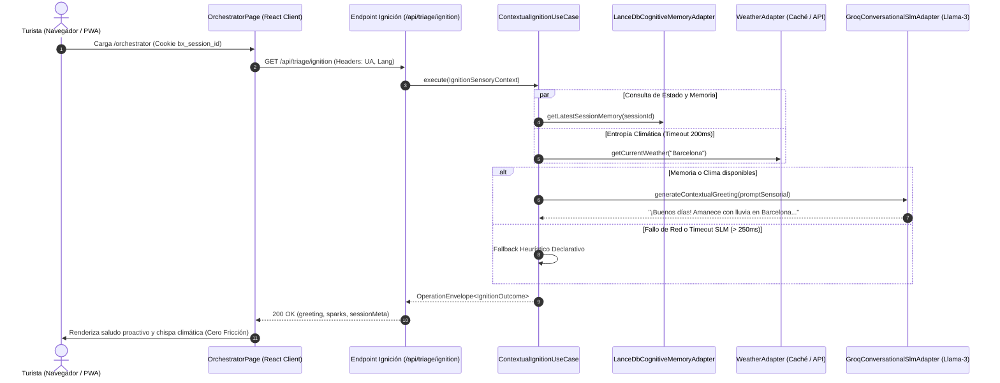

# [ARQUITECTURA] Historia de Usuario 7.1 (Refinada): Ignición Contextual y Saludo Dinámico (Aduana Universal)

**Estatus:** Realizado (S+ Grade)  
**Fecha de Revisión:** 2026-09-26  
**Fecha de Culminación:** 2026-09-26  
**Autor:** Vértice Biológico (Racso) & Antigravity IDE  
**Módulo:** Aduana Universal (`src/features/triage/`), Memoria Cognitiva (`src/features/cognitive-memory/`) y Orquestador UI (`src/app/orchestrator/`)  


---

## 🧭 Matriz de Indexación Tridimensional

- **Naturaleza:** Orquestación SLM Rápido, Percepción Sensorial Contextual, RAG Vectorial Embebido (LanceDB) y Resiliencia Perimetral (Fail-Soft).
- **Entorno:** Next.js App Router (Node.js Runtime soberano en Server Components / Route Handlers), Groq Llama-3 / Jev AI (`IConversationalSLMPort`), LanceDB (`DenseSemanticMatrix`).
- **Entropía Asimilada:**
  - Erradicación del "síndrome de la caja vacía" (`[ SISTEMA EN ESPERA DE INPUT TÁCTICO ]`) y de la fricción cognitiva inicial del turista.
  - **Corrección de Alucinación Arquitectónica Previa:** Reubicación de la ignición fuera de `middleware.ts`. El Edge Runtime de Next.js es incompatible con los binarios nativos C++/Rust de LanceDB y añadiría latencia crítica al TTFB global. La ignición se forja estrictamente en Node.js Runtime (`/api/triage/ignition` o Server Component en `/orchestrator`).
  - **Blindaje Térmico:** Eliminación de dependencias duras con APIs externas. Si el sondeo climático o el SLM superan el umbral térmico (timeout de 200 ms), el sistema conmuta instantáneamente a un saludo heurístico canónico determinista (< 10 ms).

---

## ⚡ Alineación con los Cinco Axiomas de Forja S+ Grade

1. **Axioma I — Localidad de Comportamiento (Vertical Slicing):**
   - El caso de uso de ignición se forja dentro de `src/features/triage/` (`contextual-ignition.use-case.ts`).
   - Los tests unitarios residen en el mismo directorio (`contextual-ignition.use-case.test.ts`), prohibiendo árboles espejo.

2. **Axioma II — Tolerancia Cero a la Inferencia (Fronteras Deterministas):**
   - La telemetría sensorial (cabeceras HTTP, hora, clima, memoria) se procesa mediante un esquema estricto de **Zod** (`IgnitionSensoryContextSchema`). Prohibido el uso de `any`, `as any` o aserciones de no-nulidad (`!`).
   - El resultado de la ignición se encapsula en el Value Object inmutable `IgnitionOutcome`.

3. **Axioma III — Diseño Declarativo sobre Lógica Imperativa:**
   - La clasificación horaria (`DAWN`, `MORNING`, `AFTERNOON`, `NIGHT`, `LATE_NIGHT`) y de dispositivo (`MOBILE`, `DESKTOP`, `TABLET`) se estructura en matrices declarativas de mapeo, evitando árboles de `if/else` anidados.
   - La política de fallback heurístico es determinista y no estocástica.

4. **Axioma IV — El Peaje del Oráculo (Aduana de Fricción):**
   - Todo cambio debe satisfacer en verde la Santa Trinidad: compilador TypeScript (`tsc --noEmit`), linter AST (`eslint`) y suite de tests unitarios (`vitest run`).
   - Los escenarios BDD deben ser reproducibles con mocks deterministas de tiempo, clima y memoria LanceDB.

5. **Axioma V — Ejecución Encapsulada y Pure DI:**
   - Inyección pura de dependencias por constructor: `IConversationalSLMPort`, `ICognitiveMemoryPort`, `DensityMatrixRepositoryPort`, `IWeatherPort`, `TelemetryRepositoryPort`.
   - La comunicación inter-cápsula retorna un sobre tipado `OperationEnvelope<IgnitionOutcome>`.

---

## 1. Descripción General

**Como** turista o usuario que accede al orquestador de BarcelonaXplorer,  
**Quiero** ser recibido de forma proactiva por un saludo contextual dinámico, forjado en tiempo real a partir de mi entorno sensorial (hora local de Barcelona, clima actual, dispositivo) y de mi memoria vectorial previa (si existe sesión activa),  
**Para** experimentar un diálogo táctico inteligente desde el primer instante (segundo cero), eliminando la incomodidad de enfrentarme a una pantalla en blanco o a un formulario frío.

---

## 2. Justificación Arquitectónica y Corrección de Desactualizaciones

### 2.1. El Despertar del Conserje vs. Incompatibilidad de Runtime
En versiones preliminares desactualizadas se planteó interceptar la petición y consultar LanceDB desde `middleware.ts`. Dicha premisa incurre en una **incoherencia técnica de runtime**:
1. **Edge Runtime Incompatibility:** `middleware.ts` en Next.js corre bajo Edge Runtime (V8 isolates), donde las librerías nativas con extensiones C++/Rust como LanceDB (`@lancedb/lancedb` y Apache Arrow) **no pueden ejecutarse**.
2. **TTFB Degradation:** Intercalar peticiones de red a APIs meteorológicas y al SLM dentro de `middleware.ts` penalizaría cada asset y navegación perimetral del sistema.
3. **Topología Canónica:** `middleware.ts` se mantiene exclusivamente como centinela de seguridad perimetral (`/Admin`, HSTS, HTTPS). La captura sensorial de la ignición se ejecuta en el **Node.js Runtime** de la aplicación, ya sea en el Server Component de `src/app/orchestrator/page.tsx` o en un endpoint dedicado de la Aduana (`GET /api/triage/ignition`), donde residen de forma segura los adaptadores de LanceDB y Groq.

### 2.2. Presupuesto Térmico y Fail-Soft Determinista
El conserje digital debe responder en **< 350 ms**. Para lograrlo:
- La consulta a la memoria previa en LanceDB se realiza mediante `getLatestSessionMemory(sessionId, 'default')`.
- El puerto meteorológico (`IWeatherPort`) opera con un timeout perimetral estricto de **200 ms** y una caché en memoria TTL de 10 minutos para evitar saturar servicios externos.
- Si el SLM (`GroqConversationalSlmAdapter`) o el clima fallan o agotan su presupuesto térmico, se activa la **Degradación Elegante (Fallback Heurístico)**: un motor declarativo que genera un saludo canónico impecable según la franja horaria y el dispositivo sin degradar la UI.

---

## 3. Coreografía de la Ignición Contextual



---

## 4. Contratos Técnicos y Esquemas de Frontera (Zod)

### 4.1. Esquema de Entrada Sensorial (`IgnitionSensoryContext`)
```typescript
import { z } from 'zod';

export const DeviceTypeEnum = z.enum(['MOBILE', 'DESKTOP', 'TABLET']);
export type DeviceType = z.infer<typeof DeviceTypeEnum>;

export const TimeWindowPeriodEnum = z.enum([
  'DAWN',        // 00:00 - 06:00 (Planificación tardía / Madrugada)
  'MORNING',     // 06:00 - 13:00 (Exploración matinal)
  'AFTERNOON',   // 13:00 - 20:00 (Tarde / Sobremesa)
  'NIGHT',       // 20:00 - 23:59 (Ocio nocturno / Cenas)
]);
export type TimeWindowPeriod = z.infer<typeof TimeWindowPeriodEnum>;

export const IgnitionSensoryContextSchema = z.object({
  sessionId: z.string().uuid(),
  device: DeviceTypeEnum,
  language: z.string().min(2).max(10).default('es'),
  clientTimestamp: z.number().int().positive(),
  serverTimestamp: z.number().int().positive(),
  detectedHour: z.number().int().min(0).max(23),
  period: TimeWindowPeriodEnum,
  weatherSummary: z.string().optional(),
  temperatureCelsius: z.number().optional(),
  priorMemoryExcerpt: z.string().optional(),
});

export type IgnitionSensoryContextDto = z.infer<typeof IgnitionSensoryContextSchema>;
```

### 4.2. Sobre de Retorno Tipado (`IgnitionOutcome`)
```typescript
export interface IgnitionSpark {
  id: string;
  type: 'weather' | 'logistics' | 'system';
  insight: string;
}

export interface IgnitionOutcome {
  greeting: string;
  isFallback: boolean;
  period: TimeWindowPeriod;
  device: DeviceType;
  sparks: IgnitionSpark[];
  contextSummary: string;
}
```

### 4.3. Extensión del Puerto SLM (`IConversationalSLMPort`)
```typescript
export interface IConversationalSLMPort {
  // Métodos preexistentes: generateBounceMessage, generateRepromptMessage, generateEmpatheticDialogue...
  
  /**
   * Genera un saludo dinámico proactivo de máximo 2 oraciones adaptado
   * a la telemetría del usuario y su memoria previa (< 250 ms).
   */
  generateContextualGreeting(
    sensoryContext: IgnitionSensoryContextDto,
  ): Promise<string>;
}
```

---

## 5. Criterios de Aceptación (Verificación Empírica BDD)

### Escenario 1: Ignición Virgen en Franja Matutina con Lluvia (Fricción Cero)
- **Dado** un turista nuevo que accede desde su móvil a las 09:30 AM en un día de lluvia en Barcelona.
- **Y** no existe rastro vectorial previo en LanceDB para su `bx_session_id`.
- **Cuando** el cliente orquestador ejecuta la ignición contextual (`GET /api/triage/ignition`).
- **Entonces** el orquestador consulta la telemetría sensorial y la API meteorológica.
- **Y** el SLM genera un mensaje contextual:
  > *"¡Buenos días! Parece que Barcelona ha amanecido con lluvia. ¿Buscamos refugio en museos y joyas arquitectónicas cubiertas o tienes planes de interior para hoy?"*
- **Y** la interfaz en `src/app/orchestrator/page.tsx` monta este mensaje como el primer bloque del agente (`OrchestratorBlock role="ai"`), sustituyendo el letrero estático de espera.

### Escenario 2: Retorno de Sesión con Rastro en LanceDB (Continuidad Táctica)
- **Dado** un usuario que en una sesión previa estuvo consultando "restaurantes de tapas en el Born" (almacenado en `DenseSemanticMatrix` dentro de LanceDB).
- **Y** vuelve a conectarse hoy a las 20:15 desde un navegador de escritorio con la misma cookie `bx_session_id`.
- **Cuando** se dispara la ignición contextual.
- **Entonces** `LanceDbCognitiveMemoryAdapter` recupera el rastro semántico de la sesión.
- **Y** el SLM sintetiza el saludo reconociendo la memoria previa:
  > *"Buenas noches de nuevo. Ayer dejamos pendientes los locales de tapas por el Born. ¿Retomamos la ruta gastronómica o prefieres explorar otro plan para esta noche?"*

### Escenario 3: Acceso Intempestivo de Madrugada (Inferencia de Planificación)
- **Dado** un usuario nuevo accediendo a las 02:30 AM desde un ordenador de escritorio (`DESKTOP`).
- **Cuando** la matriz sensorial evalúa la disparidad entre la hora intempestiva (`LATE_NIGHT`) y el dispositivo.
- **Entonces** el SLM adopta un tono táctico de preparación anticipada:
  > *"Planificando a deshoras, ¿eh? Dejemos tu ruta por Barcelona lista esta noche para que mañana solo tengas que disfrutar. ¿De cuántos días dispones?"*

### Escenario 4: Degradación Elegante ante Caída de Terceros (Fail-Soft Determinista)
- **Dado** un escenario donde el proveedor meteorológico no responde (timeout > 200 ms) o la API de Groq devuelve un error de cuota/rate limit.
- **Cuando** se ejecuta `ContextualIgnitionUseCase`.
- **Entonces** el sistema captura la excepción de forma silenciosa sin propagar un HTTP 500 al cliente.
- **Y** activa el catálogo declarativo de fallbacks deterministas según la franja horaria:
  > *"¡Hola! Bienvenido a BarcelonaXplorer. Cuéntame qué te apetece hacer hoy en la ciudad y forjaremos tu ruta táctica a medida."*
- **Y** el campo `isFallback` del sobre tipado retorna `true`.

### Escenario 5: Blindaje de Compatibilidad de Runtime (Aislamiento Node.js vs Edge)
- **Dado** el archivo de seguridad perimetral `src/middleware.ts`.
- **Cuando** se compila y empaqueta la aplicación (`npm run build`).
- **Entonces** se verifica que `middleware.ts` no contiene importaciones de `@lancedb/lancedb`, `@google/genai`, `groq-sdk` ni lógica de ignición.
- **Y** la totalidad de la lógica de ignición contextual se ejecuta en rutas configuradas explícitamente con `export const runtime = 'nodejs'`.
