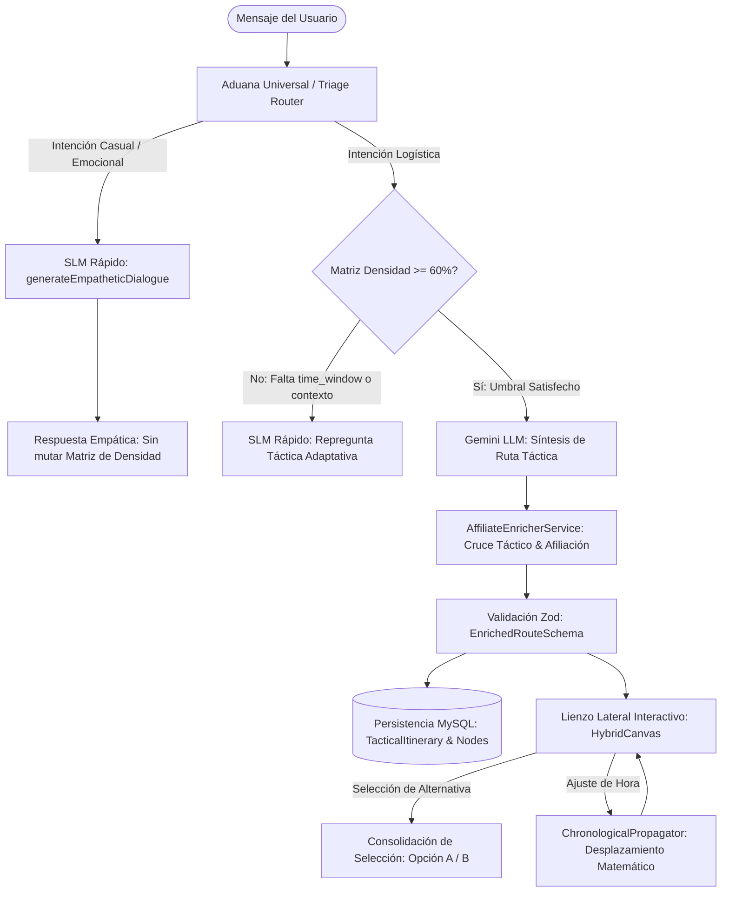

# [ARQUITECTURA] Historia de Usuario: Lienzo de Orquestación Híbrida y Triaje Semántico (S+ Grade)

**Estatus:** Refinado / Alineado con Implementación Canónica  
**Fecha de Revisión:** 2026-10-03  
**Autor:** Operador Técnico / Arquitectura BarcelonaXplorer  
**PBI Asociado:** Lote [PBI-ARCH-ORCH-001 (Realizado)](file:///home/racso/Proyectos/BarcelonaXplorer/Documentacion/PBI/Realizado/PBI%20-%20Orquestaci%C3%B3n%20H%C3%ADbrida%20y%20Triaje%20Sem%C3%A1ntico%20con%20Persistencia%20MySQL.md), descompuesto en cortes `002`–`008` (certificados). Trazabilidad en la sección 5.  
**Módulos del Sistema:** `src/features/triage/`, `src/features/planner/`, `src/features/ai-engine/`, `src/components/tactical/`, `src/prisma/`

---

### Matriz de Indexación Tridimensional (Protocolo de Acero)

- **Naturaleza:** Orquestación híbrida multi-modelo (SLM para triaje/empatía y LLM para síntesis de ruta), aduana termodinámica de densidad de variables (umbral 60%), enriquecimiento determinista de afiliados/seguridad urbana y lienzo lateral interactivo con recálculo cronológico matemático.
- **Entorno:** Next.js 16 (React Server & Client Components), Prisma ORM / MySQL 8.0, Groq SLM (Aduana Universal), Gemini LLM (Orquestador Pesado) y esquemas Zod en frontera.
- **Entropía Asimilada (Filtros A, B y C):**
  - *Filtro A (Rigor Epistémico & Cero Alucinación):* Erradicación de interrogatorios impertinentes. Si el usuario emite comentarios informales, emocionales o de estado físico ("Uf, estoy agotado"), el sistema enruta a `CASUAL_DIALOGUE` y responde con empatía táctica sin penalizar ni exigir atributos de viaje. Se clarifica que la Matriz de Densidad evalúa `time_window`, `group_size`, `vibe` y `constraints` (no presupuesto).
  - *Filtro B (Determinismo & Soberanía del Dato):* El cruce de alternativas (Opción A: Principal con afiliación / Opción B: Alternativa local y auténtica) se genera bajo contrato estricto Zod (`EnrichedRouteSchema`) y base de conocimiento táctico local, evitando dependencia de APIs externas frágiles en tiempo de renderizado. Los desplazamientos horarios se resuelven mediante el oráculo matemático inmutable `ChronologicalPropagator`.
  - *Filtro C (Eficiencia Operativa & Desacople):* Separación visual y funcional estricta entre el hilo dialógico de chat (a la izquierda) y el lienzo interactivo de parcelas temporales (a la derecha). Persistencia relacional en MySQL de las elecciones del viajero (`TacticalItinerary` y `TacticalItineraryNode`).

---

## 1. Descripción General (INVEST)

**Como** turista y explorador en BarcelonaXplorer,  
**Quiero** mantener una conversación natural y fluida con un asistente inteligente que distinga orgánicamente cuándo mantengo una charla casual y cuándo estoy planificando mi viaje, desplegando un panel lateral interactivo cuando la información logística alcance el umbral crítico, donde pueda comparar alternativas y ajustar horarios atómicamente,  
**Para** diseñar mi itinerario sin fricciones ni interrogatorios robóticos, acceder a recomendaciones locales verificadas con enlaces de afiliación y conservar la soberanía total sobre mi tiempo mediante un lienzo táctico sincronizado.

---

## 2. Componentes Arquitectónicos y Contratos de Forja

### 2.1. Aduana de Triaje y Enrutamiento Semántico (`src/features/triage/`)
- Intercepta el input del usuario y clasifica la intención entre interacción casual (`CASUAL_DIALOGUE`) o planificación logística (`LOGISTIC_EXTRACTION`).
- En intención casual, no muta la Matriz de Densidad ni eleva el estado a error, retornando un `TriageOutcome` con diálogo empático generado por el SLM.

### 2.2. Peaje Termodinámico de la Matriz de Densidad (`src/features/planner/matrix.ts`)
- Evalúa el peso relativo de las variables logísticas capturadas:
  - `time_window` (60 puntos)
  - `group_size` (15 puntos)
  - `vibe` (15 puntos)
  - `constraints` (10 puntos)
- Requiere un `survival_threshold` de **60 puntos** para autorizar la ignición del modelo pesado. Si el score es inferior, emite una repregunta contextual (`INCOMPLETE_REPROMPT`) focalizada en la variable faltante de mayor peso.

### 2.3. Enriquecimiento Táctico y Afiliación (`src/features/planner/affiliate/`)
- El LLM genera la estructura troncal de la ruta (`TacticalRoute`).
- El servicio determinista `AffiliateEnricherService` inyecta las opciones comparativas por franja horaria (Opción Principal vs. Alternativa Local de Escudo Anti-Trampas), categoriza la actividad (`GASTRONOMY`, `CULTURE`, etc.) y genera las URLs profundas de afiliación (TheFork y Civitatis), blindado por `EnrichedRouteSchema`.

### 2.4. Lienzo Lateral Interactivo y Propagación Cronológica (`src/components/tactical/hybrid-canvas.tsx`)
- Renderiza el itinerario en un panel lateral desacoplado del chat.
- Permite la conmutación atómica entre la opción principal y la alternativa local.
- Ante modificaciones manuales de la hora de un nodo, invoca el oráculo `ChronologicalPropagator.propagate(...)` recalculando en cascada las horas de inicio y fin de los nodos subsiguientes, preservando un colchón de transición mínimo de 15 minutos sin consultar al LLM.

### 2.5. Persistencia Relacional MySQL (`src/prisma/schema.prisma`)
- Modelado mediante `TacticalItinerary` y `TacticalItineraryNode`.
- Garantiza el alta de la ruta generada vinculada al `sessionId`, su lectura posterior (`getItineraryBySessionId`) y la escritura de vuelta de la opción elegida y horario editado en el lienzo ([PBI-ARCH-ORCH-008](file:///home/racso/Proyectos/BarcelonaXplorer/Documentacion/PBI/Realizado/PBI%20-%20Escritura%20de%20Vuelta%20de%20Selecci%C3%B3n%20y%20Horario%20del%20Lienzo%20%28PBI-ARCH-ORCH-008%29.md)).

---

## 3. Criterios de Aceptación (Verificación Empírica)

### Escenario 1: Enrutamiento Semántico y Empatía Táctica (Aduana Universal)
- **Dado** un usuario interactuando con la interfaz conversacional,
- **Cuando** el usuario introduce un mensaje emocional, coloquial o de estado psicofísico (ej. *"Uf, estoy agotado del viaje, qué calor hace"*),
- **Entonces** el router de triaje clasifica la intención como `CASUAL_DIALOGUE`,
- **Y** se suspende la exigencia de la Matriz de Densidad, delegando en el SLM ligero la generación de una respuesta empática y acogedora,
- **Y** no se interroga ni se fuerza al usuario hacia la configuración logística de la ruta.

### Escenario 2: Salto del Peaje Termodinámico (Umbral 60%)
- **Dado** un diálogo orientado a la exploración de Barcelona,
- **Cuando** las variables logísticas extraídas alcanzan o superan el umbral del 60% en la Matriz de Densidad (especialmente al aportar el marco temporal `time_window` o la combinación de grupo, vibra y restricciones),
- **Entonces** el sistema concluye la fase de repreguntas y dispara la ignición del LLM pesado para generar el itinerario táctico estructurado,
- **Y** en caso de no alcanzar el umbral, genera una repregunta contextual orientada a la variable faltante con mayor ponderación.

### Escenario 3: Enriquecimiento Determinista y Despliegue en el Lienzo Lateral
- **Dado** el itinerario estructurado (`TacticalRoute`) devuelto por el LLM pesado,
- **Cuando** el backend procesa la ruta a través del `AffiliateEnricherService`,
- **Entonces** cada nodo temporal se enriquece con:
  1. Dos opciones comparativas (Opción Principal y Alternativa Local con Escudo Anti-Trampas y alertas de carteristas).
  2. Proveedor y enlaces de afiliación deterministas (TheFork para restauración, Civitatis para cultura/tours).
- **Y** el resultado es validado contra `EnrichedRouteSchema` (Zod), persistido en MySQL y desplegado en el panel lateral interactivo (`HybridCanvas`), conservando el histórico de chat independiente en el panel principal.

### Escenario 4: Consolidación por Selección (Filtro Biológico de Opciones)
- **Dado** el lienzo interactivo desplegado con las parcelas horarias del itinerario,
- **Cuando** el viajero examina las alternativas presentadas para un bloque (ej. Selección Principal vs. Alternativa Auténtica de Barrio),
- **Entonces** puede alternar su preferencia con un solo clic, dejando una sola opción con `isSelected` en el estado del lienzo,
- **Y** el sistema actualiza la selección en memoria y persiste asíncronamente la opción elegida en MySQL ([PBI-ARCH-ORCH-008](file:///home/racso/Proyectos/BarcelonaXplorer/Documentacion/PBI/Realizado/PBI%20-%20Escritura%20de%20Vuelta%20de%20Selecci%C3%B3n%20y%20Horario%20del%20Lienzo%20%28PBI-ARCH-ORCH-008%29.md)), actualizando `options`, `affiliateProvider` y `affiliateUrl` en `TacticalItineraryNode` bajo fail-soft.

### Escenario 5: Refinamiento Temporal Determinista (Propagación Cronológica)
- **Dado** un nodo del itinerario en el lienzo lateral con una franja horaria definida (ej. comida de 14:00 a 15:30),
- **Cuando** el usuario modifica directamente la hora de inicio o fin desde la interfaz (ej. retrasar el almuerzo a las 15:00),
- **Entonces** el motor matemático `ChronologicalPropagator` recalcula en cascada y sin invocar al LLM los horarios de todas las actividades posteriores,
- **Y** preserva un intervalo mínimo de 15 minutos entre nodos sucesivos, ajustando el tope máximo a las 23:59,
- **Y** el horario resultante se despliega de inmediato en el lienzo y se persiste en MySQL para el nodo modificado y todos los nodos desplazados ([PBI-ARCH-ORCH-008](file:///home/racso/Proyectos/BarcelonaXplorer/Documentacion/PBI/Realizado/PBI%20-%20Escritura%20de%20Vuelta%20de%20Selecci%C3%B3n%20y%20Horario%20del%20Lienzo%20%28PBI-ARCH-ORCH-008%29.md)), preservando la resiliencia en pantalla ante fallos de red o base de datos.

---

## 4. Matriz de Clarificaciones y Corrección de Alucinaciones

| Sección Original | Texto Original / Inexactitud | Realidad Técnica Certificada en Código | Corrección Aplicada |
| :--- | :--- | :--- | :--- |
| **Matriz de Densidad** | *"atributos esenciales (tiempo, presupuesto, preferencias)"* | `DefaultDensityPayloadSchema` no incluye `presupuesto`. Pondera `time_window: 60`, `group_size: 15`, `vibe: 15` y `constraints: 10`. | Purgado `presupuesto`. Se documentan las variables reales y sus pesos exactos. |
| **Opciones del LLM** | *"JSON devuelto por el LLM con múltiples opciones por cada franja horaria"* | El LLM retorna una ruta lineal determinista (`TacticalRoute`). Las 2 opciones las construye `AffiliateEnricherService`. | Clarificado el desacople: LLM sintetiza la ruta base; el servicio enriquece las opciones A/B. |
| **APIs Externas** | *"cruza de forma asíncrona con las APIs de proveedores (TheFork, Civitatis)"* | No existen llamadas bloqueantes a APIs externas en runtime. Se generan URLs canónicas de afiliación con base de conocimiento local. | Reemplazado por enriquecimiento determinista local con esquemas Zod. |
| **Propagación Horaria** | *"el orquestador recibe un prompt de parche para buscar nuevas opciones... alteración horaria aprobada"* | La propagación de horarios es puramente matemática mediante `ChronologicalPropagator` (algoritmo en TypeScript), sin coste de LLM. | Separado el ajuste cronológico matemático de las peticiones semánticas de reemplazo. |
| **Estructura Documental** | Texto en un único párrafo plano sin encabezados, tablas ni metadatos. | Incumplimiento del estándar de documentación S+ Grade y trazabilidad INVEST. | Reestructurado a Markdown S+ Grade con trazabilidad, diagramas Mermaid y criterios Gherkin claros. |
| **PBI único** | `PBI-ARCH-ORCH-001` mezcla triaje, peaje, afiliados, lienzo, cronología y MySQL, y describe llamadas asíncronas a TheFork y Civitatis. | El código separa esas capacidades. Las URLs salen de conocimiento local. | Lote conservado como acta. Cortes `002`–`008` certificados, incluyendo la escritura de vuelta con correlación de CUIDs en `008`. |
| **Selección en MySQL** | El escenario 4 exigía `isSelected: true` en la columna del nodo al hacer clic. | En el alta, la columna nace a `true`. La opción vigente del par A/B vive en el JSON `options`. | Certificado en `PBI-ARCH-ORCH-008`: la selección actualiza el JSON `options`, `affiliateProvider` y `affiliateUrl` de la fila. |

---

## 5. Trazabilidad de PBIs

El lote `PBI-ARCH-ORCH-001` (5 SP, certificado el 2026-09-26) sigue siendo el acta de forja. Cada capacidad de esta historia tiene un corte con frontera propia. Los cortes `002`–`008` están plenamente certificados bajo la Santa Trinidad de Oráculos.

| Corte | Cubre | Estatus |
| :--- | :--- | :--- |
| [PBI-ARCH-ORCH-002](file:///home/racso/Proyectos/BarcelonaXplorer/Documentacion/PBI/Realizado/PBI%20-%20Aduana%20Sem%C3%A1ntica%20y%20Di%C3%A1logo%20Emp%C3%A1tico%20%28PBI-ARCH-ORCH-002%29.md) | Escenario 1. `CASUAL_DIALOGUE` sin mutar la matriz. | Certificado en el lote |
| [PBI-ARCH-ORCH-003](file:///home/racso/Proyectos/BarcelonaXplorer/Documentacion/PBI/Realizado/PBI%20-%20Peaje%20Termodin%C3%A1mico%20de%20la%20Matriz%20de%20Densidad%20%28PBI-ARCH-ORCH-003%29.md) | Escenario 2. Matriz `default`: 60 / 15 / 15 / 10, umbral 60, `INCOMPLETE_REPROMPT`. | Certificado en el lote |
| [PBI-ARCH-ORCH-004](file:///home/racso/Proyectos/BarcelonaXplorer/Documentacion/PBI/Realizado/PBI%20-%20Enriquecimiento%20Determinista%20de%20Ruta%20y%20Contrato%20Zod%20%28PBI-ARCH-ORCH-004%29.md) | Escenario 3, servicio. Ruta lineal del LLM, opciones A/B y URLs locales, `EnrichedRouteSchema`. | Certificado en el lote |
| [PBI-ARCH-ORCH-005](file:///home/racso/Proyectos/BarcelonaXplorer/Documentacion/PBI/Realizado/PBI%20-%20Lienzo%20Lateral%20y%20Selecci%C3%B3n%20en%20Memoria%20%28PBI-ARCH-ORCH-005%29.md) | Escenario 3, lienzo, y escenario 4 en memoria. | Certificado en el lote |
| [PBI-ARCH-ORCH-006](file:///home/racso/Proyectos/BarcelonaXplorer/Documentacion/PBI/Realizado/PBI%20-%20Propagaci%C3%B3n%20Cronol%C3%B3gica%20Determinista%20%28PBI-ARCH-ORCH-006%29.md) | Escenario 5. Colchón de 15 minutos, tope 23:59, sin LLM. | Certificado en el lote |
| [PBI-ARCH-ORCH-007](file:///home/racso/Proyectos/BarcelonaXplorer/Documentacion/PBI/Realizado/PBI%20-%20Alta%20Relacional%20del%20Itinerario%20Generado%20%28PBI-ARCH-ORCH-007%29.md) | Escenario 3, alta. `saveItinerary` con fail-soft. El DTO persistido no vuelve al lienzo. | Certificado en el lote |
| [PBI-ARCH-ORCH-008](file:///home/racso/Proyectos/BarcelonaXplorer/Documentacion/PBI/Realizado/PBI%20-%20Escritura%20de%20Vuelta%20de%20Selecci%C3%B3n%20y%20Horario%20del%20Lienzo%20%28PBI-ARCH-ORCH-008%29.md) | Escenario 4 en MySQL y persistencia del horario propagado. Correlación de CUIDs entre el alta y el lienzo. | Certificado |

Streaming SSE, i18n del lienzo, matriz `gastronomy`, escudo de supervivencia y circuit breaker de afiliados pertenecen a otras historias y no reabren estos cortes.
