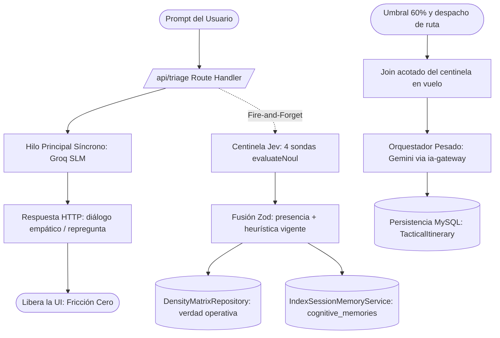

# [ARQUITECTURA] Historia de Usuario: Triaje Paramétrico Asíncrono (Centinela Jev) y Fricción Cero (S+ Grade)

**Estatus:** Completado / Certificado S+ Grade
**Fecha de Revisión y Culminación:** 2026-10-03
**Autor:** Operador Técnico / Arquitectura BarcelonaXplorer
**Historia Antecesora:** [Lienzo de Orquestación Híbrida y Triaje Semántico](file:///home/racso/Proyectos/BarcelonaXplorer/Documentacion/HistoriasDeUsuario_Historico/%5BARQUITECTURA%5D%20Historia%20de%20Usuario:%20Lienzo%20de%20Orquestaci%C3%B3n%20H%C3%ADbrida%20y%20Triaje%20Sem%C3%A1ntico.md)
**Módulos del Sistema:** `src/features/triage/`, `src/features/planner/`, `src/features/ai-engine/`, `src/features/cognitive-memory/`, `src/app/api/triage/`

---

### Matriz de Indexación Tridimensional (Protocolo de Acero)

- **Naturaleza:** Arquitectura Orientada a Eventos (EDA) a escala de petición, extracción paramétrica desacoplada y optimización de latencia percibida (*Fricción Cero*).
- **Entorno:** Ecosistema BarcelonaXplorer sobre Next.js 16, LanceDB embebido (memoria cognitiva vectorial), Groq SLM (*System Two Ligero*, `GROQ_FAST_MODEL`), motor de decisión **Jev AI** (*System One*, vía microservicio `ia-gateway`) y Gemini LLM (*Orquestador Pesado*, `engineType: REASONING_LLM`).
- **Entropía Asimilada:** Consolidación de la bifurcación cognitiva. Se acepta un mayor peaje termodinámico (consumo paralelo de tokens) a cambio de blindar la latencia de la interfaz de usuario. **Jev** opera como un centinela asíncrono en segundo plano que ejecuta una digestión paramétrica determinista mientras el SLM sostiene la interacción conversacional orgánica en el hilo síncrono.

---

## 1. Descripción General (INVEST)

**Como** Operador Técnico y Desarrollador de BarcelonaXplorer,
**Quiero** bifurcar la ingestión del prompt del usuario en el Route Handler `POST /api/triage`: delegando la respuesta conversacional en tiempo real al Modelo Ligero (Groq SLM) y disparando de forma asíncrona al centinela **Jev** para que confirme la presencia de los parámetros logísticos de la Matriz de Densidad (`time_window`, `group_size`, `vibe`, `constraints`), fusionando esa sonda con la heurística determinista ya vigente,
**Para** garantizar una experiencia de **Fricción Cero** (latencia web mínima gobernada por el SLM), asegurando que cuando el usuario solicite el itinerario final, el Orquestador Pesado (Gemini) disponga de un contexto hiper-denso, destilado deterministamente y libre de alucinaciones.

---

## 2. Componentes Arquitectónicos y Contratos de Forja

### 2.1. Bifurcación Sensorial (Patrón Fire-and-Forget)
En el Route Handler `POST /api/triage` de Next.js, la llegada del prompt detona dos procesos:
- **Hilo Principal (Síncrono):** el prompt se envía al **Groq SLM** (`IConversationalSLMPort` → `GroqConversationalSlmAdapter`), que devuelve el diálogo empático o la repregunta táctica. Esta respuesta cierra la petición HTTP y libera la interfaz.
- **Hilo Secundario (Asíncrono):** mediante una promesa no bloqueante se inyecta el mismo prompt al centinela **Jev**, sin acoplar su latencia a la respuesta HTTP. Se reutiliza el mismo patrón ya aplicado a la telemetría.

### 2.2. El Centinela Paramétrico (Jurisdicción de Jev)
**Jev** (motor de decisión *System One*, puerto `ITypedDecisionEngine`, accedido vía `ia-gateway`) opera bajo **Ceguera Conversacional**: cada sonda es una pregunta cerrada, sin tono, sin saludo y sin texto libre.
- El contrato real de Jev es `evaluateNoul` (`probability`, `isAffirmative`). Jev no emite un JSON de valores libres.
- El centinela lanza en paralelo cuatro sondas `evaluateNoul`, una por variable canónica (`has_time_window`, `has_group_size`, `has_vibe`, `has_constraints`).
- Los valores crudos salen de la heurística determinista en `extractMatrixVariables`. La función pura `mergePresenceWithHeuristic` fusiona la sonda de presencia con esos valores y valida `DefaultDensityPayloadSchema`.

### 2.3. Asimilación Silenciosa
Cuando el centinela termina, no habla con el SLM.
- Escribe el payload fusionado en `DensityMatrixRepositoryPort`.
- Indexa la matriz densa en LanceDB, tabla **`cognitive_memories`**, mediante `IndexSessionMemoryService`, bajo el `bx_session_id`.
- La tabla `context_memory` permanece reservada para el corpus hiperlocal de fuentes de contexto.

### 2.4. Ignición del Orquestador Pesado (Ensamblaje Final)
El hilo de chat no espera al centinela. El despacho de ruta sí: cuando la sesión cruza el umbral del 60 %, el caso de uso hace un **join acotado** (1500 ms) del centinela en vuelo y solo entonces llama al **Orquestador Pesado** (Gemini vía `IaGatewayClient.generateTacticalRoute`, `engineType: REASONING_LLM`, `schemaId: 'tactical-route'`).
- La ruta se construye con el `DefaultDensityPayload` ya consolidado.

---

## 3. Criterios de Aceptación Certificados

### Escenario 1: Ejecución Asíncrona sin Bloqueo (Latencia UI)
- [x] **Dado** un usuario que envía un prompt denso detallando su viaje y preferencias,
- [x] **Cuando** el servidor Next.js recibe la petición en `POST /api/triage`,
- [x] **Entonces** el servidor responde al usuario basándose exclusivamente en el tiempo de procesamiento del **Groq SLM**,
- [x] **Y** la extracción a cargo de **Jev** se ejecuta en segundo plano (fire-and-forget) sin añadir latencia perceptible al cliente web.

### Escenario 2: Sonda Booleana y Fusión Silenciosa (Ceguera Conversacional)
- [x] **Dado** el procesamiento en paralelo del centinela Jev,
- [x] **Cuando** el centinela evalúa el texto *"Somos 4 amigos, solo tenemos 3 horas y queremos algo tranquilo sin escaleras"*,
- [x] **Entonces** Jev no conversa ni devuelve texto libre: responde cuatro `evaluateNoul` (`has_time_window`, `has_group_size`, `has_vibe`, `has_constraints`),
- [x] **Y** la fusión determinista conserva solo los valores que la heurística vigente ya sabe leer en ese texto y Zod valida el resultado contra `DefaultDensityPayloadSchema`,
- [x] **Y** el payload queda en el repositorio de densidad de la sesión y, después, en LanceDB (`cognitive_memories`) bajo el `bx_session_id`.

### Escenario 3: Consolidación Previa al Despacho de Ruta
- [x] **Dado** un usuario cuyas interacciones previas ya alimentaron al centinela y cuya matriz alcanza el umbral del 60 %,
- [x] **Cuando** el triaje va a invocar al Orquestador Pesado (Gemini),
- [x] **Entonces** espera, con un tiempo máximo acotado (1500 ms), a que termine el centinela en vuelo de esa sesión,
- [x] **Y** construye la ruta con el `DefaultDensityPayload` consolidado,
- [x] **Y** el generador de ruta no vuelve a inferir `time_window`, `group_size`, `vibe` ni `constraints`.

---

## 4. Contratos y Fronteras Deterministas

| Contrato | Artefacto Canónico | Rol |
| :--- | :--- | :--- |
| Entrada de triaje | `TriageInputSchema` (Zod) en `/api/triage` | Parseo de frontera del prompt |
| Matriz de Densidad | `DefaultDensityPayloadSchema` (`src/features/planner/matrix.ts`) | Variables logísticas y pesos (60/15/15/10) |
| Sonda de presencia | `evaluateNoul` × 4 + `DensityPresenceProbeSchema` | Jev confirma si cada variable canónica está presente |
| Payload logístico | `DefaultDensityPayloadSchema` tras `mergePresenceWithHeuristic` | Verdad que consume el peaje del 60 % |
| Memoria cognitiva | `IndexSessionMemoryService` → LanceDB `cognitive_memories` | Copia durable de la matriz densa por `bx_session_id` |
| Ruta táctica | `schemaId: 'tactical-route'` / `TacticalRouteZodSchema` | Salida del Orquestador Pesado (Gemini) |
| Sesión | `bx_session_id` (cookie HttpOnly, `session-perimeter.ts`) | Identidad de la sesión |

---

## 5. Trazabilidad de PBIs Realizados

| Corte | Cubre | Estatus |
| :--- | :--- | :--- |
| [PBI-ARCH-JEV-001](file:///home/racso/Proyectos/BarcelonaXplorer/Documentacion/PBI/Realizado/PBI%20-%20Acta%20del%20Centinela%20Jev%20y%20Fricci%C3%B3n%20Cero%20%28PBI-ARCH-JEV-001%29.md) | Acta del lote, fronteras y exclusiones. | 🟢 Completado |
| [PBI-ARCH-JEV-002](file:///home/racso/Proyectos/BarcelonaXplorer/Documentacion/PBI/Realizado/PBI%20-%20Contrato%20Zod%20de%20la%20Sonda%20de%20Presencia%20Log%C3%ADstica%20%28PBI-ARCH-JEV-002%29.md) | Esquema Zod de las cuatro banderas de presencia. | 🟢 Completado |
| [PBI-ARCH-JEV-003](file:///home/racso/Proyectos/BarcelonaXplorer/Documentacion/PBI/Realizado/PBI%20-%20Centinela%20de%20Presencia%20Jev%20en%20Paralelo%20%28PBI-ARCH-JEV-003%29.md) | Escenario 2, sonda. Cuatro `evaluateNoul` en paralelo, sin texto libre. | 🟢 Completado |
| [PBI-ARCH-JEV-004](file:///home/racso/Proyectos/BarcelonaXplorer/Documentacion/PBI/Realizado/PBI%20-%20Fusi%C3%B3n%20Determinista%20de%20Presencia%20y%20Heur%C3%ADstica%20%28PBI-ARCH-JEV-004%29.md) | Escenario 2, fusión. Heurística vigente + sonda → `DefaultDensityPayload`. | 🟢 Completado |
| [PBI-ARCH-JEV-005](file:///home/racso/Proyectos/BarcelonaXplorer/Documentacion/PBI/Realizado/PBI%20-%20Bifurcaci%C3%B3n%20Fire-and-Forget%20del%20Triaje%20%28PBI-ARCH-JEV-005%29.md) | Escenario 1. El chat responde con el SLM; el centinela persiste en segundo plano. | 🟢 Completado |
| [PBI-ARCH-JEV-006](file:///home/racso/Proyectos/BarcelonaXplorer/Documentacion/PBI/Realizado/PBI%20-%20Consolidaci%C3%B3n%20de%20la%20Matriz%20antes%20del%20Despacho%20%28PBI-ARCH-JEV-006%29.md) | Escenario 3. Join acotado y ruta construida con el payload consolidado. | 🟢 Completado |

---

## 6. Evidencia de Certificación de la Santa Trinidad de Oráculos

| Oráculo | Comando de Ejecución | Resultado Determinista | Estado |
| :--- | :--- | :--- | :--- |
| **Compilador TypeScript** | `npx tsc --noEmit` | **0 errores** de tipos | 🟢 Aprobado |
| **Linter AST** | `npm run lint` | **0 errores, 0 advertencias** | 🟢 Aprobado |
| **Suite Completa del Workspace** | `npm test` | **662/662 tests pasados (100%)** en 117 suites | 🟢 Aprobado |
