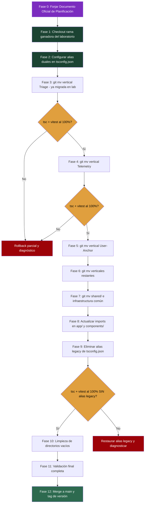
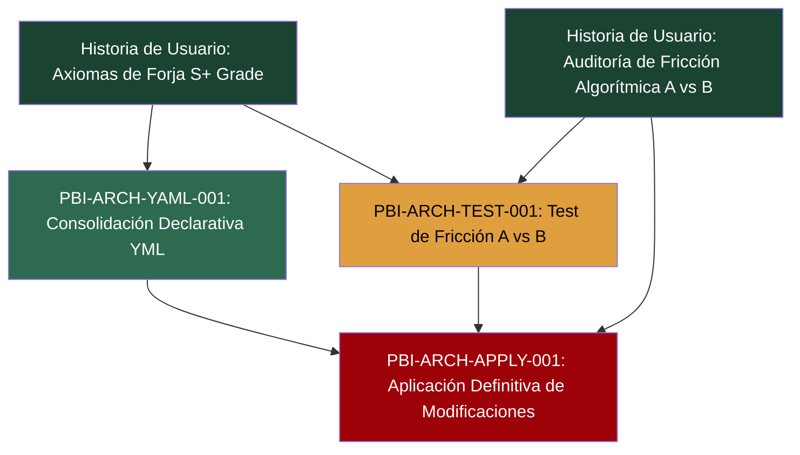

# [ARQUITECTURA] Documento Destilado: PBI - Aplicación Definitiva de Modificaciones Arquitectónicas Post-Veredicto

**Identificador:** PBI-ARCH-APPLY-001  
**Estatus:** Pendiente de Forja (Bloqueado por PBI-ARCH-TEST-001 y PBI-ARCH-YAML-001)  
**Fecha de Creación:** 2026-09-25  
**Historia de Usuario Relacionada:** [Anexo Constitucional: Axiomas de Forja S+ Grade (Optimización para IA)](file:///home/racso/Proyectos/BarcelonaXplorer/Documentacion/HistoriasDeUsuario/%5BARQUITECTURA%5D%20Anexo%20Constitucional:%20Axiomas%20de%20Forja%20S+%20Grade%20%28Optimizaci%C3%B3n%20para%20IA%29.md) · [Auditoría de Fricción Algorítmica (Evaluación Arquitectónica A vs B)](file:///home/racso/Proyectos/BarcelonaXplorer/Documentacion/HistoriasDeUsuario/Historia%20de%20Usuario:%20Auditor%C3%ADa%20de%20Fricci%C3%B3n%20Algor%C3%ADtmica%20%28Evaluaci%C3%B3n%20Arquitect%C3%B3nica%20A%20vs%20B%29.md)  
**Módulo:** Refactorización Estructural del Código Fuente Completo  
**Entorno:** Next.js 16 (App Router), TypeScript 5, Vitest 4, Zod, Prisma, LanceDB, Docker Compose v2, Ansible/Ansistrano  
**Prioridad:** Crítica (P0 - Ejecución Fundacional post-veredicto que condiciona toda la deuda técnica futura)  
**Estimación Táctica:** 8 Story Points  
**Dependencia Secuencial:** ⛔ Este PBI no puede iniciarse hasta que **PBI-ARCH-TEST-001** (Test A/B) y **PBI-ARCH-YAML-001** (Consolidación YML) estén certificados.

---

### Matriz de Indexación Tridimensional (Protocolo de Acero)

- **Naturaleza:** Aplicación definitiva e irreversible de todas las modificaciones arquitectónicas decididas como resultado del test A/B (PBI-ARCH-TEST-001) y la consolidación de formato YAML (PBI-ARCH-YAML-001), transmutando el ecosistema completo de BarcelonaXplorer a la topología ganadora. La ejecución está **supeditada a un Documento Oficial de Planificación** y se ejecuta **sobre las ramas de laboratorio** del test A/B, no desde cero.
- **Entorno:** Código fuente completo en [`src/`](file:///home/racso/Proyectos/BarcelonaXplorer/src) — actualmente organizado en: [`domain/`](file:///home/racso/Proyectos/BarcelonaXplorer/src/domain) (entidades, schemas, value-objects, exceptions), [`application/`](file:///home/racso/Proyectos/BarcelonaXplorer/src/application) (ports, use-cases), [`infrastructure/`](file:///home/racso/Proyectos/BarcelonaXplorer/src/infrastructure) (ai, gateways, persistence, repositories, security, vector), [`app/`](file:///home/racso/Proyectos/BarcelonaXplorer/src/app) (páginas, rutas API, componentes). Total: ~135 archivos fuente + ~50 archivos de test. **Ramas de laboratorio preservadas del PBI-ARCH-TEST-001** como base de partida.
- **Entropía Asimilada (Filtros A, B y C):**
  - *Filtro A (Rigor Técnico y Cero Alucinación):* Cada movimiento de archivo será rastreado por un manifiesto de migración inmutable (YAML) que mapee ruta origen → ruta destino. Todo movimiento se ejecuta mediante `git mv` obligatorio para preservar el historial rúnico (⁠`git blame`). Queda proscrito `cp` + `rm`.
  - *Filtro B (Determinismo y Soberanía):* La refactorización **no se ejecuta por improvisación del agente**. Antes de mover un solo archivo, Antigravity debe forjar y basarse estrictamente en un **Documento Oficial de Planificación de Refactorización** que actúe como único mapa de ruta autorizado. La migración se valida incrementalmente (`npx tsc --noEmit` y `npm test` al 100% tras cada fase).
  - *Filtro C (Eficiencia Operativa):* La topología resultante respetará el Axioma I (≤ 3 archivos para comprender una operación atómica). Se implementa **amortiguación del colapso de alias** en `tsconfig.json` con rutas duales temporales para evitar la destrucción de la compilación durante la transición.

---

## 1. Declaración de Intención (INVEST)

**Como** Arquitecto del Ecosistema (Vértice Biológico),  
**Quiero** aplicar definitivamente todas las modificaciones arquitectónicas decididas tras el test de fricción algorítmica A/B y la consolidación de formato YAML, basándome estrictamente en un Documento Oficial de Planificación y utilizando las ramas de laboratorio validadas como punto de partida,  
**Para** transmutar el ecosistema BarcelonaXplorer a su topología óptima definitiva preservando la memoria histórica rúnica (`git blame`), eliminando la deuda técnica estructural acumulada y estableciendo el estándar de forja que todas las IAs obreras seguirán a partir de este momento.

---

## 2. Justificación Arquitectónica (La Gran Refactorización)

### 2.1. Pre-requisitos: Los Veredictos que Gobiernan Este PBI
Este PBI es la **fase de ejecución** de dos decisiones que deben estar tomadas antes de iniciar:

| Pre-requisito | PBI | Entregable Esperado |
|---|---|---|
| Veredicto del Test A/B | PBI-ARCH-TEST-001 | ADR declarando la topología ganadora (Fragmentada vs Vertical Slicing) |
| Consolidación YAML | PBI-ARCH-YAML-001 | Documento de Gobernanza + Archivos YAML enriquecidos |

### 2.2. Mandato Fundacional: Documento Oficial de Planificación de Refactorización
La refactorización **no se ejecutará mediante improvisación del agente**. Antes de mover un solo archivo, Antigravity debe forjar un **Documento Oficial de Planificación de Refactorización** que contenga:
- El manifiesto completo de movimientos `git mv` (origen → destino).
- La secuencia de fases incrementales con checkpoints de validación.
- La configuración de amortiguación de alias en `tsconfig.json` (rutas duales temporales).
- Los criterios de limpieza de rutas legacy una vez confirmada la compilación exitosa.

Este documento actúa como el **único mapa de ruta autorizado** para el movimiento de la arquitectura. Toda desviación del plan requiere aprobación explícita del Vértice Biológico.

### 2.3. Continuidad sobre Ramas de Laboratorio (No Partir de Cero)
Este PBI **no parte de cero**. La aplicación definitiva se ejecutará utilizando como base las ramas de laboratorio forjadas y validadas en el PBI-ARCH-TEST-001:
- La topología que haya demostrado menor fricción termodinámica en Antigravity será la que se consolide y prepare para su posterior integración a `main`.
- La rama ganadora ya contendrá el módulo de Triage migrado y validado, sirviendo como piloto de la migración completa.

### 2.4. Memoria Histórica Rúnica: `git mv` Obligatorio
Queda **proscrito** el traslado de archivos mediante atajos de copia y eliminación en el sistema de archivos:

> ⛔ **PROSCRITO:** `cp archivo_origen destino/ && rm archivo_origen` — destruye el historial de Git.
>
> ✅ **MANDATO:** `git mv archivo_origen destino/` — preserva el árbol histórico (`git blame`), manteniendo intactas las cicatrices rúnicas del desarrollo previo.

Todo movimiento estructural para acoplarse al Vertical Slicing debe ejecutarse obligatoriamente mediante comandos `git mv`. La violación de esta directriz implica pérdida de trazabilidad histórica y será rechazada en la Aduana de Fricción.

### 2.5. Amortiguación del Colapso de Alias (Prevención del Big Bang)
Para evitar que la reorganización de directorios destruya la compilación de la capa de presentación (`app/` y `components/`), el Documento Oficial de Planificación debe incluir una **fase de transición en `tsconfig.json`**:

```jsonc
{
  "compilerOptions": {
    "paths": {
      // Fase de transición: alias dual temporal
      // Permite que los imports @/ resuelvan tanto en legacy como en features/
      "@/*": ["./*"],
      "@/features/*": ["./features/*"],
      // Alias legacy temporales (se eliminarán al final de la migración)
      "@/domain/*": ["./domain/*", "./features/*/"],
      "@/infrastructure/*": ["./infrastructure/*", "./features/*/"],
      "@/application/*": ["./application/*", "./features/*/"]
    }
  }
}
```

**Solo cuando Antigravity confirme que la compilación es 100% exitosa sin las rutas legacy, se eliminarán las entradas temporales del `paths`.**

### 2.6. Escenario A: Si Gana la Arquitectura Fragmentada (Status Quo)
Si el test A/B dictamina que la arquitectura fragmentada actual genera **menos fricción** que el Vertical Slicing:
- Se preserva la topología actual de directorios (`domain/`, `application/`, `infrastructure/`, `app/`).
- Se aplican únicamente los enriquecimientos de formato YAML del PBI-ARCH-YAML-001.
- Se documentan las razones en el ADR y se cierra este PBI con alcance reducido.
- Se aplican mejoras incrementales de localidad sin refactorización estructural masiva.

### 2.7. Escenario B: Si Gana el Vertical Slicing (Refactorización Completa)
Si el test A/B dictamina que el Vertical Slicing genera **menos fricción**:
- Se ejecuta la migración completa de la topología del código fuente **desde la rama de laboratorio ganadora**.
- La nueva estructura organizará el código por **features** (verticales funcionales).
- Se preservan los contratos de puertos (interfaces) y se reubican dentro de cada vertical.
- Todos los movimientos se ejecutan con `git mv` y se amortiguan con alias duales en `tsconfig.json`.

#### Topología Objetivo (Escenario B):

```
src/
├── features/
│   ├── triage/
│   │   ├── triage.entity.ts
│   │   ├── triage.schema.ts
│   │   ├── triage-outcome.vo.ts
│   │   ├── triage.use-case.ts
│   │   ├── triage.repository.ts
│   │   └── triage.test.ts
│   │
│   ├── telemetry/
│   │   ├── telemetry-entry.entity.ts
│   │   ├── telemetry.schema.ts
│   │   ├── telemetry.repository.ts
│   │   ├── telemetry-log.route.ts
│   │   ├── telemetry-prune.route.ts
│   │   └── telemetry.test.ts
│   │
│   ├── user-anchor/
│   │   ├── user-anchor.entity.ts
│   │   ├── telegram-chat-id.vo.ts
│   │   ├── user-anchor.repository.ts
│   │   ├── anchor-link.route.ts
│   │   └── user-anchor.test.ts
│   │
│   ├── ai-engine/
│   │   ├── gemini-client.ts
│   │   ├── gemini-embedding.adapter.ts
│   │   ├── groq/
│   │   │   └── prompts/
│   │   ├── jev/
│   │   │   ├── jevClient.ts
│   │   │   ├── config.ts
│   │   │   └── types.ts
│   │   ├── ai-test.route.ts
│   │   └── ai-engine.test.ts
│   │
│   ├── planner/
│   │   ├── tactical-route.entity.ts
│   │   ├── tactical-route.schema.ts
│   │   ├── dense-semantic-matrix.vo.ts
│   │   ├── geographic-scope.vo.ts
│   │   ├── matrix.ts
│   │   ├── planner-stream.route.ts
│   │   └── planner.test.ts
│   │
│   ├── telegram/
│   │   ├── telegram-webhook.schema.ts
│   │   ├── telegram-bot-api.gateway.ts
│   │   ├── webhook.route.ts
│   │   └── telegram.test.ts
│   │
│   ├── auth/
│   │   ├── hmac-magic-link-signer.ts
│   │   ├── magic-link.route.ts
│   │   └── auth.test.ts
│   │
│   └── vector/
│       ├── lancedb.adapter.ts
│       └── vector.test.ts
│
├── shared/
│   ├── domain/
│   │   └── exceptions/
│   ├── infrastructure/
│   │   └── persistence/   # Prisma client singleton
│   └── lib/
│       └── utils.ts
│
├── app/                    # Solo layouts, páginas y componentes de presentación
│   ├── Admin/
│   ├── orchestrator/
│   ├── test-ui/
│   └── layout.tsx
│
├── components/             # Componentes UI compartidos
│   ├── ui/
│   └── tactical/
│
└── prisma/
    └── schema.prisma
```

---

## 3. Protocolo de Migración Incremental (La Línea de Montaje)



### Regla de Oro de la Migración
> **Cada fase DEBE pasar `npx tsc --noEmit` y `npm test` al 100% antes de proceder a la siguiente. Si una fase rompe la compilación o los tests, se detiene la migración y se diagnostica. No se acepta deuda técnica de migración.**

### Regla de Hierro del Movimiento
> **Todo movimiento de archivo se ejecuta con `git mv`. Queda proscrito `cp` + `rm`. La trazabilidad histórica (`git blame`) es sagrada.**

---

## 4. Manifiesto de Migración (Trazabilidad Archivo por Archivo)

El manifiesto completo se generará durante la ejecución, pero la estructura será la siguiente:

```yaml
# ═══════════════════════════════════════════════════════════════
# Manifiesto de Migración Arquitectónica (Documento Inmutable)
# Generado: 2026-XX-XX
# Veredicto ADR: [Fragmentada | Vertical Slicing]
# Rama Base: feat/test-arch-[ganadora]
# Mecanismo de Movimiento: git mv (OBLIGATORIO)
# ═══════════════════════════════════════════════════════════════

migraciones:
  - origen: "domain/entities/telemetry-entry.entity.ts"
    destino: "features/telemetry/telemetry-entry.entity.ts"
    comando: "git mv domain/entities/telemetry-entry.entity.ts features/telemetry/"
    fase: 4
    verificado: false

  - origen: "domain/schemas/triage.schema.ts"
    destino: "features/triage/triage.schema.ts"
    comando: "git mv domain/schemas/triage.schema.ts features/triage/"
    fase: 3
    verificado: false

  - origen: "infrastructure/repositories/telemetry.repository.ts"
    destino: "features/telemetry/telemetry.repository.ts"
    comando: "git mv infrastructure/repositories/telemetry.repository.ts features/telemetry/"
    fase: 4
    verificado: false

  # ... (se completará en el Documento Oficial de Planificación)

amortiguacion_alias:
  fase_transicion_tsconfig:
    alias_duales_activos: true
    rutas_legacy_preservadas:
      - "@/domain/*"
      - "@/infrastructure/*"
      - "@/application/*"
    criterio_eliminacion: "tsc + vitest al 100% sin alias legacy"

totales:
  archivos_migrados: 0
  archivos_preservados: 0
  archivos_creados: 0
  fases_completadas: 0
  movimientos_git_mv: 0
  movimientos_cp_rm: 0  # DEBE ser siempre 0
```

---

## 5. Integración con PBI-ARCH-YAML-001 (Consolidación YAML)

Durante la migración, se aplicarán simultáneamente las siguientes directrices del PBI de consolidación YAML:

- [ ] Todo nuevo archivo de configuración creado durante la migración usará formato YAML.
- [ ] El manifiesto de migración se redacta y versiona en YAML (no JSON).
- [ ] Los comentarios semánticos se inyectan en cualquier archivo YAML tocado durante la migración.
- [ ] El documento de gobernanza de formatos se actualiza si la migración genera nuevos artefactos de configuración.

---

## 6. Criterios de Aceptación (Verificación Empírica - Gherkin BDD)

### Escenario 1: Documento Oficial de Planificación Forjado Antes de la Ejecución
```gherkin
Dado que el veredicto del ADR ha sido consolidado
Y la topología ganadora ha sido identificada
Cuando Antigravity inicia la refactorización definitiva
Entonces existe un Documento Oficial de Planificación de Refactorización versionado en Git
Y el documento contiene el manifiesto completo de movimientos git mv
Y el documento contiene la configuración de alias duales en tsconfig.json
Y ningún archivo ha sido movido antes de la aprobación del Vértice Biológico
```

### Escenario 2: Continuidad sobre Ramas de Laboratorio
```gherkin
Dado que las ramas de laboratorio del PBI-ARCH-TEST-001 están preservadas
Cuando se inicia la migración definitiva
Entonces la ejecución parte de la rama de laboratorio ganadora (no de main ni de cero)
Y el módulo de Triage ya está migrado y validado como piloto
```

### Escenario 3: Memoria Histórica Rúnica Preservada
```gherkin
Dado que todos los movimientos de archivo se ejecutan con "git mv"
Cuando se ejecuta "git log --follow" sobre cualquier archivo migrado
Entonces el historial de commits se preserva completamente desde su creación original
Y "git blame" muestra las líneas con sus autores y fechas originales
Y el campo "movimientos_cp_rm" del manifiesto es exactamente 0
```

### Escenario 4: Amortiguación del Colapso de Alias
```gherkin
Dado que se han configurado alias duales temporales en tsconfig.json
Cuando se migran las verticales funcionales incrementalmente
Entonces la compilación TypeScript pasa al 100% durante toda la transición
Y los imports legacy (@/domain/*, @/infrastructure/*, @/application/*) resuelven correctamente hasta su eliminación
Y los alias legacy solo se eliminan cuando "npx tsc --noEmit" confirma éxito sin ellos
```

### Escenario 5: Migración Completa sin Regresión
```gherkin
Dado que la migración completa ha sido ejecutada según el Documento Oficial
Cuando se ejecuta la validación final
Entonces la compilación TypeScript ("npx tsc --noEmit") pasa sin errores
Y la suite completa de Vitest (262+ tests) pasa al 100%
Y no se ha perdido ningún archivo fuente durante la migración
Y el manifiesto YAML tiene todos los campos "verificado: true"
```

### Escenario 6: Integración YAML Aplicada
```gherkin
Dado que se han aplicado las directrices del PBI-ARCH-YAML-001 durante la migración
Cuando se auditan los archivos de configuración creados o modificados
Entonces todo nuevo artefacto de configuración está en formato YAML
Y el manifiesto de migración está versionado en YAML
Y los archivos YAML tocados incluyen comentarios semánticos
```

### Escenario 7: Despliegue en Producción sin Regresión
```gherkin
Dado que la migración ha sido completada y verificada en la rama de refactorización
Cuando se ejecuta el pipeline de despliegue mediante "src/deploy.sh"
Entonces Ansible ejecuta el playbook sin errores ni warnings
Y Docker Compose reconstruye los contenedores correctamente
Y el servicio web responde en el puerto 8080 con estado HTTP 200
Y la sonda de MySQL confirma "mysqld is alive" en el primer intento
```

---

## 7. Plan de Implementación Táctico

### Fase 0: Planificación Oficial (Antes de Mover un Solo Archivo)
- [ ] **Tarea 1: Forjar el Documento Oficial de Planificación de Refactorización**  
  Redactar el documento con: manifiesto completo de `git mv`, secuencia de fases, configuración de alias duales en `tsconfig.json`, y criterios de limpieza. Versionar bajo Git. **Obtener aprobación del Vértice Biológico antes de proceder.**

### Fase 1: Preparación sobre Rama de Laboratorio
- [ ] **Tarea 2: Checkout de la rama de laboratorio ganadora**  
  Posicionarse en la rama `feat/test-arch-[ganadora]` preservada del PBI-ARCH-TEST-001. Crear tag de referencia `pre-arch-refactor-v1`.

- [ ] **Tarea 3: Verificar baseline de tests**  
  Ejecutar `npx tsc --noEmit` y `npm test` — registrar resultado baseline (archivos, tests, duración).

- [ ] **Tarea 4: Configurar alias duales temporales en `tsconfig.json`**  
  Inyectar las rutas duales de transición (Sección 2.5) para amortiguar el colapso de imports durante la migración.

### Fase 2-7: Migración Incremental con `git mv` (Condicional al Veredicto)
- [ ] **Tarea 5: Crear estructura de directorios `features/`**  
  Instanciar los directorios vacíos según la topología objetivo de la Sección 2.7. El módulo Triage ya existe migrado del laboratorio.

- [ ] **Tarea 6-11: Migrar verticales funcionales una por una con `git mv`**  
  Telemetry → User-Anchor → AI-Engine → Planner → Telegram → Auth → Vector.  
  Cada vertical: `git mv` archivos, actualizar imports, verificar `tsc` y `vitest`. **Prohibido `cp` + `rm`.**

- [ ] **Tarea 12: Migrar `shared/` e infraestructura común con `git mv`**  
  Mover exceptions, Prisma client singleton, utils a `shared/` mediante `git mv`.

- [ ] **Tarea 13: Actualizar imports en `app/` y `components/`**  
  Recalibrar todos los alias `@/` en las páginas, layouts y componentes UI. Los alias duales amortiguan la transición.

### Fase 8: Eliminación de Alias Legacy
- [ ] **Tarea 14: Intentar compilación sin alias legacy**  
  Eliminar las rutas legacy temporales de `tsconfig.json`. Ejecutar `npx tsc --noEmit`. Si pasa al 100%, confirmar eliminación. Si falla, restaurar y diagnosticar.

### Fase 9: Limpieza y Validación Final
- [ ] **Tarea 15: Limpieza de directorios vacíos**  
  Eliminar `domain/`, `application/`, `infrastructure/` si están vacíos tras la migración.

- [ ] **Tarea 16: Suite de validación completa**  
  `npx tsc --noEmit`, `npm test`, `docker compose config`, `ansible-playbook --syntax-check`.

- [ ] **Tarea 17: Generar manifiesto de migración definitivo**  
  Versionar el YAML con todos los movimientos `git mv` trazados. Verificar que `movimientos_cp_rm: 0`.

### Fase 10: Consolidación
- [ ] **Tarea 18: Merge a `main` y tag de versión**  
  Merge de la rama de laboratorio consolidada a `main`. Crear tag `v2.0.0-arch-definitive` marcando el hito arquitectónico.

- [ ] **Tarea 19: Despliegue a producción y verificación empírica**  
  Ejecutar `./src/deploy.sh` y verificar el funcionamiento completo del sistema.

- [ ] **Tarea 20: Actualización Constitucional de `CONSTITUTION.MD`**  
  Consagrar en el Capítulo II de [`CONSTITUTION.MD`](file:///home/racso/Proyectos/BarcelonaXplorer/CONSTITUTION.MD) la topología final y el mapa de directorios definitivo ratificado tras el veredicto empírico, eliminando la Cláusula de Evolución Temporal y formalizando la estructura oficial canónica del repositorio.

---

## 8. Definición de Hecho (DoD)

- [ ] El Documento Oficial de Planificación de Refactorización ha sido forjado, versionado y aprobado por el Vértice Biológico antes de mover ningún archivo.
- [ ] El veredicto del ADR (PBI-ARCH-TEST-001) está consolidado y referenciado.
- [ ] La consolidación YAML (PBI-ARCH-YAML-001) está certificada e integrada.
- [ ] La migración se ha ejecutado desde la rama de laboratorio ganadora del PBI-ARCH-TEST-001, no desde cero.
- [ ] **Todos** los movimientos de archivo se han ejecutado con `git mv`. El campo `movimientos_cp_rm` del manifiesto es exactamente **0**.
- [ ] `git log --follow` y `git blame` preservan el historial completo de cada archivo migrado.
- [ ] La fase de transición de alias duales en `tsconfig.json` se ha completado: los alias legacy han sido eliminados tras confirmar compilación exitosa sin ellos.
- [ ] La compilación TypeScript (`npx tsc --noEmit`) pasa sin errores.
- [ ] La suite completa de Vitest (262+ tests) pasa al 100% sin regresiones.
- [ ] El manifiesto de migración en YAML está versionado bajo Git con trazabilidad completa (comando `git mv` por cada entrada).
- [ ] El despliegue a producción mediante `src/deploy.sh` se ejecuta sin errores.
- [ ] La sonda de salud de MySQL responde con éxito en el primer intento.
- [ ] El Axioma I se cumple: cualquier operación atómica es comprensible en ≤ 3 archivos/directorios.
- [ ] [`CONSTITUTION.MD`](file:///home/racso/Proyectos/BarcelonaXplorer/CONSTITUTION.MD) ha sido actualizado y ratificado con la topología definitiva (Capítulo II), reflejando la estructura canónica del repositorio post-veredicto.
- [ ] Todos los cambios están versionados bajo control de Git con tag de versión.

---

## 9. Diagrama de Dependencias entre PBIs



> **Leyenda:**  
> 🟢 PBI-ARCH-YAML-001 — Ejecutable de inmediato  
> 🟡 PBI-ARCH-TEST-001 — Ejecutable en paralelo con PBI-ARCH-YAML-001  
> 🔴 PBI-ARCH-APPLY-001 — Bloqueado hasta certificación de los dos anteriores
