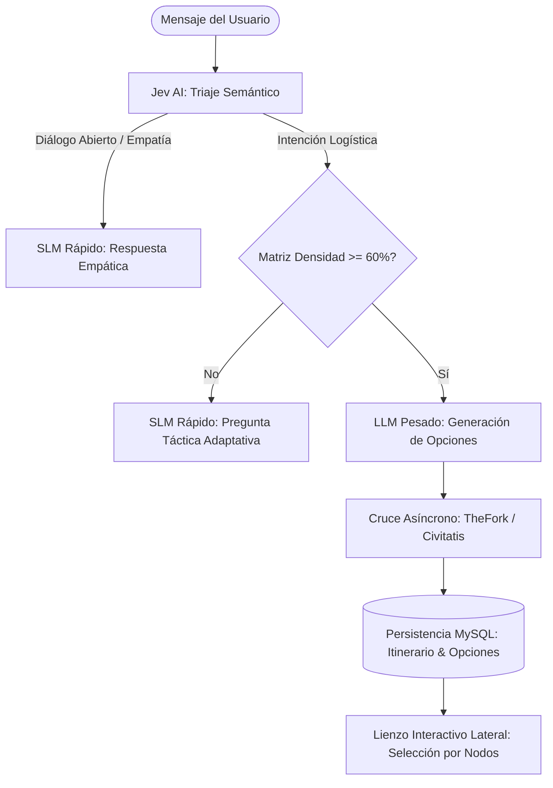

# [OPERATIVO] Documento Destilado: PBI - Orquestación Híbrida y Triaje Semántico con Persistencia MySQL

**Identificador:** PBI-ARCH-ORCH-001  
**Estatus:** Pendiente / Listo para Forja (S+ Grade)  
**Fecha de Creación:** 2026-09-26  
**Historia de Usuario Relacionada:** [[ARQUITECTURA] Historia de Usuario: Lienzo de Orquestación Híbrida y Triaje Semántico](file:///home/racso/Proyectos/BarcelonaXplorer/Documentacion/HistoriasDeUsuario/%5BARQUITECTURA%5D%20Historia%20de%20Usuario:%20Lienzo%20de%20Orquestaci%C3%B3n%20H%C3%ADbrida%20y%20Triaje%20Sem%C3%A1ntico.md) · [[OPERATIVO] Historia de Usuario: Estabilización Evolutiva y Saneamiento Post-Anclaje v2.0.1](file:///home/racso/Proyectos/BarcelonaXplorer/Documentacion/HistoriasDeUsuario/%5BOPERATIVO%5D%20Historia%20de%20Usuario:%20Estabilizaci%C3%B3n%20Evolutiva%20y%20Saneamiento%20Post-Anclaje%20v2.0.1.md)  
**Auditoría Vinculada:** [AUD-OPS-ANCHOR-001](file:///home/racso/Proyectos/BarcelonaXplorer/Documentacion/Auditorias/Auditoria%20-%20Ciclo%20Evolutivo%20v2.0.0-a-c82b741.md)  
**Fuente Base Vinculada:** [Ancla Evolutiva BarcelonaXplorer_01.md](file:///home/racso/Proyectos/BarcelonaXplorer/Documentacion/Fuentes/Ancla%20Evolutiva%20BarcelonaXplorer_01.md)  
**Módulo:** `src/features/triage/`, `src/features/ai-engine/`, `src/features/planner/`, `src/infrastructure/database/`  
**Entorno:** Next.js 16 (Server Actions & Route Handlers), Prisma ORM / MySQL 8.0, Jev AI / Groq SLM, Gemini LLM  
**Prioridad:** Alta (P1 - Expansión del Core Cognitivo y UX Conversacional)  
**Estimación Táctica:** 5 Story Points  

---

### Matriz de Indexación Tridimensional (Protocolo de Acero)

- **Naturaleza:** Enrutador semántico de intención humana (clasificación dialógica vs. logística), control del peaje termodinámico de la Matriz de Densidad (umbral 60%), enriquecimiento asíncrono con APIs de afiliados (TheFork, Civitatis) y persistencia relacional en MySQL de los itinerarios modulares y parcelas confirmadas.
- **Entorno:** Módulo de triaje (`src/features/triage/`), motor de IA (`src/features/ai-engine/`), generador de rutas (`src/features/planner/`) y tablas relacionales (`schema.prisma`).
- **Entropía Asimilada (Filtros A, B y C):**
  - *Filtro A (Rigor Técnico):* Erradicación de la alucinación donde el bot interroga al usuario sin motivo. Si el usuario conversa casualmente ("Uf, estoy agotado"), el enrutador clasifica `intent: 'dialogue'` y responde empáticamente sin forzar la matriz.
  - *Filtro B (Determinismo y Soberanía):* Inmutabilidad del cálculo de umbral (60% para activar LLM). Las opciones supervivientes del LLM se validan con Zod antes de presentarse en el lienzo interactivo. Persistencia determinista en MySQL.
  - *Filtro C (Eficiencia Operativa):* Aislamiento de llamadas externas: verificación asíncrona de disponibilidad/afiliación sin bloquear la respuesta de la interfaz al usuario.

---

## 1. Declaración de Intención (INVEST)

**Como** Viajero y Explorador en BarcelonaXplorer,  
**Quiero** interactuar con un asistente que comprenda de forma empática mis comentarios casuales sin forzar preguntas logísticas, y que sólo al tener suficiente información temporal y de contexto me proponga alternativas visuales en un panel interactivo que pueda confirmar o modificar atómicamente,  
**Para** diseñar mi ruta de forma natural, disponer de opciones verificadas con reservas reales y mantener el control absoluto sobre mi tiempo sin fricciones.

---

## 2. Arquitectura de Forja y Flujo de Datos

---

## 3. Criterios de Aceptación (Aduana de Fricción)

- [ ] **CA-1 (Enrutamiento Semántico):** Los mensajes clasificados con intención casual reciben respuesta inmediata del SLM sin modificar los contadores de la Matriz de Densidad.
- [ ] **CA-2 (Peaje del 60%):** La invocación del LLM pesado solo se desencadena cuando los atributos temporales y contextuales superan el umbral estipulado en la matriz.
- [ ] **CA-3 (Cruce de Afiliados y Contratos Zod):** Las propuestas devueltas por el LLM se validan mediante un esquema Zod estricto y se enriquecen con enlaces de afiliación antes de almacenarse en base de datos.
- [ ] **CA-4 (Persistencia Relacional MySQL):** La sesión del usuario almacena las parcelas temporales seleccionadas en la base de datos MySQL mediante Prisma, permitiendo la recarga y edición posterior.
- [ ] **CA-5 (Propagación Cronológica):** Si el usuario desplaza o edita atómicamente un nodo, los eventos posteriores recalculan automáticamente sus horas estimadas de llegada.
