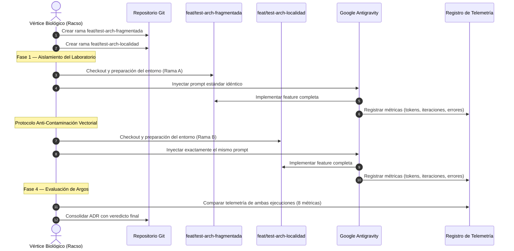

# [ARQUITECTURA] Documento Destilado: PBI - Test de Fricción Algorítmica: Evaluación Empírica de Opciones Arquitectónicas (A vs B)

**Identificador:** PBI-ARCH-TEST-001  
**Estatus:** Pendiente de Forja  
**Fecha de Creación:** 2026-09-25  
**Historia de Usuario Relacionada:** [Auditoría de Fricción Algorítmica (Evaluación Arquitectónica A vs B)](file:///home/racso/Proyectos/BarcelonaXplorer/Documentacion/HistoriasDeUsuario/Historia%20de%20Usuario:%20Auditor%C3%ADa%20de%20Fricci%C3%B3n%20Algor%C3%ADtmica%20%28Evaluaci%C3%B3n%20Arquitect%C3%B3nica%20A%20vs%20B%29.md) · [Anexo Constitucional: Axiomas de Forja S+ Grade (Optimización para IA)](file:///home/racso/Proyectos/BarcelonaXplorer/Documentacion/HistoriasDeUsuario/%5BARQUITECTURA%5D%20Anexo%20Constitucional:%20Axiomas%20de%20Forja%20S+%20Grade%20%28Optimizaci%C3%B3n%20para%20IA%29.md)  
**Módulo:** Evaluación Arquitectónica Transversal (Topología del Código Fuente)  
**Entorno:** Next.js 16 (App Router), TypeScript 5, Vitest 4, Arquitectura Hexagonal (DDD), Vertical Slicing vs Fragmentación por Capas, **Agente IA Designado: Google Antigravity**  
**Prioridad:** Alta (P1 - Decisión Arquitectónica Fundacional que condiciona toda la ejecución futura)  
**Estimación Táctica:** 5 Story Points  
**Restricción Bloqueante:** ⛔ `master` / `main` permanece intocable durante la totalidad del test. Toda ejecución se confina a ramas de laboratorio aisladas.

---

### Matriz de Indexación Tridimensional (Protocolo de Acero)

- **Naturaleza:** Ejecución de un test de implementación dual controlado (A/B) enfrentando la arquitectura fragmentada actual contra la arquitectura propuesta de Vertical Slicing / Localidad de Comportamiento, midiendo telemetría empírica de fricción para el agente IA designado (Google Antigravity).
- **Entorno:** Dos ramas de laboratorio **huérfanas de master/main**, totalmente aisladas del entorno de producción: `feat/test-arch-fragmentada` (Rama A — arquitectura fragmentada por capas actual) y `feat/test-arch-localidad` (Rama B — arquitectura de Vertical Slicing con localidad de comportamiento). Código fuente en [`src/`](file:///home/racso/Proyectos/BarcelonaXplorer/src), con topologías actuales: [`domain/`](file:///home/racso/Proyectos/BarcelonaXplorer/src/domain), [`application/`](file:///home/racso/Proyectos/BarcelonaXplorer/src/application), [`infrastructure/`](file:///home/racso/Proyectos/BarcelonaXplorer/src/infrastructure), [`app/`](file:///home/racso/Proyectos/BarcelonaXplorer/src/app).
- **Entropía Asimilada (Filtros A, B y C):**
  - *Filtro A (Rigor Técnico y Cero Alucinación):* Definición de un caso de prueba atómico, idéntico y bien delimitado, cuya implementación requiera tocar múltiples capas del sistema (entidad de dominio, esquema Zod, repositorio, ruta API, componente UI).
  - *Filtro B (Determinismo y Soberanía):* Registro cuantitativo de la telemetría: tokens consumidos, archivos tocados, prompts correctivos, errores de compilación vs errores de runtime. **Protocolo anti-contaminación vectorial** obligatorio entre ejecuciones para erradicar la memoria residual de Antigravity.
  - *Filtro C (Eficiencia Operativa / Cero Ruido):* Evaluación de la densidad de context hops que la IA necesita para completar la tarea — directamente correlacionada con el Axioma I de Economía Termodinámica. Evaluación adicional de la **autonomía de testing**: capacidad del agente para ubicar, crear y ejecutar tests sin correcciones de ruta.

---

## 1. Declaración de Intención (INVEST)

**Como** Arquitecto del Ecosistema (Vértice Biológico),  
**Quiero** someter una micro-funcionalidad real a un test de implementación dual enfrentando el modelo actual (Arquitectura Fragmentada por Capas) contra el modelo propuesto (Vertical Slicing con Localidad de Comportamiento),  
**Para** obtener telemetría empírica que dictamine qué estructura minimiza la entropía cognitiva de la IA, reduce las alucinaciones estructurales y acelera el desarrollo autónomo en Grado S+.

---

## 2. Justificación Arquitectónica (Los Axiomas en Colisión)

### 2.1. El Problema: Dispersión Entrópica de la Arquitectura Actual
La topología actual del proyecto fragmenta cada flujo funcional en 4-6 directorios separados:

```
src/
├── domain/entities/           # Entidad de dominio
├── domain/schemas/            # Esquema Zod
├── domain/value-objects/      # Value Objects
├── application/ports/in/      # Puerto de entrada
├── application/ports/out/     # Puerto de salida
├── application/use-cases/     # Caso de uso
├── infrastructure/repositories/  # Implementación del repositorio
├── infrastructure/gateways/   # Adaptadores de gateway
├── app/api/.../route.ts       # Ruta API (Next.js)
└── app/Admin/.../page.tsx     # Componente UI
```

Esto obliga a la IA a ejecutar **múltiples context hops** para comprender un flujo funcional completo, violando potencialmente el Axioma I (restricción de 3 archivos distribuidos).

### 2.2. La Hipótesis: Vertical Slicing Reduce la Fricción
La arquitectura Vertical Slicing propone agrupar todo el código de un flujo funcional en un solo directorio:

```
src/
├── features/
│   ├── triage/
│   │   ├── triage.entity.ts
│   │   ├── triage.schema.ts
│   │   ├── triage.repository.ts
│   │   ├── triage.use-case.ts
│   │   ├── triage.route.ts
│   │   └── triage.test.ts
│   ├── telemetry/
│   │   ├── telemetry-entry.entity.ts
│   │   ├── telemetry.schema.ts
│   │   ├── telemetry.repository.ts
│   │   └── telemetry.route.ts
│   └── ...
```

### 2.3. El Protocolo de Acero Exige Pruebas, No Opiniones
No se evaluará la estética del diseño para el ojo humano. Se medirán exclusivamente los vectores de fricción algorítmica definidos en la Historia de Usuario padre.

### 2.4. Aislamiento Estricto de Ramas: Jurisdicción Fuera de Master
Es **imperativo y bloqueante** que las pruebas se ejecuten en dos ramas de laboratorio totalmente aisladas de la línea principal:
- `feat/test-arch-fragmentada` (Rama A)
- `feat/test-arch-localidad` (Rama B)

> ⛔ **`master` / `main` permanece intocable durante la totalidad del test.** Ningún commit, merge, rebase ni operación de escritura puede dirigirse a la rama principal hasta que el ADR esté consolidado y certificado.

Ambas ramas deben partir del mismo commit base de `main` para garantizar la equiparación del laboratorio.

### 2.5. Protocolo Anti-Contaminación Vectorial para Antigravity
Dado que Google Antigravity indexa el repositorio y genera un **árbol vectorial de contexto** (knowledge items, embeddings de la estructura de directorios), un simple `git checkout` hacia la segunda rama **no limpia su "mente"**. El agente conservará resoluciones, paths y patrones de la topología de la Rama A, provocando alucinaciones estructurales al operar en la Rama B.

Se establece como **paso obligatorio** el siguiente protocolo de descontaminación al transicionar entre ramas:

1. **Cerrar completamente la sesión de Antigravity** (cerrar la ventana/IDE, no solo el chat).
2. **Purgar la caché de sesión y el contexto vectorial** del workspace:
   - Eliminar o invalidar los knowledge items indexados de la sesión anterior.
   - Limpiar cualquier estado de conversación residual.
3. **Abrir una nueva sesión de Antigravity** contra el workspace ya en la Rama B.
4. **Forzar la re-indexación explícita** del espacio de trabajo para que Antigravity reconstruya su árbol vectorial sobre la topología de la Rama B.
5. **Verificar antes de inyectar el prompt** que Antigravity no referencia paths o estructuras de la Rama A (test de sanidad).

> ⚠️ **La omisión de este protocolo invalida la ejecución de la Rama B y obliga a repetirla desde cero.**

---

## 3. Topología del Protocolo de Prueba



---

## 4. Vector de Prueba: Caso de Uso Atómico Seleccionado

### 4.1. Definición del Objetivo Atómico
**Funcionalidad a implementar:** Añadir un nuevo campo autovalidado `mood` (estado anímico del explorador) en los `tactical_metadata` de la entidad de Triage, que se propague desde el webhook de Telegram hasta la evaluación de la Matriz de Densidad.

**Justificación de la elección:** Este caso de uso es ideal porque:
- Atraviesa todas las capas del sistema (dominio → aplicación → infraestructura → API → UI).
- Requiere modificar esquemas Zod existentes (frontera determinista).
- Implica actualización de la Matriz de Densidad (configuración declarativa).
- Genera errores de compilación deterministas si se omite algún contrato.

### 4.2. Prompt Estándar (Idéntico para ambas ramas)
> _"Añade un campo `mood` de tipo enum (`relaxed` | `adventurous` | `cultural` | `gastronomic`) al flujo de triage del sistema. El campo debe estar validado por Zod en la frontera de entrada, debe participar en el cálculo de la Matriz de Densidad como variable con peso 10, y debe registrarse en telemetría. No modifiques tests existentes, pero crea tests unitarios para el nuevo campo."_

---

## 5. Métricas de Telemetría a Recolectar

| Métrica | Descripción | Unidad | Ideal |
|---|---|---|---|
| **Carga de Contexto** | Archivos y líneas de código que la IA necesita leer inicialmente | Archivos / Líneas | Mínimo |
| **Índice de Fricción** | Prompts correctivos del Vértice Biológico hasta éxito | Iteraciones | 1 |
| **Tasa de Interceptación** | Errores de compilación (positivos) vs errores de runtime (negativos) | Ratio compile/runtime | Alto compile, cero runtime |
| **Desgaste Espacial** | Veces que la IA se equivoca de directorio al crear/modificar/importar | Incidentes | 0 |
| **Tiempo Total de Forja** | Tiempo desde el primer prompt hasta la ejecución exitosa de tests | Minutos | Mínimo |
| **Archivos Tocados** | Número total de archivos creados o modificados | Archivos | Mínimo |
| **Context Hops** | Saltos entre directorios no adyacentes durante la implementación | Saltos | ≤ 3 |
| **Autonomía de Testing** | Capacidad del agente para ubicar, crear y ejecutar tests sin correcciones de ruta humanas | Booleano + Detalle | Sí, sin correcciones |

### Hoja de Registro de Telemetría (Plantilla)

```yaml
# Registro de Telemetría: Test Arquitectónico A/B
rama: "feat/test-arch-[fragmentada|localidad]"
fecha_ejecucion: "2026-XX-XX"
agente_ia: "Google Antigravity"
vector_prueba: "Campo mood en triage"

metricas:
  carga_contexto:
    archivos_leidos: 0
    lineas_totales: 0
  indice_friccion:
    prompts_correctivos: 0
    prompt_exitoso_en_intento: 0
  tasa_interceptacion:
    errores_compilacion: 0
    errores_runtime: 0
    ratio: "N/A"
  desgaste_espacial:
    errores_directorio: 0
    detalle: []
  tiempo_total_forja_min: 0
  archivos_tocados: 0
  context_hops: 0
  autonomia_testing:
    test_ubicado_correctamente: false
    test_ejecutado_sin_correccion_ruta: false
    directorio_test_creado: ""
    detalle: ""

veredicto_parcial: "PENDIENTE"
observaciones: ""
```

---

## 6. Criterios de Aceptación (Verificación Empírica - Gherkin BDD)

### Escenario 1: Aislamiento del Laboratorio (Master Intocable)
```gherkin
Dado el repositorio BarcelonaXplorer en su rama principal (master/main)
Cuando se crean las ramas "feat/test-arch-fragmentada" y "feat/test-arch-localidad"
Entonces ambas ramas parten del mismo commit base de main
Y la suite de tests existente pasa al 100% en ambas ramas antes de inyectar cambios
Y la rama master/main no recibe ningún commit, merge ni rebase durante la totalidad del test
```

### Escenario 2: Inyección Ciega en Rama A (Fragmentada)
```gherkin
Dado el checkout en la rama "feat/test-arch-fragmentada"
Cuando se inyecta el prompt estándar de implementación del campo "mood" en Antigravity
Entonces Antigravity implementa la funcionalidad en la topología fragmentada existente
Y se registran todas las métricas de telemetría definidas en la Sección 5 (8 métricas)
Y se evalúa si el agente ubicó el test en el directorio correcto y lo ejecutó sin correcciones de ruta
```

### Escenario 3: Protocolo Anti-Contaminación Vectorial
```gherkin
Dado que la ejecución en la Rama A ha sido completada y registrada
Cuando se transiciona a la Rama B
Entonces se cierra completamente la sesión de Antigravity
Y se purga la caché de sesión y el contexto vectorial del workspace
Y se abre una nueva sesión de Antigravity contra el workspace en la Rama B
Y se fuerza la re-indexación explícita del espacio de trabajo
Y se verifica que Antigravity no referencia paths ni estructuras de la Rama A (test de sanidad)
```

### Escenario 4: Inyección Ciega en Rama B (Localidad)
```gherkin
Dado el checkout en la rama "feat/test-arch-localidad" con la topología Vertical Slicing preparada
Y la sesión de Antigravity ha sido descontaminada según el protocolo de la Sección 2.5
Cuando se inyecta exactamente el mismo prompt estándar en Antigravity
Entonces Antigravity implementa la funcionalidad en la topología de localidad
Y se registran las 8 métricas de telemetría idénticas a las de la Rama A
Y se evalúa si el agente inyectó el test en la misma carpeta del dominio (features/triage/) sin correcciones de ruta
```

### Escenario 5: Evaluación de Argos y Veredicto Final
```gherkin
Dado los registros de telemetría de ambas ramas
Cuando se comparan las 8 métricas cuantitativamente
Entonces se identifica la topología ganadora según menor índice de fricción, menor desgaste espacial, mayor tasa de interceptación y mayor autonomía de testing
Y se consolida el veredicto en un documento ADR (Architecture Decision Record)
Y la topología ganadora se declara como nuevo estándar oficial del proyecto
```

---

## 7. Plan de Implementación Táctico

### Fase 1: Aislamiento del Laboratorio (Pre-Test)
- [ ] **Tarea 1: Creación de Rama A (`feat/test-arch-fragmentada`)**  
  Branch desde `main` con la topología fragmentada intacta. Verificar `npx tsc --noEmit` y `npm test` pasan al 100%. **Confirmar que `main` no recibe commits a partir de este punto.**

- [ ] **Tarea 2: Creación de Rama B (`feat/test-arch-localidad`)**  
  Branch desde `main` (mismo commit base que Rama A). Refactorizar la topología del caso de uso de Triage a Vertical Slicing (mover entidad, esquema, repositorio, ruta API y tests a un directorio `features/triage/` unificado). Verificar que los tests pasan al 100% tras la refactorización.

### Fase 2: Selección y Documentación del Vector de Prueba
- [ ] **Tarea 3: Redacción del Prompt Estándar**  
  Redactar y versionar el prompt exacto que será inyectado en ambas ramas (Sección 4.2).

- [ ] **Tarea 4: Preparación de la Hoja de Registro de Telemetría**  
  Crear dos instancias del template YAML de la Sección 5.1, una por rama. Incluir las 8 métricas (incluyendo Autonomía de Testing).

### Fase 3: Inyección Ciega (Ejecución)
- [ ] **Tarea 5: Ejecución en Rama A (Fragmentada)**  
  Checkout Rama A. Activar Antigravity. Inyectar prompt estándar. Registrar las 8 métricas hasta éxito. Observar especialmente si el agente ubica los tests en el directorio correcto.

- [ ] **Tarea 6: Protocolo Anti-Contaminación Vectorial**  
  Ejecutar la secuencia completa de descontaminación de Antigravity (Sección 2.5):  
  1\. Cerrar completamente la sesión de Antigravity (IDE completo, no solo el chat).  
  2\. Purgar caché de sesión y contexto vectorial del workspace.  
  3\. Abrir nueva sesión de Antigravity contra el workspace ya en Rama B.  
  4\. Forzar re-indexación explícita del espacio de trabajo.  
  5\. Verificar test de sanidad: Antigravity no referencia paths de Rama A.

- [ ] **Tarea 7: Ejecución en Rama B (Localidad)**  
  Checkout Rama B. Antigravity re-indexado y limpio. Inyectar exactamente el mismo prompt. Registrar las 8 métricas hasta éxito. Observar si el agente inyecta los tests en `features/triage/` sin correcciones de ruta.

### Fase 4: Evaluación de Argos (Post-Test)
- [ ] **Tarea 8: Comparación Cuantitativa de Telemetría (8 Métricas)**  
  Tabular las métricas de ambas ramas y calcular los deltas. Destacar la métrica de Autonomía de Testing como indicador de localidad efectiva.

- [ ] **Tarea 9: Redacción del ADR (Architecture Decision Record)**  
  Documentar el veredicto final, la topología ganadora, el análisis de impacto sobre el Capítulo II de [`CONSTITUTION.MD`](file:///home/racso/Proyectos/BarcelonaXplorer/CONSTITUTION.MD) y las métricas que respaldan la decisión.

- [ ] **Tarea 10: Preservación de Ramas de Laboratorio**  
  Las ramas de laboratorio **NO se eliminan**. Se preservan como base para el PBI-ARCH-APPLY-001 (Aplicación Definitiva Post-Veredicto). La topología ganadora servirá como punto de partida para la consolidación final.

---

## 8. Definición de Hecho (DoD)

- [ ] Se han creado las dos ramas de laboratorio (`feat/test-arch-fragmentada` y `feat/test-arch-localidad`) partiendo del mismo commit base de `main`.
- [ ] La rama `master` / `main` no ha recibido ningún commit, merge ni rebase durante la totalidad del test.
- [ ] La Rama B contiene la refactorización de Vertical Slicing para el módulo de Triage, con todos los tests existentes pasando al 100%.
- [ ] Se ha ejecutado el test de inyección ciega con el mismo prompt en ambas ramas, utilizando Antigravity como agente designado.
- [ ] Se ha ejecutado el Protocolo Anti-Contaminación Vectorial completo entre la ejecución de Rama A y Rama B.
- [ ] Se han registrado las 8 métricas de telemetría para cada rama en formato YAML (incluyendo Autonomía de Testing).
- [ ] Se ha redactado el ADR con el veredicto final declarando la topología ganadora y definiendo las enmiendas mandatorias al Capítulo II de [`CONSTITUTION.MD`](file:///home/racso/Proyectos/BarcelonaXplorer/CONSTITUTION.MD) para [`PBI-ARCH-APPLY-001`](file:///home/racso/Proyectos/BarcelonaXplorer/Documentacion/PBI/Pendiente/PBI%20-%20Aplicaci%C3%B3n%20Definitiva%20de%20Modificaciones%20Arquitect%C3%B3nicas%20Post-Veredicto.md).
- [ ] El ADR está versionado bajo control de Git en `Documentacion/ADR/`.
- [ ] La compilación TypeScript (`npx tsc --noEmit`) y la suite de Vitest pasan al 100% en ambas ramas durante el test.
- [ ] Las ramas de laboratorio se preservan intactas para su uso como base en PBI-ARCH-APPLY-001.
