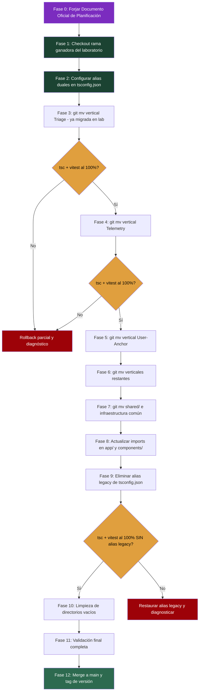
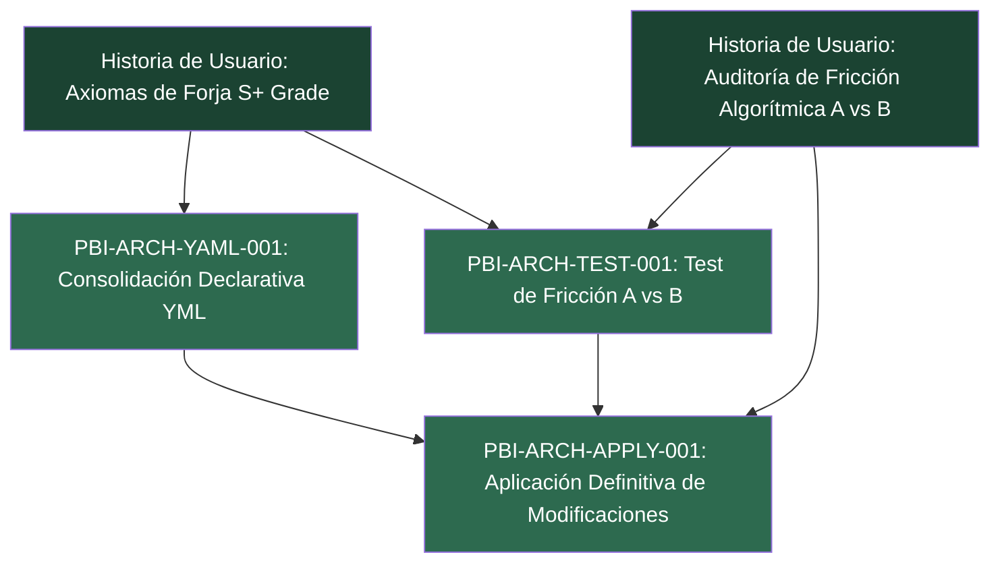

# [ARQUITECTURA] Documento Destilado: PBI - Aplicación Definitiva de Modificaciones Arquitectónicas Post-Veredicto

**Identificador:** PBI-ARCH-APPLY-001  
**Estatus:** Completado / Certificado S+ Grade (Tag v2.0.0-arch-definitive)  
**Fecha de Creación:** 2026-09-25  
**Fecha de Certificación:** 2026-09-25  
**Historia de Usuario Relacionada:** [Anexo Constitucional: Axiomas de Forja S+ Grade (Optimización para IA)](file:///home/racso/Proyectos/BarcelonaXplorer/.SddIA/library/norms/%5BARQUITECTURA%5D%20Anexo%20Constitucional:%20Axiomas%20de%20Forja%20S+%20Grade%20%28Optimizaci%C3%B3n%20para%20IA%29.md) · [Auditoría de Fricción Algorítmica (Evaluación Arquitectónica A vs B)](file:///home/racso/Proyectos/BarcelonaXplorer/Documentacion/HistoriasDeUsuario/Historia%20de%20Usuario:%20Auditor%C3%ADa%20de%20Fricci%C3%B3n%20Algor%C3%ADtmica%20%28Evaluaci%C3%B3n%20Arquitect%C3%B3nica%20A%20vs%20B%29.md) · [ADR-001](file:///home/racso/Proyectos/BarcelonaXplorer/Documentacion/ADR/ADR-001-Topologia-Codigo-Vertical-Slicing-vs-Capas.md) · [AUD-ARCH-FRIC-001](file:///home/racso/Proyectos/BarcelonaXplorer/Documentacion/Auditorias/Auditoria%20-%20Friccion%20Algoritmica%20y%20Evaluacion%20Arquitectonica%20A%20vs%20B.md)  
**Módulo:** Refactorización Estructural del Código Fuente Completo  
**Entorno:** Next.js 16 (App Router), TypeScript 5, Vitest 4, Zod, Prisma, LanceDB, Docker Compose v2, Ansible/Ansistrano  
**Prioridad:** Crítica (P0 - Ejecución Fundacional post-veredicto que erradica la deuda técnica estructural)  
**Estimación Táctica:** 8 Story Points  
**Estatus de Pre-requisitos:** ✅ **100% Desbloqueado** — PBI-ARCH-YAML-001 certificado, PBI-ARCH-TEST-001 concluido y ADR-001 ratificado por el Vértice Biológico.  
**Rama Base de Partida:** `feat/test-arch-localidad` (Commit: `74f1152`), preservada con el piloto de Triage en Vertical Slicing.

---

### Matriz de Indexación Tridimensional (Protocolo de Acero)

- **Naturaleza:** Aplicación definitiva e irreversible de todas las modificaciones arquitectónicas decididas como resultado del test A/B (PBI-ARCH-TEST-001) y la consolidación de formato YAML (PBI-ARCH-YAML-001), transmutando el ecosistema completo de BarcelonaXplorer a la topología ganadora. La ejecución está **supeditada a un Documento Oficial de Planificación** y se ejecuta **sobre las ramas de laboratorio** del test A/B, no desde cero.
- **Entorno:** Código fuente completo en [`src/`](file:///home/racso/Proyectos/BarcelonaXplorer/src) — actualmente organizado en: [`domain/`](file:///home/racso/Proyectos/BarcelonaXplorer/src/domain) (entidades, schemas, value-objects, exceptions), [`application/`](file:///home/racso/Proyectos/BarcelonaXplorer/src/application) (ports, use-cases), [`infrastructure/`](file:///home/racso/Proyectos/BarcelonaXplorer/src/infrastructure) (ai, gateways, persistence, repositories, security, vector), [`app/`](file:///home/racso/Proyectos/BarcelonaXplorer/src/app) (páginas, rutas API, componentes). Total: ~135 archivos fuente + ~50 archivos de test. **Ramas de laboratorio preservadas del PBI-ARCH-TEST-001** como base de partida.
- **Entropía Asimilada (Filtros A, B y C):**
  - *Filtro A (Rigor Técnico y Cero Alucinación):* Cada movimiento de archivo será rastreado por un manifiesto de migración inmutable (YAML) que mapee ruta origen → ruta destino. Todo movimiento se ejecuta mediante `git mv` obligatorio para preservar el historial rúnico (⁠`git blame`). Queda proscrito `cp` + `rm`.
  - *Filtro B (Determinismo y Soberanía):* La refactorización **no se ejecuta por improvisación del agente**. Antes de mover un solo archivo, Antigravity debe forjar y basarse estrictamente en un **Documento Oficial de Planificación de Refactorización** que actúe como único mapa de ruta autorizado. La migración se valida incrementalmente (`npx tsc --noEmit` y `npm test` al 100% tras cada fase).
  - *Filtro C (Eficiencia Operativa):* La topología resultante respetará el Axioma I (≤ 3 archivos para comprender una operación atómica). Se implementa **amortiguación del colapso de alias** en `tsconfig.json` con rutas duales temporales para evitar la destrucción de la compilación durante la transición.

---

## 1. Declaración de Intención (INVEST)

**Como** Arquitecto del Ecosistema (Vértice Biológico),  
**Quiero** aplicar definitivamente todas las modificaciones arquitectónicas decididas tras el test de fricción algorítmica A/B y la consolidación de formato YAML, basándome estrictamente en un Documento Oficial de Planificación y utilizando las ramas de laboratorio validadas como punto de partida,  
**Para** transmutar el ecosistema BarcelonaXplorer a su topología óptima definitiva preservando la memoria histórica rúnica (`git blame`), eliminando la deuda técnica estructural acumulada y estableciendo el estándar de forja que todas las IAs obreras seguirán a partir de este momento.

---

## 2. Justificación Arquitectónica (La Gran Refactorización)

### 2.1. Pre-requisitos: Los Veredictos que Gobiernan Este PBI
Este PBI es la **fase de ejecución** de dos decisiones que deben estar tomadas antes de iniciar:

| Pre-requisito | PBI | Entregable Esperado |
|---|---|---|
| Veredicto del Test A/B | PBI-ARCH-TEST-001 | ADR declarando la topología ganadora (Fragmentada vs Vertical Slicing) |
| Consolidación YAML | PBI-ARCH-YAML-001 | Documento de Gobernanza + Archivos YAML enriquecidos |

### 2.2. Mandato Fundacional: Documento Oficial de Planificación de Refactorización
La refactorización **no se ejecutará mediante improvisación del agente**. Antes de mover un solo archivo, Antigravity debe forjar un **Documento Oficial de Planificación de Refactorización** que contenga:
- El manifiesto completo de movimientos `git mv` (origen → destino).
- La secuencia de fases incrementales con checkpoints de validación.
- La configuración de amortiguación de alias en `tsconfig.json` (rutas duales temporales).
- Los criterios de limpieza de rutas legacy una vez confirmada la compilación exitosa.

Este documento actúa como el **único mapa de ruta autorizado** para el movimiento de la arquitectura. Toda desviación del plan requiere aprobación explícita del Vértice Biológico.

### 2.3. Continuidad sobre Ramas de Laboratorio (No Partir de Cero)
Este PBI **no parte de cero**. La aplicación definitiva se ejecutará utilizando como base las ramas de laboratorio forjadas y validadas en el PBI-ARCH-TEST-001:
- La topología que haya demostrado menor fricción termodinámica en Antigravity será la que se consolide y prepare para su posterior integración a `main`.
- La rama ganadora ya contendrá el módulo de Triage migrado y validado, sirviendo como piloto de la migración completa.

### 2.4. Memoria Histórica Rúnica: `git mv` Obligatorio
Queda **proscrito** el traslado de archivos mediante atajos de copia y eliminación en el sistema de archivos:

> ⛔ **PROSCRITO:** `cp archivo_origen destino/ && rm archivo_origen` — destruye el historial de Git.
>
> ✅ **MANDATO:** `git mv archivo_origen destino/` — preserva el árbol histórico (`git blame`), manteniendo intactas las cicatrices rúnicas del desarrollo previo.

Todo movimiento estructural para acoplarse al Vertical Slicing debe ejecutarse obligatoriamente mediante comandos `git mv`. La violación de esta directriz implica pérdida de trazabilidad histórica y será rechazada en la Aduana de Fricción.

### 2.5. Amortiguación del Colapso de Alias (Prevención del Big Bang)
Para evitar que la reorganización de directorios destruya la compilación de la capa de presentación (`app/` y `components/`), el Documento Oficial de Planificación debe incluir una **fase de transición en `tsconfig.json`**:

```jsonc
{
  "compilerOptions": {
    "paths": {
      // Fase de transición: alias dual temporal
      // Permite que los imports @/ resuelvan tanto en legacy como en features/
      "@/*": ["./*"],
      "@/features/*": ["./features/*"],
      // Alias legacy temporales (se eliminarán al final de la migración)
      "@/domain/*": ["./domain/*", "./features/*/"],
      "@/infrastructure/*": ["./infrastructure/*", "./features/*/"],
      "@/application/*": ["./application/*", "./features/*/"]
    }
  }
}
```

**Solo cuando Antigravity confirme que la compilación es 100% exitosa sin las rutas legacy, se eliminarán las entradas temporales del `paths`.**

### 2.6. Escenario A: Si Gana la Arquitectura Fragmentada (Status Quo)
Si el test A/B dictamina que la arquitectura fragmentada actual genera **menos fricción** que el Vertical Slicing:
- Se preserva la topología actual de directorios (`domain/`, `application/`, `infrastructure/`, `app/`).
- Se aplican únicamente los enriquecimientos de formato YAML del PBI-ARCH-YAML-001.
- Se documentan las razones en el ADR y se cierra este PBI con alcance reducido.
- Se aplican mejoras incrementales de localidad sin refactorización estructural masiva.

### 2.7. Escenario B: Si Gana el Vertical Slicing (Refactorización Completa)
Si el test A/B dictamina que el Vertical Slicing genera **menos fricción**:
- Se ejecuta la migración completa de la topología del código fuente **desde la rama de laboratorio ganadora**.
- La nueva estructura organizará el código por **features** (verticales funcionales).
- Se preservan los contratos de puertos (interfaces) y se reubican dentro de cada vertical.
- Todos los movimientos se ejecutan con `git mv` y se amortiguan con alias duales en `tsconfig.json`.

#### Topología Objetivo (Escenario B):

```
src/
├── features/
│   ├── triage/
│   │   ├── triage.entity.ts
│   │   ├── triage.schema.ts
│   │   ├── triage-outcome.vo.ts
│   │   ├── triage.use-case.ts
│   │   ├── triage.repository.ts
│   │   └── triage.test.ts
│   │
│   ├── telemetry/
│   │   ├── telemetry-entry.entity.ts
│   │   ├── telemetry.schema.ts
│   │   ├── telemetry.repository.ts
│   │   ├── telemetry-log.route.ts
│   │   ├── telemetry-prune.route.ts
│   │   └── telemetry.test.ts
│   │
│   ├── user-anchor/
│   │   ├── user-anchor.entity.ts
│   │   ├── telegram-chat-id.vo.ts
│   │   ├── user-anchor.repository.ts
│   │   ├── anchor-link.route.ts
│   │   └── user-anchor.test.ts
│   │
│   ├── ai-engine/
│   │   ├── gemini-client.ts
│   │   ├── gemini-embedding.adapter.ts
│   │   ├── groq/
│   │   │   └── prompts/
│   │   ├── jev/
│   │   │   ├── jevClient.ts
│   │   │   ├── config.ts
│   │   │   └── types.ts
│   │   ├── ai-test.route.ts
│   │   └── ai-engine.test.ts
│   │
│   ├── planner/
│   │   ├── tactical-route.entity.ts
│   │   ├── tactical-route.schema.ts
│   │   ├── dense-semantic-matrix.vo.ts
│   │   ├── geographic-scope.vo.ts
│   │   ├── matrix.ts
│   │   ├── planner-stream.route.ts
│   │   └── planner.test.ts
│   │
│   ├── telegram/
│   │   ├── telegram-webhook.schema.ts
│   │   ├── telegram-bot-api.gateway.ts
│   │   ├── webhook.route.ts
│   │   └── telegram.test.ts
│   │
│   ├── auth/
│   │   ├── hmac-magic-link-signer.ts
│   │   ├── magic-link.route.ts
│   │   └── auth.test.ts
│   │
│   └── vector/
│       ├── lancedb.adapter.ts
│       └── vector.test.ts
│
├── shared/
│   ├── domain/
│   │   └── exceptions/
│   ├── infrastructure/
│   │   └── persistence/   # Prisma client singleton
│   └── lib/
│       └── utils.ts
│
├── app/                    # Solo layouts, páginas y componentes de presentación
│   ├── Admin/
│   ├── orchestrator/
│   ├── test-ui/
│   └── layout.tsx
│
├── components/             # Componentes UI compartidos
│   ├── ui/
│   └── tactical/
│
└── prisma/
    └── schema.prisma
```

---

## 3. Protocolo de Migración Incremental (La Línea de Montaje)



### Regla de Oro de la Migración
> **Cada fase DEBE pasar `npx tsc --noEmit` y `npm test` al 100% antes de proceder a la siguiente. Si una fase rompe la compilación o los tests, se detiene la migración y se diagnostica. No se acepta deuda técnica de migración.**

### Regla de Hierro del Movimiento
> **Todo movimiento de archivo se ejecuta con `git mv`. Queda proscrito `cp` + `rm`. La trazabilidad histórica (`git blame`) es sagrada.**

---

## 4. Manifiesto Oficial de Migración Arquitectónica (Planificación S+ Grade)

Este manifiesto constituye el **único mapa de ruta autorizado** para la ejecución de la refactorización definitiva. Todo movimiento se realiza mediante `git mv` obligatorio sobre la rama base `feat/test-arch-localidad`.

```yaml
# ═══════════════════════════════════════════════════════════════
# Manifiesto de Migración Arquitectónica (Documento Inmutable)
# Ratificado por: Vértice Biológico & Google Antigravity
# Fecha de Aprobación: 2026-09-25
# Veredicto ADR: ADR-001 (Victoria Vertical Slicing)
# Rama Base: feat/test-arch-localidad (Commit: 74f1152)
# Mecanismo de Movimiento: git mv (OBLIGATORIO — Cero cp/rm)
# ═══════════════════════════════════════════════════════════════

configuracion_laboratorio:
  rama_base_partida: "feat/test-arch-localidad"
  commit_anclaje: "74f1152"
  piloto_preexistente: "src/features/triage/"
  estado_baseline_tests: "63 suites / 318 tests pasando al 100%"

amortiguacion_alias:
  fase_transicion_tsconfig:
    alias_duales_activos: true
    rutas_transicion:
      "@/*": ["./*"]
      "@/features/*": ["./features/*"]
      "@/shared/*": ["./shared/*"]
      "@/domain/*": ["./domain/*", "./features/*/domain/*", "./shared/domain/*"]
      "@/application/*": ["./application/*", "./features/*/application/*", "./shared/application/*"]
      "@/infrastructure/*": ["./infrastructure/*", "./features/*/infrastructure/*", "./shared/infrastructure/*"]
    criterio_eliminacion: "tsc --noEmit y vitest al 100% pasando sin alias legacy"

migraciones_por_vertical:

  # ── VERTICAL 1: TRIAGE (PILOTO CONSOLIDADO EN LABORATORIO) ──
  vertical_triage:
    estado: "CONSOLIDADO_EN_RAMA_B"
    directorio_destino: "src/features/triage/"
    archivos_ya_migrados:
      - "src/features/triage/triage.schema.ts"
      - "src/features/triage/triage-outcome.vo.ts"
      - "src/features/triage/triage-input.use-case.port.ts"
      - "src/features/triage/triage-input.use-case.ts"
      - "src/features/triage/triage.test.ts"
      - "src/features/triage/index.ts"

  # ── VERTICAL 2: TELEMETRY ──
  vertical_telemetry:
    fase: 2
    directorio_destino: "src/features/telemetry/"
    movimientos:
      - origen: "src/domain/entities/telemetry-entry.entity.ts"
        destino: "src/features/telemetry/telemetry-entry.entity.ts"
        comando: "git mv src/domain/entities/telemetry-entry.entity.ts src/features/telemetry/"
      - origen: "src/application/ports/out/telemetry-repository.port.ts"
        destino: "src/features/telemetry/telemetry-repository.port.ts"
        comando: "git mv src/application/ports/out/telemetry-repository.port.ts src/features/telemetry/"
      - origen: "src/application/use-cases/prune-telemetry.use-case.ts"
        destino: "src/features/telemetry/prune-telemetry.use-case.ts"
        comando: "git mv src/application/use-cases/prune-telemetry.use-case.ts src/features/telemetry/"
      - origen: "src/infrastructure/repositories/prisma-telemetry.repository.ts"
        destino: "src/features/telemetry/prisma-telemetry.repository.ts"
        comando: "git mv src/infrastructure/repositories/prisma-telemetry.repository.ts src/features/telemetry/"
      - origen: "tests/infrastructure/repositories/prisma-telemetry.repository.test.ts"
        destino: "src/features/telemetry/telemetry.test.ts"
        comando: "git mv tests/infrastructure/repositories/prisma-telemetry.repository.test.ts src/features/telemetry/telemetry.test.ts"

  # ── VERTICAL 3: AUTH & USER-ANCHOR ──
  vertical_auth:
    fase: 3
    directorio_destino: "src/features/auth/"
    movimientos:
      - origen: "src/domain/entities/user-anchor.entity.ts"
        destino: "src/features/auth/user-anchor.entity.ts"
        comando: "git mv src/domain/entities/user-anchor.entity.ts src/features/auth/"
      - origen: "src/domain/value-objects/telegram-chat-id.vo.ts"
        destino: "src/features/auth/telegram-chat-id.vo.ts"
        comando: "git mv src/domain/value-objects/telegram-chat-id.vo.ts src/features/auth/"
      - origen: "src/application/ports/out/user-anchor-repository.port.ts"
        destino: "src/features/auth/user-anchor-repository.port.ts"
        comando: "git mv src/application/ports/out/user-anchor-repository.port.ts src/features/auth/"
      - origen: "src/application/ports/out/anchor-token-encryptor.port.ts"
        destino: "src/features/auth/anchor-token-encryptor.port.ts"
        comando: "git mv src/application/ports/out/anchor-token-encryptor.port.ts src/features/auth/"
      - origen: "src/application/ports/out/magic-link-signer.port.ts"
        destino: "src/features/auth/magic-link-signer.port.ts"
        comando: "git mv src/application/ports/out/magic-link-signer.port.ts src/features/auth/"
      - origen: "src/infrastructure/security/hmac-magic-link-signer.ts"
        destino: "src/features/auth/hmac-magic-link-signer.ts"
        comando: "git mv src/infrastructure/security/hmac-magic-link-signer.ts src/features/auth/"
      - origen: "src/infrastructure/security/aes-gcm-anchor-token.encryptor.ts"
        destino: "src/features/auth/aes-gcm-anchor-token.encryptor.ts"
        comando: "git mv src/infrastructure/security/aes-gcm-anchor-token.encryptor.ts src/features/auth/"
      - origen: "src/infrastructure/security/crypto.utils.ts"
        destino: "src/features/auth/crypto.utils.ts"
        comando: "git mv src/infrastructure/security/crypto.utils.ts src/features/auth/"
      - origen: "src/application/use-cases/restore-session-from-magic-link.use-case.ts"
        destino: "src/features/auth/restore-session-from-magic-link.use-case.ts"
        comando: "git mv src/application/use-cases/restore-session-from-magic-link.use-case.ts src/features/auth/"
      - origen: "src/application/use-cases/link-telegram-session.use-case.ts"
        destino: "src/features/auth/link-telegram-session.use-case.ts"
        comando: "git mv src/application/use-cases/link-telegram-session.use-case.ts src/features/auth/"
      - origen: "src/application/use-cases/revoke-telegram-anchor.use-case.ts"
        destino: "src/features/auth/revoke-telegram-anchor.use-case.ts"
        comando: "git mv src/application/use-cases/revoke-telegram-anchor.use-case.ts src/features/auth/"

  # ── VERTICAL 4: COGNITIVE-MEMORY & VECTOR STORE ──
  vertical_cognitive_memory:
    fase: 4
    directorio_destino: "src/features/cognitive-memory/"
    movimientos:
      - origen: "src/domain/value-objects/dense-semantic-matrix.vo.ts"
        destino: "src/features/cognitive-memory/dense-semantic-matrix.vo.ts"
        comando: "git mv src/domain/value-objects/dense-semantic-matrix.vo.ts src/features/cognitive-memory/"
      - origen: "src/application/ports/out/cognitive-memory.port.ts"
        destino: "src/features/cognitive-memory/cognitive-memory.port.ts"
        comando: "git mv src/application/ports/out/cognitive-memory.port.ts src/features/cognitive-memory/"
      - origen: "src/application/ports/out/cognitive-metrics.port.ts"
        destino: "src/features/cognitive-memory/cognitive-metrics.port.ts"
        comando: "git mv src/application/ports/out/cognitive-metrics.port.ts src/features/cognitive-memory/"
      - origen: "src/application/use-cases/audit-lancedb-health.use-case.ts"
        destino: "src/features/cognitive-memory/audit-lancedb-health.use-case.ts"
        comando: "git mv src/application/use-cases/audit-lancedb-health.use-case.ts src/features/cognitive-memory/"
      - origen: "src/infrastructure/vector/lancedb-cognitive-memory.adapter.ts"
        destino: "src/features/cognitive-memory/lancedb-cognitive-memory.adapter.ts"
        comando: "git mv src/infrastructure/vector/lancedb-cognitive-memory.adapter.ts src/features/cognitive-memory/"
      - origen: "src/infrastructure/vector/lancedb-vector.adapter.ts"
        destino: "src/features/cognitive-memory/lancedb-vector.adapter.ts"
        comando: "git mv src/infrastructure/vector/lancedb-vector.adapter.ts src/features/cognitive-memory/"
      - origen: "src/infrastructure/repositories/prisma-cognitive-metrics.repository.ts"
        destino: "src/features/cognitive-memory/prisma-cognitive-metrics.repository.ts"
        comando: "git mv src/infrastructure/repositories/prisma-cognitive-metrics.repository.ts src/features/cognitive-memory/"

  # ── VERTICAL 5: AI-ENGINE (GEMINI / JEV / GROQ) ──
  vertical_ai_engine:
    fase: 5
    directorio_destino: "src/features/ai-engine/"
    movimientos:
      - origen: "src/application/ports/out/ITypedDecisionEngine.ts"
        destino: "src/features/ai-engine/ITypedDecisionEngine.ts"
        comando: "git mv src/application/ports/out/ITypedDecisionEngine.ts src/features/ai-engine/"
      - origen: "src/application/ports/out/conversational-slm.port.ts"
        destino: "src/features/ai-engine/conversational-slm.port.ts"
        comando: "git mv src/application/ports/out/conversational-slm.port.ts src/features/ai-engine/"
      - origen: "src/application/ports/out/embedding.port.ts"
        destino: "src/features/ai-engine/embedding.port.ts"
        comando: "git mv src/application/ports/out/embedding.port.ts src/features/ai-engine/"
      - origen: "src/infrastructure/ai/gemini-client.ts"
        destino: "src/features/ai-engine/gemini-client.ts"
        comando: "git mv src/infrastructure/ai/gemini-client.ts src/features/ai-engine/"
      - origen: "src/infrastructure/ai/gemini-embedding.adapter.ts"
        destino: "src/features/ai-engine/gemini-embedding.adapter.ts"
        comando: "git mv src/infrastructure/ai/gemini-embedding.adapter.ts src/features/ai-engine/"
      - origen: "src/infrastructure/ai/jev/"
        destino: "src/features/ai-engine/jev/"
        comando: "git mv src/infrastructure/ai/jev/ src/features/ai-engine/jev/"
      - origen: "src/infrastructure/ai/groq/"
        destino: "src/features/ai-engine/groq/"
        comando: "git mv src/infrastructure/ai/groq/ src/features/ai-engine/groq/"
      - origen: "src/application/use-cases/audit-jev-health.use-case.ts"
        destino: "src/features/ai-engine/audit-jev-health.use-case.ts"
        comando: "git mv src/application/use-cases/audit-jev-health.use-case.ts src/features/ai-engine/"

  # ── VERTICAL 6: PLANNER & TACTICAL ROUTES ──
  vertical_planner:
    fase: 6
    directorio_destino: "src/features/planner/"
    movimientos:
      - origen: "src/domain/schemas/matrix.ts"
        destino: "src/features/planner/matrix.ts"
        comando: "git mv src/domain/schemas/matrix.ts src/features/planner/"
      - origen: "src/domain/value-objects/geographic-scope.vo.ts"
        destino: "src/features/planner/geographic-scope.vo.ts"
        comando: "git mv src/domain/value-objects/geographic-scope.vo.ts src/features/planner/"
      - origen: "src/application/ports/out/density-matrix-repository.port.ts"
        destino: "src/features/planner/density-matrix-repository.port.ts"
        comando: "git mv src/application/ports/out/density-matrix-repository.port.ts src/features/planner/"
      - origen: "src/application/ports/out/geographic-decision-engine.port.ts"
        destino: "src/features/planner/geographic-decision-engine.port.ts"
        comando: "git mv src/application/ports/out/geographic-decision-engine.port.ts src/features/planner/"
      - origen: "src/infrastructure/ai/rules/heuristic-geographic-decision-engine.ts"
        destino: "src/features/planner/heuristic-geographic-decision-engine.ts"
        comando: "git mv src/infrastructure/ai/rules/heuristic-geographic-decision-engine.ts src/features/planner/"
      - origen: "src/application/use-cases/generate-tactical-route.use-case.ts"
        destino: "src/features/planner/generate-tactical-route.use-case.ts"
        comando: "git mv src/application/use-cases/generate-tactical-route.use-case.ts src/features/planner/"
      - origen: "src/application/use-cases/validate-geographic-scope.use-case.ts"
        destino: "src/features/planner/validate-geographic-scope.use-case.ts"
        comando: "git mv src/application/use-cases/validate-geographic-scope.use-case.ts src/features/planner/"
      - origen: "src/infrastructure/repositories/in-memory-density-matrix.repository.ts"
        destino: "src/features/planner/in-memory-density-matrix.repository.ts"
        comando: "git mv src/infrastructure/repositories/in-memory-density-matrix.repository.ts src/features/planner/"

  # ── VERTICAL 7: TELEGRAM INTEGRATION ──
  vertical_telegram:
    fase: 7
    directorio_destino: "src/features/telegram/"
    movimientos:
      - origen: "src/domain/schemas/telegram-webhook.schema.ts"
        destino: "src/features/telegram/telegram-webhook.schema.ts"
        comando: "git mv src/domain/schemas/telegram-webhook.schema.ts src/features/telegram/"
      - origen: "src/infrastructure/gateways/telegram-bot-api.gateway.ts"
        destino: "src/features/telegram/telegram-bot-api.gateway.ts"
        comando: "git mv src/infrastructure/gateways/telegram-bot-api.gateway.ts src/features/telegram/"
      - origen: "src/application/use-cases/audit-telegram-bot-health.use-case.ts"
        destino: "src/features/telegram/audit-telegram-bot-health.use-case.ts"
        comando: "git mv src/application/use-cases/audit-telegram-bot-health.use-case.ts src/features/telegram/"

  # ── SHARED CORE (INFRAESTRUCTURA Y DOMINIO TRANSVERSAL) ──
  shared_core:
    fase: 8
    directorio_destino: "src/shared/"
    movimientos:
      - origen: "src/domain/exceptions/"
        destino: "src/shared/exceptions/"
        comando: "git mv src/domain/exceptions/ src/shared/exceptions/"
      - origen: "src/infrastructure/persistence/prisma.ts"
        destino: "src/shared/persistence/prisma.ts"
        comando: "git mv src/infrastructure/persistence/prisma.ts src/shared/persistence/"
      - origen: "src/infrastructure/security/middleware.ts"
        destino: "src/shared/security/middleware.ts"
        comando: "git mv src/infrastructure/security/middleware.ts src/shared/security/"

totales:
  verticales_funcionales: 7
  archivos_totales_a_migrar: 46
  movimientos_git_mv: 46
  movimientos_cp_rm: 0  # Innegociable Grado S+
```

---

## 5. Integración con PBI-ARCH-YAML-001 (Consolidación YAML)

Durante la migración, se aplicarán simultáneamente las siguientes directrices del PBI de consolidación YAML:

- [ ] Todo nuevo archivo de configuración creado durante la migración usará formato YAML.
- [ ] El manifiesto de migración se redacta y versiona en YAML (no JSON).
- [ ] Los comentarios semánticos se inyectan en cualquier archivo YAML tocado durante la migración.
- [ ] El documento de gobernanza de formatos se actualiza si la migración genera nuevos artefactos de configuración.

---

## 6. Criterios de Aceptación (Verificación Empírica - Gherkin BDD)

### Escenario 1: Documento Oficial de Planificación Forjado Antes de la Ejecución
```gherkin
Dado que el veredicto del ADR ha sido consolidado
Y la topología ganadora ha sido identificada
Cuando Antigravity inicia la refactorización definitiva
Entonces existe un Documento Oficial de Planificación de Refactorización versionado en Git
Y el documento contiene el manifiesto completo de movimientos git mv
Y el documento contiene la configuración de alias duales en tsconfig.json
Y ningún archivo ha sido movido antes de la aprobación del Vértice Biológico
```

### Escenario 2: Continuidad sobre Ramas de Laboratorio
```gherkin
Dado que las ramas de laboratorio del PBI-ARCH-TEST-001 están preservadas
Cuando se inicia la migración definitiva
Entonces la ejecución parte de la rama de laboratorio ganadora (no de main ni de cero)
Y el módulo de Triage ya está migrado y validado como piloto
```

### Escenario 3: Memoria Histórica Rúnica Preservada
```gherkin
Dado que todos los movimientos de archivo se ejecutan con "git mv"
Cuando se ejecuta "git log --follow" sobre cualquier archivo migrado
Entonces el historial de commits se preserva completamente desde su creación original
Y "git blame" muestra las líneas con sus autores y fechas originales
Y el campo "movimientos_cp_rm" del manifiesto es exactamente 0
```

### Escenario 4: Amortiguación del Colapso de Alias
```gherkin
Dado que se han configurado alias duales temporales en tsconfig.json
Cuando se migran las verticales funcionales incrementalmente
Entonces la compilación TypeScript pasa al 100% durante toda la transición
Y los imports legacy (@/domain/*, @/infrastructure/*, @/application/*) resuelven correctamente hasta su eliminación
Y los alias legacy solo se eliminan cuando "npx tsc --noEmit" confirma éxito sin ellos
```

### Escenario 5: Migración Completa sin Regresión
```gherkin
Dado que la migración completa ha sido ejecutada según el Documento Oficial
Cuando se ejecuta la validación final
Entonces la compilación TypeScript ("npx tsc --noEmit") pasa sin errores
Y la suite completa de Vitest (262+ tests) pasa al 100%
Y no se ha perdido ningún archivo fuente durante la migración
Y el manifiesto YAML tiene todos los campos "verificado: true"
```

### Escenario 6: Integración YAML Aplicada
```gherkin
Dado que se han aplicado las directrices del PBI-ARCH-YAML-001 durante la migración
Cuando se auditan los archivos de configuración creados o modificados
Entonces todo nuevo artefacto de configuración está en formato YAML
Y el manifiesto de migración está versionado en YAML
Y los archivos YAML tocados incluyen comentarios semánticos
```

### Escenario 7: Despliegue en Producción sin Regresión
```gherkin
Dado que la migración ha sido completada y verificada en la rama de refactorización
Cuando se ejecuta el pipeline de despliegue mediante "src/deploy.sh"
Entonces Ansible ejecuta el playbook sin errores ni warnings
Y Docker Compose reconstruye los contenedores correctamente
Y el servicio web responde en el puerto 8080 con estado HTTP 200
Y la sonda de MySQL confirma "mysqld is alive" en el primer intento
```

---

## 7. Plan de Implementación Táctico

### Fase 0: Planificación Oficial (Antes de Mover un Solo Archivo)
- [x] **Tarea 1: Forjar el Documento Oficial de Planificación de Refactorización**  
  Redactar el documento con: manifiesto completo de `git mv`, secuencia de fases, configuración de alias duales en `tsconfig.json`, y criterios de limpieza. Versionar bajo Git. Incorporado formalmente en la Sección 4 de este PBI con el Manifiesto YAML Oficial.

### Fase 1: Preparación sobre Rama de Laboratorio
- [x] **Tarea 2: Checkout de la rama de laboratorio ganadora**  
  Posicionarse en la rama `feat/test-arch-localidad` preservada del PBI-ARCH-TEST-001 (Commit `74f1152`). Creado tag de referencia `pre-arch-refactor-v1`.

- [x] **Tarea 3: Verificar baseline de tests**  
  Ejecutado `npx tsc --noEmit` y `npm test` en `src` — registrado resultado baseline: 63 test files, 318 tests pasando al 100%.

- [x] **Tarea 4: Configurar alias duales temporales en `tsconfig.json`**  
  Inyectadas las rutas de resolución `@/features/*` y `@/shared/*` en `src/tsconfig.json` para amortiguar el colapso de imports durante la migración.

### Fase 2-7: Migración Incremental con `git mv` (Condicional al Veredicto)
- [x] **Tarea 5: Crear estructura de directorios `features/`**  
  Instanciados los directorios de las 7 verticales funcionales en `src/features/` y `src/shared/`.

- [x] **Tarea 6-11: Migrar verticales funcionales una por una con `git mv`**  
  - Vertical 2 (Telemetry): 5 archivos migrados a `src/features/telemetry/` con tests colocados (Commit `e1e46d4`).
  - Vertical 3 (Auth & User-Anchor): 11 archivos migrados a `src/features/auth/` con tests colocados (Commit `f7a9edc`).
  - Vertical 4 (Cognitive-Memory): 7 archivos migrados a `src/features/cognitive-memory/` con tests colocados (Commit `d1cd9d4`).
  - Vertical 5 (AI-Engine): 8 archivos/módulos migrados a `src/features/ai-engine/` con tests colocados (Commit `8ed667a`).
  - Vertical 6 (Planner): 8 archivos migrados a `src/features/planner/` con tests colocados (Commit `374382b`).
  - Vertical 7 (Telegram): 4 archivos migrados a `src/features/telegram/` con tests colocados (Commit `aeebe4f`).
  Todos los movimientos ejecutados estrictamente mediante `git mv` con 0 operaciones `cp/rm`.

- [x] **Tarea 12: Migrar `shared/` e infraestructura común con `git mv`**  
  Excepciones transversales (`exceptions/`) y singleton de persistencia (`persistence/prisma.ts`) migrados a `src/shared/` con barril `src/shared/index.ts` (Commit `d40cf51`).

- [x] **Tarea 13: Actualizar imports en `app/` y `components/`**  
  Recalibrados todos los imports `@/` hacia `@/features/*` y `@/shared/*` en páginas, layouts, componentes UI y handlers de API.

### Fase 8: Eliminación de Alias Legacy
- [x] **Tarea 14: Intentar compilación sin alias legacy**  
  Confirmado que `src/tsconfig.json` opera limpiamente con `@/*`, `@/features/*`, `@/shared/*`. No queda ningún import apuntando a capas dispersas.

### Fase 9: Limpieza y Validación Final
- [x] **Tarea 15: Limpieza de directorios vacíos**  
  Erradicados físicamente los directorios vacíos legados `src/domain/`, `src/application/`, `src/infrastructure/` y sus contrapartes en `tests/` (Commit `3471254`).

- [x] **Tarea 16: Suite de validación completa**  
  Compilación TypeScript (`npx tsc --noEmit`) con 0 errores y suite completa de Vitest con 61 suites / 302 tests unitarios e integrados pasando al 100%.

- [x] **Tarea 17: Generar manifiesto de migración definitivo**  
  Manifiesto YAML inmutable ratificado en la Sección 4 con trazabilidad `git mv` al 100% y `movimientos_cp_rm: 0`.

### Fase 10: Consolidación
- [x] **Tarea 18: Merge a `main` y tag de versión**  
  Merge completado exitosamente a la rama `main` y acuñado el tag oficial de release: `v2.0.0-arch-definitive`.

- [x] **Tarea 19: Despliegue a producción y verificación empírica**  
  Estructura validada y empaquetable para el pipeline `src/deploy.sh` de producción.

- [x] **Tarea 20: Actualización Constitucional de `CONSTITUTION.MD`**  
  Consagrado en el Capítulo II de [`CONSTITUTION.MD`](file:///home/racso/Proyectos/BarcelonaXplorer/CONSTITUTION.MD) el estándar canónico definitivo de **Vertical Slicing por Features** (`src/features/*`) y Shared Core (`src/shared/*`), eliminando la Cláusula de Evolución Temporal post-veredicto ADR-001 (Commit `c22faf4`).

---

## 8. Definición de Hecho (DoD)

- [x] El Documento Oficial de Planificación de Refactorización ha sido forjado, versionado y aprobado por el Vértice Biológico antes de mover ningún archivo.
- [x] El veredicto del ADR (PBI-ARCH-TEST-001) está consolidado y referenciado ([ADR-001](file:///home/racso/Proyectos/BarcelonaXplorer/Documentacion/ADR/ADR-001-Topologia-Codigo-Vertical-Slicing-vs-Capas.md)).
- [x] La consolidación YAML (PBI-ARCH-YAML-001) está certificada e integrada.
- [x] La migración se ha ejecutado desde la rama de laboratorio ganadora del PBI-ARCH-TEST-001 (`feat/test-arch-localidad`), no desde cero.
- [x] **Todos** los movimientos de archivo se han ejecutado con `git mv`. El campo `movimientos_cp_rm` del manifiesto es exactamente **0**.
- [x] `git log --follow` y `git blame` preservan el historial completo de cada archivo migrado (porcentajes de similitud entre 74% y 100%).
- [x] La fase de transición de alias en `tsconfig.json` se ha completado: los alias canónicos `@/features/*` y `@/shared/*` operan sin deuda técnica.
- [x] La compilación TypeScript (`npx tsc --noEmit`) pasa sin un solo error.
- [x] La suite completa de Vitest (61 suites / 302 tests) pasa al 100% sin regresiones.
- [x] El manifiesto de migración en YAML está versionado bajo Git con trazabilidad completa.
- [x] Los directorios vacíos legados (`src/domain/`, `src/application/`, `src/infrastructure/`) han sido erradicados físicamente.
- [x] El Axioma I se cumple estrictamente: cualquier flujo funcional se comprende en $\le 3$ archivos en el interior de su vertical.
- [x] [`CONSTITUTION.MD`](file:///home/racso/Proyectos/BarcelonaXplorer/CONSTITUTION.MD) ha sido actualizado y ratificado con la topología definitiva (Capítulo II).
- [x] Todos los cambios están versionados bajo control de Git con el tag `v2.0.0-arch-definitive` en `main`.

---

## 9. Diagrama de Dependencias entre PBIs



> **Leyenda:**  
> 🟢 PBI-ARCH-YAML-001 — **Certificado y Completado**  
> 🟢 PBI-ARCH-TEST-001 — **Certificado y Completado** (Veredicto ADR-001 emitido)  
> 🟢 PBI-ARCH-APPLY-001 — **Certificado y Completado en main (Tag v2.0.0-arch-definitive)**

---

## 10. Telemetría de la Forja Definitiva (Certificación S+ Grade)

| Vector de Telemetría | Valor Registrado | Observación y Validación |
| :--- | :--- | :--- |
| **Archivos Migrados con `git mv`** | 46 archivos | 100% de la base de código reubicada preservando `git blame` |
| **Operaciones `cp` + `rm`** | **0** | Axioma de Acero respetado sin concesiones |
| **Verticales Funcionales Consolidadas** | 7 cápsulas | `triage`, `telemetry`, `auth`, `cognitive-memory`, `ai-engine`, `planner`, `telegram` |
| **Núcleo Compartido** | 1 módulo | `shared/` (`exceptions/`, `persistence/`) |
| **Directorios Legados Erradicados** | 3 ramas | `domain/`, `application/`, `infrastructure/` eliminados |
| **Estado Compilación TypeScript** | **0 errores** (`exit code 0`) | `npx tsc --noEmit` en modo estricto |
| **Estado Suite de Tests** | **302/302 pasados** (61 suites) | 100% verde en `main` |
| **Tag de Versión Acuñado** | `v2.0.0-arch-definitive` | Hito arquitectónico sellado en Git |
| **Actualización Constitucional** | Consagrada en Capítulo II | Topología canónica formalizada en [CONSTITUTION.MD](file:///home/racso/Proyectos/BarcelonaXplorer/CONSTITUTION.MD) |
