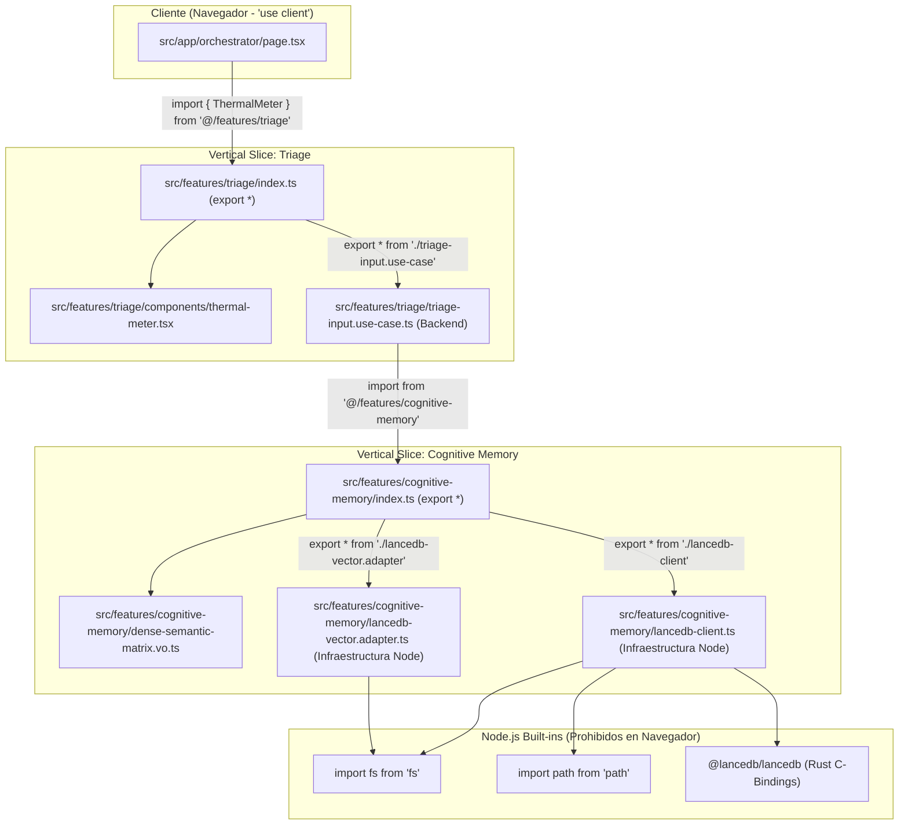
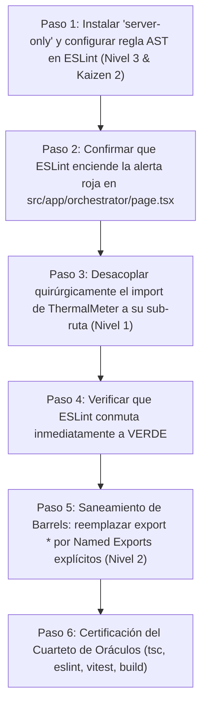

# [ARQUITECTURA] Documento Destilado: PBI - Blindaje de Frontera Cliente-Servidor y Erradicación de Contaminación por Barrel Files (LanceDB fs)

**Identificador:** PBI-ARCH-ISOL-001  
**Estatus:** Realizado (S+ Grade)  
**Fecha de Creación:** 2026-09-27  
**Fecha de Culminación:** 2026-09-27  
**Historia de Usuario Relacionada:** [[ARQUITECTURA] Historia de Usuario 8 (Refinada): Gamificación Sensorial y Medidor Térmico Agnóstico (UI-UX)](file:///home/racso/Proyectos/BarcelonaXplorer/Documentacion/HistoriasDeUsuario/%5BARQUITECTURA%5D%20Historia%20de%20Usuario%208%20%28Refinada%29:%20Gamificaci%C3%B3n%20Sensorial%20y%20Medidor%20T%C3%A9rmico%20Agn%C3%B3stico%20%28UI-UX%29.md) / [[OPERATIVO] Historia de Usuario 10: Gamificación Logística y Escudo de Supervivencia (Fase de Generación)](file:///home/racso/Proyectos/BarcelonaXplorer/Documentacion/HistoriasDeUsuario/%5BOPERATIVO%5D%20Historia%20de%20Usuario%2010:%20Gamificaci%C3%B3n%20Log%C3%ADstica%20y%20Escudo%20de%20Supervivencia%20%28Fase%20de%20Generaci%C3%B3n%29.md)  
**Módulos Afectados:** `src/app/orchestrator/`, `src/features/triage/`, `src/features/cognitive-memory/`, `src/features/planner/`, `src/vitest.config.ts`, `src/eslint.config.mjs`  
**Entorno:** Next.js 16.3.5 (Turbopack / App Router), React 19 Client Component, LanceDB 0.37.1, Node.js Built-ins (`fs`, `path`), Vitest 4.1.11  
**Prioridad:** Alta (P0 - Bloqueante crítico de compilación en `npm run build` y fallo 500 en `/orchestrator`)  
**Estimación Táctica:** 2 Story Points  

---

### Matriz de Indexación Tridimensional (Protocolo de Acero)

- **Naturaleza:** Resolución y blindaje estructural contra el fallo de compilación/runtime en Turbopack/Next.js (`Module not found: Can't resolve 'fs'`), ocasionado por la fuga de adaptadores de infraestructura nativos de Node.js (`lancedb-client.ts`, `lancedb-vector.adapter.ts`) hacia el bundle del navegador vía exportaciones globales indiscriminadas (`export *`) en archivos barril (*barrel files*).
- **Entorno:** `src/app/orchestrator/page.tsx` (`"use client"`), `src/features/triage/index.ts`, `src/features/cognitive-memory/index.ts`, `src/next.config.ts`, `src/eslint.config.mjs`, `src/vitest.config.ts`.
- **Entropía Asimilada (Filtros A, B y C):**
  - *Filtro A (Tolerancia Cero a la Inferencia y Contaminación de Capas):* Erradicación absoluta de dependencias de servidor (`fs`, `path`, `@lancedb/lancedb`, `@prisma/client`) en artefactos de cliente web.
  - *Filtro B (Aislamiento Canónico y Proscripción de `export *`):* Sustitución de comodines ciegos de re-exportación por **Named Exports Explícitos** en los barrels de cada slice, asegurando que la superficie de exportación pública sea finita, determinista y trazable.
  - *Filtro C (Protección Inmunológica y Prioridad Invertida):* Aplicación táctica *Linter-First / Shield-First* (configuración previa de reglas ESLint AST y `server-only` con soporte en Vitest) para que la propia aduana de fricción valide de forma inmediata y automática la hermeticidad de la corrección.

---

## 1. Declaración de Intención (INVEST)

**Como** Ingeniero de Software y Arquitecto de BarcelonaXplorer,  
**Quiero** aislar herméticamente las dependencias de servidor e infraestructura nativa de Node.js respecto a los componentes de cliente de React,  
**Para** eliminar el error de compilación `Can't resolve 'fs'`, permitir la generación exitosa del bundle de producción (`npm run build`) y asegurar que ningún secreto o lógica de persistencia pesada se filtre al navegador del usuario final.

---

## 2. Auditoría Técnica de la Casuística (Root Cause Analysis)

### 2.1 Síntoma Clínico
Al compilar la aplicación (`npm run build`) o solicitar en desarrollo la ruta del orquestador (`GET /orchestrator`), el servidor arrojaba un error 500 ininterrumpido:

```text
GET /orchestrator 500 in 188ms (next.js: 94ms, application-code: 94ms)
[browser] Uncaught Error: ./features/cognitive-memory/lancedb-client.ts:2:1
Error: Module not found: Can't resolve 'fs'
  1 | import * as lancedb from '@lancedb/lancedb';
> 2 | import fs from 'fs';
    | ^^^^^^^^^^^^^^^^^^^^
  3 | import path from 'path';

Import traces:
  Client Component Browser:
    ./features/cognitive-memory/lancedb-client.ts [Client Component Browser]
    ./features/cognitive-memory/index.ts [Client Component Browser]
    ./features/triage/triage-input.use-case.ts [Client Component Browser]
    ./features/triage/index.ts [Client Component Browser]
    ./app/orchestrator/page.tsx [Client Component Browser]
    ./app/orchestrator/page.tsx [Server Component]
```

### 2.2 Grafo de Propagación de Dependencias (Contaminación de Barrels)



### 2.3 Diagnóstico de Causa Raíz
1. **Contaminación de Barrel Export (Barrel File Contamination):**  
   El archivo `src/features/triage/index.ts` agrupaba en un único punto de exportación tanto componentes visuales de presentación de React (`ThermalMeter`, con `"use client"`) como orquestadores pesados del servidor (`TriageInputUseCase`, `ContextualIgnitionUseCase`, adaptadores meteorológicos).
2. **Propagación Descontrolada por `export *`:**  
   El uso indiscriminado del patrón `export * from '...'` en los `index.ts` neutralizaba la visibilidad de los límites del módulo y exponía hacia el exterior cualquier artefacto interno, propagando transitivamente todo el árbol de dependencias hacia el consumidor.
3. **Importación No Granular en el Consumidor:**  
   En [`src/app/orchestrator/page.tsx`](file:///home/racso/Proyectos/BarcelonaXplorer/src/app/orchestrator/page.tsx#L11), se importaba el componente visual desde la raíz del barrel:  
   `import { ThermalMeter } from '@/features/triage';`  
   Al resolver este módulo, Turbopack/Webpack analizaba todo el árbol de exportaciones del barrel para construir el grafo de empaquetado del cliente.
4. **Colisión de Runtime (Node.js vs Browser):**  
   `lancedb-client.ts` invoca `import fs from 'fs'` y `import path from 'path'`. En el entorno del navegador, las APIs de sistema de archivos local de Node.js no existen. Aunque `next.config.ts` declara `serverExternalPackages: ['@lancedb/lancedb', 'apache-arrow']`, este ajuste solo exime a los paquetes en el runtime de Node.js, pero no previene el fallo si el empaquetador del navegador intenta evaluar el módulo debido a una importación transitiva en un Client Component.
5. **Brecha en el Peaje del Oráculo:**  
   La tríada de oráculos (`tsc --noEmit`, `eslint`, `vitest run`) se ejecutaba exitosamente al 100% verde:
   - `tsc --noEmit` validaba tipos mediante `@types/node` (donde `fs` es un módulo completamente válido).
   - `vitest run` corría en entorno Node.js / jsdom donde `fs` está disponible.
   - `eslint` no contaba con reglas AST de segregación de imports (`no-restricted-imports`).

---

## 3. Recomendaciones Complementarias de Forja

A fin de garantizar que la intervención sea definitiva, hermética y libre de efectos colaterales en la suite de pruebas o en el grafo de dependencias, se incorporaron las siguientes tres directrices operativas:

### 3.1 Atención y Proscripción de `export *` en Barrels
- **Riesgo:** El patrón `export * from './modulo'` actúa como un comodín ciego. Si en el futuro un archivo auxiliar incorpora una utilidad que depende de Node.js o de un secreto de backend, dicha dependencia se filtrará automáticamente a través del barrel sin que el desarrollador lo advierta.
- **Directiva Aplicada:** Sustituir los comodines `export *` por **Named Exports Explícitos** (`export { MiComponente, MiTipo } from './modulo'`). De este modo, el contrato público de cada Vertical Slice es estrictamente determinista y el grafo de compilación permanece inmune a sub-dependencias imprevistas.

### 3.2 Aislamiento y Resiliencia de Mocks en Testing (`server-only` vs Vitest)
- **Riesgo:** El paquete `server-only` de Next.js está diseñado para lanzar un error fatal si se resuelve fuera del contexto de React Server Components. Dado que Vitest ejecuta las pruebas en un entorno Node.js / jsdom convencional, la simple presencia de `import 'server-only'` en un adaptador o cliente de base de datos podría quebrar la ejecución de las pruebas unitarias existentes (`vitest run`).
- **Directiva Aplicada:** Configurado el alias en [`src/vitest.config.ts`](file:///home/racso/Proyectos/BarcelonaXplorer/src/vitest.config.ts):
  ```typescript
  resolve: {
    alias: {
      'server-only': path.resolve(__dirname, 'node_modules/next/dist/compiled/server-only/empty.js'),
    }
  }
  ```
  De esta forma, `server-only` cumple su cometido de centinela estricto en Turbopack/Next.js sin interferir con la suite de pruebas unitarias de Vitest.

### 3.3 Prioridad Táctica de Ejecución (Aduana Preventiva First)
El orden de implementación siguió una **secuencia invertida de aduana**:



---

## 4. Criterios de Aceptación (Aduana de Fricción)

- [x] **CA-1 (Prioridad 1 - Regla AST en ESLint y Centinela `server-only`):**  
  - Instalado `server-only` en `src/package.json`.
  - Configurada en [`src/eslint.config.mjs`](file:///home/racso/Proyectos/BarcelonaXplorer/src/eslint.config.mjs) la regla `no-restricted-imports` para prohibir la importación de `fs`, `node:fs`, `@lancedb/lancedb`, `@prisma/client` y barrels de backend (`@/features/triage`) en vistas y componentes UI.
  - Inyectada la directiva `import 'server-only';` en [`src/features/cognitive-memory/lancedb-client.ts`](file:///home/racso/Proyectos/BarcelonaXplorer/src/features/cognitive-memory/lancedb-client.ts), [`src/features/cognitive-memory/lancedb-vector.adapter.ts`](file:///home/racso/Proyectos/BarcelonaXplorer/src/features/cognitive-memory/lancedb-vector.adapter.ts) y [`src/features/cognitive-memory/lancedb-cognitive-memory.adapter.ts`](file:///home/racso/Proyectos/BarcelonaXplorer/src/features/cognitive-memory/lancedb-cognitive-memory.adapter.ts).
- [x] **CA-2 (Prioridad 1 - Resiliencia de Testing en Vitest):**  
  Configurado en [`src/vitest.config.ts`](file:///home/racso/Proyectos/BarcelonaXplorer/src/vitest.config.ts) el alias para `server-only` apuntando a `next/dist/compiled/server-only/empty.js`, certificando 81 archivos de test al 100% verde sin falsos positivos.
- [x] **CA-3 (Prioridad 2 - Desacoplamiento Inmediato en el Orquestador):**  
  Modificado [`src/app/orchestrator/page.tsx`](file:///home/racso/Proyectos/BarcelonaXplorer/src/app/orchestrator/page.tsx#L11) importando el componente visual desde su sub-ruta colocada:  
  `import { ThermalMeter } from '@/features/triage/components/thermal-meter';`  
  Validando de inmediato que la regla de ESLint de CA-1 conmuta de error rojo a estado verde.
- [x] **CA-4 (Prioridad 3 - Erradicación de `export *` y Named Exports Explícitos en Barrels):**  
  - En [`src/features/triage/index.ts`](file:///home/racso/Proyectos/BarcelonaXplorer/src/features/triage/index.ts): Erradicados todos los comodines `export *` y sustituidos por named exports explícitos. Erradicada la re-exportación de `ThermalMeter`.
  - En [`src/features/cognitive-memory/index.ts`](file:///home/racso/Proyectos/BarcelonaXplorer/src/features/cognitive-memory/index.ts): Erradicados los comodines `export *` y tipados explícitamente todos los puertos, Value Objects y adaptadores.
- [x] **CA-5 (Prioridad 4 - Verificación de Compilación Limpia con Turbopack):**  
  Ejecución exitosa de `npm run build` en `src/`, completando la optimización de las 14/14 páginas estáticas y dinámicas (incluyendo `/orchestrator`) sin errores ni advertencias de `fs`.
- [x] **CA-6 (Prioridad 4 - Certificación del Cuarteto de Oráculos):**  
  Superación íntegra de `tsc --noEmit`, `npm run lint`, `npm run test` (81 files / 424 tests passed) y `npm run build` (Turbopack standalone output exit code 0).

---

## 5. Plan de Acción Kaizen (Prevención y Detección Continua)

| Acción Kaizen | Mecanismo | Beneficio Táctico |
| :--- | :--- | :--- |
| **Kaizen 1: Elevación de la Santa Trinidad a Cuarteto de Oráculos** | Incorporado `npm run build` en la verificación local previa a commits y despliegues Ansistrano. | Detección determinista de colisiones de empaquetado del navegador (Turbopack) antes del push. |
| **Kaizen 2: Regla AST de Aislamiento de Imports en ESLint** | Regla `no-restricted-imports` activa en `eslint.config.mjs` para archivos de UI y cliente. | Bloqueo inmediato en el IDE si se intenta importar módulos nativos o barrels de backend en UI. |
| **Kaizen 3: Inmunización Sistemática con `server-only`** | Directiva obligatoria en cabeceras de infraestructura nativa de Node. | Error fatal automático en tiempo de build si se rompe la frontera cliente-servidor. |
| **Kaizen 4: Dogma de Named Exports y Pureza de Barrels** | Proscripción de `export *` en favor de named exports explícitos en todos los slices. | Preservación de la economía termodinámica y erradicación del acoplamiento parasitario. |

---

## 6. Evidencia de Certificación de Oráculos (Cuarteto S+ Grade)

### 1. Compilador TypeScript (`tsc --noEmit`):
```bash
npx tsc --noEmit
# Exit code: 0 (Cero errores de tipos)
```

### 2. Linter AST (`npm run lint` con regla `no-restricted-imports` activa):
```bash
npm run lint
# > temp_app@0.1.0 lint
# > eslint
# Exit code: 0 (0 errores, 0 warnings)
```

### 3. Suite de Pruebas Unitarias e Integración (`npm run test` con alias `server-only` en Vitest):
```bash
npm run test
# Test Files: 81 passed (81)
# Tests: 424 passed (424)
# Duration: 25.71s
# Exit code: 0 (100% verde)
```

### 4. Empaquetador de Producción (`npm run build` con Turbopack):
```bash
npm run build
# ▲ Next.js 16.3.5 (Turbopack)
# ✓ Compiled successfully in 4.9s
# Finished TypeScript in 7.4s
# Generating static pages using 7 workers (14/14)
# Finalizing page optimization in 1159ms
# Exit code: 0 (Compilación de producción exitosa)
```
