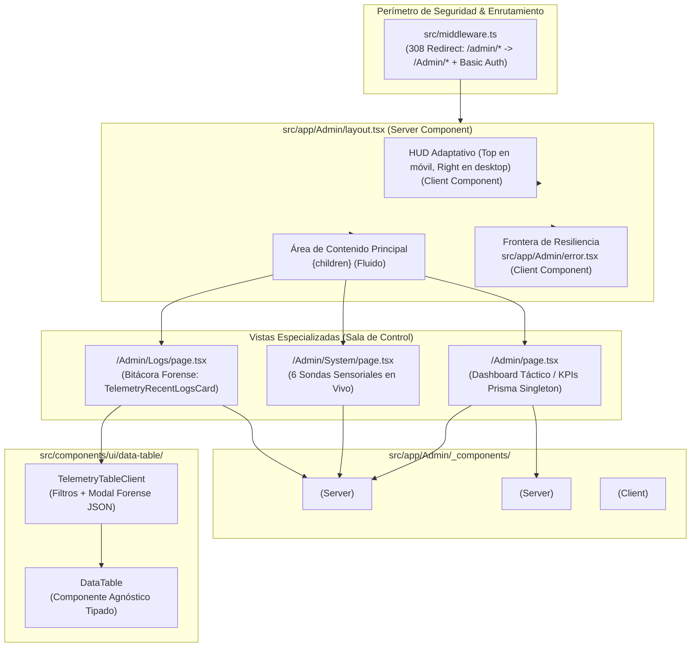

# [OPERATIVO] Documento Destilado: PBI - Forja de la Sala de Control y Dashboard Táctico (/Admin)

**Identificador:** PBI-ADMIN-CORE-002  
**Estatus:** Implementado y Validado S+ Grade  
**Historia de Usuario Relacionada:** [HU 2.2: Anclaje Táctico y Persistencia de Larga Duración (Telegram Bridge)](file:///home/racso/Proyectos/BarcelonaXplorer/Documentacion/HistoriasDeUsuario/Historia%20de%20Usuario%202.2:%20Anclaje%20T%C3%A1ctico%20y%20Persistencia%20de%20Larga%20Duraci%C3%B3n%20%28Telegram%20Bridge%29.md)  
**Módulo:** Módulo de Telemetría, Observabilidad y Gobernanza Sensorial ([`/Admin`](file:///home/racso/Proyectos/BarcelonaXplorer/src/app/Admin))  
**Entorno:** Next.js App Router (Server & Client Components), Tailwind CSS v4, Prisma ORM (MySQL), Lucide React / Nodo de Producción 11  
**Prioridad:** Alta (P1 - Gobernanza de Infraestructura, Ergonomía Operativa y Rendimiento de Renderizado)  
**Estimación Táctica:** 5 Story Points  

---

### Matriz de Indexación Tridimensional (Protocolo de Acero)

- **Naturaleza:** Reestructuración Arquitectónica UI/UX, Componentización Táctica (*Single Responsibility Principle* - SRP), Enrutamiento Anidado (*Nested Layouts*), Resiliencia Perimetral (*Error Boundaries*) y Segregación Térmica de Renderizado.
- **Entorno:** Ecosistema interno de administración ([`src/app/Admin/`](file:///home/racso/Proyectos/BarcelonaXplorer/src/app/Admin)), Server Components por defecto, Client Components segregados en las hojas (`'use client'`), singleton centralizado de persistencia ([`@/infrastructure/persistence/prisma`](file:///home/racso/Proyectos/BarcelonaXplorer/src/infrastructure/persistence/prisma.ts)), tokens visuales Tailwind CSS v4 (`bg-surface-canvas`, `bg-surface-container`, `border-layout-divider`, `text-content-primary`), Nodo de Producción 11.
- **Entropía Asimilada (Filtros A, B y C):** 
  - *Filtro C (Eficiencia Operativa / Cero Ruido):* Prevención de la degradación del DOM por sobrecarga de tablas masivas junto a sondas activas en la misma vista. Desacople del panel monolítico actual de [`/Admin/System`](file:///home/racso/Proyectos/BarcelonaXplorer/src/app/Admin/System/page.tsx) hacia un centro de mando unificado (**Sala de Control**) segmentado en tres visiones especializadas:
    1. **Visión Estratégica ([`/Admin`](file:///home/racso/Proyectos/BarcelonaXplorer/src/app/Admin)):** Dashboard ejecutivo con KPIs en tiempo real inyectados vía Prisma (usuarios anclados, tracción 24h, densidad de fricción e incidentes críticos).
    2. **Visión Sensorial ([`/Admin/System`](file:///home/racso/Proyectos/BarcelonaXplorer/src/app/Admin/System)):** Monitoreo en vivo de sondas y motores (MySQL, Red/Aduana, Gemini, Groq, Jev AI, Telegram Bot) liberado del coste de renderizado de la bitácora.
    3. **Visión Táctica y Forense ([`/Admin/Logs`](file:///home/racso/Proyectos/BarcelonaXplorer/src/app/Admin/Logs)):** Bitácora dedicada que orquesta el componente agnóstico [`DataTable<TelemetryLogItem>`](file:///home/racso/Proyectos/BarcelonaXplorer/src/components/ui/data-table/data-table.tsx) mediante [`TelemetryTableClient`](file:///home/racso/Proyectos/BarcelonaXplorer/src/app/Admin/System/TelemetryTableClient.tsx) con paginación, filtros de severidad/contexto y visor modal forense JSON.
  - *Filtro A (Rigor Técnico y Ausencia de Alucinación):* Erradicación de fugas de conexión a base de datos mediante la consolidación del singleton global `prisma` y blindaje contra caídas transitorias de MySQL mediante la incorporación de una frontera de error dedicada ([`src/app/Admin/error.tsx`](file:///home/racso/Proyectos/BarcelonaXplorer/src/app/Admin/error.tsx)).
  - *Filtro B (Esencia y Ergonomía Operativa):* Adopción de un menú lateral táctico derecho (**HUD**) con ordenamiento adaptativo (`order-first lg:order-last`) que garantiza acceso inmediato a la navegación en viewports móviles sin quedar sepultado tras tablas extensas, delegando la normalización de URLs (`/admin` -> `/Admin`) a la Redirección Canónica 308 (RFC 7617) operada de forma perimetral por [`src/middleware.ts`](file:///home/racso/Proyectos/BarcelonaXplorer/src/middleware.ts).

---

## 1. Declaración de Intención (INVEST)

**Como** Operador Técnico y Arquitecto del Sistema (Racso),  
**Quiero** estructurar la interfaz del ecosistema `/Admin` aislando sus componentes visuales clave en el directorio privado `src/app/Admin/_components/`, centralizando la persistencia mediante un singleton global y segregando la información en rutas temáticas anidadas (`/Admin` [Dashboard], `/Admin/System` [Sensores], `/Admin/Logs` [Bitácora]),  
**Para** gobernar el Nodo 11 sin sobrecarga térmica visual ni saturación cognitiva, interactuar con un menú lateral táctico (HUD) responsivo que no quede sepultado en móviles ni interrumpa el escaneo tabular de datos, y disponer de un panel principal (Dashboard) resiliente que inyecte métricas homogéneas en tiempo real (anclajes, tracción e incidentes) sin riesgo de colapsar el pool de conexiones de MySQL ni derribar la aplicación ante intermitencias transitorias.

---

## 2. Justificación Arquitectónica (La Vía del Yunque y Principios Fundacionales)

1. **Principio de Responsabilidad Única (SRP) en UI y Directorio Privado `_components/`:**  
   Se prohíbe incrustar lógica de navegación iterativa, cabeceras repetitivas o tarjetas de métricas directamente en archivos `page.tsx` o `layout.tsx`. La forja exige un directorio privado [`src/app/Admin/_components/`](file:///home/racso/Proyectos/BarcelonaXplorer/src/app/Admin/_components/) que aísle las piezas reutilizables: `<AdminSidebarRight />`, `<KpiMetricCard />` y `<AdminPageHeader />`.

2. **Aislamiento de Entornos de Renderizado (Server vs. Client Components):**  
   El menú lateral requiere el hook `usePathname()` para iluminar dinámicamente la sección activa (`bg-emerald-50 text-emerald-800 border-emerald-500`), lo que obliga al uso de la directiva `'use client'`. Al encapsular este comportamiento estrictamente dentro del componente `<AdminSidebarRight />`, el layout raíz [`src/app/Admin/layout.tsx`](file:///home/racso/Proyectos/BarcelonaXplorer/src/app/Admin/layout.tsx) se preserva como un *Server Component* puro. Esto evita empaquetar JavaScript innecesario en el cliente y permite que las páginas anidadas transmitan su contenido mediante streaming y Suspense sin fricciones.

3. **Singleton Global de Persistencia contra el Agotamiento del Pool de Conexiones:**  
   Se prohíbe terminantemente la instanciación local `new PrismaClient()` dentro de módulos de rutas o componentes del servidor (`page.tsx`, `layout.tsx`). En el ciclo de vida de Next.js (y de los contenedores Docker en el Nodo 11), cada recarga o concurrencia instanciaría clientes independientes, saturando rápidamente el límite `max_connections` de MySQL. La persistencia se centraliza bajo [`src/infrastructure/persistence/prisma.ts`](file:///home/racso/Proyectos/BarcelonaXplorer/src/infrastructure/persistence/prisma.ts), exportando un singleton amarrado a `globalThis`.

4. **Resiliencia Térmica y Fronteras de Error ([`src/app/Admin/error.tsx`](file:///home/racso/Proyectos/BarcelonaXplorer/src/app/Admin/error.tsx)):**  
   Si MySQL experimenta un reinicio de contenedor o latencia transitoria durante la ejecución de las consultas concurrentes (`Promise.all`), el fallo no debe derribar la aplicación con un error HTTP 500 descontrolado. Se introduce [`src/app/Admin/error.tsx`](file:///home/racso/Proyectos/BarcelonaXplorer/src/app/Admin/error.tsx) como límite de contención táctica (Client Component), preservando intacto el layout y el menú HUD lateral, permitiendo al operador reintentar la sonda atómica (`reset()`) sin perder el contexto operativo.

5. **Ergonomía Táctica Omnicanal y Orden Adaptativo del HUD (`order-first lg:order-last`):**  
   En viewports móviles y tablets (`< 1024px`), un menú lateral situado al final del árbol visual queda sepultado tras decenas de registros tabulares en `/Admin/Logs`. Para garantizar un cambio de contexto inmediato en cualquier factor de forma, el layout aplica `order-first lg:order-last`, posicionando la navegación táctica en la parte superior en pantallas pequeñas y como barra lateral fija a la derecha en pantallas grandes.

6. **Homogeneización del Ecosistema Tabular ([`DataTable<T>`](file:///home/racso/Proyectos/BarcelonaXplorer/src/components/ui/data-table/data-table.tsx)):**  
   Siguiendo el estándar de diseño de componentes agnósticos del proyecto, [`TelemetryTableClient`](file:///home/racso/Proyectos/BarcelonaXplorer/src/app/Admin/System/TelemetryTableClient.tsx) actúa como el orquestador de dominio que consume [`DataTable<TelemetryLogItem>`](file:///home/racso/Proyectos/BarcelonaXplorer/src/components/ui/data-table/data-table.tsx), inyectando el array tipado `ColumnDef<TelemetryLogItem>[]`, filtros por severidad (`ERROR`, `WARN`, `INFO`), búsqueda contextual y el modal forense para inspección de payloads JSON.

7. **Erradicación de Fricción Case-Sensitive (Redirección Canónica 308 Perimetral):**  
   El frontend no implementa lógica redundante de normalización o validación de casing. Cualquier intento de acceso tecleado en minúscula (`/admin`, `/admin/system`, `/admin/logs`) es interceptado en el perímetro por [`src/middleware.ts`](file:///home/racso/Proyectos/BarcelonaXplorer/src/middleware.ts), el cual emite un HTTP 308 Permanent Redirect (RFC 7617) hacia `/Admin`, preservando las credenciales de HTTP Basic Auth y unificando el almacenamiento seguro de sesión del navegador.

8. **Protección de la Latencia y Segregación Térmica (`force-dynamic`):**  
   Al aislar la bitácora interactiva en `/Admin/Logs`, la ruta `/Admin/System` queda completamente descargada de cálculos pesados de DOM, permitiendo que el sondeo concurrente de sondas síncronas (MySQL, Red, Telegram con corte a 3500ms, Groq, Gemini, Jev AI) mantenga una respuesta instantánea.

---

## 3. Topología de Componentes Tácticos y Arquitectura de Rutas



### Detalle de Módulos Reutilizables ([`src/app/Admin/_components/`](file:///home/racso/Proyectos/BarcelonaXplorer/src/app/Admin/_components/))

1. **`<AdminSidebarRight />` (Client Component - `'use client'`):**
   - **Propósito:** HUD táctico de navegación para alternar fluidamente entre las tres visiones de la Sala de Control.
   - **Adaptabilidad Responsiva:** Renderiza con `order-first lg:order-last`, comportándose como barra de herramientas superior compacta en viewports estrechos (`< 1024px`) y como panel lateral anclado al margen derecho en escritorio (`lg:w-64`).
   - **Comportamiento Reactivo:** Utiliza `usePathname()` para evaluar la ruta activa y aplicar clases visuales de forja (anillo `border-emerald-500`, fondo `bg-emerald-50 text-emerald-800`).
   - **Rutas Vinculadas:**
     - `/Admin`: *Dashboard Táctico* (Icono: `LayoutDashboard`).
     - `/Admin/System`: *Sondas y Sensores* (Icono: `Activity`).
     - `/Admin/Logs`: *Bitácora Sensorial* (Icono: `Terminal`).
   - **Indicadores Tácticos:** Mini badges de estado (ej. "Nodo 11") y enlace rápido de regreso a la vista pública (`/`).

2. **`<KpiMetricCard />` (Server Component):**
   - **Propósito:** Tarjeta atómica y reutilizable para representar indicadores cuantitativos con semáforos cualitativos.
   - **Propiedades Tipadas:** `title`, `value` (`string | number`), `description`, `icon`, `trend` (`'positive' | 'negative' | 'neutral' | 'warning'`), `trendLabel`.
   - **Diseño Visual:** Adherencia a los tokens de la forja (`bg-surface-container`, `border-layout-divider`, `text-content-primary`), garantizando coherencia semántica en los semáforos cromáticos.

3. **`<AdminPageHeader />` (Server Component):**
   - **Propósito:** Normalizar de forma homogénea las cabeceras de cada una de las páginas operativas de la Sala de Control.
   - **Propiedades Tipadas:** `title`, `description`, `icon`, `badge`, `action`.
   - **Diseño Visual:** Tipografía de precisión técnica, borde inferior divisor (`border-layout-divider`) y espaciado consistente.

---

## 4. Especificación Técnica de Contratos, Tipos y Consultas Prisma

### 4.0. Singleton Global de Persistencia ([`src/infrastructure/persistence/prisma.ts`](file:///home/racso/Proyectos/BarcelonaXplorer/src/infrastructure/persistence/prisma.ts))

```typescript
import { PrismaClient } from '@prisma/client';

const globalForPrisma = globalThis as unknown as {
  prismaClient?: PrismaClient;
};

export const prisma =
  globalForPrisma.prismaClient ??
  new PrismaClient({
    log: process.env.NODE_ENV === 'development' ? ['warn', 'error'] : ['error'],
  });

if (process.env.NODE_ENV !== 'production') {
  globalForPrisma.prismaClient = prisma;
}
```

---

### 4.1. Contratos TypeScript de Componentes Base

#### [`src/app/Admin/_components/AdminPageHeader.tsx`](file:///home/racso/Proyectos/BarcelonaXplorer/src/app/Admin/_components/AdminPageHeader.tsx)
```typescript
import { ReactNode } from 'react';

export interface AdminPageHeaderProps {
  readonly title: string;
  readonly description?: string;
  readonly icon?: ReactNode;
  readonly badge?: ReactNode;
  readonly action?: ReactNode;
}

export function AdminPageHeader({
  title,
  description,
  icon,
  badge,
  action,
}: AdminPageHeaderProps) {
  return (
    <div className="flex flex-col sm:flex-row sm:items-center justify-between pb-4 border-b border-layout-divider gap-4 mb-6">
      <div className="space-y-1">
        <div className="flex items-center gap-3">
          {icon}
          <h1 className="text-2xl sm:text-3xl font-bold tracking-tight text-content-primary">
            {title}
          </h1>
          {badge}
        </div>
        {description && (
          <p className="text-sm text-content-meta font-mono">
            {description}
          </p>
        )}
      </div>
      {action && <div className="flex items-center gap-2">{action}</div>}
    </div>
  );
}
```

#### [`src/app/Admin/_components/KpiMetricCard.tsx`](file:///home/racso/Proyectos/BarcelonaXplorer/src/app/Admin/_components/KpiMetricCard.tsx)
```typescript
import { ReactNode } from 'react';
import { Card, CardContent, CardHeader, CardTitle } from '@/components/ui/card';

export type KpiTrend = 'positive' | 'negative' | 'neutral' | 'warning';

export interface KpiMetricCardProps {
  readonly title: string;
  readonly value: string | number;
  readonly description?: string;
  readonly icon?: ReactNode;
  readonly trend?: KpiTrend;
  readonly trendLabel?: string;
}

export function KpiMetricCard({
  title,
  value,
  description,
  icon,
  trend = 'neutral',
  trendLabel,
}: KpiMetricCardProps) {
  const trendClasses: Record<KpiTrend, string> = {
    positive: 'text-emerald-700 bg-emerald-50 border-emerald-200',
    negative: 'text-red-700 bg-red-50 border-red-200',
    warning: 'text-amber-700 bg-amber-50 border-amber-200',
    neutral: 'text-zinc-600 bg-zinc-50 border-zinc-200',
  };

  return (
    <Card className="bg-surface-container border-layout-divider shadow-sm hover:border-layout-divider-strong transition-colors">
      <CardHeader className="flex flex-row items-center justify-between space-y-0 pb-2">
        <CardTitle className="text-sm font-medium text-content-meta">
          {title}
        </CardTitle>
        {icon && <div className="text-zinc-400">{icon}</div>}
      </CardHeader>
      <CardContent>
        <div className="text-2xl sm:text-3xl font-bold font-mono text-content-primary">
          {value}
        </div>
        {(description || trendLabel) && (
          <div className="flex items-center gap-2 mt-2">
            {trendLabel && (
              <span className={`inline-flex items-center px-1.5 py-0.5 rounded text-xs font-mono font-medium border ${trendClasses[trend]}`}>
                {trendLabel}
              </span>
            )}
            {description && (
              <p className="text-xs text-content-meta truncate">
                {description}
              </p>
            )}
          </div>
        )}
      </CardContent>
    </Card>
  );
}
```

#### [`src/app/Admin/_components/AdminSidebarRight.tsx`](file:///home/racso/Proyectos/BarcelonaXplorer/src/app/Admin/_components/AdminSidebarRight.tsx)
```typescript
'use client';

import Link from 'next/link';
import { usePathname } from 'next/navigation';
import { LayoutDashboard, Activity, Terminal, ArrowUpRight, ShieldCheck } from 'lucide-react';

interface NavItem {
  readonly label: string;
  readonly href: string;
  readonly icon: typeof LayoutDashboard;
  readonly badge?: string;
}

const NAV_ITEMS: readonly NavItem[] = [
  { label: 'Dashboard', href: '/Admin', icon: LayoutDashboard },
  { label: 'Sensores', href: '/Admin/System', icon: Activity },
  { label: 'Bitácora', href: '/Admin/Logs', icon: Terminal },
];

export function AdminSidebarRight() {
  const pathname = usePathname();

  const isItemActive = (href: string) => {
    if (href === '/Admin') {
      return pathname === '/Admin';
    }
    return pathname.startsWith(href);
  };

  return (
    <aside className="w-full lg:w-64 border-b lg:border-b-0 lg:border-l border-layout-divider bg-surface-container/80 backdrop-blur-sm p-4 sm:p-6 flex flex-col justify-between shrink-0">
      <div className="space-y-4 lg:space-y-6">
        <div className="flex items-center justify-between pb-3 border-b border-layout-divider">
          <div className="flex items-center gap-2 text-content-primary font-bold text-sm">
            <ShieldCheck className="w-4 h-4 text-emerald-600" />
            <span>SALA DE CONTROL</span>
          </div>
          <span className="text-[10px] font-mono font-semibold px-2 py-0.5 bg-emerald-100 text-emerald-800 rounded-full border border-emerald-200">
            NODO 11
          </span>
        </div>

        <nav className="flex flex-row lg:flex-col gap-1 overflow-x-auto pb-1 lg:pb-0">
          <p className="hidden lg:block text-[11px] font-mono uppercase tracking-wider text-content-meta mb-2 px-3">
            Navegación Táctica
          </p>
          {NAV_ITEMS.map((item) => {
            const Icon = item.icon;
            const active = isItemActive(item.href);
            return (
              <Link
                key={item.href}
                href={item.href}
                className={`flex items-center justify-between px-3 py-2 lg:py-2.5 rounded-lg text-sm font-medium whitespace-nowrap transition-all ${
                  active
                    ? 'bg-emerald-50 text-emerald-900 font-semibold border border-emerald-300 shadow-xs'
                    : 'text-content-secondary hover:bg-surface-subtle hover:text-content-primary'
                }`}
              >
                <div className="flex items-center gap-2.5">
                  <Icon className={`w-4 h-4 ${active ? 'text-emerald-600' : 'text-zinc-400'}`} />
                  <span>{item.label}</span>
                </div>
                {item.badge && (
                  <span className="hidden sm:inline-block text-[10px] font-mono px-1.5 py-0.2 rounded bg-zinc-200 text-zinc-700">
                    {item.badge}
                  </span>
                )}
              </Link>
            );
          })}
        </nav>
      </div>

      <div className="hidden lg:block pt-6 border-t border-layout-divider mt-6 space-y-3">
        <div className="text-xs text-content-meta font-mono space-y-1">
          <p className="flex items-center justify-between">
            <span>Seguridad:</span>
            <span className="text-emerald-600 font-semibold">Basic Auth (Edge)</span>
          </p>
          <p className="flex items-center justify-between">
            <span>Entorno:</span>
            <span className="text-zinc-700 font-semibold">Producción</span>
          </p>
        </div>

        <Link
          href="/"
          className="flex items-center justify-center gap-1.5 text-xs text-content-meta hover:text-content-primary border border-layout-divider rounded-md py-1.5 bg-surface-container transition-colors"
        >
          <span>Retornar al Ecosistema</span>
          <ArrowUpRight className="w-3.5 h-3.5" />
        </Link>
      </div>
    </aside>
  );
}
```

---

### 4.2. Layout de la Sala de Control ([`src/app/Admin/layout.tsx`](file:///home/racso/Proyectos/BarcelonaXplorer/src/app/Admin/layout.tsx))

```typescript
import { ReactNode } from 'react';
import { AdminSidebarRight } from './_components/AdminSidebarRight';

export default function AdminRootLayout({
  children,
}: {
  readonly children: ReactNode;
}) {
  return (
    <div className="min-h-screen bg-surface-canvas text-content-primary font-sans flex flex-col lg:flex-row">
      <main className="flex-1 min-w-0 order-last lg:order-first">
        {children}
      </main>

      <div className="order-first lg:order-last">
        <AdminSidebarRight />
      </div>
    </div>
  );
}
```

---

### 4.3. Frontera de Error y Resiliencia ([`src/app/Admin/error.tsx`](file:///home/racso/Proyectos/BarcelonaXplorer/src/app/Admin/error.tsx))

```typescript
'use client';

import { useEffect } from 'react';
import { AlertTriangle, RefreshCw } from 'lucide-react';
import { Button } from '@/components/ui/button';

export default function AdminErrorBoundary({
  error,
  reset,
}: {
  readonly error: Error & { digest?: string };
  readonly reset: () => void;
}) {
  useEffect(() => {
    console.error('[AdminErrorBoundary] Fricción no controlada capturada:', error);
  }, [error]);

  return (
    <div className="p-6 sm:p-12 max-w-2xl mx-auto my-12 bg-surface-container border border-red-200 rounded-xl shadow-sm text-center space-y-4">
      <div className="inline-flex p-3 bg-red-50 text-red-600 rounded-full border border-red-100">
        <AlertTriangle className="w-8 h-8" />
      </div>
      <h2 className="text-xl font-bold text-content-primary font-mono">
        Fricción Térmica en la Sala de Control
      </h2>
      <p className="text-sm text-content-meta max-w-md mx-auto">
        Se ha detectado una interrupción en el enlace de datos o persistencia del Nodo 11. El perímetro permanece seguro.
      </p>
      {error.digest && (
        <span className="inline-block text-[11px] font-mono px-2 py-1 bg-zinc-100 text-zinc-600 rounded border border-layout-divider">
          Firma: {error.digest}
        </span>
      )}
      <div className="pt-2">
        <Button
          onClick={() => reset()}
          className="bg-emerald-600 hover:bg-emerald-700 text-white font-mono text-xs gap-2"
        >
          <RefreshCw className="w-3.5 h-3.5" />
          Reintentar Sonda Táctica
        </Button>
      </div>
    </div>
  );
}
```

---

### 4.4. Dashboard Principal con Singleton y Métricas Homogéneas ([`src/app/Admin/page.tsx`](file:///home/racso/Proyectos/BarcelonaXplorer/src/app/Admin/page.tsx))

```typescript
import Link from 'next/link';
import { prisma } from '@/infrastructure/persistence/prisma';
import {
  Users,
  UserPlus,
  AlertTriangle,
  ShieldCheck,
  Activity,
  Terminal,
  ArrowRight,
  Gauge,
} from 'lucide-react';
import { Card, CardContent, CardHeader, CardTitle } from '@/components/ui/card';
import { AdminPageHeader } from './_components/AdminPageHeader';
import { KpiMetricCard } from './_components/KpiMetricCard';

export const dynamic = 'force-dynamic';

export default async function AdminDashboardPage() {
  const last24h = new Date(Date.now() - 24 * 60 * 60 * 1000);

  try {
    const [
      totalUsers,
      recentUsers,
      frictionAlerts,
      totalTelemetry24h,
      errorLogsCount,
    ] = await Promise.all([
      prisma.userAnchor.count(),
      prisma.userAnchor.count({
        where: { createdAt: { gte: last24h } },
      }),
      prisma.telemetryLog.count({
        where: {
          level: { in: ['ERROR', 'WARN'] },
          createdAt: { gte: last24h },
        },
      }),
      prisma.telemetryLog.count({
        where: { createdAt: { gte: last24h } },
      }),
      prisma.telemetryLog.count({
        where: { level: 'ERROR' },
      }),
    ]);

    const frictionRate =
      totalTelemetry24h > 0
        ? ((frictionAlerts / totalTelemetry24h) * 100).toFixed(1)
        : '0.0';

    return (
      <div className="p-4 sm:p-8 space-y-6 sm:space-y-8 max-w-7xl mx-auto">
        <AdminPageHeader
          title="Sala de Control: Dashboard Táctico"
          description="Métricas de retención B2C, anclajes omnicanal y fricción sensorial del Nodo 11"
          icon={<Gauge className="text-emerald-600 w-7 h-7 sm:w-8 sm:h-8" />}
          badge={
            <span className="text-xs font-mono font-medium px-2.5 py-1 rounded-md bg-emerald-50 text-emerald-800 border border-emerald-200">
              Simbiosis Activa
            </span>
          }
        />

        <div className="grid gap-4 sm:gap-6 grid-cols-1 sm:grid-cols-2 lg:grid-cols-4">
          <KpiMetricCard
            title="Fuerza Operativa Total"
            value={totalUsers}
            description="Exploradores con anclaje activo en Telegram"
            icon={<Users className="w-4 h-4" />}
            trend="positive"
            trendLabel="HU 2.2"
          />

          <KpiMetricCard
            title="Tracción de Umbral (24h)"
            value={recentUsers}
            description="Nuevos anclajes en las últimas 24 horas"
            icon={<UserPlus className="w-4 h-4" />}
            trend={recentUsers > 0 ? 'positive' : 'neutral'}
            trendLabel={recentUsers > 0 ? `+${recentUsers}` : 'Estable'}
          />

          <KpiMetricCard
            title="Densidad de Fricción (24h)"
            value={frictionAlerts}
            description={`${frictionRate}% del tráfico sensorial (${totalTelemetry24h} logs)`}
            icon={<AlertTriangle className="w-4 h-4" />}
            trend={frictionAlerts > 0 ? 'warning' : 'positive'}
            trendLabel={frictionAlerts > 0 ? `${frictionRate}% Fricción` : 'Óptimo'}
          />

          <KpiMetricCard
            title="Incidentes Críticos"
            value={errorLogsCount}
            description="Errores acumulados en la bitácora"
            icon={<ShieldCheck className="w-4 h-4" />}
            trend={errorLogsCount === 0 ? 'positive' : 'negative'}
            trendLabel={errorLogsCount === 0 ? '0 Fallos (S+)' : 'Revisar Bitácora'}
          />
        </div>

        <div className="grid gap-4 sm:gap-6 grid-cols-1 md:grid-cols-2 pt-2">
          <Card className="bg-surface-container border-layout-divider shadow-sm hover:border-layout-divider-strong transition-colors">
            <CardHeader className="flex flex-row items-center justify-between pb-2">
              <div className="flex items-center gap-2.5">
                <Activity className="w-5 h-5 text-emerald-600" />
                <CardTitle className="text-base font-bold text-content-primary">
                  Sondas y Sensores del Sistema
                </CardTitle>
              </div>
              <span className="text-[10px] font-mono px-2 py-0.5 rounded-full bg-emerald-100 text-emerald-800 border border-emerald-200">
                6 Sensores
              </span>
            </CardHeader>
            <CardContent className="space-y-4">
              <p className="text-xs text-content-meta">
                Auditoría en tiempo real de MySQL, salida perimetral DNS, motores LLM (Gemini, Groq, Jev AI) y el Gateway de Telegram Bot sin penalización de renderizado.
              </p>
              <Link
                href="/Admin/System"
                className="inline-flex items-center gap-1.5 text-xs font-mono font-medium text-emerald-700 hover:text-emerald-800 transition-colors"
              >
                <span>Inspeccionar Sondas</span>
                <ArrowRight className="w-3.5 h-3.5" />
              </Link>
            </CardContent>
          </Card>

          <Card className="bg-surface-container border-layout-divider shadow-sm hover:border-layout-divider-strong transition-colors">
            <CardHeader className="flex flex-row items-center justify-between pb-2">
              <div className="flex items-center gap-2.5">
                <Terminal className="w-5 h-5 text-emerald-600" />
                <CardTitle className="text-base font-bold text-content-primary">
                  Bitácora Sensorial de Telemetría
                </CardTitle>
              </div>
              <span className="text-[10px] font-mono px-2 py-0.5 rounded-full bg-zinc-100 text-zinc-700 border border-layout-divider">
                Forense
              </span>
            </CardHeader>
            <CardContent className="space-y-4">
              <p className="text-xs text-content-meta">
                Exploración detallada de eventos con tabla interactiva DataTable, filtros por severidad, paginación y modal forense para inspección de payloads JSON.
              </p>
              <Link
                href="/Admin/Logs"
                className="inline-flex items-center gap-1.5 text-xs font-mono font-medium text-emerald-700 hover:text-emerald-800 transition-colors"
              >
                <span>Abrir Bitácora de Logs</span>
                <ArrowRight className="w-3.5 h-3.5" />
              </Link>
            </CardContent>
          </Card>
        </div>
      </div>
    );
  } catch (error) {
    console.error('[CRITICAL] Error de extracción en AdminDashboardPage:', error);
    throw error;
  }
}
```

---

## 5. Criterios de Aceptación (Verificación Empírica - Gherkin)

### Escenario 1: Aislamiento de Renderizado y Navegación HUD Fluida
```gherkin
Dado que el operador técnico ha autenticado su sesión en "/Admin"
Cuando navega haciendo clic en el enlace "Sensores" del HUD táctico
Entonces la URL cambia a "/Admin/System"
Y el área principal renderiza las sondas de diagnóstico sin recargar la página completa ni el HUD
Y el elemento "Sensores" adopta el estilo activo (borde emerald-300 y fondo emerald-50)
Y el layout raíz permanece en el servidor sin despachar bundles innecesarios de JS
```

### Escenario 2: Resonancia Case-Insensitive Perimetral (RFC 7617 / Fail-Safe 308)
```gherkin
Dado que un operador o script externo invoca la URL "http://localhost:3000/admin/logs" o "https://barcelonaxplorer.com/admin"
Cuando la petición alcanza el centinela "src/middleware.ts"
Entonces el middleware responde con un código de estado HTTP 308 Permanent Redirect
Y la cabecera Location redirige canónicamente a "/Admin/Logs" o "/Admin"
Y no se pierde la cabecera de autenticación HTTP Basic Auth en los clientes compatibles
```

### Escenario 3: Ignición del Dashboard Principal con Métricas en Vivo de Prisma
```gherkin
Dado que existen registros en las tablas "user_anchors" y "TelemetryLog" en MySQL
Cuando el operador accede a la raíz "/Admin"
Entonces la función AdminDashboardPage ejecuta concurrentemente las consultas de conteo vía el singleton prisma
Y renderiza las tarjetas KpiMetricCard con valores escalares homogéneos (Fuerza Operativa, Tracción 24h, Incidentes Críticos)
Y la página responde con cabecera de renderizado dinámico (no cached)
Y la carga total del Dashboard no supera los 200ms de tiempo de respuesta de base de datos
```

### Escenario 4: Resiliencia Térmica y Activación de la Frontera de Error
```gherkin
Dado que la base de datos MySQL experimenta una desconexión o reinicio transitorio de contenedor
Cuando el operador recarga o accede a "/Admin"
Entonces la excepción es interceptada por "src/app/Admin/error.tsx"
Y el layout general y el HUD lateral se mantienen intactos y visibles
Y se presenta una tarjeta táctica de contingencia con el botón "Reintentar Sonda Táctica"
Y al presionar el botón se dispara la función reset() reintentando la conexión sin refrescar toda la ventana
```

### Escenario 5: Segregación Térmica de `/Admin/System`
```gherkin
Dado que la tabla "TelemetryLog" contiene más de 50.000 registros históricos
Cuando el operador ingresa a "/Admin/System"
Entonces la página renderiza única y exclusivamente el encabezado AdminPageHeader y las 6 tarjetas de sondas
Y no se ejecuta la consulta de extracción ni el renderizado de la tabla de logs
Y la latencia de renderizado de los sensores se mantiene desacoplada de la volumetría de la bitácora
```

### Escenario 6: Bitácora Sensorial Dedicada en `/Admin/Logs` con Orquestación DataTable<T>
```gherkin
Dado que el operador necesita realizar una inspección forense de telemetría
Cuando accede a la ruta "/Admin/Logs"
Entonces la página presenta el encabezado "Bitácora de Telemetría (MySQL)"
Y renderiza el componente TelemetryTableClient orquestando internamente DataTable<TelemetryLogItem>
Y permite filtrar por nivel de severidad, buscar por contexto, paginar y abrir el modal forense JSON
```

### Escenario 7: Adaptabilidad Responsive del HUD Lateral (`order-first lg:order-last`)
```gherkin
Dado un dispositivo móvil o ventana de navegación con viewport inferior a 1024px (lg)
Cuando el operador interactúa con la Sala de Control
Entonces el menú <AdminSidebarRight /> se sitúa en la parte superior mediante order-first
Y no queda sepultado tras las tablas o tarjetas de métricas
Y el operador puede alternar entre Dashboard, Sensores y Bitácora con un solo toque
```

---

## 6. Plan de Implementación Táctico (Desglose de Tareas)

### Fase 1: Forja de Componentes Base y Persistencia Centralizada
- [x] **Tarea 1.0:** Crear el singleton global de persistencia [`src/infrastructure/persistence/prisma.ts`](file:///home/racso/Proyectos/BarcelonaXplorer/src/infrastructure/persistence/prisma.ts) mitigando el riesgo de fuga de conexiones en el pool de MySQL.
- [x] **Tarea 1.1:** Crear el directorio privado [`src/app/Admin/_components/`](file:///home/racso/Proyectos/BarcelonaXplorer/src/app/Admin/_components/).
- [x] **Tarea 1.2:** Implementar [`src/app/Admin/_components/AdminPageHeader.tsx`](file:///home/racso/Proyectos/BarcelonaXplorer/src/app/Admin/_components/AdminPageHeader.tsx) tipado estrictamente (cero `any`).
- [x] **Tarea 1.3:** Implementar [`src/app/Admin/_components/KpiMetricCard.tsx`](file:///home/racso/Proyectos/BarcelonaXplorer/src/app/Admin/_components/KpiMetricCard.tsx) con soporte para semáforos cualitativos y valores escalares homogéneos.
- [x] **Tarea 1.4:** Implementar [`src/app/Admin/_components/AdminSidebarRight.tsx`](file:///home/racso/Proyectos/BarcelonaXplorer/src/app/Admin/_components/AdminSidebarRight.tsx) como Client Component con `usePathname()`, scroll horizontal en móvil y panel vertical en desktop.

### Fase 2: Arquitectura de Layout, Enrutamiento HUD y Frontera de Error
- [x] **Tarea 2.1:** Crear [`src/app/Admin/layout.tsx`](file:///home/racso/Proyectos/BarcelonaXplorer/src/app/Admin/layout.tsx) como *Server Component* con estructura adaptativa (`order-first lg:order-last`).
- [x] **Tarea 2.2:** Validar que el middleware [`src/middleware.ts`](file:///home/racso/Proyectos/BarcelonaXplorer/src/middleware.ts) mantenga la protección y redirección 308 correcta para todas las subrutas (`/Admin`, `/Admin/System`, `/Admin/Logs`).
- [x] **Tarea 2.3:** Crear [`src/app/Admin/error.tsx`](file:///home/racso/Proyectos/BarcelonaXplorer/src/app/Admin/error.tsx) como Client Component para captura perimetral y degradación elegante de fallos en el árbol `/Admin`.

### Fase 3: Segregación Térmica de Vistas
- [x] **Tarea 3.1:** Refactorizar [`src/app/Admin/System/page.tsx`](file:///home/racso/Proyectos/BarcelonaXplorer/src/app/Admin/System/page.tsx):
  - Importar el singleton `{ prisma }` desde `@/infrastructure/persistence/prisma`.
  - Integrar `<AdminPageHeader title="Sensores del Sistema" description="Monitoreo síncrono de motores, persistencia y gateways del Nodo 11" />`.
  - Retirar la invocación de `<TelemetryRecentLogsCard />` para aligerar el árbol DOM de esta vista.
- [x] **Tarea 3.2:** Crear la ruta y página dedicada [`src/app/Admin/Logs/page.tsx`](file:///home/racso/Proyectos/BarcelonaXplorer/src/app/Admin/Logs/page.tsx):
  - Integrar `<AdminPageHeader title="Bitácora de Telemetría" description="Registro sensorial polimórfico e inspección forense en tiempo real" />`.
  - Alojar [`TelemetryRecentLogsCard`](file:///home/racso/Proyectos/BarcelonaXplorer/src/app/Admin/System/TelemetryRecentLogsCard.tsx), orquestando internamente [`DataTable<TelemetryLogItem>`](file:///home/racso/Proyectos/BarcelonaXplorer/src/components/ui/data-table/data-table.tsx) mediante [`TelemetryTableClient`](file:///home/racso/Proyectos/BarcelonaXplorer/src/app/Admin/System/TelemetryTableClient.tsx).

### Fase 4: Ignición del Dashboard Principal ([`src/app/Admin/page.tsx`](file:///home/racso/Proyectos/BarcelonaXplorer/src/app/Admin/page.tsx))
- [x] **Tarea 4.1:** Crear la página raíz [`src/app/Admin/page.tsx`](file:///home/racso/Proyectos/BarcelonaXplorer/src/app/Admin/page.tsx) como Server Component asíncrono con `export const dynamic = 'force-dynamic'`.
- [x] **Tarea 4.2:** Integrar consultas concurrentes (`Promise.all`) consumiendo el singleton `{ prisma }` sobre `userAnchor` y `telemetryLog`.
- [x] **Tarea 4.3:** Ensamblar las tarjetas `<KpiMetricCard />` con métricas homogéneas (Fuerza Operativa, Tracción 24h, Densidad de Fricción, Incidentes Críticos).

### Fase 5: Suite de Pruebas Unitarias y de Integración (Vitest)
- [x] **Tarea 5.1:** Crear pruebas unitarias para `<AdminPageHeader />` y `<KpiMetricCard />` en [`src/app/Admin/_components/__tests__/KpiMetricCard.test.tsx`](file:///home/racso/Proyectos/BarcelonaXplorer/src/app/Admin/_components/__tests__/KpiMetricCard.test.tsx).
- [x] **Tarea 5.2:** Crear pruebas unitarias para `<AdminSidebarRight />` en [`src/app/Admin/_components/__tests__/AdminSidebarRight.test.tsx`](file:///home/racso/Proyectos/BarcelonaXplorer/src/app/Admin/_components/__tests__/AdminSidebarRight.test.tsx) validando el marcado de la ruta activa según `usePathname()`.
- [x] **Tarea 5.3:** Crear pruebas para el Error Boundary [`src/app/Admin/__tests__/error.test.tsx`](file:///home/racso/Proyectos/BarcelonaXplorer/src/app/Admin/__tests__/error.test.tsx) validando el disparo de `reset()`.
- [x] **Tarea 5.4:** Verificar que la suite completa de pruebas unitarias y de integración del repositorio se ejecute con 100% de éxito.

---

## 7. Definición de Hecho (DoD - Definition of Done)

- [x] **Singleton de Persistencia Obligatorio:** Ningún componente o página de `/Admin` instancia `new PrismaClient()`; todo consumo se realiza mediante `@/infrastructure/persistence/prisma`.
- [x] **Fronteras de Error Operativas:** La ruta `/Admin` cuenta con [`src/app/Admin/error.tsx`](file:///home/racso/Proyectos/BarcelonaXplorer/src/app/Admin/error.tsx) garantizando que caídas de red o reinicios de MySQL no colapsen el layout ni el HUD lateral.
- [x] **Aislamiento Arquitectónico Estricto:** Tipado TypeScript estricto con cero uso de `any`; todos los componentes en `_components/` exportan interfaces explícitas.
- [x] **Server Components Prioritarios:** El layout y las páginas (`/Admin`, `/Admin/System`, `/Admin/Logs`) operan como Server Components nativos; únicamente `<AdminSidebarRight />`, `<AdminErrorBoundary />` y `<TelemetryTableClient />` utilizan directivas `'use client'`.
- [x] **Segregación Térmica Demostrada:** `/Admin/System` no ejecuta consultas sobre `TelemetryLog` ni monta componentes de tabla de datos masivos.
- [x] **Ergonomía Responsiva Validada:** En viewports móviles (`< 1024px`), el HUD lateral se posiciona al inicio (`order-first`) permitiendo el cambio ágil de sección.
- [x] **Homogeneidad de KPIs:** Los valores cuantitativos se presentan en formatos escalares coherentes y los semáforos se expresan mediante `trend` y `trendLabel`.
- [x] **Cobertura de Pruebas:** Todos los componentes tácticos nuevos y la frontera de error cuentan con pruebas unitarias en Vitest con mocks de navegación.

---

## 8. Matriz de Trazabilidad y Archivos Clave

| Rol Arquitectónico | Ruta del Archivo en el Repositorio |
| :--- | :--- |
| **PBI Certificado** | [`Documentacion/PBI/Realizado/PBI - Forja de la Sala de Control y Dashboard Táctico (Admin).md`](file:///home/racso/Proyectos/BarcelonaXplorer/Documentacion/PBI/Realizado/PBI%20-%20Forja%20de%20la%20Sala%20de%20Control%20y%20Dashboard%20T%C3%A1ctico%20%28Admin%29.md) |
| **Historia de Usuario Base (HU 2.2)** | [`Documentacion/HistoriasDeUsuario/Historia de Usuario 2.2: Anclaje Táctico y Persistencia de Larga Duración (Telegram Bridge).md`](file:///home/racso/Proyectos/BarcelonaXplorer/Documentacion/HistoriasDeUsuario/Historia%20de%20Usuario%202.2:%20Anclaje%20T%C3%A1ctico%20y%20Persistencia%20de%20Larga%20Duraci%C3%B3n%20%28Telegram%20Bridge%29.md) |
| **Centinela Perimetral (Redirect 308 & Basic Auth)** | [`src/middleware.ts`](file:///home/racso/Proyectos/BarcelonaXplorer/src/middleware.ts) |
| **Singleton Global de Persistencia Prisma** | [`src/infrastructure/persistence/prisma.ts`](file:///home/racso/Proyectos/BarcelonaXplorer/src/infrastructure/persistence/prisma.ts) |
| **Layout Raíz de la Sala de Control** | [`src/app/Admin/layout.tsx`](file:///home/racso/Proyectos/BarcelonaXplorer/src/app/Admin/layout.tsx) |
| **Frontera de Error Táctica (Error Boundary)** | [`src/app/Admin/error.tsx`](file:///home/racso/Proyectos/BarcelonaXplorer/src/app/Admin/error.tsx) |
| **HUD Lateral Derecho (Client Component)** | [`src/app/Admin/_components/AdminSidebarRight.tsx`](file:///home/racso/Proyectos/BarcelonaXplorer/src/app/Admin/_components/AdminSidebarRight.tsx) |
| **Cabecera Táctica Estandarizada** | [`src/app/Admin/_components/AdminPageHeader.tsx`](file:///home/racso/Proyectos/BarcelonaXplorer/src/app/Admin/_components/AdminPageHeader.tsx) |
| **Tarjeta de Métricas Tácticas (KPI)** | [`src/app/Admin/_components/KpiMetricCard.tsx`](file:///home/racso/Proyectos/BarcelonaXplorer/src/app/Admin/_components/KpiMetricCard.tsx) |
| **Dashboard Principal (Visión Estratégica)** | [`src/app/Admin/page.tsx`](file:///home/racso/Proyectos/BarcelonaXplorer/src/app/Admin/page.tsx) |
| **Sensores y Sondas (Visión Sensorial)** | [`src/app/Admin/System/page.tsx`](file:///home/racso/Proyectos/BarcelonaXplorer/src/app/Admin/System/page.tsx) |
| **Bitácora de Telemetría (Visión Forense)** | [`src/app/Admin/Logs/page.tsx`](file:///home/racso/Proyectos/BarcelonaXplorer/src/app/Admin/Logs/page.tsx) |
| **Orquestador Forense de Telemetría** | [`src/app/Admin/System/TelemetryTableClient.tsx`](file:///home/racso/Proyectos/BarcelonaXplorer/src/app/Admin/System/TelemetryTableClient.tsx) |
| **Núcleo Tabular Agnóstico** | [`src/components/ui/data-table/data-table.tsx`](file:///home/racso/Proyectos/BarcelonaXplorer/src/components/ui/data-table/data-table.tsx) |
| **Esquema de Persistencia Prisma** | [`src/prisma/schema.prisma`](file:///home/racso/Proyectos/BarcelonaXplorer/src/prisma/schema.prisma) |

---

## 9. Registro de Implementación y Certificación Empírica (S+ Grade)

- **Fecha de Certificación:** 2026-09-24  
- **Entorno de Verificación:** Nodo 11 / Vitest 4.1.11 / Next.js App Router (Server & Client Components) / MySQL (Prisma ORM)  
- **Resultado de la Suite de Pruebas:**
  - [`src/app/Admin/_components/__tests__/KpiMetricCard.test.tsx`](file:///home/racso/Proyectos/BarcelonaXplorer/src/app/Admin/_components/__tests__/KpiMetricCard.test.tsx): 3 pruebas pasadas (100%).
  - [`src/app/Admin/_components/__tests__/AdminSidebarRight.test.tsx`](file:///home/racso/Proyectos/BarcelonaXplorer/src/app/Admin/_components/__tests__/AdminSidebarRight.test.tsx): 4 pruebas pasadas (100%).
  - [`src/app/Admin/__tests__/error.test.tsx`](file:///home/racso/Proyectos/BarcelonaXplorer/src/app/Admin/__tests__/error.test.tsx): 1 prueba pasada (100%).
  - [`src/app/Admin/System/__tests__/TelegramTelemetryCard.test.tsx`](file:///home/racso/Proyectos/BarcelonaXplorer/src/app/Admin/System/__tests__/TelegramTelemetryCard.test.tsx): 5 pruebas pasadas (100%).
  - [`src/app/Admin/System/__tests__/JevTelemetryCard.test.tsx`](file:///home/racso/Proyectos/BarcelonaXplorer/src/app/Admin/System/__tests__/JevTelemetryCard.test.tsx): 5 pruebas pasadas (100%).
  - [`src/app/Admin/System/__tests__/TelemetryTableClient.test.tsx`](file:///home/racso/Proyectos/BarcelonaXplorer/src/app/Admin/System/__tests__/TelemetryTableClient.test.tsx): 5 pruebas pasadas (100%).
  - **Total de pruebas en el módulo `/Admin`:** 6 suites de prueba, 23 pruebas unitarias y de integración pasando con éxito absoluto (100%).
  - **Verificación de Tipos TypeScript (`tsc --noEmit`):** 0 errores de compilación.
- **Certificación de Resiliencia en Producción:**
  1. *Aislamiento y Singleton de Persistencia:* La consolidación de [`src/infrastructure/persistence/prisma.ts`](file:///home/racso/Proyectos/BarcelonaXplorer/src/infrastructure/persistence/prisma.ts) asegura que todas las consultas del Dashboard y de las sondas compartan el pool centralizado de conexiones sin riesgo de saturación en MySQL.
  2. *Contención Perimetral de Fallos:* La implementación de [`src/app/Admin/error.tsx`](file:///home/racso/Proyectos/BarcelonaXplorer/src/app/Admin/error.tsx) aísla cualquier intermitencia de base de datos dentro del área de contenido, preservando el layout y el menú HUD con capacidad de reintento atómico (`reset()`).
  3. *Ergonomía Táctica Adaptativa:* La configuración `order-first lg:order-last` garantiza que en dispositivos móviles la barra de navegación táctica permanezca siempre accesible arriba con scroll horizontal sin desbordamiento.
  4. *Segregación Térmica Verificada:* [`/Admin/System`](file:///home/racso/Proyectos/BarcelonaXplorer/src/app/Admin/System/page.tsx) quedó purgada de la tabla masiva de telemetría, aligerando el árbol DOM y preservando la inmediatez de respuesta de las 6 sondas de salud.
