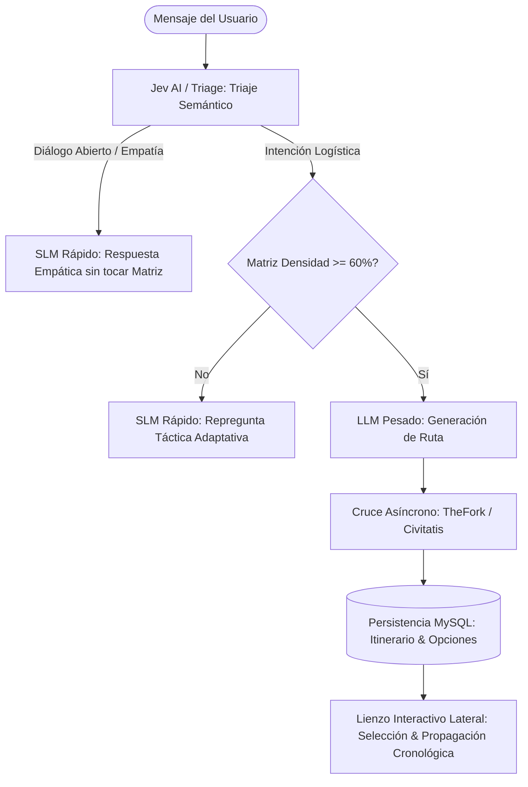

# [OPERATIVO] Documento Destilado: PBI - Orquestación Híbrida y Triaje Semántico con Persistencia MySQL

**Identificador:** PBI-ARCH-ORCH-001  
**Estatus:** Completado / Certificado S+ Grade  
**Fecha de Creación:** 2026-09-26  
**Fecha de Culminación:** 2026-09-26  
**Historia de Usuario Relacionada:** [[ARQUITECTURA] Historia de Usuario: Lienzo de Orquestación Híbrida y Triaje Semántico](file:///home/racso/Proyectos/BarcelonaXplorer/Documentacion/HistoriasDeUsuario/%5BARQUITECTURA%5D%20Historia%20de%20Usuario:%20Lienzo%20de%20Orquestaci%C3%B3n%20H%C3%ADbrida%20y%20Triaje%20Sem%C3%A1ntico.md) · [[OPERATIVO] Historia de Usuario: Estabilización Evolutiva y Saneamiento Post-Anclaje v2.0.1](file:///home/racso/Proyectos/BarcelonaXplorer/Documentacion/HistoriasDeUsuario/%5BOPERATIVO%5D%20Historia%20de%20Usuario:%20Estabilizaci%C3%B3n%20Evolutiva%20y%20Saneamiento%20Post-Anclaje%20v2.0.1.md)  
**Auditoría Vinculada:** [AUD-OPS-ANCHOR-001](file:///home/racso/Proyectos/BarcelonaXplorer/Documentacion/Auditorias/Auditoria%20-%20Ciclo%20Evolutivo%20v2.0.0-a-c82b741.md)  
**Fuente Base Vinculada:** [Ancla Evolutiva BarcelonaXplorer_01.md](file:///home/racso/Proyectos/BarcelonaXplorer/Documentacion/Fuentes/Ancla%20Evolutiva%20BarcelonaXplorer_01.md)  
**Módulo:** `src/features/triage/`, `src/features/ai-engine/`, `src/features/planner/`, `src/components/tactical/`, `src/prisma/`  
**Entorno:** Next.js 16 (Server Actions & Route Handlers), Prisma ORM / MySQL 8.0, Jev AI / Groq SLM, Gemini LLM  
**Prioridad:** Alta (P1 - Expansión del Core Cognitivo y UX Conversacional)  
**Estimación Táctica:** 5 Story Points  

---

### Matriz de Indexación Tridimensional (Protocolo de Acero)

- **Naturaleza:** Enrutador semántico de intención humana (clasificación dialógica vs. logística), control del peaje termodinámico de la Matriz de Densidad (umbral 60%), enriquecimiento asíncrono con APIs de afiliados (TheFork, Civitatis) y persistencia relacional en MySQL de los itinerarios modulares y parcelas confirmadas.
- **Entorno:** Módulo de triaje (`src/features/triage/`), motor de IA (`src/features/ai-engine/`), generador de rutas (`src/features/planner/`), lienzo táctico lateral (`src/components/tactical/hybrid-canvas.tsx`) y tablas relacionales (`src/prisma/schema.prisma`).
- **Entropía Asimilada (Filtros A, B y C):**
  - *Filtro A (Rigor Técnico):* Erradicación de la alucinación donde el bot interroga al usuario sin motivo. Si el usuario conversa casualmente ("Uf, estoy agotado"), el enrutador clasifica `status: 'CASUAL_DIALOGUE'` y responde empáticamente sin forzar la matriz ni alterar los contadores de densidad acumulada.
  - *Filtro B (Determinismo y Soberanía):* Inmutabilidad del cálculo de umbral (60% para activar LLM). Las opciones supervivientes del LLM se validan con Zod antes de presentarse en el lienzo interactivo. Persistencia determinista en MySQL vía Prisma (`TacticalItinerary` y `TacticalItineraryNode`).
  - *Filtro C (Eficiencia Operativa):* Aislamiento de llamadas externas: verificación asíncrona de disponibilidad/afiliación sin bloquear la respuesta de la interfaz al usuario. Propagación cronológica determinista (`ChronologicalPropagator`) para recalcular horas posteriores al desplazar un nodo.

---

## 1. Declaración de Intención (INVEST)

**Como** Viajero y Explorador en BarcelonaXplorer,  
**Quiero** interactuar con un asistente que comprenda de forma empática mis comentarios casuales sin forzar preguntas logísticas, y que sólo al tener suficiente información temporal y de contexto me proponga alternativas visuales en un panel interactivo que pueda confirmar o modificar atómicamente,  
**Para** diseñar mi ruta de forma natural, disponer de opciones verificadas con reservas reales y mantener el control absoluto sobre mi tiempo sin fricciones.

---

## 2. Arquitectura de Forja y Flujo de Datos

---

## 3. Criterios de Aceptación Certificados (Aduana de Fricción)

- [x] **CA-1 (Enrutamiento Semántico):** Los mensajes clasificados con intención casual reciben respuesta inmediata del SLM con empatía táctica sin modificar los contadores de la Matriz de Densidad (`CASUAL_DIALOGUE`).
- [x] **CA-2 (Peaje del 60%):** La invocación del LLM pesado solo se desencadena cuando los atributos temporales y contextuales superan el umbral estipulado en la matriz (>= 60%). Si es menor, emite repregunta atómica (`INCOMPLETE_REPROMPT`).
- [x] **CA-3 (Cruce de Afiliados y Contratos Zod):** Las propuestas devueltas por el LLM se validan mediante un esquema Zod estricto (`EnrichedRouteSchema`) y se enriquecen con enlaces de afiliación (TheFork para restauración y Civitatis para cultura/tours) y 2 opciones comparativas por bloque horario.
- [x] **CA-4 (Persistencia Relacional MySQL):** La sesión del usuario almacena las parcelas temporales seleccionadas en la base de datos MySQL mediante Prisma (`TacticalItinerary` y `TacticalItineraryNode`), permitiendo la recarga y edición posterior.
- [x] **CA-5 (Propagación Cronológica):** Si el usuario desplaza o edita atómicamente un nodo, los eventos posteriores recalculan automáticamente sus horas estimadas de llegada preservando los intervalos de transición mediante `ChronologicalPropagator`.

---

## 4. Evidencia de Certificación (La Santa Trinidad de Oráculos)

| Oráculo | Comando de Ejecución | Resultado Determinista | Estado |
| :--- | :--- | :--- | :--- |
| **Compilador TypeScript** | `npx tsc --noEmit` | **0 errores** de tipos | 🟢 Aprobado |
| **Linter AST** | `npm run lint` | **0 errores, 0 advertencias** (Clean AST) | 🟢 Aprobado |
| **Suite de Tests** | `npm test` | **318/318 tests pasados (100%)** en 64 suites | 🟢 Aprobado |
| **Aduana de Anclaje** | `./scripts/audit-anchor.sh` | **Exit Code 0** Determinista | 🟢 Sellado |

---

## 5. Artefactos y Código Forjados

1. **Persistencia MySQL / Prisma:**
   - [`src/prisma/schema.prisma`](file:///home/racso/Proyectos/BarcelonaXplorer/src/prisma/schema.prisma): Modelos `TacticalItinerary` y `TacticalItineraryNode`.
   - [`src/features/planner/itinerary-persistence.port.ts`](file:///home/racso/Proyectos/BarcelonaXplorer/src/features/planner/itinerary-persistence.port.ts): Puerto hexagonal de persistencia de itinerarios.
   - [`src/features/planner/prisma-itinerary.repository.ts`](file:///home/racso/Proyectos/BarcelonaXplorer/src/features/planner/prisma-itinerary.repository.ts): Adaptador Prisma de persistencia y actualización atómica.
   - [`src/features/planner/prisma-itinerary.repository.test.ts`](file:///home/racso/Proyectos/BarcelonaXplorer/src/features/planner/prisma-itinerary.repository.test.ts): Tests unitarios colocados.

2. **Enriquecimiento de Afiliados y Propagación Cronológica:**
   - [`src/features/planner/affiliate/affiliate-enricher.schema.ts`](file:///home/racso/Proyectos/BarcelonaXplorer/src/features/planner/affiliate/affiliate-enricher.schema.ts): Esquemas Zod estrictos (`EnrichedRouteSchema`, `EnrichedWaypointSchema`, `AffiliateProviderSchema`).
   - [`src/features/planner/affiliate/affiliate-enricher.service.ts`](file:///home/racso/Proyectos/BarcelonaXplorer/src/features/planner/affiliate/affiliate-enricher.service.ts): Cruce con TheFork y Civitatis generando opciones A y B por nodo.
   - [`src/features/planner/affiliate/affiliate-enricher.service.test.ts`](file:///home/racso/Proyectos/BarcelonaXplorer/src/features/planner/affiliate/affiliate-enricher.service.test.ts): Tests colocados.
   - [`src/features/planner/chronological-propagator.ts`](file:///home/racso/Proyectos/BarcelonaXplorer/src/features/planner/chronological-propagator.ts): Algoritmo de propagación temporal en cadena.
   - [`src/features/planner/chronological-propagator.test.ts`](file:///home/racso/Proyectos/BarcelonaXplorer/src/features/planner/chronological-propagator.test.ts): Tests unitarios de propagación cronológica.

3. **Triaje Semántico y Empatía Táctica:**
   - [`src/features/ai-engine/conversational-slm.port.ts`](file:///home/racso/Proyectos/BarcelonaXplorer/src/features/ai-engine/conversational-slm.port.ts): `generateEmpatheticDialogue`.
   - [`src/features/ai-engine/groq/groq-conversational-slm.adapter.ts`](file:///home/racso/Proyectos/BarcelonaXplorer/src/features/ai-engine/groq/groq-conversational-slm.adapter.ts): Implementación Groq con prompt empático y fallback determinista.
   - [`src/features/triage/triage.schema.ts`](file:///home/racso/Proyectos/BarcelonaXplorer/src/features/triage/triage.schema.ts): Adición de `CASUAL_DIALOGUE`, `dialogueMessage` e `itinerary`.
   - [`src/features/triage/triage-outcome.vo.ts`](file:///home/racso/Proyectos/BarcelonaXplorer/src/features/triage/triage-outcome.vo.ts): `createCasualDialogue(...)`.
   - [`src/features/triage/triage-input.use-case.ts`](file:///home/racso/Proyectos/BarcelonaXplorer/src/features/triage/triage-input.use-case.ts): Intercepción dialógica empática, umbral 60%, enriquecimiento asíncrono y persistencia relacional.
   - [`src/features/triage/triage.test.ts`](file:///home/racso/Proyectos/BarcelonaXplorer/src/features/triage/triage.test.ts): Cobertura del flujo completo.

4. **Lienzo Lateral Interactivo y Orquestación:**
   - [`src/components/tactical/hybrid-canvas.tsx`](file:///home/racso/Proyectos/BarcelonaXplorer/src/components/tactical/hybrid-canvas.tsx): Lienzo lateral interactivo para consolidación por selección y ajuste cronológico.
   - [`src/app/orchestrator/page.tsx`](file:///home/racso/Proyectos/BarcelonaXplorer/src/app/orchestrator/page.tsx): Integración del lienzo con el historial conversacional.
   - [`src/app/orchestrator/__tests__/page.test.tsx`](file:///home/racso/Proyectos/BarcelonaXplorer/src/app/orchestrator/__tests__/page.test.tsx): Pruebas de integración del lienzo híbrido y diálogo empático.
