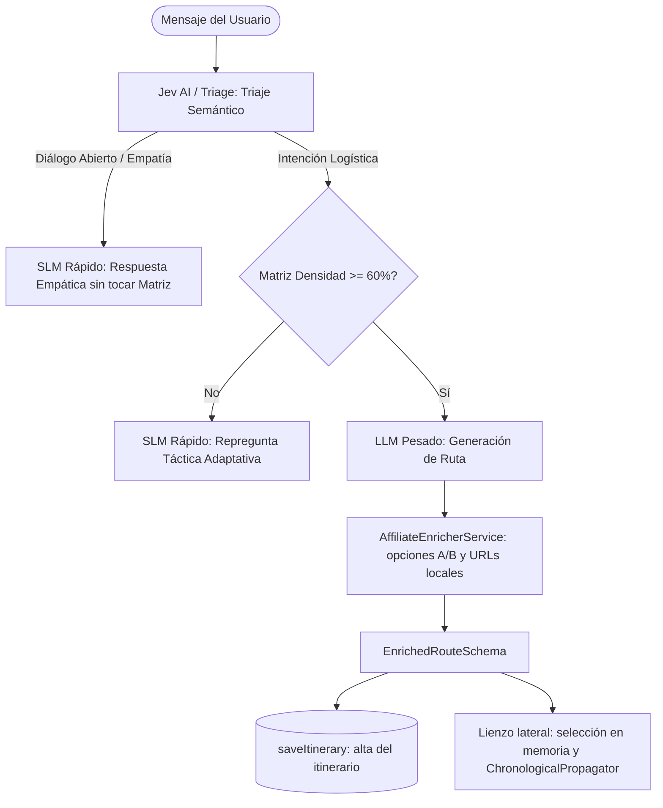

# [OPERATIVO] Documento Destilado: PBI - Orquestación Híbrida y Triaje Semántico con Persistencia MySQL

**Identificador:** PBI-ARCH-ORCH-001  
**Estatus:** Completado como lote / Descompuesto en cortes atómicos (2026-10-03)  
**Fecha de Creación:** 2026-09-26  
**Fecha de Culminación:** 2026-09-26  
**Historia de Usuario Relacionada:** [[ARQUITECTURA] Historia de Usuario: Lienzo de Orquestación Híbrida y Triaje Semántico](file:///home/racso/Proyectos/BarcelonaXplorer/Documentacion/HistoriasDeUsuario/%5BARQUITECTURA%5D%20Historia%20de%20Usuario:%20Lienzo%20de%20Orquestaci%C3%B3n%20H%C3%ADbrida%20y%20Triaje%20Sem%C3%A1ntico.md) · [[OPERATIVO] Historia de Usuario: Estabilización Evolutiva y Saneamiento Post-Anclaje v2.0.1](file:///home/racso/Proyectos/BarcelonaXplorer/Documentacion/HistoriasDeUsuario_Historico/%5BOPERATIVO%5D%20Historia%20de%20Usuario:%20Estabilizaci%C3%B3n%20Evolutiva%20y%20Saneamiento%20Post-Anclaje%20v2.0.1.md)  
**Auditoría Vinculada:** [AUD-OPS-ANCHOR-001](file:///home/racso/Proyectos/BarcelonaXplorer/Documentacion/Auditorias/Auditoria%20-%20Ciclo%20Evolutivo%20v2.0.0-a-c82b741.md)  
**Fuente Base Vinculada:** [Ancla Evolutiva BarcelonaXplorer_01.md](file:///home/racso/Proyectos/BarcelonaXplorer/Documentacion/Fuentes/Ancla%20Evolutiva%20BarcelonaXplorer_01.md)  
**Módulo:** `src/features/triage/`, `src/features/ai-engine/`, `src/features/planner/`, `src/components/tactical/`, `src/prisma/`  
**Entorno:** Next.js 16 (Server Actions & Route Handlers), Prisma ORM / MySQL 8.0, Jev AI / Groq SLM, Gemini LLM  
**Prioridad:** Alta (P1 - Expansión del Core Cognitivo y UX Conversacional)  
**Estimación Táctica:** 5 Story Points (lote histórico). El alcance vivo está en los cortes `PBI-ARCH-ORCH-002` … `008`.  

---

### Matriz de Indexación Tridimensional (Protocolo de Acero)

- **Naturaleza:** Lote histórico que cubre el enrutador semántico (`CASUAL_DIALOGUE` frente a extracción logística), el peaje de la matriz `default` (umbral 60), el enriquecimiento local de opciones A/B, el lienzo lateral y el alta del itinerario en MySQL.
- **Entorno:** Módulo de triaje (`src/features/triage/`), motor de IA (`src/features/ai-engine/`), generador de rutas (`src/features/planner/`), lienzo táctico lateral (`src/components/tactical/hybrid-canvas.tsx`) y tablas relacionales (`src/prisma/schema.prisma`).
- **Entropía Asimilada (Filtros A, B y C):**
  - *Filtro A (Rigor Técnico):* Un comentario casual ("Uf, estoy agotado") clasifica `CASUAL_DIALOGUE`. El SLM responde con empatía y la Matriz de Densidad permanece intacta. La matriz `default` puntúa `time_window` (60), `group_size` (15), `vibe` (15) y `constraints` (10). `mood`, `districts` y `language` viajan en el payload y no suman puntos.
  - *Filtro B (Determinismo y Soberanía):* El LLM devuelve una ruta lineal (`TacticalRoute`). `AffiliateEnricherService` construye las dos opciones, la categoría y las URLs de afiliación desde conocimiento local, y `EnrichedRouteSchema` valida el resultado. El alta en MySQL ocurre en `saveItinerary` con degradación si Prisma falla.
  - *Filtro C (Eficiencia Operativa):* El ajuste horario del lienzo lo resuelve `ChronologicalPropagator` en el cliente, con colchón de 15 minutos y tope 23:59, sin una segunda llamada al LLM. La conmutación de opción y el desplazamiento horario actualizan el estado React. Su escritura de vuelta a MySQL queda fuera de este lote: ver `PBI-ARCH-ORCH-008`.

---

## 1. Declaración de Intención (INVEST)

**Como** Viajero y Explorador en BarcelonaXplorer,  
**Quiero** interactuar con un asistente que comprenda de forma empática mis comentarios casuales sin forzar preguntas logísticas, y que sólo al tener suficiente información temporal y de contexto me proponga alternativas visuales en un panel interactivo que pueda confirmar o modificar atómicamente,  
**Para** diseñar mi ruta de forma natural, disponer de opciones verificadas con reservas reales y mantener el control absoluto sobre mi tiempo sin fricciones.

---

## 2. Arquitectura de Forja y Flujo de Datos

```mermaid
flowchart TD
    UserMsg([Mensaje del Usuario]) --> TriageEngine[Jev AI / Triage: Triaje Semántico]
    TriageEngine -->|Diálogo Abierto / Empatía| SLMCasual[SLM Rápido: Respuesta Empática sin tocar Matriz]
    TriageEngine -->|Intención Logística| DensityCheck{Matriz Densidad >= 60%?}
    DensityCheck -->|No| SLMExtractor[SLM Rápido: Repregunta Táctica Adaptativa]
    DensityCheck -->|Sí| HeavyLLM[LLM Pesado: Generación de Ruta]
    HeavyLLM --> AffiliateEnricher[AffiliateEnricherService: opciones A/B y URLs locales]
    AffiliateEnricher --> ZodGate[EnrichedRouteSchema]
    ZodGate --> MySQL[(saveItinerary: alta del itinerario)]
    ZodGate --> CanvasUI[Lienzo lateral: selección en memoria y ChronologicalPropagator]
```

---

## 3. Criterios de Aceptación Certificados (Aduana de Fricción)

- [x] **CA-1 (Enrutamiento Semántico):** Los mensajes clasificados con intención casual reciben respuesta inmediata del SLM con empatía táctica sin modificar los contadores de la Matriz de Densidad (`CASUAL_DIALOGUE`).
- [x] **CA-2 (Peaje del 60%):** La invocación del LLM pesado solo se desencadena cuando los atributos temporales y contextuales superan el umbral estipulado en la matriz (>= 60%). Si es menor, emite repregunta atómica (`INCOMPLETE_REPROMPT`).
- [x] **CA-3 (Enriquecimiento local y contrato Zod):** `AffiliateEnricherService` parte de la ruta lineal del LLM, asigna categoría, genera dos opciones por parcela y compone URLs de TheFork (gastronomía) o Civitatis (cultura/tours) desde catálogo local. `EnrichedRouteSchema.parse` es la aduana de salida. El escudo de supervivencia y los drops de saturación pertenecen a la HU-10.
- [x] **CA-4 (Alta relacional del itinerario generado):** Al despachar, `TriageInputUseCase` llama a `saveItinerary`. Un fallo de MySQL se telemetría y no aborta la respuesta. El valor devuelto por el repositorio se descarta: el lienzo sigue usando los identificadores de la ruta enriquecida.
- [x] **CA-5 (Propagación cronológica en cliente):** `handleTimeShift` invoca `ChronologicalPropagator.propagate` y sustituye los waypoints en memoria. Preserva un hueco mínimo de 15 minutos y recorta a las 23:59.
- [x] **CA-6 (Escritura de vuelta de edición):** La selección de opción y el nuevo horario persisten en MySQL vía `updateNodeSelection` y `updateNodeTime`. Certificado en [PBI-ARCH-ORCH-008](file:///home/racso/Proyectos/BarcelonaXplorer/Documentacion/PBI/Realizado/PBI%20-%20Escritura%20de%20Vuelta%20de%20Selecci%C3%B3n%20y%20Horario%20del%20Lienzo%20%28PBI-ARCH-ORCH-008%29.md).

---

## 4. Evidencia de Certificación (La Santa Trinidad de Oráculos)

| Oráculo | Comando de Ejecución | Resultado Determinista | Estado |
| :--- | :--- | :--- | :--- |
| **Compilador TypeScript** | `npx tsc --noEmit` | **0 errores** de tipos | 🟢 Aprobado |
| **Linter AST** | `npm run lint` | **0 errores, 0 advertencias** (Clean AST) | 🟢 Aprobado |
| **Suite de Tests** | `npm test` | **318/318 tests pasados (100%)** en 64 suites | 🟢 Aprobado |
| **Aduana de Anclaje** | `./scripts/audit-anchor.sh` | **Exit Code 0** Determinista | 🟢 Sellado |

---

## 5. Artefactos y Código Forjados

1. **Persistencia MySQL / Prisma:**
   - [`src/prisma/schema.prisma`](file:///home/racso/Proyectos/BarcelonaXplorer/src/prisma/schema.prisma): Modelos `TacticalItinerary` y `TacticalItineraryNode`.
   - [`src/features/planner/itinerary-persistence.port.ts`](file:///home/racso/Proyectos/BarcelonaXplorer/src/features/planner/itinerary-persistence.port.ts): Puerto hexagonal de persistencia de itinerarios.
   - [`src/features/planner/prisma-itinerary.repository.ts`](file:///home/racso/Proyectos/BarcelonaXplorer/src/features/planner/prisma-itinerary.repository.ts): Adaptador Prisma de persistencia y actualización atómica.
   - [`src/features/planner/prisma-itinerary.repository.test.ts`](file:///home/racso/Proyectos/BarcelonaXplorer/src/features/planner/prisma-itinerary.repository.test.ts): Tests unitarios colocados.

2. **Enriquecimiento de Afiliados y Propagación Cronológica:**
   - [`src/features/planner/affiliate/affiliate-enricher.schema.ts`](file:///home/racso/Proyectos/BarcelonaXplorer/src/features/planner/affiliate/affiliate-enricher.schema.ts): Esquemas Zod estrictos (`EnrichedRouteSchema`, `EnrichedWaypointSchema`, `AffiliateProviderSchema`).
   - [`src/features/planner/affiliate/affiliate-enricher.service.ts`](file:///home/racso/Proyectos/BarcelonaXplorer/src/features/planner/affiliate/affiliate-enricher.service.ts): Opciones A/B y URLs canónicas de TheFork y Civitatis desde conocimiento local.
   - [`src/features/planner/affiliate/affiliate-enricher.service.test.ts`](file:///home/racso/Proyectos/BarcelonaXplorer/src/features/planner/affiliate/affiliate-enricher.service.test.ts): Tests colocados.
   - [`src/features/planner/chronological-propagator.ts`](file:///home/racso/Proyectos/BarcelonaXplorer/src/features/planner/chronological-propagator.ts): Algoritmo de propagación temporal en cadena.
   - [`src/features/planner/chronological-propagator.test.ts`](file:///home/racso/Proyectos/BarcelonaXplorer/src/features/planner/chronological-propagator.test.ts): Tests unitarios de propagación cronológica.

3. **Triaje Semántico y Empatía Táctica:**
   - [`src/features/ai-engine/conversational-slm.port.ts`](file:///home/racso/Proyectos/BarcelonaXplorer/src/features/ai-engine/conversational-slm.port.ts): `generateEmpatheticDialogue`.
   - [`src/features/ai-engine/groq/groq-conversational-slm.adapter.ts`](file:///home/racso/Proyectos/BarcelonaXplorer/src/features/ai-engine/groq/groq-conversational-slm.adapter.ts): Implementación Groq con prompt empático y fallback determinista.
   - [`src/features/triage/triage.schema.ts`](file:///home/racso/Proyectos/BarcelonaXplorer/src/features/triage/triage.schema.ts): Adición de `CASUAL_DIALOGUE`, `dialogueMessage` e `itinerary`.
   - [`src/features/triage/triage-outcome.vo.ts`](file:///home/racso/Proyectos/BarcelonaXplorer/src/features/triage/triage-outcome.vo.ts): `createCasualDialogue(...)`.
   - [`src/features/triage/triage-input.use-case.ts`](file:///home/racso/Proyectos/BarcelonaXplorer/src/features/triage/triage-input.use-case.ts): Intercepción dialógica empática, umbral 60%, enriquecimiento local y alta relacional con fail-soft.
   - [`src/features/triage/triage.test.ts`](file:///home/racso/Proyectos/BarcelonaXplorer/src/features/triage/triage.test.ts): Cobertura del flujo completo.

4. **Lienzo Lateral Interactivo y Orquestación:**
   - [`src/components/tactical/hybrid-canvas.tsx`](file:///home/racso/Proyectos/BarcelonaXplorer/src/components/tactical/hybrid-canvas.tsx): Lienzo lateral interactivo para consolidación por selección y ajuste cronológico.
   - [`src/app/orchestrator/page.tsx`](file:///home/racso/Proyectos/BarcelonaXplorer/src/app/orchestrator/page.tsx): Integración del lienzo con el historial conversacional.
   - [`src/app/orchestrator/__tests__/page.test.tsx`](file:///home/racso/Proyectos/BarcelonaXplorer/src/app/orchestrator/__tests__/page.test.tsx): Pruebas de integración del lienzo híbrido y diálogo empático.

---

## 6. Descomposición atómica (refinamiento 2026-10-03)

Este documento permanece como acta del lote forjado el 2026-09-26. El alcance ejecutable y los límites de cada capacidad viven en los cortes siguientes. La certificación de oráculos de la sección 4 pertenece al lote; cada corte cita las pruebas que lo cubren.

| Corte | Capacidad | Escenario de la HU | Estatus |
| :--- | :--- | :--- | :--- |
| [PBI-ARCH-ORCH-002](file:///home/racso/Proyectos/BarcelonaXplorer/Documentacion/PBI/Realizado/PBI%20-%20Aduana%20Sem%C3%A1ntica%20y%20Di%C3%A1logo%20Emp%C3%A1tico%20%28PBI-ARCH-ORCH-002%29.md) | Clasificar charla casual y responder sin mutar la matriz | 1 | Certificado en el lote |
| [PBI-ARCH-ORCH-003](file:///home/racso/Proyectos/BarcelonaXplorer/Documentacion/PBI/Realizado/PBI%20-%20Peaje%20Termodin%C3%A1mico%20de%20la%20Matriz%20de%20Densidad%20%28PBI-ARCH-ORCH-003%29.md) | Autorizar el LLM solo al alcanzar 60 puntos en la matriz `default` | 2 | Certificado en el lote |
| [PBI-ARCH-ORCH-004](file:///home/racso/Proyectos/BarcelonaXplorer/Documentacion/PBI/Realizado/PBI%20-%20Enriquecimiento%20Determinista%20de%20Ruta%20y%20Contrato%20Zod%20%28PBI-ARCH-ORCH-004%29.md) | Construir opciones A/B y URLs locales, validadas por Zod | 3 (servicio) | Certificado en el lote |
| [PBI-ARCH-ORCH-005](file:///home/racso/Proyectos/BarcelonaXplorer/Documentacion/PBI/Realizado/PBI%20-%20Lienzo%20Lateral%20y%20Selecci%C3%B3n%20en%20Memoria%20%28PBI-ARCH-ORCH-005%29.md) | Mostrar el itinerario aparte del chat y conmutar la opción en memoria | 3 (lienzo) y 4 (memoria) | Certificado en el lote |
| [PBI-ARCH-ORCH-006](file:///home/racso/Proyectos/BarcelonaXplorer/Documentacion/PBI/Realizado/PBI%20-%20Propagaci%C3%B3n%20Cronol%C3%B3gica%20Determinista%20%28PBI-ARCH-ORCH-006%29.md) | Recalcular horas posteriores en cliente, sin LLM | 5 | Certificado en el lote |
| [PBI-ARCH-ORCH-007](file:///home/racso/Proyectos/BarcelonaXplorer/Documentacion/PBI/Realizado/PBI%20-%20Alta%20Relacional%20del%20Itinerario%20Generado%20%28PBI-ARCH-ORCH-007%29.md) | Persistir el itinerario en el momento del despacho | 3 (alta) | Certificado en el lote |
| [PBI-ARCH-ORCH-008](file:///home/racso/Proyectos/BarcelonaXplorer/Documentacion/PBI/Realizado/PBI%20-%20Escritura%20de%20Vuelta%20de%20Selecci%C3%B3n%20y%20Horario%20del%20Lienzo%20%28PBI-ARCH-ORCH-008%29.md) | Persistir la opción elegida y el horario propagado | 4 (base de datos) | Certificado |

### Fuera de este lote

Streaming SSE, diccionario i18n del lienzo, matriz `gastronomy`, escudo de supervivencia, drops de saturación y circuit breaker de afiliados tienen PBIs propios de historias posteriores. No se reabren aquí.
