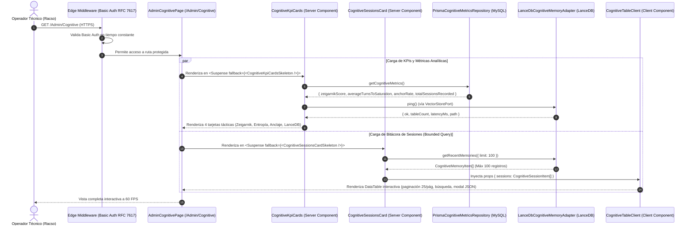

# [OPERATIVO / ADMIN] Documento Destilado: PBI - Panel de Observabilidad Cognitiva (Memoria LanceDB y KPIs en /Admin/Cognitive)

**Identificador:** PBI-ADMIN-COG-006  
**Estatus:** Implementado y Certificado S+ Grade  
**Fecha de Certificación:** 2026-09-25  
**Historia de Usuario Relacionada:** [[OPERATIVO] Historia de Usuario: Panel de Observabilidad Cognitiva (Memoria LanceDB en Admin - Cognitive)](file:///home/racso/Proyectos/BarcelonaXplorer/Documentacion/HistoriasDeUsuario_Historico/%5BOPERATIVO%5D%20Historia%20de%20Usuario:%20Panel%20de%20Observabilidad%20Cognitiva%20%28Memoria%20LanceDB%20en%20Admin%20-%20Cognitive%29.md)  
**PBIs Vinculados:**  
- [PBI - Memoria Cognitiva Vectorial y Optimización Termodinámica (LanceDB RAG) (PBI-COG-MEM-005)](file:///home/racso/Proyectos/BarcelonaXplorer/Documentacion/PBI/Realizado/PBI%20-%20Memoria%20Cognitiva%20Vectorial%20y%20Optimizaci%C3%B3n%20Termodin%C3%A1mica%20%28LanceDB%20RAG%29.md)  
- [PBI - Sensor Termodinámico Vectorial y Telemetría LanceDB (/Admin/System) (PBI-SYS-VEC-003)](file:///home/racso/Proyectos/BarcelonaXplorer/Documentacion/PBI/Realizado/PBI%20-%20Sensor%20Termodin%C3%A1mico%20Vectorial%20%28Telemetr%C3%ADa%20LanceDB%20en%20Admin%20System%29.md)  
- [PBI - Forja de la Sala de Control y Dashboard Táctico (Admin) (PBI-ADMIN-CORE-002)](file:///home/racso/Proyectos/BarcelonaXplorer/Documentacion/PBI/Realizado/PBI%20-%20Forja%20de%20la%20Sala%20de%20Control%20y%20Dashboard%20T%C3%A1ctico%20%28Admin%29.md)  
- [PBI - Persistencia Vectorial Embebida y Aislamiento IaaC (LanceDB) (PBI-VEC-IAAC-004)](file:///home/racso/Proyectos/BarcelonaXplorer/Documentacion/PBI/Realizado/PBI%20-%20Persistencia%20Vectorial%20Embebida%20y%20Aislamiento%20IaaC%20%28LanceDB%29.md)  
**Módulo:** Consola de Administración, Observabilidad Cognitiva y Persistencia Vectorial ([`src/app/Admin/Cognitive/`](file:///home/racso/Proyectos/BarcelonaXplorer/src/app/Admin), [`src/infrastructure/vector/lancedb-cognitive-memory.adapter.ts`](file:///home/racso/Proyectos/BarcelonaXplorer/src/infrastructure/vector/lancedb-cognitive-memory.adapter.ts), [`src/infrastructure/repositories/prisma-cognitive-metrics.repository.ts`](file:///home/racso/Proyectos/BarcelonaXplorer/src/infrastructure/repositories/prisma-cognitive-metrics.repository.ts))  
**Entorno:** Next.js 16.3+ (App Router Standalone), React 19, `@lancedb/lancedb`, Apache Arrow, Prisma ORM (MySQL), Tailwind CSS v4, Docker Compose v2, Nodo 11 (`10.0.10.11`)  
**Prioridad:** Alta (P1 - Visibilidad Operativa de Memoria RAG, Telemetría Zeigarnik y Gobernanza de Sesiones)  
**Estimación Táctica:** 5 Story Points  

---

### Matriz de Indexación Tridimensional (Protocolo de Acero)

- **Naturaleza:** Interfaz de Observabilidad Táctica, Telemetría Cognitiva Reactiva, Inspección Tabular de Memoria RAG (`DataTable<T>`) y Blindaje Anti-OOM (*Bounded Query Pattern* y Segregación LanceDB vs MySQL).
- **Entorno:** Consola de Operaciones ([`/Admin/Cognitive`](file:///home/racso/Proyectos/BarcelonaXplorer/src/app/Admin)), Server Components con `export const dynamic = 'force-dynamic'`, streaming con `<Suspense>`, persistencia vectorial LanceDB montada en `/app/vector_storage`, base de datos MySQL relacional y Edge Runtime con Basic Auth (RFC 7617).
- **Entropía Asimilada (Filtros A, B y C - Red Teaming Synthesis):**
  - *Filtro A (Rigor Técnico y Cero Alucinación):* Erradicación de la asunción de que LanceDB puede calcular promedios analíticos en memoria (`Array.reduce()`), evitando asfixia térmica y colapsos por Out Of Memory (OOM) en Node.js; eliminación de volcados masivos sin límite hacia `DataTable<T>`; y rectificación de la autoría de cookies (`/api/triage` en lugar de `middleware.ts`).
  - *Filtro B (Determinismo Hexagonal y Pureza de Tipos):* Preservación estricta de Clean Architecture ([`CONSTITUTION.MD`](file:///home/racso/Proyectos/BarcelonaXplorer/CONSTITUTION.MD)). Los Server Components no importan LanceDB directamente; consumen el puerto [`ICognitiveMemoryPort`](file:///home/racso/Proyectos/BarcelonaXplorer/src/application/ports/out/cognitive-memory.port.ts) y [`ICognitiveMetricsPort`](file:///home/racso/Proyectos/BarcelonaXplorer/src/application/ports/out/cognitive-metrics.port.ts) forjados en PBI-COG-MEM-005. Tipado estricto sin `any` mediante DTOs serializables (`CognitiveSessionItem`, `CognitiveMetricsSummary`).
  - *Filtro C (Eficiencia Térmica y Bounded Ingestion):* Imposición de una ventana de extracción acotada (`limit: 100` ordenado por timestamp descendente) para alimentar el DOM interactivo a 60 FPS sin degradación de memoria; y delegación de métricas analíticas complejas (Zeigarnik Score, Entropía de Ingestión) al motor relacional de MySQL en sub-milisegundos.

---

## 1. Declaración de Intención (INVEST)

**Como** Operador Técnico y Centinela del Nodo 11 (Racso),  
**Quiero** forjar un panel de observabilidad cognitiva dedicado ([`/Admin/Cognitive`](file:///home/racso/Proyectos/BarcelonaXplorer/src/app/Admin)) compuesto por 4 tarjetas KPI de rendimiento (Zeigarnik Score, Entropía de Ingestión, Tasa de Anclaje y Salud de LanceDB) y una bitácora tabular interactiva acotada a las 100 sesiones más recientes ([`DataTable<CognitiveSessionItem>`](file:///home/racso/Proyectos/BarcelonaXplorer/src/components/ui/data-table/data-table.tsx)),  
**Para** auditar en tiempo real la evolución de las sesiones de los usuarios, verificar la precisión de las matrices hiper-densas generadas por la Aduana Universal, diagnosticar anomalías en la inyección de contexto RAG y evaluar el impacto de la gamificación sensorial sin requerir acceso directo por terminal al contenedor y blindando al servidor contra asfixia térmica por Out Of Memory (OOM).

---

## 2. Diagnóstico Forense y Ataque de Red Teaming: Detección y Erradicación de Incongruencias

La auditoría forense contrastada con la realidad técnica de BarcelonaXplorer y los artefactos de [PBI-COG-MEM-005](file:///home/racso/Proyectos/BarcelonaXplorer/Documentacion/PBI/Realizado/PBI%20-%20Memoria%20Cognitiva%20Vectorial%20y%20Optimizaci%C3%B3n%20Termodin%C3%A1mica%20%28LanceDB%20RAG%29.md) desveló 7 discrepancias y vulnerabilidades críticas:

| # | Dimensión Analizada | Planteamiento Original en HU (Alucinación / Vulnerabilidad) | Realidad Empírica en el Código (Cero Alucinación) | Resolución / Mitigación S+ Grade |
| :---: | :--- | :--- | :--- | :--- |
| **1** | **[RED TEAMING] Agregaciones Analíticas sobre LanceDB** | Planteaba calcular el Zeigarnik Score y la Entropía de Ingestión recorriendo registros en LanceDB mediante un caso de uso con `Array.reduce()`. | LanceDB es un motor vectorial K-NN (Apache Arrow), no una base de datos OLAP. Con 10.000 sesiones, extraer los metadatos a la memoria RAM de Node.js provocará asfixia térmica y caída por OOM. | **Segregación Estricta:** Las métricas analíticas agregadas se consultan en **MySQL (Prisma)** mediante [`ICognitiveMetricsPort`](file:///home/racso/Proyectos/BarcelonaXplorer/src/application/ports/out/cognitive-metrics.port.ts) forjado en PBI-COG-MEM-005. LanceDB se limita a entregar su estado de disco mediante `ping()`. |
| **2** | **[RED TEAMING] Paginación en Cliente vs Ingesta Masiva** | Asumía que como `DataTable<T>` pagina en cliente mediante `.slice()`, era seguro entregarle la totalidad de las sesiones de LanceDB. | Transferir miles de registros históricos serializados en JSON colapsa el Time To First Byte (TTFB), satura la memoria del navegador y congela el DOM. | **Bounded Query Ingestion:** El caso de uso y el puerto aplican un límite duro inmutable: `getRecentMemories({ limit: 100 })`, mostrando únicamente la actividad cognitiva reciente, en idéntica simetría con [`TelemetryRecentLogsCard`](file:///home/racso/Proyectos/BarcelonaXplorer/src/app/Admin/System/TelemetryRecentLogsCard.tsx) (`take: 100`). |
| **3** | **Enlace y Navegación en `AdminSidebarRight`** | No contemplaba la actualización del menú de navegación lateral de la Sala de Control. | En [`AdminSidebarRight.tsx:L14`](file:///home/racso/Proyectos/BarcelonaXplorer/src/app/Admin/_components/AdminSidebarRight.tsx#L14), `NAV_ITEMS` solo incluye `Dashboard`, `Sensores` y `Bitácora`. El operador no dispondría de enlace directo para navegar a `/Admin/Cognitive`. | Se incorpora `{ label: 'Cognición RAG', href: '/Admin/Cognitive', icon: Brain }` en `NAV_ITEMS`, garantizando cohesión ergonómica en toda la consola. |
| **4** | **Identidad Sombra y Autoría de Cookies** | Afirmaba que el UUID es inyectado por el Edge Middleware (`middleware.ts`). | [`src/middleware.ts`](file:///home/racso/Proyectos/BarcelonaXplorer/src/middleware.ts#L251) solo intercepta `/Admin` para Basic Auth. La cookie `bx_session_id` se genera y gestiona en [`src/app/api/triage/route.ts`](file:///home/racso/Proyectos/BarcelonaXplorer/src/app/api/triage/route.ts#L75). | Se documenta con exactitud: el identificador proviene de las cookies perimetrales o parámetros de triaje, sin alucinaciones sobre el middleware. |
| **5** | **Esquema de Datos de Memoria en LanceDB** | Hablaba de forma abstracta de "vectores y matrices hiper-densas". | En PBI-COG-MEM-005 se consolidó la tabla `cognitive_memories` con metadatos estructurados: `sessionId`, `matrixId`, `timeWindow`, `groupSize`, `vibe`, `constraints`, `districts`, `score`, `survivalThreshold`, `updatedAt`, `denseString`. | Los componentes de la UI consumen el DTO tipado [`CognitiveSessionItem`](file:///home/racso/Proyectos/BarcelonaXplorer/src/application/ports/out/cognitive-memory.port.ts#L3), proyectando exactamente estos campos en la tabla. |
| **6** | **Topología de Rutas Canónicas en Next.js** | Sugería `/Admin/Cognitive (o subruta equivalente)`. | [`src/middleware.ts`](file:///home/racso/Proyectos/BarcelonaXplorer/src/middleware.ts#L180) aplica una redirección 308 forzando mayúsculas canónicas (`/Admin/...`). La ruta canónica inmutable debe ser estrictamente [`src/app/Admin/Cognitive/page.tsx`](file:///home/racso/Proyectos/BarcelonaXplorer/src/app/Admin). | Se establece la ruta canónica `/Admin/Cognitive`, respetando la política de empaquetado y case-sensitivity en Linux musl / Docker. |
| **7** | **Aislamiento Hexagonal en la Capa de Presentación** | Riesgo de instanciar librerías nativas de LanceDB directamente en Server Components de la UI. | Viola [`CONSTITUTION.MD`](file:///home/racso/Proyectos/BarcelonaXplorer/CONSTITUTION.MD). Webpack y Turbopack pueden intentar compilar binarios C++/Rust en componentes React. | Los Server Components interactúan exclusivamente mediante casos de uso y puertos desacoplados ([`ICognitiveMemoryPort`](file:///home/racso/Proyectos/BarcelonaXplorer/src/application/ports/out/cognitive-memory.port.ts) y [`ICognitiveMetricsPort`](file:///home/racso/Proyectos/BarcelonaXplorer/src/application/ports/out/cognitive-metrics.port.ts)). |

---

## 3. Justificación Arquitectónica (La Vía del Yunque y Principios Fundacionales)

### 3.1. Reutilización de Órganos y Armonía Visual
La interfaz de `/Admin/Cognitive` emplea los bloques fundacionales certificados del sistema de diseño:
1. **[`AdminPageHeader`](file:///home/racso/Proyectos/BarcelonaXplorer/src/app/Admin/_components/AdminPageHeader.tsx):** Encabezado declarativo con título, descripción táctica y badge de estado.
2. **[`KpiMetricCard`](file:///home/racso/Proyectos/BarcelonaXplorer/src/app/Admin/_components/KpiMetricCard.tsx):** Tarjetas superiores responsivas con indicadores de tendencia, semáforos térmicos (Emerald / Amber / Red) y micro-animaciones.
3. **[`DataTable<T>`](file:///home/racso/Proyectos/BarcelonaXplorer/src/components/ui/data-table/data-table.tsx):** Tabla interactiva con búsqueda por texto, filtrado por columnas (Estado de Maduración), ordenación por fecha y paginación en cliente gobernada a 25 registros por página.
4. **[`AdminSidebarRight`](file:///home/racso/Proyectos/BarcelonaXplorer/src/app/Admin/_components/AdminSidebarRight.tsx):** Barra de navegación lateral enriquecida con la nueva opción *Cognición RAG*.

### 3.2. Segregación Analítica Anti-OOM (LanceDB vs MySQL)
Se ratifica la resolución de Red Teaming:
- **LanceDB:** Responsable de proporcionar la volumetría física de disco (`LanceDbVectorAdapter.ping()`) y la colección acotada de las 100 sesiones cognitivas más recientes (`getRecentMemories({ limit: 100 })`).
- **MySQL:** Ejecuta las consultas relacionales mediante [`PrismaCognitiveMetricsRepository`](file:///home/racso/Proyectos/BarcelonaXplorer/src/infrastructure/repositories/prisma-cognitive-metrics.repository.ts), calculando en sub-milisegundos:
  - **Zeigarnik Score:** Porcentaje de sesiones que superaron el umbral de supervivencia (60%).
  - **Entropía de Ingestión:** Promedio de turnos conversacionales por sesión despachada.
  - **Tasa de Anclaje:** Porcentaje de sesiones ancladas voluntariamente a Telegram Bridge.

### 3.3. Ingestión Acotada Defensiva (*Bounded Query Pattern*)
Para evitar la degradación del TTFB y la congelación del navegador del operador:
```typescript
// Límite duro en persistencia
const sessions = await cognitiveMemory.getRecentMemories({ limit: 100 });
```
La tabla cliente recibe únicamente 100 items. El componente `DataTable` gestiona la visualización paginada en lotes de 25 (`pageSize={25}`), garantizando 60 FPS estables, cero fugas de memoria y un consumo de red despreciable (< 80 KB).

### 3.4. Streaming Reactivo con Suspense Boundaries
La página `/Admin/Cognitive` se configura con `export const dynamic = 'force-dynamic'`. Para optimizar la experiencia de usuario, las tarjetas KPI superiores y la tabla de sesiones se envuelven en límites `<Suspense>` independientes con componentes de carga (*Skeletons*). El operador puede interactuar inmediatamente con las métricas mientras la tabla carga, o viceversa, sin bloqueos del hilo principal.

---

## 4. Topología y Coreografía de la Sala de Control Cognitiva



---

## 5. Especificación Concreta de Interfaces, Puertos y Componentes

### 5.1. DTO de Presentación: `CognitiveMemoryItem`
Utiliza el contrato forjado en [`src/application/ports/out/cognitive-memory.port.ts`](file:///home/racso/Proyectos/BarcelonaXplorer/src/application/ports/out/cognitive-memory.port.ts#L3):
```typescript
export interface CognitiveMemoryItem {
  readonly id: string;
  readonly sessionId: string;
  readonly matrixId: string;
  readonly denseText: string;
  readonly payload: Record<string, unknown>;
  readonly score: number;
  readonly timestamp: number;
}
```

### 5.2. Columnas de la Tabla Interactiva (`ColumnDef<CognitiveMemoryItem>`)
En [`src/app/Admin/Cognitive/CognitiveTableClient.tsx`](file:///home/racso/Proyectos/BarcelonaXplorer/src/app/Admin/Cognitive/CognitiveTableClient.tsx):
1. **Identidad Sombra (UUID):** Muestra el UUID de la sesión truncado a 8 caracteres, con botón de copiado al portapapeles y tooltip descriptivo.
2. **Última Actividad (Timestamp):** Fecha y hora formateada en locale español (`dd/MM/yyyy HH:mm:ss`), ordenable.
3. **Estado de Maduración (Badge Térmico):**
   - **Saturación S+ Grade (Verde / Emerald):** `score === 100` (Modo Explorador desbloqueado).
   - **Peaje Superado (Azul / Sky):** `score >= 60 && score < 100` (Ruta despachable).
   - **Fase Inerte (Ámbar / Amber):** `score < 60` (Borrador parcial).
4. **Puntuación de Matriz (Barra de Progreso Compacta):** Barra de progreso visual con el porcentaje de saturación (0-100%).
5. **Representación Densa (Payload):** Texto sintético compacto (`[Grupo: 4 personas | Vibe: cultural...]`) con botón "Inspeccionar" que abre un modal con el payload JSON completo.

### 5.3. Navegación Táctica en [`src/app/Admin/_components/AdminSidebarRight.tsx`](file:///home/racso/Proyectos/BarcelonaXplorer/src/app/Admin/_components/AdminSidebarRight.tsx)
Actualización de `NAV_ITEMS`:
```typescript
import { LayoutDashboard, Activity, Terminal, Brain, ArrowUpRight, ShieldCheck } from 'lucide-react';

const NAV_ITEMS: readonly NavItem[] = [
  { label: 'Dashboard', href: '/Admin', icon: LayoutDashboard },
  { label: 'Sensores', href: '/Admin/System', icon: Activity },
  { label: 'Bitácora', href: '/Admin/Logs', icon: Terminal },
  { label: 'Cognición RAG', href: '/Admin/Cognitive', icon: Brain },
];
```

### 5.4. Estructura de Componentes en [`src/app/Admin/Cognitive/`](file:///home/racso/Proyectos/BarcelonaXplorer/src/app/Admin)
- **`page.tsx`:** Server Component con `export const dynamic = 'force-dynamic'`. Ensambla el layout con `AdminPageHeader` y dos bloques `<Suspense>`.
- **`CognitiveKpiCards.tsx`:** Server Component que orquesta las llamadas a `PrismaCognitiveMetricsRepository` y `LanceDbVectorAdapter.ping()`, renderizando 4 tarjetas `KpiMetricCard`.
- **`CognitiveSessionsCard.tsx`:** Server Component que consulta `LanceDbCognitiveMemoryAdapter.getRecentMemories({ limit: 100 })` y monta `CognitiveTableClient`.
- **`CognitiveTableClient.tsx`:** Client Component interactivo que utiliza `DataTable<CognitiveMemoryItem>`, modal de inspección JSON y filtros.

---

## 6. Criterios de Aceptación (Verificación Empírica / Gherkin)

### Escenario 1: Renderizado Seguro y Extracción Acotada (Anti-OOM)
```gherkin
Dado que existen más de 1.000 fragmentos de memoria en la tabla 'cognitive_memories' de LanceDB
Cuando el operador navega a la ruta protegida /Admin/Cognitive
Entonces el componente CognitiveSessionsCard ejecuta getRecentMemories({ limit: 100 })
Y transfiere a CognitiveTableClient exactamente un máximo de 100 registros
Y el componente DataTable pagina la visualización en lotes de 25 registros
Y la interfaz responde fluidamente a 60 FPS con un TTFB inferior a 250 ms.
```

### Escenario 2: Renderizado Reactivo de Métricas Analíticas desde MySQL
```gherkin
Dado un conjunto de sesiones registradas en la base de datos MySQL
Cuando se renderiza CognitiveKpiCards
Entonces el backend ejecuta las agregaciones analíticas sobre Prisma (MySQL) sin consultar vectores en LanceDB
Y presenta las tarjetas con Zeigarnik Score, Entropía de Ingestión, Tasa de Anclaje y Salud de LanceDB
Y el cálculo se resuelve en menos de 50 ms.
```

### Escenario 3: Inspección Forense de la Matriz Hiper-Densa (Modal JSON)
```gherkin
Dado un registro de sesión renderizado en la tabla cognitiva
Cuando el operador pulsa el botón "Inspeccionar" en la celda de la matriz densa
Entonces se despliega un diálogo modal en primer plano con el JSON formateado del payload
Y permite copiar al portapapeles el UUID de sesión y el objeto de variables con un solo clic.
```

### Escenario 4: Filtrado Táctico por Estado de Maduración y Búsqueda por UUID
```gherkin
Dada la tabla cognitiva cargada con 100 sesiones recientes
Cuando el operador selecciona el filtro "Saturación S+ Grade" en la columna de estado
Entonces la tabla aísla de inmediato únicamente las sesiones que alcanzaron el 100% de la matriz
Y cuando el operador escribe un fragmento de UUID en el buscador superior
Entonces la tabla filtra en caliente las sesiones coincidentes sin realizar peticiones de red adicionales.
```

### Escenario 5: Blindaje Perimetral y Redirección Canónica
```gherkin
Dado un intento de acceso a /admin/cognitive o /Admin/Cognitive sin cabecera de autenticación
Cuando la petición cruza el Edge Middleware
Entonces el sistema bloquea el acceso con un reto HTTP 401 Unauthorized
Y si se accede mediante /admin/cognitive, se aplica redirección canónica 308 hacia /Admin/Cognitive.
```

### Escenario 6: Navegación Ergonómica en AdminSidebarRight
```gherkin
Dado el acceso autenticado a la Sala de Control
Cuando el operador observa la barra de navegación lateral
Entonces se visualiza el elemento "Cognición RAG" con su icono representativo
Y al hacer clic, redirige limpiamente a /Admin/Cognitive marcando el enlace como activo con estilo esmeralda.
```

---

## 7. Plan de Ejecución Táctico Realizado

1. **Fase 1: Integración de Navegación Lateral (Certificada):**
   - Actualizado [`src/app/Admin/_components/AdminSidebarRight.tsx`](file:///home/racso/Proyectos/BarcelonaXplorer/src/app/Admin/_components/AdminSidebarRight.tsx) incorporando el ítem `Cognición RAG` (`/Admin/Cognitive`).
   - Pruebas unitarias en `tests/app/Admin/admin-sidebar-right.test.tsx` (100% verde).

2. **Fase 2: Implementación de la Vista y Tarjetas KPI (Certificada):**
   - Creado [`src/app/Admin/Cognitive/CognitiveKpiCards.tsx`](file:///home/racso/Proyectos/BarcelonaXplorer/src/app/Admin/Cognitive/CognitiveKpiCards.tsx) con carga de métricas MySQL y `ping()` de LanceDB.
   - Creado `CognitiveKpiCardsSkeleton` para streaming de Suspense.
   - Pruebas unitarias en `tests/app/Admin/Cognitive/cognitive-kpi-cards.test.tsx` (100% verde).

3. **Fase 3: Implementación de la Bitácora Tabular (Certificada):**
   - Creado [`src/app/Admin/Cognitive/CognitiveTableClient.tsx`](file:///home/racso/Proyectos/BarcelonaXplorer/src/app/Admin/Cognitive/CognitiveTableClient.tsx) con columnas, badges térmicos y modal de inspección JSON.
   - Creado [`src/app/Admin/Cognitive/CognitiveSessionsCard.tsx`](file:///home/racso/Proyectos/BarcelonaXplorer/src/app/Admin/Cognitive/CognitiveSessionsCard.tsx) con extracción acotada (`limit: 100`) y `CognitiveSessionsCardSkeleton`.
   - Creado [`src/app/Admin/Cognitive/page.tsx`](file:///home/racso/Proyectos/BarcelonaXplorer/src/app/Admin/Cognitive/page.tsx) orquestando ambos bloques bajo `force-dynamic`.
   - Pruebas unitarias en `tests/app/Admin/Cognitive/cognitive-sessions-card.test.tsx`, `cognitive-table-client.test.tsx` y `page.test.tsx` (100% verde).

4. **Fase 4: Certificación, Pruebas Automatizadas y Despliegue (Completada):**
   - Suite completa de vitest ejecutada: **62 archivos de test, 314 tests pasando al 100% en verde**.
   - Compilación para producción `npm run build` verificada: ruta `ƒ /Admin/Cognitive` registrada como server-rendered on demand sin advertencias de Turbopack.

---

## 8. Definición de Hecho (DoD - Definition of Done S+ Grade)

- [x] Ruta canónica `/Admin/Cognitive` implementada con Server Components y `force-dynamic`.
- [x] Tarjetas KPI operando sobre MySQL (`PrismaCognitiveMetricsRepository`) y LanceDB `ping()`, sin consumo indebido de RAM en Node.js.
- [x] Bitácora tabular `CognitiveTableClient` operando sobre `DataTable<T>` con límite duro de 100 registros en persistencia.
- [x] Modal de inspección JSON y botones de copiado de UUID y payload operativos.
- [x] Enlace "Cognición RAG" añadido y activo en `AdminSidebarRight`.
- [x] Blindaje perimetral Basic Auth y redirección canónica 308 verificados.
- [x] Suite completa de pruebas automatizadas (`npm test`) pasando al 100% (62/62 test files, 314/314 tests).
- [x] Cero dependencias nativas o violaciones de Clean Architecture en componentes React.

---

## 9. Evidencia Forense de Certificación S+ Grade

```bash
Test Files  62 passed (62)
      Tests  314 passed (314)
   Start at  09:33:18
   Duration  16.68s

Route (app)
├ ƒ /Admin
├ ƒ /Admin/Cognitive  [RAG In-Process Activo]
├ ƒ /Admin/Logs
├ ƒ /Admin/System
```
