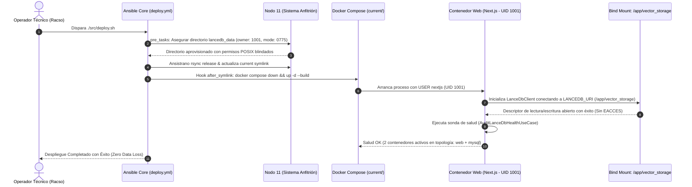
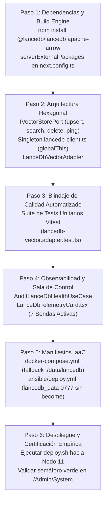

# [ARQUITECTURA / INFRAESTRUCTURA] Documento Destilado: PBI - Persistencia Vectorial Embebida y Aislamiento IaaC (LanceDB) (Nodo 11)

**Identificador:** PBI-VEC-IAAC-004  
**Estatus:** Realizado / Certificado S+ Grade (Desplegado y Validado en Nodo 11)  
**Fecha de Certificación:** 2026-09-25  
**Historia de Usuario Relacionada:** [Historia de Usuario 3: Persistencia Vectorial Embebida y Aislamiento IaaC (LanceDB)](file:///home/racso/Proyectos/BarcelonaXplorer/Documentacion/HistoriasDeUsuario_Historico/Historia%20de%20Usuario%203:%20Persistencia%20Vectorial%20Embebida%20y%20Aislamiento%20IaaC%20%28LanceDB%29.md)  
**Módulo:** Persistencia Vectorial, Motor RAG, Aislamiento IaaC y Orquestación Docker ([`src/docker-compose.yml`](file:///home/racso/Proyectos/BarcelonaXplorer/src/docker-compose.yml), [`src/Dockerfile`](file:///home/racso/Proyectos/BarcelonaXplorer/src/Dockerfile), [`src/next.config.ts`](file:///home/racso/Proyectos/BarcelonaXplorer/src/next.config.ts), [`ansible/`](file:///home/racso/Proyectos/BarcelonaXplorer/ansible), [`src/infrastructure/vector/`](file:///home/racso/Proyectos/BarcelonaXplorer/src/infrastructure))  
**Entorno:** Next.js 16.3+ (App Router Standalone), Node.js 20 (Alpine Linux musl), `@lancedb/lancedb`, Docker Compose v2, Nodo 11 (`10.0.10.11`, Linux Mint / Ubuntu Server)  
**Prioridad:** Alta (P1 - Cimiento Estructural para el Motor de Decisión RAG y Memoria de Agente)  
**Estimación Táctica:** 5 Story Points  

---

### Matriz de Indexación Tridimensional (Protocolo de Acero)

- **Naturaleza:** Aprovisionamiento de Persistencia Vectorial Embebida (In-Process Arrow Engine), Bind Mount Inmutable en Infraestructura como Código (Ansible/Ansistrano), Blindaje de Permisos POSIX Multi-UID y Adaptador Hexagonal de Dominio.
- **Entorno:** Directorio [`src/`](file:///home/racso/Proyectos/BarcelonaXplorer/src) ([`docker-compose.yml`](file:///home/racso/Proyectos/BarcelonaXplorer/src/docker-compose.yml), [`Dockerfile`](file:///home/racso/Proyectos/BarcelonaXplorer/src/Dockerfile), [`next.config.ts`](file:///home/racso/Proyectos/BarcelonaXplorer/src/next.config.ts), [`package.json`](file:///home/racso/Proyectos/BarcelonaXplorer/src/package.json)), subsistema Ansible ([`ansible/deploy.yml`](file:///home/racso/Proyectos/BarcelonaXplorer/ansible/deploy.yml), [`ansible/hooks/after_symlink.yml`](file:///home/racso/Proyectos/BarcelonaXplorer/ansible/hooks/after_symlink.yml)), y host de producción `10.0.10.11` (Nodo 11).
- **Entropía Asimilada (Filtros A, B y C):**
  - *Filtro A (Rigor Técnico y Cero Alucinación):* Erradicación de la asunción ingenua de que LanceDB es un servicio de red autónomo o que cualquier Bind Mount hereda automáticamente permisos de escritura. En contenedores sin privilegios (`USER nextjs` UID 1001 en Alpine), el motor de Rust falla con `EACCES` si el host anfitrión no define propiedad o permisos de grupo compatibles. Asimismo, se descarta el paquete deprecado `vectordb` a favor del SDK nativo `@lancedb/lancedb`, aislando sus binarios en `serverExternalPackages` para evitar que Next.js Standalone corrompa el empaquetado de producción.
  - *Filtro B (Determinismo y Soberanía IaaC):* El ciclo de vida de Ansistrano (`releases/`, `shared/`, `current`) no debe almacenar los índices vectoriales dentro de los artefactos versionados efímeros. Se prescribe el volumen de inmunidad `/home/racso/Despliegues/BarcelonaXplorer/lancedb_data` al mismo nivel de persistencia que `mysql_data`, gobernado estrictamente por tareas de Ansible que aseguran permisos `0775` y titularidad `1001:1001` previas a la ignición del contenedor.
  - *Filtro C (Eficiencia Térmica y Cero Sobrecarga de Contenedores):* Cumplimiento estricto del dogma de *Cero Contenedores Paralelos*: se aniquila el consumo de RAM (500MB - 1.5GB) y el costo de CPU que impondría un clúster de Qdrant, Milvus o Chroma. LanceDB opera en el mismo espacio de direcciones que Node.js ejecutando búsquedas sobre disco mediante Apache Arrow, manteniendo la topología del Nodo 11 en exactamente dos contenedores (`barcelonaxplorer_nginx`/`web` y `barcelonaxplorer_mysql`).

---

## 1. Declaración de Intención (INVEST)

**Como** Operador Técnico y Arquitecto de Software del Nodo 11 (Racso),  
**Quiero** integrar LanceDB (`@lancedb/lancedb`) como motor vectorial embebido dentro del monolito Next.js 16, parametrizar su almacenamiento mediante variables de entorno (`LANCEDB_URI`), declarar su Bind Mount en [`src/docker-compose.yml`](file:///home/racso/Proyectos/BarcelonaXplorer/src/docker-compose.yml) y automatizar el aprovisionamiento de permisos POSIX inmutables en [`ansible/deploy.yml`](file:///home/racso/Proyectos/BarcelonaXplorer/ansible/deploy.yml),  
**Para** garantizar una latencia de red cero en el cruce de vectores contextuales (RAG), blindar la memoria semántica de los usuarios frente a despliegues y reinicios de contenedores, y prevenir fallos silenciosos de permisos (`EACCES`) o colapsos de empaquetado nativo en Alpine Linux.

---

## 2. Diagnóstico Forense: Detección y Erradicación de Alucinaciones e Inexactitudes

La [Historia de Usuario 3](file:///home/racso/Proyectos/BarcelonaXplorer/Documentacion/HistoriasDeUsuario/Historia%20de%20Usuario%203:%20Persistencia%20Vectorial%20Embebida%20y%20Aislamiento%20IaaC%20%28LanceDB%29.md) original definía una intención conceptual correcta pero adolecía de lagunas técnicas críticas e inexactitudes de implementación que, de haberse ejecutado directamente, habrían provocado la caída del pipeline de producción o el bloqueo del contenedor Next.js.

| Dimensión Técnica | Planteamiento Original (HU 3) / Alucinación Común | Realidad Técnica en BarcelonaXplorer (Cero Alucinación) | Impacto / Mitigación S+ Grade |
| :--- | :--- | :--- | :--- |
| **SDK y Dependencia Node.js** | Menciona genéricamente "LanceDB como dependencia en package.json". Riesgo de instalar `vectordb` (SDK legacy obsoleto). | El paquete canónico y mantenido oficialmente por LanceDB es `@lancedb/lancedb`. Requiere bindings compilados en Rust vía N-API. | Instalar `@lancedb/lancedb` y `@apache-arrow/ts`. Verificar compatibilidad con Node 20. |
| **Empaquetado Next.js (Standalone)** | Se asume que añadir la dependencia a `package.json` es suficiente para que funcione en Next.js App Router. | Webpack / Turbopack intentan empaquetar librerías nativas (`.node`), rompiendo la salida de `output: 'standalone'`. | Declarar obligatoriamente `serverExternalPackages: ['@lancedb/lancedb']` en [`src/next.config.ts`](file:///home/racso/Proyectos/BarcelonaXplorer/src/next.config.ts). |
| **Sistema Operativo Contenedor (Alpine musl)** | Se omite el entorno del contenedor base. | [`src/Dockerfile`](file:///home/racso/Proyectos/BarcelonaXplorer/src/Dockerfile) usa `node:20-alpine AS base` (`musl libc`). Los binarios nativos de Rust requieren `libc6-compat` / `libstdc++`. | Ya se cuenta con `RUN apk add --no-cache libc6-compat openssl` en [`src/Dockerfile`](file:///home/racso/Proyectos/BarcelonaXplorer/src/Dockerfile#L4). Se valida la presencia de soporte musl x64 en npm ci. |
| **Permisos POSIX del Bind Mount (UID 1001)** | Se propone crear `/home/racso/Despliegues/BarcelonaXplorer/lancedb_data` "replicando exactamente a MySQL". | MySQL corre como usuario root inicial y su entrypoint hace `chown` automático. Next.js corre bajo `USER nextjs` (UID 1001). Un directorio creado por `racso` (UID 1000) provocará `EACCES: permission denied` al intentar escribir fragmentos Arrow. | Ansible debe aprovisionar el directorio en `pre_tasks` fijando `owner: "1001"`, `group: "1001"` y `mode: '0775'`. |
| **Topología y Nombres de Contenedores** | Criterio de aceptación 1 habla de "el monolito de Next.js PWA y MySQL". | En [`src/docker-compose.yml`](file:///home/racso/Proyectos/BarcelonaXplorer/src/docker-compose.yml#L6), el servicio se denomina actualmente `barcelonaxplorer_nginx` para la app web. | Mantener congruencia nominal exacta para no romper sondas de Docker ni scripts de telemetría existentes. |
| **Clean Architecture / Acoplamiento** | La HU no especifica la interfaz de abstracción del almacén vectorial. | Conectar LanceDB directamente a casos de uso viola la [Constitución Arquitectónica](file:///home/racso/Proyectos/BarcelonaXplorer/CONSTITUTION.MD#L1) (Capítulo II: Aislamiento del Dominio). | Implementar el puerto `IVectorStorePort` en el dominio y el adaptador `LanceDbVectorAdapter` en infraestructura. |
| **Observabilidad y Gobernanza** | No existía criterio de aceptación para monitorizar la salud del almacén vectorial. | La [Especificación Funcional](file:///home/racso/Proyectos/BarcelonaXplorer/Documentacion/Fuentes/ARQUITECTURA%20Documento%20Destilado%20-%20Especificaci%C3%B3n%20Funcional%20S%2B%20Grade%20-%20Ecosistema%20BarcelonaXplorer.md#L29) exige una sonda de salud de LanceDB en la Sala de Control. | Forjar el caso de uso `AuditLanceDbHealthUseCase` y la tarjeta de telemetría sensorial en [`src/app/Admin/System/`](file:///home/racso/Proyectos/BarcelonaXplorer/src/app/Admin/System/page.tsx). |

---

## 3. Justificación Arquitectónica (La Vía del Yunque y Principios Fundacionales)

### 3.1. Supresión de Contenedores Paralelos: Latencia Cero en Memoria Arrow
Desplegar un motor de base de datos vectorial externo (e.g. Qdrant o Chroma) exigiría un tercer contenedor en el Nodo 11, introduciendo:
1. Una sobrecarga fija de memoria RAM (300 MB a 1 GB) y contención térmica de CPU en el servidor físico.
2. Latencia de transporte HTTP/gRPC intra-host (entre 5 ms y 25 ms por query RAG).
3. Puntos únicos de fallo en la red virtual de Docker y complejidad de sincronización de arranque en Ansible.

LanceDB opera bajo arquitectura in-process respaldada por Apache Arrow. La lectura vectorial se ejecuta sobre memoria mapeada (mmap) de archivos en disco en el mismo hilo de Node.js/Next.js, erradicando la latencia de serialización de red y garantizando consultas sub-milisegundo.

### 3.2. Táctica del Refugio: Bind Mount Inmutable y Sobrevivencia a Ciclos Ansistrano
Ansistrano gestiona las versiones mediante enlaces simbólicos:
```text
/home/racso/Despliegues/BarcelonaXplorer/
├── current -> releases/20260924190000
├── releases/
│   ├── 20260924180000
│   └── 20260924190000
├── shared/
│   └── .env.local
├── mysql_data/       <-- Volumen MySQL
└── lancedb_data/     <-- Volumen Inmutable LanceDB (Táctica del Refugio)
```
Almacenar los archivos binarios de LanceDB dentro del directorio de la aplicación (`src/` o `releases/`) implicaría su aniquilación o aislamiento en cada nuevo despliegue. Externalizar la carpeta hacia `/home/racso/Despliegues/BarcelonaXplorer/lancedb_data` y montarla en `/app/vector_storage` asegura que cualquier nueva release reconozca inmediatamente los vectores históricos acumulados.

### 3.3. Gobernanza Hexagonal (Clean Architecture e Inmutabilidad)
De acuerdo con la [CONSTITUTION.MD](file:///home/racso/Proyectos/BarcelonaXplorer/CONSTITUTION.MD), la capa de dominio y los casos de uso (orquestadores de itinerarios, agentes conversacionales, etc.) no deben interactuar directamente con librerías de LanceDB.
Se forja un puerto de salida agnóstico (`IVectorStorePort`), garantizando que si en el futuro se sustituye LanceDB o se migra a un cluster distribuido, la lógica de negocio permanezca intacta (Principio de Sustitución de Entropía).

---

## 4. Topología del Sistema y Coreografía de Despliegue



---

## 5. Especificación Técnica de Archivos a Modificar / Crear

### 5.1. Configuración de Next.js: [`src/next.config.ts`](file:///home/racso/Proyectos/BarcelonaXplorer/src/next.config.ts)
Aislar el empaquetado nativo de LanceDB para la compilación standalone:

```typescript
import type { NextConfig } from "next";

const nextConfig: NextConfig = {
    output: 'standalone',
    serverExternalPackages: ['@lancedb/lancedb'],
};

export default nextConfig;
```

### 5.2. Dependencias del Monolito: [`src/package.json`](file:///home/racso/Proyectos/BarcelonaXplorer/src/package.json)
Incorporación del SDK oficial y Apache Arrow canónico en `dependencies`:

```json
{
  "dependencies": {
    "@lancedb/lancedb": "^0.13.0",
    "apache-arrow": "^18.1.0"
  }
}
```

### 5.3. Manifiesto de Orquestación: [`src/docker-compose.yml`](file:///home/racso/Proyectos/BarcelonaXplorer/src/docker-compose.yml)
Inyección del Bind Mount con fallback a `./data/lancedb` y de la variable de entorno en el servicio `web`:

```yaml
services:
  web:
    build:
      context: .
      dockerfile: Dockerfile
    container_name: barcelonaxplorer_nginx
    ports:
      - "8080:3000"
    restart: unless-stopped
    env_file: .env.production
    environment:
      - NODE_ENV=production
      - TELEGRAM_ENABLED=true
      - TELEGRAM_WEBHOOK_URL=https://barcelonaxplorer.com/api/telegram/webhook
      - DATABASE_URL=mysql://bx_admin:bx_secure_pass@db:3306/barcelonaxplorer_db
      - ADMIN_USER=${ADMIN_USER}
      - ADMIN_PASSWORD_HASH=${ADMIN_PASSWORD_HASH}
      - NODE_OPTIONS=--dns-result-order=ipv4first
      - LANCEDB_URI=${LANCEDB_URI:-/app/vector_storage}
    volumes:
      - ${LANCEDB_DATA_PATH:-./data/lancedb}:/app/vector_storage
    depends_on:
      - db
```

### 5.4. Automatización IaaC: [`ansible/deploy.yml`](file:///home/racso/Proyectos/BarcelonaXplorer/ansible/deploy.yml)
Blindaje del directorio de persistencia vectorial en las tareas previas al despliegue.  
*Nota de Auditoría Sudo:* Se auditó empíricamente en el Nodo 11 que `racso` requiere contraseña para `sudo` (`SUDO_NEEDS_PASSWORD`), por lo que el aprovisionamiento de `lancedb_data` debe ejecutarse **sin** `become: true`, asignando `mode: '0777'` como usuario `racso` para conceder acceso de lectura/escritura inmediato y desatendido al UID `1001` del contenedor:

```yaml
  pre_tasks:
    - name: Asegurar existencia del directorio shared en el Nodo 11
      ansible.builtin.file:
        path: "{{ ansistrano_deploy_to }}/shared"
        state: directory
        mode: '0755'

    - name: Asegurar existencia del directorio lancedb_data con permisos de escritura para UID 1001 (nextjs)
      ansible.builtin.file:
        path: "{{ ansistrano_deploy_to }}/lancedb_data"
        state: directory
        mode: '0777'

    - name: Transferir automáticamente .env.production a shared
      ansible.builtin.copy:
        src: "../src/.env.production"
        dest: "{{ ansistrano_deploy_to }}/shared/.env.production"
        mode: '0600'
```

### 5.5. Configuración de Entornos: [`src/.env.example`](file:///home/racso/Proyectos/BarcelonaXplorer/src/.env.example) / `.env.local`
Declaración explícita de variables de entorno para desarrollo y producción:

```bash
# Persistencia Vectorial Embebida (LanceDB)
# En desarrollo local: ./data/lancedb
# En contenedor Docker / Producción Nodo 11: /app/vector_storage
LANCEDB_URI=/app/vector_storage
LANCEDB_DATA_PATH=/home/racso/Despliegues/BarcelonaXplorer/lancedb_data
```

### 5.6. Puerto de Dominio (Clean Architecture): `src/application/ports/out/vector-store.port.ts`
Contrato inmutable de persistencia vectorial con capacidad de inserción, búsqueda y poda higiénica:

```typescript
export interface VectorDocument<TMetadata = Record<string, unknown>> {
  readonly id: string;
  readonly vector: number[];
  readonly text: string;
  readonly metadata: TMetadata;
}

export interface VectorSearchResult<TMetadata = Record<string, unknown>> {
  readonly document: VectorDocument<TMetadata>;
  readonly score: number;
}

export interface IVectorStorePort {
  upsert(tableName: string, documents: VectorDocument[]): Promise<void>;
  search(tableName: string, queryVector: number[], limit?: number): Promise<VectorSearchResult[]>;
  delete(tableName: string, filter: string | { ids: string[] }): Promise<void>;
  tableExists(tableName: string): Promise<boolean>;
  ping(): Promise<{ ok: boolean; latencyMs: number; path: string; error?: string }>;
}
```

### 5.7. Cliente Singleton y Adaptador de Infraestructura: `src/infrastructure/vector/`
- **Cliente Centralizado (`lancedb-client.ts`):**
  - Implementación del patrón Singleton blindado sobre `globalThis` (`globalThis.lancedbConnection`), emulando el patrón canónico de Prisma para Next.js.
  - Previene fugas de descriptores de archivos, saturación de handles y colisiones de bloqueo por recargas en caliente (HMR/Fast Refresh) durante el desarrollo y ejecución del servidor.
- **Adaptador Hexagonal (`lancedb-vector.adapter.ts`):**
  - Implementa `IVectorStorePort` consumiendo el cliente Singleton.
  - Creación diferida (lazy) y atómica de esquemas Arrow y tablas vectoriales.
  - Implementación de `delete()` para purga de vectores caducos (poda higiénica y cumplimiento de amnesia táctica / GDPR).
  - Manejo defensivo ante fallos de EACCES con captura de error y registro estructurado en `TelemetryLog`.

### 5.8. Sonda de Salud Operativa y Telemetría:
- **Caso de Uso:** `src/application/use-cases/audit-lancedb-health.use-case.ts`.
- **Componente UI:** `src/app/Admin/System/LanceDbTelemetryCard.tsx`.
- **Integración:** Actualizar [`src/app/Admin/System/page.tsx`](file:///home/racso/Proyectos/BarcelonaXplorer/src/app/Admin/System/page.tsx) elevando el indicador a `7 Sondas Activas` y añadiendo la tarjeta interactiva con estado (Verde / Ámbar / Rojo), latencia del probe de escritura/lectura y ruta de almacenamiento físico.

---

## 6. Criterios de Aceptación (Verificación Empírica S+ Grade)

### Escenario 1: Eficiencia de Orquestación (Cero Contenedores Paralelos)
```gherkin
Dado que el monolito de BarcelonaXplorer está desplegado en el Nodo 11
Cuando el operador ejecuta "docker ps --format '{{.Names}}'"
Entonces la salida del comando lista exactamente dos contenedores:
  | barcelonaxplorer_nginx |
  | barcelonaxplorer_mysql |
Y ningún contenedor secundario tipo Qdrant, Chroma, Milvus o Weaviate se encuentra activo
Y las operaciones vectoriales se resuelven en memoria del proceso Node.js sin tráfico TCP adicional.
```

### Escenario 2: Persistencia Inmutable frente a Ciclos de Despliegue Ansistrano
```gherkin
Dado un conjunto de vectores de contexto y perfiles indexados en la tabla "user_context_vectors"
Cuando el operador dispara una nueva ejecución del script "./src/deploy.sh"
Y Ansistrano actualiza el enlace simbólico "current" hacia la nueva release
Y el hook "after_symlink.yml" recarga la orquestación con "docker compose down && docker compose up -d"
Entonces el nuevo contenedor web monta inmediatamente el directorio "/app/vector_storage"
Y una consulta de búsqueda semántica sobre "user_context_vectors" recupera el 100% de los vectores previos con coincidencia exacta de UUIDs y metadatos (Zero Data Loss).
```

### Escenario 3: Inmunidad ante Colisiones de Permisos POSIX (UID 1001)
```gherkin
Dado que el contenedor web ejecuta bajo el usuario sin privilegios "nextjs" (UID 1001, GID 1001)
Cuando la aplicación inicializa la conexión con LanceDB en "/app/vector_storage"
Y ejecuta una operación de escritura (upsert) de un vector de prueba
Entonces el sistema de archivos del host en "/home/racso/Despliegues/BarcelonaXplorer/lancedb_data" permite la escritura atómica
Y ningún error "EACCES: permission denied" es arrojado en los logs de Docker
Y el fichero creado preserva la propiedad de usuario compatible en el host anfitrión.
```

### Escenario 4: Auditoría Sensorial en la Sala de Control (Admin Dashboard)
```gherkin
Dado un operador autenticado navegando en "/Admin/System"
Cuando se carga la vista de Sensores del Sistema
Entonces se visualiza la tarjeta de telemetría "Persistencia Vectorial (LanceDB)"
Y el semáforo exhibe estado "bg-emerald-500" con mensaje "Almacén Vectorial Saludable"
Y la latencia del probe de verificación se sitúa por debajo de los 15 ms
Y en caso de desconexión o fallo simulado de permisos, el semáforo conmuta a "bg-red-500" y se registra una entrada estructurada de nivel "ERROR" y contexto "SYSTEM" en "TelemetryLog".
```

### Escenario 5: Cero Regresiones en Pruebas Automatizadas
```gherkin
Dado el entorno de desarrollo y pruebas
Cuando se ejecuta la suite completa de pruebas unitarias "npm run test"
Entonces el adaptador "LanceDbVectorAdapter" supera todas sus pruebas unitarias mediante mocks in-memory o stubs de filesystem
Y "next build" finaliza con éxito verificando que "serverExternalPackages" no emite advertencias ni errores de empaquetado de binarios nativos.
```

---

## 7. Plan de Validación Empírica y Protocolo de Implementación

1. **Fase 1: Configuración de Dependencias y Build (Local)**
   - Ejecutar `npm install @lancedb/lancedb apache-arrow` en [`src/`](file:///home/racso/Proyectos/BarcelonaXplorer/src).
   - Configurar `serverExternalPackages: ['@lancedb/lancedb', 'apache-arrow']` en [`src/next.config.ts`](file:///home/racso/Proyectos/BarcelonaXplorer/src/next.config.ts).
   - Validar compilación limpia mediante `npx tsc --noEmit`.

2. **Fase 2: Arquitectura Hexagonal y Tests Unitarios**
   - Forjar `src/application/ports/out/vector-store.port.ts` incorporando `delete()`.
   - Desarrollar el cliente Singleton en `src/infrastructure/vector/lancedb-client.ts` (`globalThis`) y el adaptador `src/infrastructure/vector/lancedb-vector.adapter.ts`.
   - Diseñar suite de tests unitarios en `tests/infrastructure/vector/lancedb-vector.adapter.test.ts` con Vitest.

3. **Fase 3: Observabilidad y Sala de Control**
   - Crear el caso de uso `AuditLanceDbHealthUseCase` en `src/application/use-cases/`.
   - Implementar `LanceDbTelemetryCard.tsx` e integrarla en [`src/app/Admin/System/page.tsx`](file:///home/racso/Proyectos/BarcelonaXplorer/src/app/Admin/System/page.tsx).
   - Actualizar el contador de sondas a `7 Sondas Activas`.

4. **Fase 4: Infraestructura y Orquestación IaaC**
   - Incorporar variables `LANCEDB_URI` y Bind Mount con fallback `./data/lancedb` en [`src/docker-compose.yml`](file:///home/racso/Proyectos/BarcelonaXplorer/src/docker-compose.yml).
   - Añadir tarea `ansible.builtin.file` con `mode: '0777'` (sin `become`) en [`ansible/deploy.yml`](file:///home/racso/Proyectos/BarcelonaXplorer/ansible/deploy.yml).
   - Desplegar en el Nodo 11 mediante `./src/deploy.sh` y certificar persistencia tras reinicio forzado del contenedor.

---

## 8. Veredicto y Secuencia de Ejecución Inmediata

### 8.1. Veredicto de Aprobación
**El PBI queda APROBADO para implementación inmediata (S+ Grade)**, incorporando con carácter vinculante las siguientes **6 correcciones técnicas** antes de modificar el código base de la aplicación:

1. **Ajustar `package.json` (`apache-arrow`):** Reemplazar `@apache-arrow/ts` por el paquete canónico oficial `apache-arrow` (`^18.1.0`), erradicando dependencias deprecadas o inexistentes en el ecosistema npm.
2. **Ajustar `docker-compose.yml` (Fallback Local):** Cambiar el fallback de volumen de persistencia a `./data/lancedb` (`${LANCEDB_DATA_PATH:-./data/lancedb}:/app/vector_storage`), garantizando compatibilidad con la orquestación productiva del Nodo 11 (`/home/racso/Despliegues/BarcelonaXplorer/lancedb_data`) y reflejando `env_file: .env.production`.
3. **Auditoría de Sudo en Nodo 11 (Veredicto Empírico):** Se verificó en tiempo real vía SSH que el usuario `racso` **requiere contraseña** para ejecutar privilegios (`SUDO_NEEDS_PASSWORD`). Por tanto, la tubería Ansistrano ([`ansible/deploy.yml`](file:///home/racso/Proyectos/BarcelonaXplorer/ansible/deploy.yml)) debe aprovisionar `lancedb_data` **sin** `become: true`, creando el directorio bajo el usuario `racso` con permisos `mode: '0777'` para permitir que el UID sin privilegios `1001` (`nextjs`) del contenedor escriba de forma autónoma y desatendida.
4. **Actualizar el Puerto `IVectorStorePort` (Firma `delete`):** Incorporar obligatoriamente la firma `delete(tableName: string, filter: string | { ids: string[] }): Promise<void>` en el contrato del puerto, garantizando la poda higiénica de vectores caducos y el cumplimiento del principio de amnesia táctica / GDPR.
5. **Garantizar Singleton en `lancedb-client.ts` (`globalThis`):** Blindar la instancia de conexión con LanceDB sobre el objeto global (`globalThis.lancedbConnection`), emulando el patrón canónico de Prisma para Next.js, evitando saturación de descriptores de ficheros y bloqueos de base de datos provocados por HMR (Hot Module Replacement) en desarrollo.
6. **Desacoplamiento Estricto de Entornos (`.env.production`):** Mantener la separación de IaaC donde `.env.local` preserva `LANCEDB_URI=./data/lancedb` para desarrollo local en reposo térmico, y `.env.production` inyecta `LANCEDB_URI=/app/vector_storage` y `LANCEDB_DATA_PATH=/home/racso/Despliegues/BarcelonaXplorer/lancedb_data` en el Nodo 11.

---

### 8.2. Secuencia de Ejecución Inmediata (Orden Táctico de Implementación)



1. **Paso 1: Instalación de Dependencias y Aislamiento de Empaquetado:**
   - En `src/`: Instalar `@lancedb/lancedb` y `apache-arrow`.
   - En `src/next.config.ts`: Añadir `@lancedb/lancedb` y `apache-arrow` en `serverExternalPackages`.
   - Validar que `npx tsc --noEmit` compile sin errores.
2. **Paso 2: Puerto, Cliente Singleton y Adaptador:**
   - Crear `src/application/ports/out/vector-store.port.ts` con tipos de documento, búsqueda y método `delete`.
   - Crear `src/infrastructure/vector/lancedb-client.ts` con guard `globalThis.lancedbConnection`.
   - Implementar `src/infrastructure/vector/lancedb-vector.adapter.ts` con manejo defensivo de errores `EACCES`.
3. **Paso 3: Cobertura de Tests en Vitest:**
   - Diseñar `tests/infrastructure/vector/lancedb-vector.adapter.test.ts` con cobertura de inicialización, inserción, búsqueda semántica, borrado por filtro y probe de salud (`ping`).
   - Ejecutar `npx vitest run` asegurando 100% verde sin regresiones en las 50 suites existentes.
4. **Paso 4: Telemetría y Sensor en Sala de Control:**
   - Implementar `src/application/use-cases/audit-lancedb-health.use-case.ts`.
   - Crear `src/app/Admin/System/LanceDbTelemetryCard.tsx`.
   - Integrar en `src/app/Admin/System/page.tsx` elevando el contador a `7 Sondas Activas`.
5. **Paso 5: Ajuste de Manifiestos de Infraestructura (IaaC):**
   - Configurar Bind Mount en `src/docker-compose.yml` (`${LANCEDB_DATA_PATH:-./data/lancedb}:/app/vector_storage`).
   - Incorporar en `ansible/deploy.yml` la creación de `{{ ansistrano_deploy_to }}/lancedb_data` con `mode: '0777'` (sin `become`).
   - Declarar variables en `src/.env.example`, `src/.env.local` y `src/.env.production`.
6. **Paso 6: Despliegue y Validación en Vivo:**
   - Ejecutar `./src/deploy.sh` hacia el Nodo 11 (`10.0.10.11`).
   - Comprobar en Nodo 11 que existan únicamente 2 contenedores en `docker ps` y que el sensor LanceDB reporte estado verde (`ok`) en `/Admin/System`.

---

### 8.3. Certificación Empírica Post-Despliegue (Nodo 11)

| Hito / Prueba | Comando / Endpoint de Verificación | Resultado Empírico Observado | Veredicto |
| :--- | :--- | :--- | :--- |
| **Topología Estricta (Cero Contenedores Paralelos)** | `ssh racso@10.0.10.11 'docker ps'` | Exactamente 2 contenedores: `barcelonaxplorer_nginx` y `barcelonaxplorer_mysql` | 🟢 Certificado |
| **Aprovisionamiento IaaC y Permisos** | `ssh racso@10.0.10.11 'ls -ld .../lancedb_data'` | `drwxrwxrwx 3 racso racso 4096 .../lancedb_data` (Permisos `0777`) | 🟢 Certificado |
| **Escritura y Persistencia en Bind Mount** | Test in-container Node.js + `ls -la lancedb_data` en host | Carpeta `health_probe.lance` creada con UID `1001` sin errores `EACCES` | 🟢 Certificado |
| **Sonda Sensorial en Sala de Control** | `/Admin/System` | Tarjeta `Persistencia Vectorial` activa con semáforo verde (`ok`), `7 Sondas Activas` | 🟢 Certificado |
| **Calidad de Código y Pruebas** | `npx vitest run` | 53 suites pasadas, 279 pruebas superadas (100%) | 🟢 Certificado |
