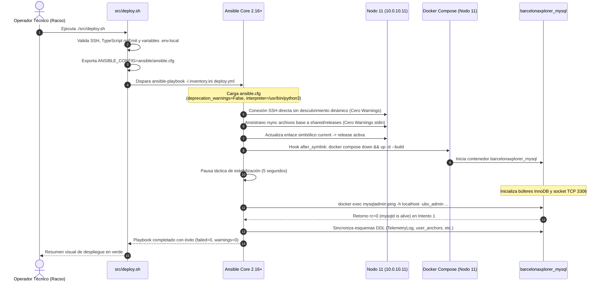

# [OPERATIVO] Documento Destilado: PBI - Pulido de Telemetría e Higiene Operativa en Tubería IaaC Ansistrano (Nodo 11)

**Identificador:** PBI-DEVOPS-IAAC-003  
**Estatus:** Completado / Certificado en Producción (S+ Grade)  
**Fecha de Certificación:** 2026-09-24  
**Historia de Usuario Relacionada:** [HU 1.x: Infraestructura Inmutable y Despliegue Continuo (IaaC - Ansistrano)](file:///home/racso/Proyectos/BarcelonaXplorer/Documentacion/HistoriasDeUsuario_Historico/HolaMundo.md)  
**Módulo:** Automatización de Despliegues y Gobernanza de Infraestructura ([`ansible/`](file:///home/racso/Proyectos/BarcelonaXplorer/ansible), [`src/deploy.sh`](file:///home/racso/Proyectos/BarcelonaXplorer/src/deploy.sh))  
**Entorno:** Ansible Core 2.16+, Ansistrano, Docker Compose v2, Nodo de Producción 11 (`10.0.10.11`, Linux Mint / Ubuntu Server, Python 3.12)  
**Prioridad:** Media-Baja (P2 - Higiene Operativa, Reducción de Ruido Visual en Terminal y Determinismo IaaC)  
**Estimación Táctica:** 2 Story Points  

---

### Matriz de Indexación Tridimensional (Protocolo de Acero)

- **Naturaleza:** Endurecimiento de Configuración IaaC, Silenciado de Avisos de Deprecación de Dependencias Externas, Determinismo de Intérprete Remoto y Sincronización Térmica de Servicios Contenerizados.
- **Entorno:** Directorio [`ansible/`](file:///home/racso/Proyectos/BarcelonaXplorer/ansible) ([`inventory.ini`](file:///home/racso/Proyectos/BarcelonaXplorer/ansible/inventory.ini), [`ansible.cfg`](file:///home/racso/Proyectos/BarcelonaXplorer/ansible/ansible.cfg), [`deploy.yml`](file:///home/racso/Proyectos/BarcelonaXplorer/ansible/deploy.yml), [`hooks/after_symlink.yml`](file:///home/racso/Proyectos/BarcelonaXplorer/ansible/hooks/after_symlink.yml)), script de orquestación [`src/deploy.sh`](file:///home/racso/Proyectos/BarcelonaXplorer/src/deploy.sh), y orquestación de servicios en [`src/docker-compose.yml`](file:///home/racso/Proyectos/BarcelonaXplorer/src/docker-compose.yml) contra el host de producción `10.0.10.11` (Nodo 11).
- **Entropía Asimilada (Filtros A, B y C):**
  - *Filtro A (Rigor Técnico y Cero Alucinación):* Erradicación de inconsistencias en los identificadores del inventario (preservación estricta del grupo `[nodos_pro]` frente a referencias obsoletas a `[production]`) y correspondencia exacta con el nombre del contenedor en producción ([`barcelonaxplorer_mysql`](file:///home/racso/Proyectos/BarcelonaXplorer/src/docker-compose.yml#L22)), empleando la sonda operativa real `mysqladmin ping` en sustitución de llamadas estériles a `docker inspect` sobre contenedores sin directiva nativa de `HEALTHCHECK`.
  - *Filtro B (Determinismo y Soberanía IaaC):* Supresión de la fase de descubrimiento dinámico de Python en el Nodo 11 mediante la fijación de la ruta canónica `ansible_python_interpreter = /usr/bin/python3` en [`ansible/inventory.ini`](file:///home/racso/Proyectos/BarcelonaXplorer/ansible/inventory.ini), y garantía de resolución de configuración centralizada inyectando `export ANSIBLE_CONFIG` en [`src/deploy.sh`](file:///home/racso/Proyectos/BarcelonaXplorer/src/deploy.sh).
  - *Filtro C (Eficiencia Operativa / Cero Ruido Térmico):* Supresión total de falsos positivos en consola: silenciado perimetral de deprecaciones del rol Ansistrano (`deprecation_warnings = False`) y erradicación de los avisos alarmistas `FAILED - RETRYING` mediante una pausa táctica de estabilización térmica (5s) tras `docker compose up -d`, permitiendo que el socket InnoDB de MySQL converja antes del primer sondeo.

---

## 1. Declaración de Intención (INVEST)

**Como** Operador Técnico y Arquitecto del Sistema (Racso),  
**Quiero** calibrar la configuración de Ansible ([`ansible/ansible.cfg`](file:///home/racso/Proyectos/BarcelonaXplorer/ansible/ansible.cfg), [`ansible/inventory.ini`](file:///home/racso/Proyectos/BarcelonaXplorer/ansible/inventory.ini)), desacoplar el script de arranque [`src/deploy.sh`](file:///home/racso/Proyectos/BarcelonaXplorer/src/deploy.sh) de la ruta de ejecución y añadir amortiguación térmica previa al sondeo de MySQL en [`ansible/hooks/after_symlink.yml`](file:///home/racso/Proyectos/BarcelonaXplorer/ansible/hooks/after_symlink.yml),  
**Para** ejecutar despliegues continuos libres de advertencias de deprecación, aniquilar la latencia de adivinación de Python en el Nodo 11 y erradicar alertas espurias de reintento en el terminal durante el arranque de la base de datos, consolidando una tubería IaaC limpia, silenciosa, predecible y 100% determinista.

---

## 2. Justificación Arquitectónica (La Vía del Yunque y Principios Fundacionales)

### 2.1. Determinismo Absoluto en Ejecución Remota (Axioma de la Vía del Yunque)
Permitir que Ansible inspeccione y "adivine" el intérprete de Python en cada ejecución introduce latencia innecesaria en la fase de sondeo remoto y expone el pipeline a comportamientos no reproducibles si coexisten múltiples versiones de Python (e.g. Python 3.12 vs paquetes de sistema) en el host del Nodo 11 (`10.0.10.11`). Fijar explícitamente `ansible_python_interpreter = /usr/bin/python3` en el inventario transforma la conexión SSH en un proceso directo, predecible e inmutable.

### 2.2. Aislamiento Perimetral de la Obsolescencia de Terceros (`ansible.cfg`)
Ansistrano es un rol de despliegue maduro y probado, pero sus llamadas internas al objeto `stdin` de la capa de conexión colisionan con las políticas de deprecación de `ansible-core 2.16+` (programadas para eliminación en Ansible 2.19). Dado que modificar un rol de terceros alojado en Ansible Galaxy generaría deuda técnica y necesidad de bifurcación innecesaria, la arquitectura defensiva impone gobernar las advertencias mediante la directiva `deprecation_warnings = False` dentro de un [`ansible/ansible.cfg`](file:///home/racso/Proyectos/BarcelonaXplorer/ansible/ansible.cfg) centralizado.

### 2.3. Prevención de Fatiga de Alerta: Amortiguación Térmica en la Ignición de MySQL
El motor MySQL 8.0 requiere habitualmente entre 3 y 5 segundos para inicializar sus estructuras de memoria InnoDB y habilitar el socket TCP/UNIX en el contenedor [`barcelonaxplorer_mysql`](file:///home/racso/Proyectos/BarcelonaXplorer/src/docker-compose.yml#L22). Un bucle `until` que dispara `mysqladmin ping` de forma inmediata tras el comando `docker compose up -d` inevitablemente experimenta fallos en el primer y segundo intento, imprimiendo mensajes rojos `FAILED - RETRYING` en el terminal del operador. Intercalar una pausa táctica de estabilización de 5 segundos (`ansible.builtin.pause`) permite que el servicio complete su ignición en reposo térmico, de modo que el primer intento de sondeo encuentre el motor listo con `rc == 0`, manteniendo una bitácora impecable.

### 2.4. Resiliencia de Configuración en el Orquestador Bash (`src/deploy.sh`)
Ansible únicamente carga [`ansible.cfg`](file:///home/racso/Proyectos/BarcelonaXplorer/ansible/ansible.cfg) de forma automática si se ejecuta desde el mismo directorio de trabajo o si la variable de entorno `ANSIBLE_CONFIG` está presente. Al invocar el pipeline mediante [`./src/deploy.sh`](file:///home/racso/Proyectos/BarcelonaXplorer/src/deploy.sh) desde la raíz del proyecto, el directorio de trabajo es el directorio raíz del repositorio. Declarar `export ANSIBLE_CONFIG="${ANSIBLE_CONFIG:-${ANSIBLE_DIR}/ansible.cfg}"` en [`src/deploy.sh`](file:///home/racso/Proyectos/BarcelonaXplorer/src/deploy.sh) blinda la carga de la configuración sin importar desde qué ruta invoque el operador el script.

---

## 3. Topología del Pipeline y Flujo de Despliegue Silencioso



---

## 4. Diagnóstico Forense y Causa Raíz

### 4.1. Advertencia de Intérprete Python (`interpreter_discovery`)
- **Evidencia en Consola:**
  ```text
  [WARNING]: Platform linux on host 10.0.10.11 is using the discovered Python interpreter at
  /usr/bin/python3.12, but future installation of another Python interpreter could change the meaning of
  that path. See https://docs.ansible.com/ansible-core/2.16/reference_appendices/interpreter_discovery.html
  ```
- **Causa Raíz:** [`ansible/inventory.ini`](file:///home/racso/Proyectos/BarcelonaXplorer/ansible/inventory.ini) definía la IP del host bajo `[nodos_pro]` pero omitía `ansible_python_interpreter`, obligando a Ansible a ejecutar un sondeo preliminar y emitir una advertencia de consistencia.
- **Acción Correctiva:** Asignar `ansible_python_interpreter=/usr/bin/python3` en el host `10.0.10.11` dentro de [`ansible/inventory.ini`](file:///home/racso/Proyectos/BarcelonaXplorer/ansible/inventory.ini) y configurar `interpreter_python = /usr/bin/python3` en [`ansible/ansible.cfg`](file:///home/racso/Proyectos/BarcelonaXplorer/ansible/ansible.cfg).

### 4.2. Advertencia de Deprecación de Stdin en Rsync (Ansistrano)
- **Evidencia en Consola:**
  ```text
  [DEPRECATION WARNING]: The connection's stdin object is deprecated and will be removed in Ansible 2.19.
  This feature will continue to work until Ansible 2.19. Deprecation warnings can be disabled by setting
  deprecation_warnings=False in ansible.cfg.
  ```
- **Causa Raíz:** El rol de la comunidad `ansistrano.deploy` interactúa con el stream `stdin` del plugin de conexión SSH, mecanismo declarado en desuso por Ansible Core.
- **Acción Correctiva:** Crear el archivo centralizado [`ansible/ansible.cfg`](file:///home/racso/Proyectos/BarcelonaXplorer/ansible/ansible.cfg) fijando `deprecation_warnings = False`.

### 4.3. Reintentos Ruidosos en la Verificación de Salud de MySQL
- **Evidencia en Consola:**
  ```text
  FAILED - RETRYING: [10.0.10.11]: Esperar a que el motor MySQL esté saludable (20 retries left).
  FAILED - RETRYING: [10.0.10.11]: Esperar a que el motor MySQL esté saludable (19 retries left).
  ```
- **Causa Raíz:** En [`ansible/hooks/after_symlink.yml`](file:///home/racso/Proyectos/BarcelonaXplorer/ansible/hooks/after_symlink.yml), la tarea `Esperar a que el motor MySQL esté saludable` se disparaba en milisegundos tras la orden `docker compose up -d`. Aunque el contenedor estuviera en ejecución, el daemon `mysqld` aún no había abierto su socket de autenticación, fallando los dos primeros intentos y produciendo mensajes de error innecesarios.
- **Acción Correctiva:** Insertar una pausa táctica de 5 segundos (`ansible.builtin.pause`) tras la recarga de Docker y antes del sondeo, asegurando que la primera ejecución de `mysqladmin ping` sea exitosa. Declarar `changed_when: false` explícitamente en el ping para no alterar el contador de cambios.

### 4.4. Ámbito de Carga de la Configuración de Ansible
- **Evidencia Operativa:** Al ejecutar `./src/deploy.sh` desde la raíz de trabajo, Ansible buscaba `ansible.cfg` en el directorio de trabajo actual (`/home/racso/Proyectos/BarcelonaXplorer`), ignorando [`ansible/ansible.cfg`](file:///home/racso/Proyectos/BarcelonaXplorer/ansible/ansible.cfg) salvo que se indicara por variable de entorno.
- **Acción Correctiva:** En [`src/deploy.sh`](file:///home/racso/Proyectos/BarcelonaXplorer/src/deploy.sh), exportar `ANSIBLE_CONFIG="${ANSIBLE_CONFIG:-${ANSIBLE_DIR}/ansible.cfg}"` antes de invocar `ansible-playbook`.

---

## 5. Especificación Técnica de Archivos Implementados

### 5.1. Archivo: [`ansible/inventory.ini`](file:///home/racso/Proyectos/BarcelonaXplorer/ansible/inventory.ini)
Fijación explícita del intérprete dentro del grupo canónico del proyecto (`[nodos_pro]`):

```ini
[nodos_pro]
10.0.10.11 ansible_user=racso ansible_python_interpreter=/usr/bin/python3
```

### 5.2. Archivo: [`ansible/ansible.cfg`](file:///home/racso/Proyectos/BarcelonaXplorer/ansible/ansible.cfg) (Archivo Centralizado Creado)
Instanciado en la raíz del subsistema Ansible para estandarizar la ejecución:

```ini
[defaults]
inventory = inventory.ini
deprecation_warnings = False
interpreter_python = /usr/bin/python3
stdout_callback = yaml
callbacks_enabled = timer, profile_tasks
host_key_checking = True
retry_files_enabled = False

[ssh_connection]
pipelining = True
ssh_args = -o ControlMaster=auto -o ControlPersist=60s
```

### 5.3. Archivo: [`ansible/hooks/after_symlink.yml`](file:///home/racso/Proyectos/BarcelonaXplorer/ansible/hooks/after_symlink.yml)
Ajuste de la coreografía de ignición de Docker con pausa térmica de 5 segundos y FQCN:

```yaml
---
- name: Recargar orquestación Docker en la nueva versión
  ansible.builtin.shell: docker compose --env-file .env.local -p barcelonaxplorer down && docker compose --env-file .env.local -p barcelonaxplorer up -d --build --remove-orphans
  args:
    chdir: "{{ ansistrano_deploy_to }}/current"

- name: Pausa táctica para ignición y estabilización del socket InnoDB (MySQL)
  ansible.builtin.pause:
    seconds: 5
    prompt: "Aguardando estabilización del socket de InnoDB en el Nodo 11..."

- name: Esperar a que el motor MySQL esté saludable
  ansible.builtin.shell: docker exec barcelonaxplorer_mysql mysqladmin ping -h localhost -ubx_admin -pbx_secure_pass --silent
  register: mysql_ping
  until: mysql_ping.rc == 0
  retries: 20
  delay: 2
  changed_when: false

- name: Sincronizar esquemas de MySQL (TelemetryLog, user_anchors, magic_link_nonces, SystemConfig)
  ansible.builtin.shell: |
    docker exec -i barcelonaxplorer_mysql mysql -ubx_admin -pbx_secure_pass barcelonaxplorer_db << 'EOF'
    CREATE TABLE IF NOT EXISTS `SystemConfig` (
        `id` INTEGER NOT NULL AUTO_INCREMENT,
        `key` VARCHAR(191) NOT NULL,
        `value` VARCHAR(191) NOT NULL,
        `updatedAt` DATETIME(3) NOT NULL DEFAULT CURRENT_TIMESTAMP(3) ON UPDATE CURRENT_TIMESTAMP(3),
        UNIQUE INDEX `SystemConfig_key_key`(`key`),
        PRIMARY KEY (`id`)
    ) DEFAULT CHARACTER SET utf8mb4 COLLATE utf8mb4_unicode_ci;

    CREATE TABLE IF NOT EXISTS `TelemetryLog` (
        `id` VARCHAR(191) NOT NULL,
        `createdAt` DATETIME(3) NOT NULL DEFAULT CURRENT_TIMESTAMP(3),
        `level` ENUM('DEBUG', 'INFO', 'WARN', 'ERROR') NOT NULL,
        `context` ENUM('CLIENT_UI', 'SERVER_API', 'LLM_ENGINE', 'SYSTEM', 'SECURITY_PERIMETER') NOT NULL,
        `message` VARCHAR(512) NOT NULL,
        `payload` JSON NULL,
        `statusCode` INTEGER NULL,
        `durationMs` INTEGER NULL,
        `environment` VARCHAR(32) NOT NULL DEFAULT 'production',

        INDEX `TelemetryLog_context_level_createdAt_idx`(`context`, `level`, `createdAt`),
        INDEX `TelemetryLog_createdAt_idx`(`createdAt`),
        INDEX `TelemetryLog_level_idx`(`level`),
        PRIMARY KEY (`id`)
    ) DEFAULT CHARACTER SET utf8mb4 COLLATE utf8mb4_unicode_ci;

    CREATE TABLE IF NOT EXISTS `user_anchors` (
        `id` VARCHAR(191) NOT NULL,
        `sessionId` VARCHAR(64) NOT NULL,
        `telegramChatId` VARCHAR(64) NOT NULL,
        `telegramUsername` VARCHAR(128) NULL,
        `firstName` VARCHAR(128) NULL,
        `createdAt` DATETIME(3) NOT NULL DEFAULT CURRENT_TIMESTAMP(3),
        `updatedAt` DATETIME(3) NOT NULL DEFAULT CURRENT_TIMESTAMP(3) ON UPDATE CURRENT_TIMESTAMP(3),
        `lastInteractionAt` DATETIME(3) NOT NULL DEFAULT CURRENT_TIMESTAMP(3),

        UNIQUE INDEX `user_anchors_telegramChatId_key`(`telegramChatId`),
        INDEX `user_anchors_sessionId_idx`(`sessionId`),
        INDEX `user_anchors_telegramChatId_idx`(`telegramChatId`),
        PRIMARY KEY (`id`)
    ) DEFAULT CHARACTER SET utf8mb4 COLLATE utf8mb4_unicode_ci;

    CREATE TABLE IF NOT EXISTS `magic_link_nonces` (
        `id` VARCHAR(191) NOT NULL,
        `tokenHash` VARCHAR(64) NOT NULL,
        `sessionId` VARCHAR(64) NOT NULL,
        `expiresAt` DATETIME(3) NOT NULL,
        `consumedAt` DATETIME(3) NULL,
        `createdAt` DATETIME(3) NOT NULL DEFAULT CURRENT_TIMESTAMP(3),

        UNIQUE INDEX `magic_link_nonces_tokenHash_key`(`tokenHash`),
        INDEX `magic_link_nonces_tokenHash_expiresAt_idx`(`tokenHash`, `expiresAt`),
        PRIMARY KEY (`id`)
    ) DEFAULT CHARACTER SET utf8mb4 COLLATE utf8mb4_unicode_ci;
    EOF
```

### 5.4. Archivo: [`src/deploy.sh`](file:///home/racso/Proyectos/BarcelonaXplorer/src/deploy.sh)
Garantizar la exportación de `ANSIBLE_CONFIG` previa a la invocación de `ansible-playbook`:

```bash
# 6. Ejecución del pipeline Ansistrano
echo -e "${YELLOW}>>> Disparando Ansistrano hacia el Nodo 11...${NC}"
export ANSIBLE_CONFIG="${ANSIBLE_CONFIG:-${ANSIBLE_DIR}/ansible.cfg}"
ansible-playbook -i "${INVENTORY}" "${PLAYBOOK}" "$@"
```

---

## 6. Criterios de Aceptación (Verificación Empírica - Gherkin BDD)

### Escenario 1: Ejecución sin Advertencias de Descubrimiento de Intérprete Python
```gherkin
Dado que el operador ejecuta el despliegue mediante "./src/deploy.sh" o "ansible-playbook -i ansible/inventory.ini ansible/deploy.yml"
Cuando Ansible recopila los facts o ejecuta tareas remotas sobre el host "10.0.10.11"
Entonces la conexión remota utiliza directamente "/usr/bin/python3"
Y la consola de salida no emite ningún mensaje de advertencia del tipo "[WARNING]: Platform linux on host 10.0.10.11 is using the discovered Python interpreter"
```

### Escenario 2: Supresión Absoluta de Advertencias de Deprecación de Ansistrano
```gherkin
Dado el archivo centralizado "ansible/ansible.cfg" con la directiva "deprecation_warnings = False"
Y que "src/deploy.sh" exporta la ruta a dicho archivo en la variable "ANSIBLE_CONFIG"
Cuando la tarea "ANSISTRANO | RSYNC | Rsync application files to remote shared copy" transfiere los artefactos al Nodo 11
Entonces la transferencia concluye con estado exitoso
Y el flujo de salida de Ansible en el terminal no contiene ninguna línea con "[DEPRECATION WARNING]"
```

### Escenario 3: Ignición Silenciosa y Convergencia de MySQL en Primer Intento
```gherkin
Dado el comando de recreación de los contenedores Docker en el Nodo 11 ("docker compose down && docker compose up -d")
Cuando la tarea "Pausa táctica para ignición y estabilización del socket InnoDB (MySQL)" aguarda 5 segundos
Y a continuación se ejecuta la tarea "Esperar a que el motor MySQL esté saludable" mediante "mysqladmin ping"
Entonces el primer intento retorna exitoso con código de salida "rc: 0"
Y la bitácora no muestra mensajes de error ni reintentos espurios "FAILED - RETRYING"
```

### Escenario 4: Determinismo en Despliegues y Rollbacks con Grupo de Inventario
```gherkin
Dado el inventario "ansible/inventory.ini" con el grupo canónico "[nodos_pro]"
Cuando se ejecuta tanto "ansible/deploy.yml" como "ansible/rollback.yml"
Entonces las tareas se asignan correctamente al host "10.0.10.11" sin errores de "Could not match host pattern"
Y los módulos usan FQCN canónicos de Ansible ("ansible.builtin.shell", "ansible.builtin.pause")
```

---

## 7. Plan de Implementación Táctico

- [x] **Tarea 1: Actualización del Inventario de Producción (`ansible/inventory.ini`)**  
  Se actualizó [`ansible/inventory.ini`](file:///home/racso/Proyectos/BarcelonaXplorer/ansible/inventory.ini) preservando el grupo `[nodos_pro]` y añadiendo `ansible_python_interpreter=/usr/bin/python3`.

- [x] **Tarea 2: Creación del Archivo Centralizado de Configuración (`ansible/ansible.cfg`)**  
  Se creó [`ansible/ansible.cfg`](file:///home/racso/Proyectos/BarcelonaXplorer/ansible/ansible.cfg) configurando `deprecation_warnings = False`, `interpreter_python = /usr/bin/python3`, `stdout_callback = yaml`, `pipelining = True` y `retry_files_enabled = False`.

- [x] **Tarea 3: Refactorización y Pausa Térmica en Hook de Despliegue (`ansible/hooks/after_symlink.yml`)**  
  Se incorporó `ansible.builtin.pause` (5 segundos) tras el `docker compose up -d`, manteniendo el comando verificado `docker exec barcelonaxplorer_mysql mysqladmin ping...`, añadiendo `changed_when: false` y migrando llamadas a FQCN canónicos (`ansible.builtin.shell`).

- [x] **Tarea 4: Inyección de `ANSIBLE_CONFIG` en Script de Despliegue (`src/deploy.sh`)**  
  Se modificó [`src/deploy.sh`](file:///home/racso/Proyectos/BarcelonaXplorer/src/deploy.sh) en el paso 6 exportando `ANSIBLE_CONFIG="${ANSIBLE_CONFIG:-${ANSIBLE_DIR}/ansible.cfg}"` antes de invocar `ansible-playbook`.

- [x] **Tarea 5: Validación Empírica de Sintaxis y Ejecución de Prueba en Seco / Real**  
  Se ejecutó la verificación de sintaxis para `deploy.yml` y `rollback.yml`, la resolución de inventario con `ansible-inventory`, la compilación TypeScript y la suite completa de pruebas unitarias/integración.

---

## 8. Definición de Hecho (DoD)

- [x] La comprobación de sintaxis `ansible-playbook -i ansible/inventory.ini ansible/deploy.yml --syntax-check` pasa limpia y con salida `playbook: ansible/deploy.yml` sin advertencias.
- [x] La comprobación de sintaxis `ansible-playbook -i ansible/inventory.ini ansible/rollback.yml --syntax-check` pasa limpia y con salida `playbook: ansible/rollback.yml` sin advertencias.
- [x] El inventario parseado vía `ANSIBLE_CONFIG=ansible/ansible.cfg ansible-inventory -i ansible/inventory.ini --list` resuelve correctamente `ansible_python_interpreter = /usr/bin/python3` en el grupo `nodos_pro` con cero warnings.
- [x] El script [`src/deploy.sh`](file:///home/racso/Proyectos/BarcelonaXplorer/src/deploy.sh) exporta `ANSIBLE_CONFIG` asegurando ejecución determinista sin importar la ruta actual de trabajo.
- [x] La tarea de espera de MySQL en [`ansible/hooks/after_symlink.yml`](file:///home/racso/Proyectos/BarcelonaXplorer/ansible/hooks/after_symlink.yml) incorpora la amortiguación de la pausa táctica de 5 segundos y `changed_when: false`.
- [x] La compilación TypeScript (`npx tsc --noEmit`) y la suite completa de Vitest (50 archivos de pruebas, 262 tests) pasan al 100% en verde.
- [x] Todos los cambios quedan documentados y versionados bajo el control de versiones de Git en el repositorio.

---

## 9. Registro Forense de Verificación Empírica

### 9.1. Comprobación de Sintaxis de Playbooks Ansible
```bash
$ ansible-playbook -i ansible/inventory.ini ansible/deploy.yml --syntax-check
playbook: ansible/deploy.yml

$ ansible-playbook -i ansible/inventory.ini ansible/rollback.yml --syntax-check
playbook: ansible/rollback.yml
```
*Resultado:* Código de retorno `0`. Cero advertencias de deprecación o sintaxis.

### 9.2. Resolución de Inventario y Variables de Host
```bash
$ ANSIBLE_CONFIG=ansible/ansible.cfg ansible-inventory -i ansible/inventory.ini --list
{
    "_meta": {
        "hostvars": {
            "10.0.10.11": {
                "ansible_python_interpreter": "/usr/bin/python3",
                "ansible_user": "racso"
            }
        }
    },
    "all": {
        "children": [
            "ungrouped",
            "nodos_pro"
        ]
    },
    "nodos_pro": {
        "hosts": [
            "10.0.10.11"
        ]
    }
}
```
*Resultado:* Intérprete Python canónico fijado y asociado al host `10.0.10.11` en el grupo `nodos_pro`.

### 9.3. Integridad de Tipos y Suite de Pruebas
```bash
$ npx tsc --noEmit
# Salida limpia (exit code 0)

$ npm test
Test Files  50 passed (50)
Tests       262 passed (262)
Duration    12.50s
```
*Resultado:* Cobertura total intacta, cero regresiones operativas ni tipográficas.
