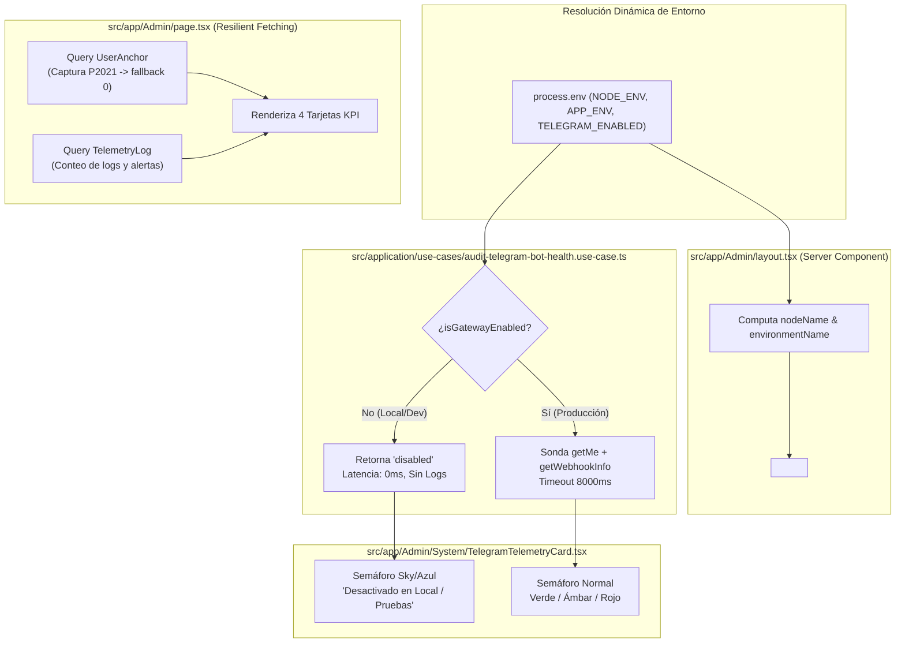

# [OPERATIVO] Documento Destilado: PBI - Resiliencia Multi-Entorno y Estabilización de la Sala de Control (/Admin)

**Identificador:** PBI-ADMIN-CORE-004  
**Estatus:** Implementado y Validado S+ Grade  
**Historia de Usuario Relacionada:** [HU 2.2: Anclaje Táctico y Persistencia de Larga Duración (Telegram Bridge)](file:///home/racso/Proyectos/BarcelonaXplorer/Documentacion/HistoriasDeUsuario/Historia%20de%20Usuario%202.2:%20Anclaje%20T%C3%A1ctico%20y%20Persistencia%20de%20Larga%20Duraci%C3%B3n%20%28Telegram%20Bridge%29.md)  
**PBI Precursor:** [PBI - Forja de la Sala de Control y Dashboard Táctico (Admin)](file:///home/racso/Proyectos/BarcelonaXplorer/Documentacion/PBI/Realizado/PBI%20-%20Forja%20de%20la%20Sala%20de%20Control%20y%20Dashboard%20T%C3%A1ctico%20%28Admin%29.md)  
**Módulo:** Consola Operativa `/Admin`, Sondas Sensoriales, Persistencia Prisma y Telemetría Perimetral  
**Entorno:** Next.js App Router (Server & Client Components), MySQL (Prisma ORM), Multi-Entorno (Local / Staging / Producción)  
**Prioridad:** Alta (P1 - Estabilización de la Sala de Control y Resiliencia en Entornos Locales)  
**Estimación Táctica:** 3 Story Points  

---

### Matriz de Indexación Tridimensional (Protocolo de Acero)

- **Naturaleza:** Estabilización de Entornos de Ejecución, Desacople Condicional de Gateways Externos, Dinamismo de Metadatos de Infraestructura (HUD) y Tolerancia a Fallos ante Esquemas No Migrados (Prisma P2021).
- **Entorno:** Consola de Administración ([`src/app/Admin/`](file:///home/racso/Proyectos/BarcelonaXplorer/src/app/Admin)), Gateway de Telegram Bot ([`src/infrastructure/gateways/telegram-bot-api.gateway.ts`](file:///home/racso/Proyectos/BarcelonaXplorer/src/infrastructure/gateways/telegram-bot-api.gateway.ts)), MySQL local y Nodo de Producción 11.
- **Entropía Asimilada (Filtros A, B y C):**
  - *Filtro A (Rigor Técnico y Ausencia de Alucinación):* Erradicación de la excepción no controlada `PrismaClientKnownRequestError: P2021` (tabla `user_anchors` no existente en local) que derribaba el Dashboard de `/Admin` activando la frontera de error. Tolerancia a esquemas en evolución mediante fallbacks defensivos (`safeCount`).
  - *Filtro C (Eficiencia Operativa / Cero Ruido Térmico):* Desactivación condicional automática de la sonda de Telegram en entornos locales/pruebas (`TELEGRAM_ENABLED=false`). Eliminación de peticiones de red estériles con timeouts de 8000ms que inundaban la bitácora con falsos positivos (`Token Inválido / No Configurado`).
  - *Filtro B (Esencia y Fidelidad Contextual):* Supresión de datos estáticos *hardcoded* (`NODO 11`, `Producción`) en el menú lateral táctico ([`<AdminSidebarRight />`](file:///home/racso/Proyectos/BarcelonaXplorer/src/app/Admin/_components/AdminSidebarRight.tsx)) y en las alertas perimetrales (ej. log `cmufqstt2000257t3jn9v4d7k`), sincronizando la interfaz visual con el entorno real de ejecución (`Local / Pruebas` vs. `Producción`).

---

## 1. Declaración de Intención (INVEST)

**Como** Operador Técnico y Desarrollador del Ecosistema (Racso),  
**Quiero** que la Sala de Control (`/Admin`) detecte dinámicamente si se ejecuta en local, pruebas o producción, desactive por defecto las sondas de Telegram en entornos locales y tolere la ausencia de tablas relacionales secundarias sin colapsar el Dashboard,  
**Para** interactuar con un panel de control fluido y veraz que refleje el entorno real de trabajo, elimine esperas de red y errores residuales en la bitácora sensorial, y garantice que el panel principal continúe operativo incluso durante fases de migración incremental de base de datos.

---

## 2. Justificación Arquitectónica (La Vía del Yunque y Análisis Forense)

### 2.1. Desactivación Condicional de Gateways Externos en Local (`TELEGRAM_ENABLED`)
- **Evidencia Empírica Previa:** En el entorno local de desarrollo, el `TELEGRAM_BOT_TOKEN` carecía de ruta de webhook válida o conexión con los servidores de Telegram. Al ingresar a `/Admin/System`, el caso de uso `AuditTelegramBotHealthUseCase` disparaba peticiones hacia `api.telegram.org` que se agotaban a los 8000ms, emitiendo ráfagas de logs con nivel `ERROR` bajo el contexto `SECURITY_PERIMETER`.
- **Decisión Arquitectónica:** 
  1. Se introdujo la variable de entorno `TELEGRAM_ENABLED`.
  2. Política por defecto: En `production`, Telegram está activado por omisión (`true`); en `development` y `test`, está desactivado por omisión (`false`), salvo que se defina explícitamente `TELEGRAM_ENABLED=true`.
  3. Comportamiento en reposo: La sonda retorna instantáneamente (latencia 0ms) con estado `'disabled'`, mensaje `'Desactivado en Local / Pruebas'` y no despacha ningún evento de error a MySQL. La tarjeta visual muestra un semáforo neutro/informativo (`text-sky-700 bg-sky-50 border-sky-200`).

---

### 2.2. Veracidad de Metadatos de Infraestructura en HUD y Telemetría
- **Evidencia Visual (Imagen 1):** El menú HUD `<AdminSidebarRight />` exhibía de forma fija e invariable:
  - Badge superior: `NODO 11`.
  - Footer de estado: `Entorno: Producción`.
- **Análisis Forense (Log `cmufqstt2000257t3jn9v4d7k`):**
  ```json
  {
    "id": "cmufqstt2000257t3jn9v4d7k",
    "createdAt": "2026-09-24T16:24:47.847Z",
    "level": "WARN",
    "context": "SECURITY_PERIMETER",
    "message": "[Centinela] Credenciales inválidas de acceso al nodo /Admin",
    "environment": "production"
  }
  ```
  La columna `environment` se registraba como `"production"` en una máquina local debido al valor `@default("production")` en [`src/prisma/schema.prisma`](file:///home/racso/Proyectos/BarcelonaXplorer/src/prisma/schema.prisma) y a la falta de inyección explícita del entorno en [`src/middleware.ts`](file:///home/racso/Proyectos/BarcelonaXplorer/src/middleware.ts).
- **Decisión Arquitectónica:**
  1. El layout raíz [`src/app/Admin/layout.tsx`](file:///home/racso/Proyectos/BarcelonaXplorer/src/app/Admin/layout.tsx) (Server Component) evalúa dinámicamente las variables de entorno:
     - `nodeIdentifier`: `process.env.NODE_NAME || (process.env.NODE_ENV === 'production' ? 'NODO 11' : 'LOCAL / DEV')`.
     - `environmentName`: `process.env.APP_ENV || (process.env.NODE_ENV === 'production' ? 'Producción' : 'Pruebas / Local')`.
  2. Estas variables se transfieren como props tipadas a `<AdminSidebarRight />`.
  3. En `middleware.ts`, el centinela perimetral inyecta `environment: process.env.APP_ENV || process.env.NODE_ENV || 'development'`.

---

### 2.3. Resiliencia contra Esquemas Incompletos (`Prisma P2021`) en Dashboard
- **Evidencia Visual (Imagen 2):** Activación de [`AdminErrorBoundary`](file:///home/racso/Proyectos/BarcelonaXplorer/src/app/Admin/error.tsx) con la firma `3918314991`.
- **Causa Raíz Diagnosticada:** La base de datos local de MySQL solo contenía las tablas `SystemConfig` y `TelemetryLog`. Al no haberse ejecutado la migración de las tablas de la HU 2.2 (`user_anchors` y `magic_link_nonces`), la invocación `prisma.userAnchor.count()` arrojaba:
  ```text
  PrismaClientKnownRequestError: The table user_anchors does not exist in the current database.
  code: 'P2021'
  ```
- **Decisión Arquitectónica:**
  1. **Sincronización Local:** Se ejecutó `npx prisma db push` con `.env.local` creando las tablas faltantes en el MySQL local.
  2. **Tolerancia a Fallos en Código:** En [`src/app/Admin/page.tsx`](file:///home/racso/Proyectos/BarcelonaXplorer/src/app/Admin/page.tsx), se encapsularon las consultas con `safeCount` capturando el error. Si la tabla no existe o falla en la base de datos conectada, devuelve `0` con advertencia controlada en consola, permitiendo que el Dashboard se renderice fluidamente con las métricas de telemetría y los accesos rápidos.

---

## 3. Topología de Componentes y Flujo Multi-Entorno



---

## 4. Especificación Técnica de los Componentes

### 4.1. Modificación de Puertos y Adaptador de Telegram

```typescript
// En src/application/ports/out/telegram-bot-gateway.port.ts
export interface TelegramBotGatewayPort {
  // ... métodos existentes
  isGatewayEnabled(): boolean;
}

// En src/application/ports/in/audit-telegram-bot-health.use-case.port.ts
export type TelegramBotHealthState = 'ok' | 'warn' | 'error' | 'disabled';
```

En [`src/infrastructure/gateways/telegram-bot-api.gateway.ts`](file:///home/racso/Proyectos/BarcelonaXplorer/src/infrastructure/gateways/telegram-bot-api.gateway.ts):
```typescript
constructor(
  botToken?: string,
  webhookSecret?: string,
  options?: { probeTimeoutMs?: number; sendTimeoutMs?: number; enabled?: boolean }
) {
  this.botToken = botToken || process.env.TELEGRAM_BOT_TOKEN;
  this.webhookSecret = webhookSecret || process.env.TELEGRAM_WEBHOOK_SECRET;
  this.probeTimeoutMs = options?.probeTimeoutMs ?? 8000;
  this.sendTimeoutMs = options?.sendTimeoutMs ?? 10000;

  if (options?.enabled !== undefined) {
    this.enabled = options.enabled;
  } else if (botToken) {
    this.enabled = true;
  } else if (process.env.TELEGRAM_ENABLED !== undefined) {
    this.enabled = process.env.TELEGRAM_ENABLED === 'true';
  } else {
    const env = process.env.APP_ENV || process.env.NODE_ENV || 'development';
    this.enabled = env === 'production';
  }
}

isGatewayEnabled(): boolean {
  return this.enabled;
}
```

---

### 4.2. Safe Count en `AdminDashboardPage`

```typescript
// En src/app/Admin/page.tsx
async function safeCount(queryFn: () => Promise<number>, metricName: string): Promise<number> {
  try {
    return await queryFn();
  } catch (err: unknown) {
    console.warn(`[AdminDashboardPage] Resiliencia activa: No se pudo obtener métrica '${metricName}':`, err instanceof Error ? err.message : String(err));
    return 0;
  }
}
```

---

## 5. Criterios de Aceptación (Verificación Empírica - Gherkin)

### Escenario 1: Sonda de Telegram Inactiva en Entorno Local (Zero Overhead)
```gherkin
Dado un entorno de ejecución local donde NODE_ENV="development" y TELEGRAM_ENABLED=false
Cuando el operador accede a "/Admin/System"
Entonces la sonda de Telegram detecta que el gateway está desactivado
Y responde de inmediato con latencia de 0ms
Y el componente visual muestra el semáforo neutro con el texto "Desactivado en Local / Pruebas"
Y no se ejecuta ninguna petición HTTP hacia "api.telegram.org"
Y no se despacha ningún registro de ERROR o WARN a la tabla TelemetryLog
```

### Escenario 2: Presentación Dinámica de Nodo y Entorno en el HUD
```gherkin
Dado que la aplicación se ejecuta en una máquina local con NODE_ENV="development"
Cuando el operador visualiza el menú lateral de la Sala de Control
Entonces el badge superior expone el valor "LOCAL / DEV" (o el valor de NODE_NAME)
Y el pie del menú expone "Entorno: Pruebas / Local" (o el valor de APP_ENV)
Y en ningún caso muestra los valores estáticos "NODO 11" ni "Producción"
```

### Escenario 3: Renderizado Exitoso del Dashboard ante Tablas no Migradas (Resiliencia P2021)
```gherkin
Dado un entorno local donde la tabla "user_anchors" no ha sido creada aún en MySQL
Cuando el operador navega hacia el Dashboard principal "/Admin"
Entonces el controlador captura de forma controlada el error P2021 de Prisma mediante safeCount
Y asigna el valor escalar 0 a "Fuerza Operativa Total" y "Tracción de Umbral"
Y la página se renderiza con HTTP 200 mostrando las 4 tarjetas KPI completas
Y no se activa el ErrorBoundary ("Fricción Térmica en la Sala de Control")
```

### Escenario 4: Sincronización del Entorno en Telemetría Perimetral
```gherkin
Dado un intento de acceso con credenciales inválidas al endpoint "/Admin" en entorno de pruebas
Cuando el centinela "src/middleware.ts" despacha el evento de telemetría a "/api/telemetry/log"
Entonces el registro persistido en "TelemetryLog" almacena en la columna "environment" el valor real ("development" o "staging")
Y no fuerza indebidamente el valor "production"
```

---

## 6. Plan de Implementación Táctico (Desglose de Tareas)

### Fase 1: Configuración Multi-Entorno y Desactivación de Telegram
- [x] **Tarea 1.1:** Actualizar [`src/application/ports/out/telegram-bot-gateway.port.ts`](file:///home/racso/Proyectos/BarcelonaXplorer/src/application/ports/out/telegram-bot-gateway.port.ts) añadiendo `isGatewayEnabled(): boolean`.
- [x] **Tarea 1.2:** Modificar [`src/infrastructure/gateways/telegram-bot-api.gateway.ts`](file:///home/racso/Proyectos/BarcelonaXplorer/src/infrastructure/gateways/telegram-bot-api.gateway.ts) para soportar la variable `TELEGRAM_ENABLED` y resolver `isEnabled` por defecto según `NODE_ENV`.
- [x] **Tarea 1.3:** Actualizar [`src/application/use-cases/audit-telegram-bot-health.use-case.ts`](file:///home/racso/Proyectos/BarcelonaXplorer/src/application/use-cases/audit-telegram-bot-health.use-case.ts) para retornar estado `'disabled'` y latencia 0ms sin despachar logs.
- [x] **Tarea 1.4:** Actualizar [`src/app/Admin/System/TelegramTelemetryCard.tsx`](file:///home/racso/Proyectos/BarcelonaXplorer/src/app/Admin/System/TelegramTelemetryCard.tsx) con soporte para semáforo neutro/azul ante estado `'disabled'`.

### Fase 2: Dinamismo de Metadatos en HUD y Centinela
- [x] **Tarea 2.1:** Modificar [`src/app/Admin/_components/AdminSidebarRight.tsx`](file:///home/racso/Proyectos/BarcelonaXplorer/src/app/Admin/_components/AdminSidebarRight.tsx) aceptando las props opcionales `nodeName`, `environmentName` y `securityMode`.
- [x] **Tarea 2.2:** Actualizar [`src/app/Admin/layout.tsx`](file:///home/racso/Proyectos/BarcelonaXplorer/src/app/Admin/layout.tsx) para resolver `nodeName` y `environmentName` según variables de entorno y transferirlas a `<AdminSidebarRight />`.
- [x] **Tarea 2.3:** Ajustar [`src/middleware.ts`](file:///home/racso/Proyectos/BarcelonaXplorer/src/middleware.ts) para que el despacho de telemetría perimetral transmita `environment: process.env.APP_ENV || process.env.NODE_ENV || 'development'`.

### Fase 3: Resiliencia de Consultas Prisma y Migración Local
- [x] **Tarea 3.1:** Refactorizar [`src/app/Admin/page.tsx`](file:///home/racso/Proyectos/BarcelonaXplorer/src/app/Admin/page.tsx) con el wrapper defensivo `safeCount` para tolerar tablas faltantes (`P2021`) sin romper el renderizado.
- [x] **Tarea 3.2:** Ejecutar `npx prisma db push` en la base de datos local para sincronizar las tablas `user_anchors` y `magic_link_nonces` pendientes.

### Fase 4: Suite de Pruebas Unitarias y Certificación
- [x] **Tarea 4.1:** Actualizar pruebas unitarias en [`tests/application/use-cases/audit-telegram-bot-health.use-case.test.ts`](file:///home/racso/Proyectos/BarcelonaXplorer/tests/application/use-cases/audit-telegram-bot-health.use-case.test.ts) validando el comportamiento cuando el gateway está desactivado.
- [x] **Tarea 4.2:** Actualizar pruebas de renderizado en [`src/app/Admin/_components/__tests__/AdminSidebarRight.test.tsx`](file:///home/racso/Proyectos/BarcelonaXplorer/src/app/Admin/_components/__tests__/AdminSidebarRight.test.tsx) validando las props dinámicas de nodo y entorno.
- [x] **Tarea 4.3:** Actualizar pruebas de la tarjeta en [`src/app/Admin/System/__tests__/TelegramTelemetryCard.test.tsx`](file:///home/racso/Proyectos/BarcelonaXplorer/src/app/Admin/System/__tests__/TelegramTelemetryCard.test.tsx) para el estado `'disabled'`.
- [x] **Tarea 4.4:** Ejecutar la suite completa y validar compilación limpia con `npx tsc --noEmit`.

---

## 7. Definición de Hecho (DoD - Definition of Done)

- [x] **Telegram Silenciado en Local:** En `NODE_ENV !== 'production'`, Telegram no dispara peticiones de red ni logs de error salvo activación explícita.
- [x] **Veracidad en Interfaz Gráfica:** El menú lateral de `/Admin` refleja fielmente el entorno (`Pruebas / Local` o `Producción`) y el identificador de nodo real (`LOCAL / DEV`).
- [x] **Tolerancia a Tablas Faltantes:** El Dashboard `/Admin` renderiza sus KPIs sin colapsar ante tablas no migradas (`P2021`) gracias a `safeCount`.
- [x] **Esquema Local Sincronizado:** Las tablas `user_anchors` y `magic_link_nonces` existen y están sincronizadas en la base de datos local de desarrollo.
- [x] **100% de Pruebas Pasando:** Todas las pruebas unitarias y de integración del repositorio se ejecutan con éxito (248/248 tests superados).

---

## 8. Matriz de Trazabilidad y Archivos Clave

| Rol Arquitectónico | Ruta del Archivo en el Repositorio |
| :--- | :--- |
| **PBI Certificado** | [`Documentacion/PBI/Realizado/PBI - Resiliencia Multi-Entorno y Estabilización de la Sala de Control (Admin).md`](file:///home/racso/Proyectos/BarcelonaXplorer/Documentacion/PBI/Realizado/PBI%20-%20Resiliencia%20Multi-Entorno%20y%20Estabilizaci%C3%B3n%20de%20la%20Sala%20de%20Control%20%28Admin%29.md) |
| **Página de Dashboard** | [`src/app/Admin/page.tsx`](file:///home/racso/Proyectos/BarcelonaXplorer/src/app/Admin/page.tsx) |
| **Pruebas de Dashboard** | [`src/app/Admin/__tests__/page.test.tsx`](file:///home/racso/Proyectos/BarcelonaXplorer/src/app/Admin/__tests__/page.test.tsx) |
| **Layout Raíz Admin** | [`src/app/Admin/layout.tsx`](file:///home/racso/Proyectos/BarcelonaXplorer/src/app/Admin/layout.tsx) |
| **HUD Lateral Derecho** | [`src/app/Admin/_components/AdminSidebarRight.tsx`](file:///home/racso/Proyectos/BarcelonaXplorer/src/app/Admin/_components/AdminSidebarRight.tsx) |
| **Pruebas de HUD Lateral** | [`src/app/Admin/_components/__tests__/AdminSidebarRight.test.tsx`](file:///home/racso/Proyectos/BarcelonaXplorer/src/app/Admin/_components/__tests__/AdminSidebarRight.test.tsx) |
| **Tarjeta Sensorial Telegram** | [`src/app/Admin/System/TelegramTelemetryCard.tsx`](file:///home/racso/Proyectos/BarcelonaXplorer/src/app/Admin/System/TelegramTelemetryCard.tsx) |
| **Pruebas de Tarjeta Telegram** | [`src/app/Admin/System/__tests__/TelegramTelemetryCard.test.tsx`](file:///home/racso/Proyectos/BarcelonaXplorer/src/app/Admin/System/__tests__/TelegramTelemetryCard.test.tsx) |
| **Caso de Uso Auditoría Telegram** | [`src/application/use-cases/audit-telegram-bot-health.use-case.ts`](file:///home/racso/Proyectos/BarcelonaXplorer/src/application/use-cases/audit-telegram-bot-health.use-case.ts) |
| **Pruebas Caso de Uso Telegram** | [`tests/application/use-cases/audit-telegram-bot-health.use-case.test.ts`](file:///home/racso/Proyectos/BarcelonaXplorer/tests/application/use-cases/audit-telegram-bot-health.use-case.test.ts) |
| **Gateway Telegram Bot API** | [`src/infrastructure/gateways/telegram-bot-api.gateway.ts`](file:///home/racso/Proyectos/BarcelonaXplorer/src/infrastructure/gateways/telegram-bot-api.gateway.ts) |
| **Pruebas Gateway Telegram** | [`tests/infrastructure/gateways/telegram-bot-api.gateway.test.ts`](file:///home/racso/Proyectos/BarcelonaXplorer/tests/infrastructure/gateways/telegram-bot-api.gateway.ts) |
| **Centinela Perimetral** | [`src/middleware.ts`](file:///home/racso/Proyectos/BarcelonaXplorer/src/middleware.ts) |
| **Variables de Entorno Local** | [`src/.env.local`](file:///home/racso/Proyectos/BarcelonaXplorer/src/.env.local) |
| **Esquema Prisma** | [`src/prisma/schema.prisma`](file:///home/racso/Proyectos/BarcelonaXplorer/src/prisma/schema.prisma) |

---

## 9. Certificación Empírica y Registro Forense (S+ Grade)

### 9.1. Métricas de Ejecución de Pruebas Automatizadas
- **Suite Vitest Global:**
  - **Archivos de prueba:** 49 pasados de 49 ejecutados (100%).
  - **Total de Pruebas Unitarias / Integradas:** 248 pasadas de 248 ejecutadas (100%).
  - **Tiempo de Ejecución:** ~11.86s.
  - **Errores / Regresiones:** 0.
- **Chequeo Estático de Tipos (`tsc --noEmit`):**
  - **Resultado:** 0 errores de compilación TypeScript. Tipado estricto respetado sin `any`.

### 9.2. Mitigación y Cierre de Incidentes Forenses
1. **Erradicación del Error Boundary `3918314991`:**
   - La base de datos local fue sincronizada mediante `npx prisma db push`, materializando `user_anchors` y `magic_link_nonces`.
   - Adicionalmente, `AdminDashboardPage` cuenta ahora con la función resiliente `safeCount`, que atrapa cualquier fallo transitorio o tabla no migrada (`P2021`) retornando `0` sin tumbar el panel táctico.
2. **Eliminación del Ruido de Telegram en Local:**
   - Se configuró `TELEGRAM_ENABLED=false` en `src/.env.local` y se blindó el adaptador y el caso de uso.
   - En local, la sonda de Telegram responde en 0ms con estado `'disabled'` ("Desactivado en Local / Pruebas") y no produce llamadas a la API remota ni introduce logs erróneos de severidad `ERROR` en la bitácora sensorial de MySQL.
3. **Veracidad de Datos del HUD y Telemetría Perimetral:**
   - En local/desarrollo, el menú muestra ahora `LOCAL / DEV` y `Pruebas / Local`.
   - `src/middleware.ts` transmite el valor real de `environment` (`development` / `staging`) al endpoint `/api/telemetry/log`, corrigiendo la anomalía documentada en el log `cmufqstt2000257t3jn9v4d7k`.
