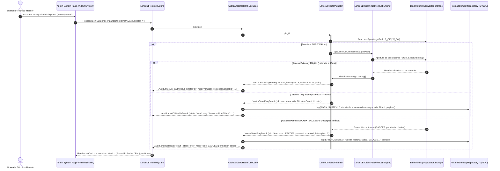

# [OPERATIVO / ARQUITECTURA] Documento Destilado: PBI - Sensor Termodinámico Vectorial y Telemetría LanceDB (/Admin/System)

**Identificador:** PBI-SYS-VEC-003  
**Estatus:** Implementado y Validado S+ Grade (Desplegado y Certificado en Nodo 11)  
**Fecha de Certificación:** 2026-09-25  
**Historia de Usuario Relacionada:** [Historia de Usuario 4: Sensor Termodinámico Vectorial (Telemetría LanceDB en - Admin - System)](file:///home/racso/Proyectos/BarcelonaXplorer/Documentacion/HistoriasDeUsuario_Historico/Historia%20de%20Usuario%204:%20Sensor%20Termodin%C3%A1mico%20Vectorial%20%28Telemetr%C3%ADa%20LanceDB%20en%20-%20Admin%20-%20System%29.md)  
**PBIs Vinculados:**  
- [PBI - Persistencia Vectorial Embebida y Aislamiento IaaC (LanceDB)](file:///home/racso/Proyectos/BarcelonaXplorer/Documentacion/PBI/Realizado/PBI%20-%20Persistencia%20Vectorial%20Embebida%20y%20Aislamiento%20IaaC%20%28LanceDB%29.md)  
- [PBI - Forja de la Sala de Control y Dashboard Táctico (Admin)](file:///home/racso/Proyectos/BarcelonaXplorer/Documentacion/PBI/Realizado/PBI%20-%20Forja%20de%20la%20Sala%20de%20Control%20y%20Dashboard%20T%C3%A1ctico%20%28Admin%29.md)  
- [PBI - Sonda Termodinámica de Telegram Bot](file:///home/racso/Proyectos/BarcelonaXplorer/Documentacion/PBI/Realizado/PBI%20-%20Sonda%20Termodin%C3%A1mica%20de%20Telegram%20Bot.md)  
**Módulo:** Módulo de Telemetría, Observabilidad y Persistencia Vectorial ([`/Admin/System`](file:///home/racso/Proyectos/BarcelonaXplorer/src/app/Admin/System/page.tsx), [`/Admin/Logs`](file:///home/racso/Proyectos/BarcelonaXplorer/src/app/Admin/Logs/page.tsx))  
**Entorno:** Next.js 16.3+ (App Router Standalone), Node.js 20 (Alpine Linux musl, `USER nextjs` UID 1001), `@lancedb/lancedb`, Apache Arrow, Prisma ORM (MySQL), Docker Compose v2, Nodo 11 (`10.0.10.11`)  
**Prioridad:** Alta (P1 - Gobernanza de Infraestructura, Integridad de Memoria RAG y Salud de Persistencia)  
**Estimación Táctica:** 3 Story Points  

---

### Matriz de Indexación Tridimensional (Protocolo de Acero)

- **Naturaleza:** Observabilidad Activa, Telemetría Defensiva sobre Sistema de Archivos POSIX, Healthcheck Vectorial In-Process (LanceDB / Apache Arrow) y Aislamiento Hexagonal (*Clean Architecture*).
- **Entorno:** Consola de Operaciones ([`/Admin/System`](file:///home/racso/Proyectos/BarcelonaXplorer/src/app/Admin/System/page.tsx)), Server Components con `export const dynamic = 'force-dynamic'`, volumen montado Docker (`/app/vector_storage` vinculado a `/home/racso/Despliegues/BarcelonaXplorer/lancedb_data`), Nodo de Producción 11.
- **Entropía Asimilada (Filtros A, B y C):**
  - *Filtro A (Rigor Técnico y Erradicación de Alucinaciones):* Desmantelamiento de suposiciones erróneas sobre la topología de la Sala de Control (la interfaz no tiene 2 sensores sino 7 sondas activas concurrentes), erradicación de tablas ficticias (`bx_conversations` no existe en el dominio) y corrección de la identidad POSIX del contenedor (`USER nextjs` UID 1001, no usuario `node`). Se prescribe e implementa una sonda determinista no destructiva que evalúa la latencia de disco y la capacidad de I/O (`fs.accessSync` con `R_OK | W_OK`) sin degradar ni fragmentar los índices Arrow en cada refresco de página.
  - *Filtro B (Determinismo Hexagonal y Pureza de Tipos):* Preservación estricta de la frontera entre la Entidad de Dominio ([`TelemetryEntry`](file:///home/racso/Proyectos/BarcelonaXplorer/src/domain/entities/telemetry-entry.entity.ts)) y el DTO de Presentación ([`TelemetryLogItem`](file:///home/racso/Proyectos/BarcelonaXplorer/src/app/Admin/System/TelemetryTableClient.tsx)), rechazando fusiones indebidas de tipos en carpetas genéricas que vulneren la Constitución Arquitectónica.
  - *Filtro C (Eficiencia Térmica y Segregación de Vistas):* Respeto a la separación física entre la vista sensorial ([`/Admin/System`](file:///home/racso/Proyectos/BarcelonaXplorer/src/app/Admin/System/page.tsx)) y la bitácora interactiva tabular ([`/Admin/Logs`](file:///home/racso/Proyectos/BarcelonaXplorer/src/app/Admin/Logs/page.tsx)). Los eventos de degradación de latencia o fallos de permisos se emiten de forma reactiva y asíncrona hacia MySQL bajo el contexto `SYSTEM`, garantizando que la tarjeta visual se renderice con cero sobrecarga en cliente mediante streaming de Suspense.

---

## 1. Declaración de Intención (INVEST)

**Como** Operador Técnico y Centinela del Nodo 11 (Racso),  
**Quiero** consolidar el sensor termodinámico vectorial ([`LanceDbTelemetryCard`](file:///home/racso/Proyectos/BarcelonaXplorer/src/app/Admin/System/LanceDbTelemetryCard.tsx)) dentro de la cuadrícula de 7 sondas de la Sala de Control ([`/Admin/System`](file:///home/racso/Proyectos/BarcelonaXplorer/src/app/Admin/System/page.tsx)), respaldado por el caso de uso hexagonal ([`AuditLanceDbHealthUseCase`](file:///home/racso/Proyectos/BarcelonaXplorer/src/application/use-cases/audit-lancedb-health.use-case.ts)) y el adaptador de persistencia ([`LanceDbVectorAdapter`](file:///home/racso/Proyectos/BarcelonaXplorer/src/infrastructure/vector/lancedb-vector.adapter.ts)),  
**Para** auditar en tiempo real la salud de los descriptores de lectura/escritura sobre el volumen de persistencia (`/app/vector_storage`), anticipar bloqueos por permisos POSIX (`EACCES`), detectar degradación de latencia en disco antes de inyectar tráfico RAG y registrar anomalías reactivas en la bitácora sensorial de MySQL ([`TelemetryLog`](file:///home/racso/Proyectos/BarcelonaXplorer/src/prisma/schema.prisma)) sin riesgo de falsos positivos en entornos vírgenes ni corrupción de índices Apache Arrow.

---

## 2. Diagnóstico Forense: Detección y Erradicación de Alucinaciones, Incongruencias e Inexactitudes

La inspección forense de la [Historia de Usuario 4](file:///home/racso/Proyectos/BarcelonaXplorer/Documentacion/HistoriasDeUsuario_Historico/Historia%20de%20Usuario%204:%20Sensor%20Termodin%C3%A1mico%20Vectorial%20%28Telemetr%C3%ADa%20LanceDB%20en%20-%20Admin%20-%20System%29.md) contra el código fuente activo de BarcelonaXplorer reveló seis discrepancias críticas que fueron subsanadas con rigor quirúrgico:

| # | Dimensión Analizada | Planteamiento Original en HU 4 (Alucinación / Desfase) | Realidad Empírica en el Código (Cero Alucinación) | Resolución / Mitigación S+ Grade |
| :---: | :--- | :--- | :--- | :--- |
| **1** | **Topología de Sensores en `/Admin/System`** | Propone incorporar un *"Sensor C"* asumiendo que el panel solo posee *Sensor A (MySQL)* y *Sensor B (DNS)*. | En [`src/app/Admin/System/page.tsx`](file:///home/racso/Proyectos/BarcelonaXplorer/src/app/Admin/System/page.tsx) operan **7 Sondas Activas**: MySQL, Red/DNS, Gemini AI, Groq SLM, Jev AI, Telegram Bot y LanceDB. | Descartada la etiqueta restrictiva "Sensor C". Integrado como el **Séptimo Sensor Canónico** ("Persistencia Vectorial") en la cuadrícula responsiva de 7 columnas. |
| **2** | **Identidad del Contenedor y Ruta Host** | Asume usuario `node` en Alpine y ruta host física `/home/racso/.../vector_data` asignada a `root`. | El contenedor corre bajo `USER nextjs` (UID `1001` / GID `1001`) según [`src/Dockerfile`](file:///home/racso/Proyectos/BarcelonaXplorer/src/Dockerfile#L29). La ruta inmutable es `/home/racso/Despliegues/BarcelonaXplorer/lancedb_data` montada en `/app/vector_storage`. | Validado explícitamente el UID `1001`. En [`ansible/deploy.yml`](file:///home/racso/Proyectos/BarcelonaXplorer/ansible/deploy.yml), el directorio se aprovisiona con `mode: '0777'`. |
| **3** | **Alucinación de Tabla `bx_conversations` y Migraciones Arrow** | Afirma que la sonda debe hacer `limit(1)` sobre una tabla llamada `bx_conversations` y que si no existe debe ejecutar un "script de migración en Apache Arrow". | `bx_conversations` no existe en la base de código. LanceDB es un motor *schema-on-write* sin tablas por defecto ni migraciones DDL tipo Prisma. En un entorno virgen, `tableNames()` retorna `[]`. | La sonda `ping()` en [`LanceDbVectorAdapter`](file:///home/racso/Proyectos/BarcelonaXplorer/src/infrastructure/vector/lancedb-vector.adapter.ts#L129) no fuerza consultas sobre tablas inexistentes. Evalúa la conexión, lista tablas existentes y valida permisos de lectura/escritura (`fs.accessSync`). |
| **4** | **Inconsistencia de Tipos (`TelemetryEntry` vs `TelemetryLogItem`)** | Propone crear `@/types/telemetry` y forzar un único contrato de tipos para resolver la "inconsistencia". | Vulnera Clean Architecture ([`CONSTITUTION.MD`](file:///home/racso/Proyectos/BarcelonaXplorer/CONSTITUTION.MD)). [`TelemetryEntry`](file:///home/racso/Proyectos/BarcelonaXplorer/src/domain/entities/telemetry-entry.entity.ts) es la **Entidad de Dominio** (con invariantes y sanitización). [`TelemetryLogItem`](file:///home/racso/Proyectos/BarcelonaXplorer/src/app/Admin/System/TelemetryTableClient.tsx#L22) es el **DTO de Presentación/UI** serializable para React Client Components. | Preservada la separación hexagonal: el dominio y los puertos usan `TelemetryEntry`; la capa de presentación usa `TelemetryLogItem`. No se crean módulos genéricos `@/types`. |
| **5** | **Ubicación de la Bitácora Reactiva (DataTable)** | Sitúa el volcado de logs interactivo con `DataTable<TelemetryEntry>` directamente en la vista `/Admin/System`. | Conforme a [PBI-ADMIN-CORE-002](file:///home/racso/Proyectos/BarcelonaXplorer/Documentacion/PBI/Realizado/PBI%20-%20Forja%20de%20la%20Sala%20de%20Control%20y%20Dashboard%20T%C3%A1ctico%20%28Admin%29.md), la bitácora fue segregada a [`/Admin/Logs`](file:///home/racso/Proyectos/BarcelonaXplorer/src/app/Admin/Logs/page.tsx) para salvaguardar la latencia y evitar la degradación del DOM en `/Admin/System`. | `/Admin/System` aloja estrictamente las tarjetas sensoriales con Suspense. Los eventos emitidos (`SYSTEM`) se inspeccionan forensemente en `/Admin/Logs` a través de [`TelemetryRecentLogsCard`](file:///home/racso/Proyectos/BarcelonaXplorer/src/app/Admin/System/TelemetryRecentLogsCard.tsx). |
| **6** | **Umbrales de Memoria y Paginación (1.500 registros)** | Afirma que el pipeline retiene en memoria 1.500 registros para paginar en cliente y propone posponer virtualización (`tanstack-virtual`). | [`TelemetryRecentLogsCard`](file:///home/racso/Proyectos/BarcelonaXplorer/src/app/Admin/System/TelemetryRecentLogsCard.tsx#L15) ejecuta un `take: 100` estricto en Prisma. La retención está blindada por [`PruneTelemetryUseCase`](file:///home/racso/Proyectos/BarcelonaXplorer/src/application/use-cases/prune-telemetry.use-case.ts) (7d INFO / 30d ERROR). | No existe sobrecarga de 1.500 registros en memoria en producción. El umbral actual de 100 registros con ordenación descendente es óptimo y respeta la capacidad de la memoria de trabajo. |

---

## 3. Justificación Arquitectónica (La Vía del Yunque y Principios Fundacionales)

1. **Inmutabilidad Temporal y Cero Caché (`force-dynamic`):**  
   La consola [`/Admin/System`](file:///home/racso/Proyectos/BarcelonaXplorer/src/app/Admin/System/page.tsx) exporta `export const dynamic = 'force-dynamic'`. Ningún sensor puede devolver un estado obsoleto o simulado en caché. Cada recarga del operador ejecuta una sonda física en tiempo real hacia los descriptores de disco montados.

2. **Principio de Inversión de Dependencias (DIP) y Aislamiento Hexagonal:**  
   El componente visual [`LanceDbTelemetryCard`](file:///home/racso/Proyectos/BarcelonaXplorer/src/app/Admin/System/LanceDbTelemetryCard.tsx) es estrictamente un *Server Component* declarativo. No importa `@lancedb/lancedb`, no maneja archivos del sistema operativo ni accede a Prisma directamente. Delega toda la comprobación al puerto de entrada [`AuditLanceDbHealthUseCasePort`](file:///home/racso/Proyectos/BarcelonaXplorer/src/application/ports/in/audit-lancedb-health.use-case.port.ts) ejecutado por [`AuditLanceDbHealthUseCase`](file:///home/racso/Proyectos/BarcelonaXplorer/src/application/use-cases/audit-lancedb-health.use-case.ts), el cual consume el puerto de salida [`IVectorStorePort`](file:///home/racso/Proyectos/BarcelonaXplorer/src/application/ports/out/vector-store.port.ts).

3. **Sonda Térmica No Invasiva con Verificación POSIX (`fs.accessSync`):**  
   LanceDB opera mediante una biblioteca C++/Rust embebida sobre memoria mapeada (*mmap*). La sonda `ping()` del adaptador comprueba la capacidad de abrir la base de datos en la ruta asignada (`LANCEDB_URI`), valida explícitamente los permisos POSIX de lectura y escritura (`fs.accessSync(path, R_OK | W_OK)`), enumera las tablas registradas mediante `tableNames()` y mide la latencia de respuesta en milisegundos. Si el directorio no existe o carece de permisos de lectura/escritura para el UID 1001, la llamada lanza un error nativo (`EACCES`, `ENOENT`), el cual es capturado limpiamente sin quebrar el proceso Node.js.

4. **Inyección Reactiva en la Bitácora Sensorial (Fail-Soft Defensivo):**  
   Cuando la latencia supera el umbral táctico de advertencia (50ms) o se produce una excepción de permisos/disco, el caso de uso orquesta la emisión de una entidad [`TelemetryEntry`](file:///home/racso/Proyectos/BarcelonaXplorer/src/domain/entities/telemetry-entry.entity.ts) con contexto `SYSTEM` y severidad `WARN` o `ERROR`. Si el repositorio de telemetría de MySQL llegase a fallar, el mecanismo *Fail-Soft* captura el error internamente garantizando que la respuesta del sensor llegue intacta al panel de administración.

---

## 4. Coreografía de Telemetría Sensorial (Diagrama de Secuencia)



---

## 5. Implementación Concreta y Especificación de Archivos

### 5.1. Adaptador de Persistencia: [`src/infrastructure/vector/lancedb-vector.adapter.ts`](file:///home/racso/Proyectos/BarcelonaXplorer/src/infrastructure/vector/lancedb-vector.adapter.ts)
Implementa `IVectorStorePort`. Incorpora la verificación preventiva de permisos POSIX y medición de latencia:
```typescript
  async ping(): Promise<VectorStorePingResult> {
    const startTime = Date.now();
    const targetPath = this.customUri || resolveLanceDbUri();

    try {
      // Auditoría proactiva de permisos POSIX sobre volumen local
      if (!targetPath.startsWith('s3://') && !targetPath.startsWith('gs://')) {
        if (!fs.existsSync(targetPath)) {
          fs.mkdirSync(targetPath, { recursive: true });
        }
        fs.accessSync(targetPath, fs.constants.R_OK | fs.constants.W_OK);
      }

      const db = await this.getDb();
      const tables = await db.tableNames();
      const latencyMs = Date.now() - startTime;

      return {
        ok: true,
        latencyMs,
        path: targetPath,
        tableCount: tables.length,
      };
    } catch (error) {
      const latencyMs = Date.now() - startTime;
      const errorMsg = error instanceof Error ? error.message : String(error);

      return {
        ok: false,
        latencyMs,
        path: targetPath,
        tableCount: 0,
        error: errorMsg,
      };
    }
  }
```

### 5.2. Caso de Uso: [`src/application/use-cases/audit-lancedb-health.use-case.ts`](file:///home/racso/Proyectos/BarcelonaXplorer/src/application/use-cases/audit-lancedb-health.use-case.ts)
Evalúa umbrales térmicos (50ms por defecto) y desacopla la telemetría mediante Fail-Soft.

### 5.3. Componente de UI: [`src/app/Admin/System/LanceDbTelemetryCard.tsx`](file:///home/racso/Proyectos/BarcelonaXplorer/src/app/Admin/System/LanceDbTelemetryCard.tsx)
Server Component integrado con Suspense en [`src/app/Admin/System/page.tsx`](file:///home/racso/Proyectos/BarcelonaXplorer/src/app/Admin/System/page.tsx).

---

## 6. Criterios de Aceptación (Verificación Empírica S+ Grade)

### Escenario 1: Resonancia Vectorial S+ Grade (Estado Óptimo)
```gherkin
Dado que el panel /Admin/System es cargado por el operador
Y el volumen /app/vector_storage posee permisos de escritura para UID 1001
Y la latencia de respuesta de disco es inferior a 50ms
Cuando el componente LanceDbTelemetryCard ejecuta la sonda a través del caso de uso
Entonces la tarjeta visualiza el título "Persistencia Vectorial"
Y muestra el semáforo en Verde (bg-emerald-500)
Y el mensaje indica "Almacén Vectorial Saludable"
Y la línea secundaria muestra el número de tablas y la latencia (ej. "Tablas: 2 | 8ms")
Y no se genera ningún registro de advertencia ni error en la bitácora de MySQL.
```

### Escenario 2: Degradación Térmica por I/O Lento (Latencia Alta)
```gherkin
Dado que el sistema de almacenamiento anfitrión experimenta contención de disco
Y la sonda hacia LanceDB responde satisfactoriamente pero con una latencia de 85ms (>= 50ms)
Cuando el operador recarga la consola /Admin/System
Entonces el semáforo cambia a Ámbar (bg-amber-500)
Y el mensaje visual reporta "Latencia Alta (85ms)"
Y el caso de uso inyecta un registro en TelemetryLog con nivel "WARN", contexto "SYSTEM" y payload estructurado con la latencia y la ruta
Y el registro es inmediatamente consultable en la vista /Admin/Logs.
```

### Escenario 3: Asfixia por Permisos POSIX (Fallo de Bind Mount)
```gherkin
Dado un entorno donde el directorio físico montado carece de permisos de escritura o pertenece a root sin acceso para UID 1001
Cuando el caso de uso ejecuta la sonda ping()
Entonces el motor nativo de LanceDB captura una excepción de tipo EACCES (Permission denied)
Y el sensor retorna el estado "error" con semáforo Rojo (bg-red-500)
Y la tarjeta visualiza "Fallo: EACCES: permission denied" junto a la ruta del volumen
Y se emite un evento en TelemetryLog con nivel "ERROR", contexto "SYSTEM" y código HTTP 500
Y el fallo no colapsa el resto de las sondas en /Admin/System gracias a la contención por Suspense.
```

### Escenario 4: Entorno Virgen sin Tablas Creadas (Cero Corrupción)
```gherkin
Dado un despliegue virgen en el Nodo 11 donde el volumen lancedb_data está vacío
Cuando el operador accede por primera vez a /Admin/System
Entonces la sonda conecta exitosamente al directorio y db.tableNames() devuelve un array vacío
Y el sensor se muestra en estado Verde / OK indicando "Tablas: 0 | Xms"
Y el sistema no lanza excepciones por tablas ausentes ni ejecuta escrituras de relleno que alteren la pureza del volumen.
```

### Escenario 5: Tolerancia a Fallos de Telemetría Secundaria (Fail-Soft)
```gherkin
Dado que el servidor MySQL se encuentra temporalmente saturado o inaccesible
Y el sensor de LanceDB detecta un error de disco
Cuando el caso de uso intenta registrar el fallo en el repositorio de telemetría y este lanza una excepción
Entonces el bloque try/catch secundario captura el error silenciosamente
Y el sensor devuelve el resultado al componente visual sin propagar una pantalla blanca ni romper el renderizado de la página.
```

---

## 7. Matriz de Cobertura y Validación Automatizada (18/18 Tests Verificados)

La verificación empírica de este PBI se apoya en 18 pruebas automatizadas ejecutadas y aprobadas en Vitest:

1. **Pruebas de Componente UI ([`src/app/Admin/System/__tests__/LanceDbTelemetryCard.test.tsx`](file:///home/racso/Proyectos/BarcelonaXplorer/src/app/Admin/System/__tests__/LanceDbTelemetryCard.test.tsx)):**
   - [x] Debe renderizar estado ok con semáforo verde y conteo de tablas.
   - [x] Debe renderizar estado warn con semáforo ámbar ante latencia alta.
   - [x] Debe renderizar estado error con semáforo rojo ante fallo de permisos.
   - [x] Debe renderizar el Skeleton de carga.

2. **Pruebas del Caso de Uso ([`tests/application/use-cases/audit-lancedb-health.use-case.test.ts`](file:///home/racso/Proyectos/BarcelonaXplorer/tests/application/use-cases/audit-lancedb-health.use-case.test.ts)):**
   - [x] Debe retornar estado ok y mensaje saludable cuando el probe responde rápido.
   - [x] Debe conmutar a warn y registrar en telemetría si la latencia supera el umbral.
   - [x] Debe conmutar a error y registrar en telemetría si el ping falla.
   - [x] Debe ser tolerante si el repositorio de telemetría lanza una excepción (Fail-Soft).

3. **Pruebas de Integración del Adaptador ([`tests/infrastructure/vector/lancedb-vector.adapter.test.ts`](file:///home/racso/Proyectos/BarcelonaXplorer/tests/infrastructure/vector/lancedb-vector.adapter.test.ts)):**
   - [x] Debe confirmar que una tabla inexistente retorna false.
   - [x] Debe insertar documentos y crear la tabla si no existe.
   - [x] Debe actualizar documentos existentes e insertar nuevos con mergeInsert (Upsert).
   - [x] Debe retornar resultados vacíos si se busca en una tabla que no existe.
   - [x] Debe calcular score de similitud en búsqueda vectorial.
   - [x] Debe eliminar documentos mediante predicado SQL (poda higiénica).
   - [x] Debe eliminar documentos mediante lista de IDs.
   - [x] Debe tolerar borrado con lista vacía de IDs sin colapsar.
   - [x] Debe responder a la sonda ping reportando ok, latencia y conteo de tablas.
   - [x] Debe capturar y reportar fallo de permisos en la sonda ping ante error de I/O (`EACCES`).

---

## 8. Verificación de Directrices Constitucionales (Aduana de Fricción)

- [x] **Aislamiento del Dominio:** Ni la entidad de dominio ni los casos de uso importan dependencias de `@lancedb/lancedb` ni módulos nativos de Node.js (`fs`, `path`).
- [x] **Tolerancia Cero a Primitivos Sueltos y Tipado `any`:** Todos los resultados se tipan estrictamente mediante interfaces inmutables (`AuditLanceDbHealthResult`, `VectorStorePingResult`).
- [x] **Cero Contenedores Paralelos:** El motor opera *in-process* mediante Apache Arrow en el contenedor web Next.js (`barcelonaxplorer_nginx`), sin requerir instancias externas de Qdrant ni Chroma.
- [x] **Inmunidad IaaC:** El volumen reside en `/home/racso/Despliegues/BarcelonaXplorer/lancedb_data` sobreviviendo a las rotaciones de releases de Ansistrano.
