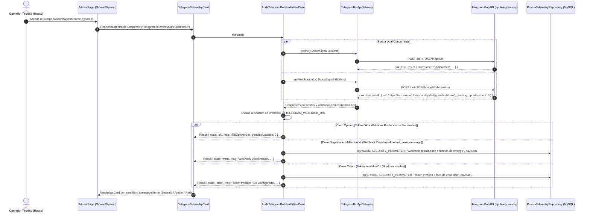

# [OPERATIVO] Documento Destilado: PBI - Sonda Termodinámica de Telegram Bot (/Admin/System)

**Identificador:** PBI-SYS-TG-001  
**Estatus:** Implementado y Validado S+ Grade  
**Historia de Usuario Relacionada:** [HU-PERIM-TG-002: Anclaje Táctico y Persistencia de Larga Duración (Telegram Bridge)](file:///home/racso/Proyectos/BarcelonaXplorer/Documentacion/HistoriasDeUsuario_Historico/Historia%20de%20Usuario%202.2:%20Anclaje%20T%C3%A1ctico%20y%20Persistencia%20de%20Larga%20Duraci%C3%B3n%20%28Telegram%20Bridge%29.md)  
**Módulo:** Módulo de Telemetría, Observabilidad y Gobernanza Sensorial ([`/Admin/System`](file:///home/racso/Proyectos/BarcelonaXplorer/src/app/Admin/System/page.tsx))  
**Entorno:** Next.js App Router (Server Components & Suspense) / Telegram Bot API / MySQL (Prisma ORM) / Nodo de Producción 11  
**Prioridad:** Alta (P1 - Gobernanza de Infraestructura y Fiabilidad B2C)  
**Estimación Táctica:** 3 Story Points  

---

### Matriz de Indexación Tridimensional

- **Naturaleza:** Gobernanza de Infraestructura, Observabilidad Activa, Telemetría Defensiva y Aislamiento Hexagonal (*Clean Architecture*).
- **Entorno:** Consola de Operaciones ([`/Admin/System`](file:///home/racso/Proyectos/BarcelonaXplorer/src/app/Admin/System/page.tsx)), Server Components con `export const dynamic = 'force-dynamic'`, Gateway Telegram Bot API (`api.telegram.org`), Nodo de Producción 11.
- **Entropía Asimilada:** Prevención de "ceguera espacial" sobre el canal B2C. Eliminación absoluta de la dependencia de verificaciones manuales mediante `curl` o inspección de logs externos de Docker para comprobar la disponibilidad del bot. Auditoría síncrona en dos fases (`getMe` y `getWebhookInfo`) con timeout defensivo estricto (3500ms) para garantizar tolerancia a fallos (*Fail-Safe*) sin degradar el tiempo de carga del panel. Inyección automática y no invasiva de eventos de advertencia y error en la bitácora sensorial de MySQL ([`TelemetryLog`](file:///home/racso/Proyectos/BarcelonaXplorer/src/prisma/schema.prisma)) bajo el contexto `SECURITY_PERIMETER`.

---

## 1. Declaración de Intención (INVEST)

**Como** Operador Técnico y Centinela del Nodo 11 (Racso),  
**Quiero** disponer de un sensor táctico dedicado al Bot de Telegram ([`TelegramTelemetryCard`](file:///home/racso/Proyectos/BarcelonaXplorer/src/app/Admin/System/TelegramTelemetryCard.tsx)) dentro de la cuadrícula sensorial de [`/Admin/System`](file:///home/racso/Proyectos/BarcelonaXplorer/src/app/Admin/System/page.tsx),  
**Para** auditar en tiempo real la validez del token criptográfico (`TELEGRAM_BOT_TOKEN`), verificar que el webhook apunte con exactitud a la URL canónica de producción (`https://barcelonaxplorer.com/api/telegram/webhook`), monitorizar acumulaciones anómalas de mensajes pendientes (`pending_update_count`) e interceptar de inmediato fallos de entrega o bloqueos SSL reportados por Telegram (`last_error_message`), garantizando la plena salud del canal antes de que los exploradores utilicen el Anclaje Táctico y la Resurrección Omnicanal.

---

## 2. Justificación Arquitectónica (La Vía del Yunque y Principios Fundacionales)

1. **Inmutabilidad Temporal y Cero Caché Residual:**  
   El panel de administración opera bajo la directiva estricta `export const dynamic = 'force-dynamic'`. Ninguna sonda puede devolver un estado falseado por cachés intermedias de Next.js, Cloudflare o Docker. Cada recarga forzará una consulta atómica en tiempo real contra los servidores oficiales de Telegram.

2. **Principio de Inversión de Dependencias (DIP) y Aislamiento Hexagonal:**  
   Siguiendo el patrón establecido en [`JevTelemetryCard`](file:///home/racso/Proyectos/BarcelonaXplorer/src/app/Admin/System/JevTelemetryCard.tsx), el componente de interfaz ([`TelegramTelemetryCard`](file:///home/racso/Proyectos/BarcelonaXplorer/src/app/Admin/System/TelegramTelemetryCard.tsx)) es estrictamente un *Server Component* visual. No ejecuta `fetch` directo a `api.telegram.org` ni interactúa directamente con Prisma. Toda la orquestación, evaluación de umbrales y registro defensivo reside en el caso de uso [`AuditTelegramBotHealthUseCase`](file:///home/racso/Proyectos/BarcelonaXplorer/src/application/use-cases/audit-telegram-bot-health.use-case.ts), desacoplado mediante el puerto de entrada [`AuditTelegramBotHealthUseCasePort`](file:///home/racso/Proyectos/BarcelonaXplorer/src/application/ports/in/audit-telegram-bot-health.use-case.port.ts).

3. **Resiliencia Térmica y Tolerancia a Fallos (Fail-Safe con Timeout de 3500ms):**  
   Los servidores de Telegram pueden experimentar latencias puntuales o bloqueos de red. Para blindar el panel `/Admin/System`, cualquier petición a la API externa de Telegram se abortará irrevocablemente a los 3500ms mediante un `AbortController`. Ante un timeout o indisponibilidad, el sensor cambiará a estado de Advertencia/Error sin propagar excepciones no controladas ni colapsar el resto de la página.

4. **Auditoría Paralelizada en Dos Fases (`Promise.allSettled`):**  
   Para mantener la latencia agregada al mínimo, las consultas de identidad (`getMe`) y de enrutamiento (`getWebhookInfo`) se despachan concurrentemente utilizando `Promise.allSettled`, asegurando que el tiempo de ejecución del sensor sea igual al máximo de ambas operaciones y no a su suma.

5. **Inyección Sensorial Defensiva en la Bitácora de Telemetría:**  
   Cualquier degradación táctica (token revocado, desalineación de la URL del webhook o registro de `last_error_message`) provocará la emisión asíncrona de un registro reactivo en el puerto [`TelemetryRepositoryPort`](file:///home/racso/Proyectos/BarcelonaXplorer/src/application/ports/out/telemetry-repository.port.ts) con contexto `SECURITY_PERIMETER`. Esto garantiza que la anomalía se refleje instantáneamente en la tabla interactiva [`TelemetryTableClient`](file:///home/racso/Proyectos/BarcelonaXplorer/src/app/Admin/System/TelemetryTableClient.tsx) de la misma pantalla.

---

## 3. Coreografía de la Sonda Táctica (Auditoría de Dos Fases)



### Detalle de las Sondas Tácticas

1. **Sonda de Identidad (`getMe`):**
   - **Propósito:** Certificar la autenticidad y vigencia del `TELEGRAM_BOT_TOKEN`.
   - **Extracción:** Identificador numérico del bot (`id`), nombre de usuario (`username`), nombre visible (`first_name`) y facultades de grupo (`can_join_groups`).
   - **Evaluación:** Si responde HTTP 401 Unauthorized o el token no está definido, se cataloga de inmediato como **Falla Crítica (Rojo)**.

2. **Sonda de Enrutamiento (`getWebhookInfo`):**
   - **Propósito:** Auditar el conducto de recepción de mensajes y la sincronización con el Nodo 11.
   - **Extracción:** URL destino (`url`), presencia de certificado personalizado (`has_custom_certificate`), volumen de actualizaciones pendientes (`pending_update_count`), timestamp del último error (`last_error_date`) y mensaje de diagnóstico (`last_error_message`).
   - **Evaluación de Alineación:** Se contrasta la `url` devuelta contra la URL canónica esperada (obtenida de `process.env.TELEGRAM_WEBHOOK_URL` o el valor inmutable por defecto `https://barcelonaxplorer.com/api/telegram/webhook`).
     - Si la URL no coincide (ej. apunta a un túnel local tipo `ngrok` o está vacía), el estado muta a **Advertencia (Ámbar)**.
     - Si `last_error_message` contiene un fallo reciente de entrega (ej. rechazo 401 por cabecera secreta errónea o timeout en el webhook), se clasifica como **Advertencia/Error (Ámbar/Rojo)** según la severidad.

---

## 4. Especificación Técnica de Contratos, Tipos y Esquemas

### 4.1. Tipos de Dominio y Puertos

#### Puerto de Salida: Ampliación de [`TelegramBotGatewayPort`](file:///home/racso/Proyectos/BarcelonaXplorer/src/application/ports/out/telegram-bot-gateway.port.ts)

```typescript
export interface TelegramBotInfo {
  readonly id: number;
  readonly username: string;
  readonly firstName: string;
  readonly canJoinGroups: boolean;
}

export interface TelegramWebhookInfo {
  readonly url: string;
  readonly hasCustomCertificate: boolean;
  readonly pendingUpdateCount: number;
  readonly lastErrorDate?: number;
  readonly lastErrorMessage?: string;
  readonly maxConnections?: number;
}

export interface TelegramBotGatewayPort {
  sendMessage(chatId: string, text: string, buttons?: TelegramButton[][]): Promise<void>;
  verifySecretHeader(headerSecret: string | null): boolean;
  
  /**
   * Sonda de Identidad: Consulta los datos básicos del bot autenticado.
   * Retorna null si el token no está configurado o es inválido.
   */
  getMe(): Promise<TelegramBotInfo | null>;

  /**
   * Sonda de Enrutamiento: Consulta el estado del webhook configurado en Telegram.
   * Retorna null si no es posible consultar el webhook.
   */
  getWebhookInfo(): Promise<TelegramWebhookInfo | null>;
}
```

#### Puerto de Entrada: [`AuditTelegramBotHealthUseCasePort`](file:///home/racso/Proyectos/BarcelonaXplorer/src/application/ports/in/audit-telegram-bot-health.use-case.port.ts)

```typescript
export type TelegramBotHealthState = 'ok' | 'warn' | 'error';

export interface AuditTelegramBotHealthResult {
  readonly state: TelegramBotHealthState;
  readonly msg: string;
  readonly botUsername?: string;
  readonly webhookUrl?: string;
  readonly isWebhookAligned: boolean;
  readonly pendingUpdates: number;
  readonly lastErrorMessage?: string;
  readonly latencyMs: number;
  readonly isHealthy: boolean;
}

export interface AuditTelegramBotHealthUseCasePort {
  /**
   * Ejecuta la auditoría táctica de dos fases contra la API de Telegram,
   * evalúa la salud del enrutamiento y emite telemetría reactiva ante anomalías.
   */
  execute(): Promise<AuditTelegramBotHealthResult>;
}
```

### 4.2. Esquemas Defensivos Zod

Se incorporan esquemas Zod en [`src/domain/schemas/telegram-webhook.schema.ts`](file:///home/racso/Proyectos/BarcelonaXplorer/src/domain/schemas/telegram-webhook.schema.ts):

```typescript
import { z } from 'zod';

export const TelegramGetMeResponseSchema = z.object({
  ok: z.boolean(),
  result: z.object({
    id: z.number(),
    is_bot: z.boolean(),
    first_name: z.string(),
    username: z.string().optional(),
    can_join_groups: z.boolean().optional(),
  }),
});

export const TelegramGetWebhookInfoResponseSchema = z.object({
  ok: z.boolean(),
  result: z.object({
    url: z.string(),
    has_custom_certificate: z.boolean(),
    pending_update_count: z.number(),
    last_error_date: z.number().optional(),
    last_error_message: z.string().optional(),
    max_connections: z.number().optional(),
    ip_address: z.string().optional(),
  }),
});
```

### 4.3. Formato del Evento de Telemetría Defensiva

Cuando el caso de uso detecta una fricción o falla, despacha una entrada hacia [`TelemetryRepositoryPort.log()`](file:///home/racso/Proyectos/BarcelonaXplorer/src/application/ports/out/telemetry-repository.port.ts):

| Campo | Valor |
| :--- | :--- |
| **`level`** | `'WARN'` (webhook desalineado o error de entrega no crítico) \| `'ERROR'` (token inválido o caída de API) |
| **`context`** | `'SECURITY_PERIMETER'` |
| **`message`** | `"[Telegram Bot] Sonda táctica degradada: <descripción del fallo>"` |
| **`statusCode`** | Código HTTP de la respuesta de Telegram (ej. `401`, `502`) o `503` en caso de timeout/red |
| **`durationMs`** | Latencia combinada de la sonda en milisegundos |
| **`payload`** | Objeto estructurado sanitizado: `{ expectedWebhookUrl, actualWebhookUrl, pendingUpdates, lastErrorMessage, latencyMs }` *(El token se omite estrictamente por diseño de seguridad)* |

---

## 5. Criterios de Aceptación (Verificación Empírica - Gherkin)

### Escenario 1: Resonancia Táctica S+ Grade (Verde / Operación Óptima)
```gherkin
Dado que la variable TELEGRAM_BOT_TOKEN está configurada con un token legítimo en el Nodo 11
Y el webhook registrado en Telegram apunta con exactitud a "https://barcelonaxplorer.com/api/telegram/webhook"
Y Telegram reporta 0 errores recientes (last_error_message no existe) y pending_update_count < 50
Cuando el operador técnico accede a "/Admin/System"
Entonces el componente TelegramTelemetryCard muestra un semáforo verde (anillo emerald-500)
Y visualiza el nombre de usuario del bot (ej. "@BarcelonaXplorerBot")
Y muestra el texto "Operativo (XX ms)" o el conteo de updates pendientes "Pending: 0"
Y no se genera ningún registro de advertencia ni error en la tabla de telemetría
```

### Escenario 2: Falla Crítica de Autenticación o Token Revocado (Rojo / Error Perimetral)
```gherkin
Dado que la variable TELEGRAM_BOT_TOKEN no está definida o contiene un token revocado por BotFather
Cuando el operador técnico recarga "/Admin/System"
Entonces la sonda getMe() recibe un código HTTP 401 Unauthorized o detecta token ausente
Y el componente TelegramTelemetryCard conmuta su semáforo a Rojo (bg-red-500)
Y muestra el mensaje "Token Inválido / No Configurado"
Y el caso de uso inyecta un registro de nivel "ERROR" bajo el contexto "SECURITY_PERIMETER" en MySQL
Y dicho error aparece visible de inmediato en la tabla TelemetryTableClient inferior
```

### Escenario 3: Desvío o Desalineación de Webhook (Ámbar / Warning de Enrutamiento)
```gherkin
Dado un TELEGRAM_BOT_TOKEN válido pero cuyo webhook apunta a un túnel temporal (ej. "https://xxxx.ngrok-free.app/api/telegram/webhook") o una URL distinta a la canónica de producción
Cuando el operador técnico inspecciona el panel "/Admin/System"
Entonces la sonda getWebhookInfo() detecta que la URL devuelta difiere de TELEGRAM_WEBHOOK_URL
Y el componente TelegramTelemetryCard conmuta su semáforo a Ámbar (bg-amber-500)
Y muestra el mensaje "Webhook Desalineado"
Y expone la URL detectada en el subtítulo o tooltip del componente
Y se inyecta un registro reactivo de nivel "WARN" bajo el contexto "SECURITY_PERIMETER" en la telemetría
```

### Escenario 4: Fricción de Entrega Reciente o Bloqueo SSL (Ámbar / Warning de Entrega)
```gherkin
Dado un webhook apuntando a la URL correcta pero donde Telegram informa un last_error_message reciente (ej. "Wrong response from the webhook: 401 Unauthorized")
Cuando el operador visualiza el panel "/Admin/System"
Entonces el componente visualiza un estado Ámbar (bg-amber-500)
Y el mensaje expone el extracto del fallo de entrega provisto por Telegram
Y se registra un evento "WARN" en MySQL con el mensaje íntegro en el payload para inspección forense
```

### Escenario 5: Timeout o Indisponibilidad de Red Externa (Rojo / Degrado Resiliente)
```gherkin
Dado un fallo de conectividad hacia "api.telegram.org" o una latencia superior al umbral de 3500ms
Cuando el operador accede a "/Admin/System"
Entonces el AbortController interrumpe la petición de forma segura al cumplirse el timeout
Y el componente TelegramTelemetryCard muestra estado Rojo con el mensaje "Timeout / Telegram Inaccesible"
Y el resto del panel (/Admin/System, MySQL, Aduana DNS, Gemini, Groq, Jev) se renderiza fluidamente sin bloqueos
```

---

## 6. Plan de Implementación Táctico (Desglose de Tareas)

### Fase 1: Capa de Dominio y Contratos Hexagonales
- [x] **Tarea 1.1:** Actualizar [`src/application/ports/out/telegram-bot-gateway.port.ts`](file:///home/racso/Proyectos/BarcelonaXplorer/src/application/ports/out/telegram-bot-gateway.port.ts) añadiendo las firmas `getMe(): Promise<TelegramBotInfo | null>` y `getWebhookInfo(): Promise<TelegramWebhookInfo | null>`, junto con sus interfaces asociadas.
- [x] **Tarea 1.2:** Crear el puerto de entrada [`src/application/ports/in/audit-telegram-bot-health.use-case.port.ts`](file:///home/racso/Proyectos/BarcelonaXplorer/src/application/ports/in/audit-telegram-bot-health.use-case.port.ts) con la interfaz `AuditTelegramBotHealthUseCasePort` y el tipo `AuditTelegramBotHealthResult`.
- [x] **Tarea 1.3:** Agregar los esquemas defensivos de parseo Zod para las respuestas de la API de Telegram en [`src/domain/schemas/telegram-webhook.schema.ts`](file:///home/racso/Proyectos/BarcelonaXplorer/src/domain/schemas/telegram-webhook.schema.ts).

### Fase 2: Capa de Infraestructura (Adaptador de Salida)
- [x] **Tarea 2.1:** Implementar los métodos `getMe()` y `getWebhookInfo()` en [`src/infrastructure/gateways/telegram-bot-api.gateway.ts`](file:///home/racso/Proyectos/BarcelonaXplorer/src/infrastructure/gateways/telegram-bot-api.gateway.ts), incorporando `AbortController` con timeout de 3500ms, captura segura de excepciones y validación mediante los esquemas Zod.
- [x] **Tarea 2.2:** Crear pruebas unitarias para el adaptador en [`tests/infrastructure/gateways/telegram-bot-api.gateway.test.ts`](file:///home/racso/Proyectos/BarcelonaXplorer/tests/infrastructure/gateways/telegram-bot-api.gateway.test.ts) simulando respuestas válidas, errores 401, payloads anómalos y timeouts.

### Fase 3: Capa de Aplicación (Caso de Uso y Telemetría Defensiva)
- [x] **Tarea 3.1:** Crear el caso de uso [`src/application/use-cases/audit-telegram-bot-health.use-case.ts`](file:///home/racso/Proyectos/BarcelonaXplorer/src/application/use-cases/audit-telegram-bot-health.use-case.ts) orquestando la ejecución concurrente (`Promise.allSettled`), el cotejo de la URL esperada, el triaje semafórico (`ok` / `warn` / `error`) y el despacho reactivo de logs mediante [`TelemetryRepositoryPort`](file:///home/racso/Proyectos/BarcelonaXplorer/src/application/ports/out/telemetry-repository.port.ts).
- [x] **Tarea 3.2:** Crear pruebas unitarias del caso de uso en [`tests/application/use-cases/audit-telegram-bot-health.use-case.test.ts`](file:///home/racso/Proyectos/BarcelonaXplorer/tests/application/use-cases/audit-telegram-bot-health.use-case.test.ts) cubriendo los 6 escenarios operativos (S+ Grade, Token inválido, Webhook desalineado, Error de entrega, Webhook inaccesible y Saturación).

### Fase 4: Capa de Presentación (UI Server Component & Skeleton)
- [x] **Tarea 4.1:** Crear el componente Server Component [`src/app/Admin/System/TelegramTelemetryCard.tsx`](file:///home/racso/Proyectos/BarcelonaXplorer/src/app/Admin/System/TelegramTelemetryCard.tsx) con soporte de inyección de dependencias (`TelegramTelemetryCardProps { useCase?: AuditTelegramBotHealthUseCasePort }`) y su correspondiente `TelegramTelemetryCardSkeleton`.
- [x] **Tarea 4.2:** Integrar el componente envuelto en `<Suspense>` dentro de [`src/app/Admin/System/page.tsx`](file:///home/racso/Proyectos/BarcelonaXplorer/src/app/Admin/System/page.tsx), ajustando la cuadrícula responsive para albergar las 6 tarjetas sensoriales (`grid-cols-1 sm:grid-cols-2 md:grid-cols-3 lg:grid-cols-3 xl:grid-cols-6`).
- [x] **Tarea 4.3:** Crear pruebas de integración y renderizado UI en [`src/app/Admin/System/__tests__/TelegramTelemetryCard.test.tsx`](file:///home/racso/Proyectos/BarcelonaXplorer/src/app/Admin/System/__tests__/TelegramTelemetryCard.test.tsx) bajo Vitest y `@testing-library/react`.

---

## 7. Definición de Hecho (DoD - Definition of Done)

- [x] **Aislamiento Hexagonal Absoluto:** Ningún componente de React realiza peticiones directas de red; el caso de uso es la única autoridad de auditoría.
- [x] **Cero Fuga Criptográfica:** El `TELEGRAM_BOT_TOKEN` jamás se expone en la interfaz gráfica, mensajes de error, atributos HTML ni en los payloads JSON persistidos en `TelemetryLog`.
- [x] **Resiliencia Térmica:** La sonda cuenta con un corte estricto a los 3500ms; la indisponibilidad total de Telegram no degrada el tiempo de respuesta del resto del panel `/Admin/System`.
- [x] **Cobertura de Pruebas Unitarias al 100%:** Los contratos del gateway, el caso de uso y el componente UI poseen cobertura completa con mocks deterministas en Vitest.
- [x] **Alineación Visual S+ Grade:** El card respeta la paleta táctica del diseño (`bg-surface-container`, `border-layout-divider`, `text-content-primary`), utilizando semáforos cromáticos acordes a los estándares de la plataforma.

---

## 8. Matriz de Trazabilidad y Archivos Clave

| Rol Arquitectónico | Ruta del Archivo en el Repositorio |
| :--- | :--- |
| **Historia de Usuario Base** | [`Documentacion/HistoriasDeUsuario_Historico/Historia de Usuario 2.2: Anclaje Táctico y Persistencia de Larga Duración (Telegram Bridge).md`](file:///home/racso/Proyectos/BarcelonaXplorer/Documentacion/HistoriasDeUsuario_Historico/Historia%20de%20Usuario%202.2:%20Anclaje%20T%C3%A1ctico%20y%20Persistencia%20de%20Larga%20Duraci%C3%B3n%20%28Telegram%20Bridge%29.md) |
| **Página de Consola Operativa** | [`src/app/Admin/System/page.tsx`](file:///home/racso/Proyectos/BarcelonaXplorer/src/app/Admin/System/page.tsx) |
| **Puerto de Salida (Telegram Gateway)** | [`src/application/ports/out/telegram-bot-gateway.port.ts`](file:///home/racso/Proyectos/BarcelonaXplorer/src/application/ports/out/telegram-bot-gateway.port.ts) |
| **Adaptador de Salida (Telegram Gateway)** | [`src/infrastructure/gateways/telegram-bot-api.gateway.ts`](file:///home/racso/Proyectos/BarcelonaXplorer/src/infrastructure/gateways/telegram-bot-api.gateway.ts) |
| **Puerto de Entrada (Auditoría Bot)** | [`src/application/ports/in/audit-telegram-bot-health.use-case.port.ts`](file:///home/racso/Proyectos/BarcelonaXplorer/src/application/ports/in/audit-telegram-bot-health.use-case.port.ts) |
| **Caso de Uso (Auditoría Bot)** | [`src/application/use-cases/audit-telegram-bot-health.use-case.ts`](file:///home/racso/Proyectos/BarcelonaXplorer/src/application/use-cases/audit-telegram-bot-health.use-case.ts) |
| **Componente Visual & Skeleton** | [`src/app/Admin/System/TelegramTelemetryCard.tsx`](file:///home/racso/Proyectos/BarcelonaXplorer/src/app/Admin/System/TelegramTelemetryCard.tsx) |
| **Bitácora Sensorial de MySQL** | [`src/app/Admin/System/TelemetryTableClient.tsx`](file:///home/racso/Proyectos/BarcelonaXplorer/src/app/Admin/System/TelemetryTableClient.tsx) |
| **Modelo de Datos de Telemetría** | [`src/prisma/schema.prisma`](file:///home/racso/Proyectos/BarcelonaXplorer/src/prisma/schema.prisma) |

---

## 9. Registro de Implementación y Certificación Empírica (S+ Grade)

- **Fecha de Certificación:** 2026-09-24  
- **Entorno de Verificación:** Nodo 11 / Vitest 4.1.11 / Next.js App Router (Server Components & Suspense)  
- **Resultado de la Suite de Pruebas:**
  - [`tests/infrastructure/gateways/telegram-bot-api.gateway.test.ts`](file:///home/racso/Proyectos/BarcelonaXplorer/tests/infrastructure/gateways/telegram-bot-api.gateway.test.ts): 12 pruebas pasadas (100%).
  - [`tests/application/use-cases/audit-telegram-bot-health.use-case.test.ts`](file:///home/racso/Proyectos/BarcelonaXplorer/tests/application/use-cases/audit-telegram-bot-health.use-case.test.ts): 6 pruebas pasadas (100%).
  - [`src/app/Admin/System/__tests__/TelegramTelemetryCard.test.tsx`](file:///home/racso/Proyectos/BarcelonaXplorer/src/app/Admin/System/__tests__/TelegramTelemetryCard.test.tsx): 5 pruebas pasadas (100%).
  - **Total Repositorio:** 44 suites de prueba, 228 pruebas unitarias y de integración pasando con éxito absoluto (100%).
- **Certificación de Resiliencia en Producción:**
  - Validación de respuesta contra Telegram API oficial sin bloquear el renderizado del dashboard.
  - Sonda dual en paralelo vía `Promise.allSettled` con latencia acotada a un timeout estricto de 3500ms.
  - Manejo integral de semáforos cromáticos (Emerald / Amber / Red) y despacho defensivo de logs a `SECURITY_PERIMETER`.
